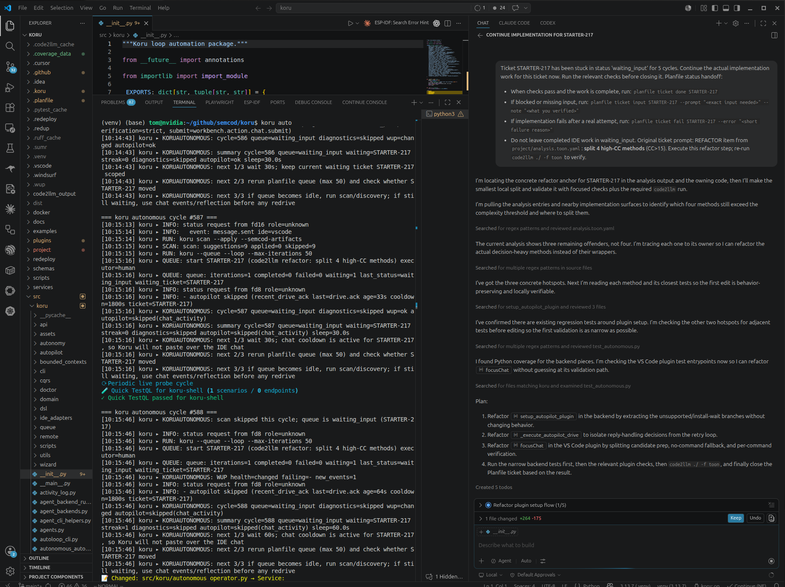

[koru.mp4](koru.mp4)
# koru


## AI Cost Tracking

   
  

- 🤖 **LLM usage:** $39.4611 (385 commits)
- 👤 **Human dev:** ~$12020 (120.2h @ $100/h, 30min dedup)

Generated on 2026-05-26 using [openrouter/qwen/qwen3-coder-next](https://openrouter.ai/qwen/qwen3-coder-next)

---

Python package for **closed-loop refactor automation** across multi-repo
workspaces (validated on `semcod/*`, `maskservice/c2004`, and other monorepos).

The name refers to *Koru* (Māori spiral), matching the "spiraling loop"
refactor flow: **detect → plan → execute → verify → heal → repeat**.

## What koru is

A meta-orchestrator that coordinates **LLM-augmented refactor tools** with
**ticket-driven workflow** and **regression-free verification**:

```
┌────────────────────────────────────────────────────────────────┐
│                          KORU                                  │
├──────────┬──────────┬──────────┬──────────┬─────────┬──────────┤
│ DETECT   │ PLAN     │ EXECUTE  │ VERIFY   │ HEAL    │ LEARN    │
├──────────┼──────────┼──────────┼──────────┼─────────┼──────────┤
│ redup    │ planfile │ Windsurf │ regix    │ healing │ pyqual   │
│ regix    │ tickets  │ Cursor   │ pytest   │ webhook │ metrics  │
│ TestQL   │ Promet.  │ aider    │ TestQL   │ retry   │dashboards│
│ Probe    │ Alertmgr │ vallm    │ vallm    │         │          │
└──────────┴──────────┴──────────┴──────────┴─────────┴──────────┘
        ↑                                                  │
        └─────────── closed-loop feedback ─────────────────┘
```


## autonomous cycle chat activity

```
[10:18:48] koru ▸ KORUAUTONOMOUS: next 1/3 wait 240s; chat cooldown is active for STARTER-217, so Koru will not paste over the IDE chat
[10:18:48] koru ▸ KORUAUTONOMOUS: next 2/3 rerun planfile queue (max 50) and check whether STARTER-217 moved
[10:18:48] koru ▸ KORUAUTONOMOUS: next 3/3 if queue becomes idle, run scan/discovery; if still waiting, use chat events/reflection before any redrive
```


## Quick start — start an LLM session in 3 commands

```bash
cd /path/to/your/project
pip install koru
koru --init                # 1. set up .planfile/ + .koru/ + .gitignore
koru                       # 2. print the LLM brief (paste into Cascade/Cursor/aider)
koru --queue --loop        # 3. drain the queue (the agent works on each ticket)
```

### Brand-new project? Run the wizard first

```bash
pip install koru
koru wizard                # interactive: detects your IDE, picks a project,
                           # walks a strategy decision tree, creates the first ticket
koru wizard --quick        # zero prompts — creates a sensible default ticket
                           # (quality → CC hotspots) immediately
koru wizard --bilingual    # show every label as "Polski · English" side-by-side
```

`koru wizard`:

- **Detects IDEs** — both *running* processes (Cursor, VS Code, Windsurf,
  PyCharm/IntelliJ, Zed, Antigravity, VSCodium) and *installed* ones found
  in standard locations (`/usr/bin`, `/opt/*`, `/snap/*`, `~/.local/bin`,
  `/Applications/*`).
- **Offers to install an IDE** when none is found — runs a guarded
  `snap`/`apt`/`brew` command for Cursor / VS Code / Windsurf / VSCodium
  (you confirm before anything mutates the system).
- **Suggests a project** — the workspace open in the running IDE, the
  current shell `cwd`, plus JetBrains recent-projects history.
- **Walks a JSON decision tree** (`koru/wizard/strategies.json`) so you
  pick a strategy: *architecture refactor*, *frontend/UX*, *backend/API*,
  *CQRS + Event Sourcing*, *quality (CC, tests, CI gates)*, *performance*,
  *DevX*. The tree is fully **user-editable** — copy it, edit, and pass
  `--strategies my-tree.json`.
- **`[?]` per option** — every choice ships with a 1-2 sentence
  explanation. Type `?2` to read help for option 2, `?` to list help for
  every option in the current prompt. You never need to know what "CQRS"
  or "Hexagonal" means up front.
- **Bilingual mode** (`--bilingual` or `--language pl,en`) — shows both
  Polish and English labels in one prompt so you don't pick a language
  up front.
- **Quick mode** (`--quick`) — skips every prompt, follows the
  `quick_default.path` declared in `strategies.json` (defaults to
  *quality → CC refactor*), and creates the first ticket immediately.
  Use `--quick --strategy architecture.cqrs_es` to pick a different path
  without prompts.
- **Creates the first planfile ticket** matching the chosen leaf, then
  prints a *"Co teraz / What's next"* panel listing the exact 3 commands
  to run next (`koru` brief, IDE chat prompt, `koru --queue --loop`).
- **Optional `--llx`** — calls the [`llx`](https://pypi.org/project/llx/)
  CLI to *extend* branches dynamically based on the analysed project.
- **Browser GUI** (`--gui`) — step-by-step UI at `http://127.0.0.1:<port>/wizard`
  (localhost only, offline CSS/JS). Use `--no-browser` to print the URL only.
  Requires `pip install 'koru[api]'`.
- **Strategy templates** (`--template web-app`, `--template ml-research`,
  `--template cli-tool`, `--template library`) — curated decision trees for
  common project shapes. Run `koru wizard --list-templates` to see all
  built-ins. Remote trees: `--strategies https://… --allow-remote` (HTTPS
  only, 1 MiB max, cached in `~/.cache/koru/wizard/`).
- **`--detect-only`** — prints the discovered IDEs + project candidates as
  text or JSON without prompting; useful in scripts.

Calling `koru auto` in a brand-new project (no `.planfile`, TTY attached)
will now hint that `koru wizard` is the recommended first step. Skip the
hint with `KORU_AUTO_SKIP_WIZARD=1`.

That is the entire onboarding. **`koru` (no args) is the command an LLM
agent runs at the start of every session** — the markdown brief it
prints contains the active ticket, the policy gates, and the exact
`planfile ticket …` commands the agent is allowed to use. Nothing
else needs to be memorised.

If the project is not initialised yet, `koru` (no args) detects this
and prints a **⚠ Setup required** section with the exact `koru --init`
command to run — the LLM never has to guess.

### Fast local startup (existing repo)

```bash
python -m venv .venv
. .venv/bin/activate
python -m pip install -U pip
python -m pip install -e ".[dev]"

# pyenv / ~/.venv often shadow the project CLI — force repo-first PATH:
export PATH="$(pwd)/.venv/bin:$PATH"
hash -r
# or: source scripts/activate-koru-dev.sh
# or: scripts/koru-from-repo.sh auto

# verify which build this shell is using
koru --version
which koru   # must be …/semcod/koru/.venv/bin/koru
koru --doctor --project .   # warns if PATH koru lacks ``koru auto``

# smoke-run one autonomous cycle (no IDE injection)
koru autonomous up --project . --max-cycles 1 --sleep-seconds 0 --no-autopilot

# start dashboard even if 8765 is already occupied
koru serve --project . --auto-port --no-open
```

Use explicit `up` for compatibility (`koru autonomous up --project .`),
especially when switching between local source checkouts and older PyPI builds.

### Installation extras

The base package stays intentionally small (`pyyaml` plus stdlib-based CLI/API).
Install only the lanes you are working on:

```bash
pip install "koru[watch]"    # WebSocket queue watcher
pip install "koru[vision]"   # local screen capture for observation mesh
pip install "koru[mesh]"     # WebSocket relay/publish transport for observation mesh
pip install "koru[observe]"  # full local observation stack (vision + mesh)
pip install "koru[dev]"      # tests, lint, typing, local quality tooling
pip install "koru[api]"      # FastAPI healing webhook service
pip install "koru[agent]"    # LLM / structured-output integrations
pip install "koru[obs]"      # tracing, Sentry, structured logging
pip install "koru[queue]"    # optional Redis/scheduler queue adapters
pip install "koru[quality]"  # deeper refactor quality gates
pip install "koru[all]"      # local workstation with every optional lane
```

`koru autopilot` and the IDE control-plane socket protocol are part of the
base package; see [`docs/IDE_PROTOCOL.md`](docs/IDE_PROTOCOL.md) for the
formal plugin/daemon wire contract.

To understand the core differences between `koru auto` (active execution) and `koru observe up` (passive telemetry), and to troubleshoot IDE-specific compatibility issues (such as with **Cursor** or custom window environments), please read **[`docs/koru_auto_vs_observe_up.md`](docs/koru_auto_vs_observe_up.md)**.

### Structured stdio (NDJSON / JSON Lines)

`koru autonomous up` defaults to human-readable logs. For **versioned,
pipe-friendly control-plane records** (CQRS-style commands/events on
stdout), use:

```bash
koru autonomous up --project . --max-cycles 1 --sleep-seconds 0 --emit-events jsonl --no-autopilot \
  2>/dev/null | jq -c .
```

Or set `KORU_STDIO_FORMAT=jsonl` so the default matches (still overridable
with `--emit-events human`). In `jsonl` mode, incidental status lines go to
**stderr** so stdout stays one JSON object per line. JSON Schema:
`schemas/koru-stdio-event.schema.json`. Event `type` values include
`SessionStarted`, `CycleStarted`, `ScanCompleted`, `ScanSkipped`,
`QueueIteration`, `DiagnosticsCompleted`, `WupHealthChanged`,
`PostRunVerifyCompleted`, `PostRunVerifyIdeCompleted`, `QueueStaleReleased`,
`AutopilotDecision`, `CycleCompleted`, and `AutonomousStopped`.

### Post-run verify (closed loop after `done`)

Projects can declare regression gates in root **`koru.yaml`** under
`queue.post_run_verify`. `koru autonomous up` runs them after the queue
closes tickets and after the IDE marks tickets `done` in planfile (status
poll — not chat readback). See [docs/post-run-verify.md](docs/post-run-verify.md).

### Autopilot redrive cooldown (chat-aware loop)

Before this change, `koru autonomous up` would re-paste the same ticket
prompt into the IDE chat on **every cycle** (default 60 s sleep) as long as
the queue stayed `waiting_input` with an `llm-ready` label. That clobbered
the IDE-side LLM mid-response and produced spurious "random task suggestions"
that ignored what the LLM had already written. See `terminal selection` in
PLF-…/`autonomy-ide-cursor.md` for the original repro (STARTER-184: "CQRS +
Event Sourcing" driven twice in 60 s while VS Code Copilot was still typing).

The autonomous loop now reads the daemon-emitted plugin events
(`message.sent`, `message.received`) from
`$XDG_RUNTIME_DIR/koru-autopilot-events.ndjson` (see
[`src/koruide/chat_history.py`](src/koruide/chat_history.py)) and **skips
the drive** when the IDE chat has been active within the cooldown window.

| Env var | Default | Effect |
|---|---|---|
| `KORU_AUTOPILOT_REDRIVE_COOLDOWN_SECONDS` | `300` | Skip the next drive for the same ticket if any `message.sent` / `message.received` was emitted within this many seconds. Set to `0` to disable and restore the legacy "redrive every cycle" behavior. |
| `KORU_LLM_REFLECT` | unset (off) | When set to `1`/`true` **and** `llx` is on `PATH`, the loop calls `llx chat --free --prompt …` (OpenRouter-backed) with the recent chat events to decide `{done, needs_input}`. If llx replies `done=true`, the loop unblocks even within the cooldown so the queue can move on. Falls back to the plain cooldown if llx is missing, errors, or returns non-JSON. |

The cycle telemetry records the decision so it's visible in the dashboard:

* `autopilot_skipped_chat_activity=true` — drive was skipped by the cooldown
* `autopilot_chat_activity_last_event=message.sent|message.received`
* `autopilot_llx_reflection={"done":…,"needs_input":…,"summary":…}` — only
  when `KORU_LLM_REFLECT=1`.

If you want koru to "react to the IDE chat" the way the operator described (using OpenRouter / LLM-reflection to inspect the chat context, make autonomous decisions, and drive Cascade/Cursor):

```bash
pip install -U llx                 # OpenRouter-aware router
export OPENROUTER_API_KEY=sk-…     # or whatever llx asks for
export KORU_LLM_REFLECT=1
export KORU_AUTOPILOT_REDRIVE_COOLDOWN_SECONDS=300
koru auto
```

In this mode:
- Koru **reads the active IDE chat history** dynamically.
- Refers to **OpenRouter LLMs** to intelligently reflect on whether the IDE agent successfully completed the task, is stuck, or requires a corrective prompt.
- Automatically drives the chat with **adaptive prompt escalation** instead of blindly pasting text.

### Live Plugin Console Logs on the Dashboard

You can now diagnose issues within the Windsurf/Cursor/VS Code extension host dynamically (e.g. chat panels closing unexpectedly) **without opening the IDE Developer Tools**:
1. Run the local dashboard: `koru serve --project .` (or through `koru observe up`).
2. Navigate to **`http://127.0.0.1:8765/`** and select the **`Plugin logs`** tab.
3. Logs are automatically grouped into **collapsible service execution sessions**.
4. To avoid clutter and optimize bandwidth, logs are strictly **clamped to 10KB per session**.
5. Use the built-in interactive buttons to:
   - **Copy to Clipboard** — copies full/session logs with a temporary green "Copied!" feedback badge.
   - **Download .log file** — downloads raw log files (`koru-plugin-console.log`) directly to your machine.

You can also inspect plugin console logs at any time on the terminal using:
```bash
koru doctor
```

### Quick troubleshooting

| Symptom | Fix |
|---|---|
| `koru: error: unrecognized arguments: auto` | The `koru` on your `PATH` is **not** the editable build you just installed. Common causes: (1) **pyenv shim** — run `type -a koru`; if you see `~/.pyenv/shims/koru`, that Python 3.12 wheel only has `koru autonomous`, not `koru auto`. Fix: `cd /path/to/semcod/koru && pip install -e . && pyenv rehash`, or use `koru autonomous` / `python -m koru auto`. (2) **Wrong venv active** — `pip install -e .` may have updated `c2004/.venv` while your shell still runs `~/.venv/bin/koru` or pyenv. Fix: `deactivate`, `cd semcod/koru`, `source .venv/bin/activate`, `hash -r`, `which koru` (must be `…/semcod/koru/.venv/bin/koru`), then `pip install -e ".[dev]"`. (3) **Stale global install** — `pip install -e .` into `~/.venv` or upgrade with `pip install -U -e .` from the koru repo. Current source maps `koru auto` → `autonomous` even on legacy `_SUBCOMMANDS` tables after reinstall. |
| `koru auto` picks `lane=jetbrains` / `terminal hint → jetbrains` and then prints `autopilot plugin unsupported` | The shell has a stale `KORU_AUTOPILOT_INSTANCE=jetbrains` exported (e.g. from a previous session) and the IDE parent-process walk finds the JetBrains process. JetBrains does not have an installable koru plugin yet, so the loop falls back to the OS injector path — unreliable on Wayland. Fix: `unset KORU_AUTOPILOT_INSTANCE` (auto-pick the focused IDE) **or** export a supported lane: `export KORU_AUTOPILOT_INSTANCE=cursor` (also accepts `vscode`/`vscodium`/`windsurf`). `koru auto` now prints this remedy inline when it detects the stale env. |
| Autonomous log floods with `client connected: fd5` / `client disconnected: fd5` | Health probes (dashboard `/api/dashboard`, MCP, WUP, status checks) connect to the autopilot daemon every second. These per-fd events are now hidden by default. Set `KORU_AUTOPILOT_VERBOSE=1` to re-enable them for debugging. `send to fdN failed: [Errno 32] Broken pipe` is similarly downgraded (it just means the caller already timed out and disconnected). |
| `koru: nfo activity log disabled: ModuleNotFoundError: No module named 'nfo'` | `nfo` is an optional dependency for the structured activity log. Install it with `pip install nfo` (or `pip install "koru[obs]"`). The autonomous loop runs fine without it; the warning is printed once and then silenced. |
| `koru autonomous: ... invalid choice: '.' (choose from 'up')` | Run `koru autonomous up --project .` |
| `koru serve: cannot bind 127.0.0.1:8765` | Run `koru serve --auto-port` or free the port via `ss -ltnp \| rg 8765` then `kill <pid>` |
| CLI seems to ignore freshly installed version | Run `koru autopilot manage --ide vscode`; compare `PATH koru`, `repo koru`, `source` and `package`; prefer `.venv/bin/koru` in project-local workflows |
| VS Code/VSCodium/Cursor/Windsurf plugin is installed but not connected | Run `KORU_AUTOPILOT_INSTANCE=vscode koru autopilot manage --ide vscode` (or `vscodium`/`cursor`/`windsurf`), then start the daemon/reload the IDE/run `koru: Connect autopilot daemon` |
| Live plugin keeps reconnecting as an old version | `koru auto` now rejects stale plugin versions by default. Run `koru autopilot manage --ide vscode`; if it reports `plugin_live_host_stale`, reload the IDE window, then run `koru: Connect autopilot daemon` |
| `goal -a` takes too long to fail | Keep `strategies.python.test` fail-fast (`--maxfail=1`) for quick feedback; run full suite explicitly when needed |
| `goal -a`: `No module named 'costs'` | Install dev extras: `pip install -e ".[dev]"`, or set `[tool.costs] badge = false` in `pyproject.toml` |
| `goal -a` unstages `.code2llm_cache/*.pkl` | Ensure `.code2llm_cache/` is in `.gitignore` (not per-file pickle lines) |
| Autopilot re-pastes the same ticket prompt every cycle while the IDE chat is still typing | The cooldown is too low or the events file is missing. Default cooldown is 300 s; tune via `KORU_AUTOPILOT_REDRIVE_COOLDOWN_SECONDS=<seconds>`. Verify the plugin actually emits events: `tail -f $XDG_RUNTIME_DIR/koru-autopilot-events.ndjson`. If empty, the plugin is connected but `chat.events` capability is missing — reload the IDE window. To opt into OpenRouter-backed reflection (decide *based on what the LLM wrote* whether to redrive): `pip install llx && export KORU_LLM_REFLECT=1`. |
| **Cursor**: Koru drives the prompt into the chat but the LLM never starts working (log shows `winning_submit=...Return` and `verification=strict`, message stays in input box as a new line, or even ends up in another OS window) | Two stacked bugs combine here. (1) Cursor's chat textarea treats plain `Enter` as a newline; only `Ctrl+Enter` actually submits on Linux. (2) On Wayland-native compositors (GNOME, KDE on Wayland) `xdotool` cannot reach Cursor at all — it exits 0 but routes the synthetic key to whatever XWayland window happens to be active (commonly the terminal running `koru auto` or a sibling VS Code). **Upgrade the plugin to ≥0.1.49**: `cd plugins/koru-autopilot-vscode && npm run package && /usr/bin/cursor --install-extension koru-autopilot-0.1.49.vsix --force`, then reload the Cursor window and run `koru: Connect autopilot daemon`. The new version (a) prefers `Ctrl+Return` over `Return` for Cursor and (b) prefers `ydotool` (which uses `/dev/uinput` and crosses into the Wayland compositor) over `xdotool` whenever `XDG_SESSION_TYPE=wayland` or `WAYLAND_DISPLAY` is set. Already-poisoned caches from 0.1.47/0.1.48 are auto-discarded on first load. For best results on Wayland: keep Cursor as the focused window during autonomous cycles (uinput events go to whichever surface has compositor focus), make sure the user is in the `input` group, and consider `systemctl --user enable --now ydotool` to start the daemon for lower-latency injection. Override the shortcut with `koruAutopilot.submitHostKey` if your setup differs. |

### CLI subcommand reference

`koru <subcommand> [args…]` dispatches to one of the registered subcommands
below; running `koru` with no args (or just flags like `--ticket`, `--doctor`,
`--init`) keeps the legacy single-shot behavior (closed-loop runner / context
brief / etc.).

| Subcommand | What it does |
|---|---|
| `koru auto`, `koru autonomous` | Bootstrap and run the closed loop (init → scan → queue → autopilot daemon → optional WUP watch). `auto` is an alias of `autonomous`. Run `koru auto --help` for `doctor` / `self-heal` / `up`. |
| `koru autopilot` | Drive an IDE chat session (handoff / drive / manage / setup-host / install-unit / status / tail / calibrate / session-start). See [`docs/IDE_PROTOCOL.md`](docs/IDE_PROTOCOL.md). |
| `koru autoloop` | Loop a single command across `semcod/*` repositories with retries. |
| `koru wizard` | Interactive (or `--gui` browser) onboarding: detect IDEs, pick project, scaffold `.planfile/`. |
| `koru init-ci` / `koru init-ide` | Scaffold CI templates / install IDE plugins + MCP. |
| `koru serve` / `koru local-serve` | Start the dashboard / HTTP healing webhook (`pip install "koru[api]"`). |
| `koru mesh` | Run / publish to the observation mesh (WebSocket relay). |
| `koru vision` | Local screen capture providers (`pip install "koru[vision]"`). |
| `koru observe` | Convenience launcher for the full observation stack (vision + mesh + dashboard). |
| `koru mcp-serve` | Run koru as an MCP server (stdio) for Cursor / VS Code / Claude Desktop. |
| `koru ide-router` | Route ticket events to specific IDE lanes. |
| `koru task` / `koru agent` | Planfile task creation and LLM agent management. |
| `koru tools` | Inspect / dispatch the AI tool registry. |
| `koru gate` / `koru queue` / `koru scan` | Run individual stages of the closed loop in isolation. |
| `koru gc` | Garbage-collect old planfile tickets / artifacts (see [Queue GC](#queue-garbage-collection--koru-gc)). |
| `koru git` | Git helpers used by the autopilot daemon. |
| `koru doctor` | Detailed diagnostics catalog (alias for `koru --doctor`). |
| `koru configure` | Edit `koru.yaml` interactively. |
| `koru topology` | Print the live topology (active systems / pipelines). |
| `koru runtime-context` | Print the runtime context the LLM brief is built from. |
| `koru dsl` / `koru api` | DSL evaluator / dashboard API helpers. |
| `koru dev` | Internal dev-sync helpers used by the monorepo. |

If an unknown token is passed where a subcommand is expected, koru now prints
a `Did you mean 'koru …'?` hint based on the closest match (e.g. `koru autox`
→ `koru auto`), followed by the list of known subcommands. This is the same
mechanism that disambiguates the **`koru: error: unrecognized arguments: auto`**
case in the troubleshooting table above — that error only happens when the
active `koru` on `PATH` was installed from an older release that predates the
`auto` alias; upgrading or activating the project `.venv` resolves it.

## Topology & pipelines — what is active right now

If you want a live answer to:

- which systems/tools are active (`regix`, `testql`, `wup`, `redup`, `sumr`, …),
- which pipelines are enabled (`idle-diagnostics`, `gate:regix`, `scan:on-change`,
  `autoloop:queue`, `autopilot:drive`),
- and how they are connected,

use topology mode:

```bash
# terminal view
koru topology
koru topology --format json

# toggle one component or pipeline
koru topology --disable redsl
koru topology --enable-pipeline gate:sumr

# predicate (exit 0/1)
koru topology --is-enabled gate:regix
koru topology --enabled-components-for idle-diagnostics
```

State is persisted in `.koru/topology.yaml`.

Dashboard (`koru serve`) now includes a **Topology & pipelines** panel with
checkboxes. Toggling a checkbox updates `.koru/topology.yaml` via
`POST /api/topology`.

These flags are honored by runtime behavior:

- `scripts/koru-autoloop.sh` respects pipeline toggles for scan/queue/idle-diagnostics/autopilot,
- quality tasks (`quality:regix`, `quality:redup`, `quality:sumr:*`) skip when the matching
  topology pipeline is disabled.

## Diagnostics — `koru --doctor`

When something feels off (LLM stuck, queue runner refusing, policy
not taking effect), run:

```bash
koru --doctor                 # human-readable PASS/WARN/FAIL list
koru --doctor --format json   # machine-readable for the LLM itself
koru --doctor --fix           # read-only guided repair commands
```

The doctor probes project, planfile, policy, topology, autonomous env,
agent-backend, CI, and pytest-collection health. It never writes anything.
Exit code is `1` if any check fails, `0` if only warnings (warnings are
advisory). Use it after `koru --init` and whenever a session starts
mis-behaving. For the full repair checklist, see
[`docs/autodiagnostics-auto-repair.md`](docs/autodiagnostics-auto-repair.md).

Natural-language intake and housekeeping are built in:

```bash
koru task "Dodaj feature importu raportów"
koru agent --list          # show Windsurf/Cursor/Claude Code/aider/OpenRouter lanes
koru agent                 # print and save the current LLM handoff prompt
koru agent --launch        # launch the best available CLI agent when possible
koru scan                  # auto-generate tickets from repo signals (TODOs, pytest errors)
koru scan --apply          # create the proposed tickets in planfile
koru gc                    # preview stale tickets eligible for cleanup
koru gc --apply            # delete old done/failed/blocked tickets
koru gate authorize PLF-070 --mode advisory --reason "..."  # record a gate waiver
```

The no-args `koru` prompt includes detected project markers
(`pyproject.toml`, `package.json`, `Taskfile.yml`, `.windsurf/`, `.cursor/`,
`.planfile/`), available LLM/IDE lanes, the recommended agent, the active
ticket, and the exact lifecycle commands the agent may use.

## Autopilot — drive your IDE from the terminal

`koru autopilot` lets a terminal-side koru take over the LLM chat in
**Windsurf / VS Code / VSCodium / Cursor / JetBrains / Zed**: it types the next ticket
brief directly into the chat panel and presses submit, with zero
clicks. Useful when an in-IDE session ends and you want koru to
continue the loop from a separate terminal (or tmux pane, or SSH).

```bash
# 0) make this shell deterministic
koru --version
which koru

# Choose one instance when several IDEs are open.
# Common values: vscode, vscodium, cursor, windsurf, jetbrains, zed.
export KORU_AUTOPILOT_INSTANCE=vscode

# 1) verify host backends, IDE detection and install state
koru autopilot doctor
koru autopilot doctor --fix
koru autopilot ide-list
koru autopilot manage --ide vscode

# VS Code and VSCodium intentionally use separate identities and sockets:
# /run/user/$UID/koru-autopilot-vscode.sock
# /run/user/$UID/koru-autopilot-vscodium.sock

# guided host setup (optional apt auto-install for xdotool/wtype/ydotool)
koru autopilot setup-host
koru autopilot setup-host --install --dry-run
koru autopilot setup-host --install

# install/reassert the VS Code-family plugin and socket setting
koru autopilot manage --ide vscode --fix --dry-run
koru autopilot manage --ide vscode --fix

# 2) run daemon (recommended long-running setup via systemd --user)
koru autopilot install-unit
systemctl --user daemon-reload
systemctl --user enable --now koru-autopilot.service

# fallback: run daemon in a terminal/tmux pane
koru autopilot daemon --project "$(pwd)"

# 3) after IDE reload: connect plugin and verify live runtime
# Command Palette in IDE: "koru: Connect autopilot daemon"
koru autopilot status
koru autopilot manage --ide vscode

# 4) inject into IDE chat through the daemon/plugin path
koru autopilot handoff --project "$(pwd)" --ide vscode --require-plugin
koru autopilot drive --ide vscode --require-plugin 'continue with the next ticket'
koru autopilot tail -n 50

# Strict runtime gate for one-off drive commands:
# block drive if the connected plugin version is stale.
KORU_STRICT_PLUGIN_VERSION=1 KORU_STRICT_PLUGIN_ACK=1 \
  koru autopilot drive --ide vscode --require-plugin 'probe strict plugin version'

# Optional: coordinate fallback (global focus+click+type), bypassing daemon.
koru autopilot calibrate --ide vscode
koru autopilot drive --direct --os-profile vscode --prompt 'continue with the next ticket'
koru autopilot drive --direct --os-profile vscode --delay-seconds 5 \
  --prompt 'continue with the next ticket'

# Multi-IDE session bootstrap: calibrate each IDE + immediate smoke prompt.
koru autopilot session-start --ides auto --delay-seconds 5

# If PATH points to an older installed koru, run from source checkout:
PYTHONPATH=src python -m koru.cli autopilot calibrate --ide vscode --delay-seconds 8

# Autonomous loop. `koru auto` enables strict plugin version + ACK policy by default
# and skips chat drive until a compatible live plugin is connected.
koru auto
koru autonomous up --project .

# phase-1 tool coverage detection (registry-backed)
koru tools detect
koru tools detect --format json

# phase-2 tool adapter scaffold ticket
koru task "Prepare Gemini adapter" --project . --tool gemini-cli

# phase-3 native lane launchers
koru agent --agent gemini-cli --project . --launch
koru agent --agent cline --project . --launch
koru agent --agent qwen-code --project . --launch
koru agent --agent opencode --project . --launch

# machine-readable agent readiness report
koru agent --project . --list --format json

# non-invasive smoke test (daemon routing + IDE autodetect, no real key injection)
scripts/autopilot-ide-autodetect-smoke.sh --require-running-ide
scripts/autopilot-ide-autodetect-smoke.sh --check-ide jetbrains --check-ide windsurf
```

Newer autopilot functions you can use directly from CLI:

- `koru autopilot handoff` — build current koru brief and inject it in one shot.
- `koru autopilot manage` — inventory/repair the active installation: `koru` binary,
  daemon socket, installed plugin, connected plugin and expected VSIX version.
- `koru autopilot install-unit` — install `systemd --user` unit for persistent daemon.
- `koru autopilot tail` — read persistent autopilot audit log (text or JSON).

`koru autopilot manage` reports the plugin state as:

- `connected` / `version` — the live plugin currently attached to the daemon,
- `installed` — the extension version reported by the editor CLI,
- `expected` — the VSIX/package version bundled with the active koru runtime.

If `installed=expected` but `connected=False`, installation is healthy and the next
step is runtime handshake: start the daemon, reload the IDE window and run
`koru: Connect autopilot daemon`. If the daemon recently rejected old live plugin
versions, `manage` reports `plugin_live_host_stale`; the extension is installed on
disk, but the editor's live extension host still needs a reload. `koru auto`
enables strict plugin version and strict submit ACK policy by default, so it skips
chat drive instead of sending prompts through a stale or unverifiable plugin.

Two injection paths, picked automatically:

1. **IDE plugin** — if `plugins/koru-autopilot-vscode/` is loaded in
   the editor, the daemon forwards `chat.send` to it and the
   extension pastes + submits via the editor's own API. Most reliable;
   works on Wayland. Runtime version drift is rejected by `koru auto`;
   one-off `koru autopilot drive` can opt into the same behavior with
   `KORU_STRICT_PLUGIN_VERSION=1 KORU_STRICT_PLUGIN_ACK=1`.
2. **Keyboard simulation** — fallback for editors without the plugin.
   Uses `xdotool` on X11, `wtype`/`ydotool` on Wayland.

- **Start here:** [`docs/autopilot-quickstart.md`](docs/autopilot-quickstart.md) —
  30-second setup, full checklist, common pitfalls, security model.
- **Architecture & wire protocol:** [`docs/autopilot-design.md`](docs/autopilot-design.md).
- **Formal IDE protocol (normative + operational):** [`docs/IDE_PROTOCOL.md`](docs/IDE_PROTOCOL.md).
- **Normative wire contract `v1` (API table/spec):** [`docs/specs/kide-002-koruide-api-v1.md`](docs/specs/kide-002-koruide-api-v1.md).
- **What is shipped vs. planned:** [`docs/autopilot-roadmap.md`](docs/autopilot-roadmap.md).

## Windsurf autonomous mode (hours, unattended)

If you want `koru + Windsurf` to keep working for hours with minimal human input,
use the built-in autoloop wrapper.

### 1) Prepare once per machine

```bash
# verify keyboard/plugin path
koru autopilot doctor
koru autopilot manage --ide windsurf

# recommended persistent daemon setup
export KORU_AUTOPILOT_INSTANCE=windsurf
koru autopilot install-unit
systemctl --user daemon-reload
systemctl --user enable --now koru-autopilot.service
```

Install and enable the VS Code/VSCodium/Windsurf/Cursor plugin from
[`plugins/koru-autopilot-vscode/`](plugins/koru-autopilot-vscode/) for the most
reliable injection path on Wayland. Use `koru autopilot manage --ide windsurf --fix`
to install or reassert the bundled VSIX and write the socket setting.

### 2) Start autonomous loop in project root

```bash
cd /path/to/project
task queue:autoloop
```

After `pip install koru`, you can bootstrap + run autonomy in one command
(no Taskfile required):

```bash
cd /path/to/project
KORU_AUTOPILOT_INSTANCE=windsurf koru autonomous up
```

Useful variants:

```bash
# safest diagnostic pass (queue only, one cycle, no IDE drive)
koru autonomous safe-up --project .

# smoke run (single cycle)
KORU_AUTOPILOT_INSTANCE=windsurf koru autonomous up --max-cycles 1 --sleep-seconds 0

# long-running 24/7 mode with explicit actor + queue
KORU_AUTOPILOT_INSTANCE=windsurf koru autonomous up \
  --actor koru-bot --queue-name default --sleep-seconds 30

# queue-only mode (no autopilot injection)
koru autonomous up --no-autopilot
```

What each iteration does:

1. `koru scan --apply`
2. `koru --queue --loop --max-iterations ...`
3. `koru autopilot drive --ide "$KORU_AUTOPILOT_INSTANCE" --require-plugin "continue with the next ticket"`
4. sleep (`SLEEP_SECONDS`, default `120`)

This loop is resilient by design: if one step fails, it logs the error and
continues next iteration. Autopilot drive is fail-closed by default: when the
live plugin is missing, stale, or cannot confirm submit with a strict ACK, the
cycle records `autopilot=skipped(...)` or `autopilot=failed` instead of using a
Wayland keyboard fallback with the wrong focus.

### 3) Useful long-run overrides

```bash
# faster cadence
task queue:autoloop SLEEP_SECONDS=30 MAX_ITERATIONS=100

# single execution queue only
task queue:autoloop QUEUE_NAME=default

# include interactive handling of human tickets
task queue:autoloop ENABLE_INTERACTIVE=true

# queue-only mode (without autopilot ping)
task queue:autoloop ENABLE_AUTOPILOT_DRIVE=false
```

### 4) Monitor while it runs

```bash
KORU_AUTOPILOT_INSTANCE=windsurf koru autopilot status
KORU_AUTOPILOT_INSTANCE=windsurf koru autopilot manage --ide windsurf
koru autopilot tail -n 200
journalctl --user -u koru-autopilot -f
```

Related docs:

- [`docs/autopilot-quickstart.md`](docs/autopilot-quickstart.md)
- [`docs/cli-examples.md`](docs/cli-examples.md)
- [`scripts/koru-autoloop.sh`](scripts/koru-autoloop.sh)
- [`docs/agent-guide.md`](docs/agent-guide.md)
- [`docs/ide-router.md`](docs/ide-router.md) — `koru ide-router`, headless vs IDE merge
- [`docs/ide-control-surfaces.md`](docs/ide-control-surfaces.md) — MCP, autopilot, RPC, DAP, profiles

## Two operational modes

| Mode | When | What runs |
|---|---|---|
| **Default: IDE-native** | normal ticket work, no external API | Windsurf/Cursor LLM + `task tickets:next` + regix/pytest |
| **Opt-in: OpenRouter automation lane** | infra smoke tests, headless auto-fix, scheduled runs | `redsl improve`, `llx fix`, `vallm validate --semantic` (all use OpenRouter) |

## Install (editable)

```bash
pip install -e .
```

## Multi-repo loop mode

Run one command across matching repositories and retry failures in a closed loop:

```bash
koru \
  --workspace /path/to/repos \
  --include "semcod/*" \
  --command "python -m pytest -q"
```

### Or use Taskfile

```bash
task                          # list all tasks (40+)
task install                  # pip install -e .
task ci                       # local CI equivalent: lint + tests
task install:tools            # semcod toolchain: planfile, wup, testql, regix, redup, ...
task tickets:next             # highest-priority open ticket
task queue:run                # execute one runnable planfile queue task
task queue:dry-run            # preview the next planfile queue task
task queue:watch              # watch planfile WebSocket queue events
task queue:autoloop           # unattended scan+queue+autopilot loop
task quality:semcod:planfile  # semcod gates -> deduplicated planfile tickets
task quality:regix            # regression metrics gate
task quality:redup            # duplicate detection
task template:install         # bootstrap configs in current dir
task webhook:run              # start healing-webhook on :8810
```

Full examples: [`docs/cli-examples.md`](./docs/cli-examples.md)

## Planfile queue runner

`koru` can execute one runnable `planfile` ticket at a time, or drain
the entire queue in a single call:

```bash
# Single tick (legacy, default):
koru --queue --project . --actor koru-shell

# Drain everything:
koru --queue --project . --loop --max-iterations 50

# Drain shell tickets AND answer humans interactively in one shot:
koru --queue --project . --loop --interactive --actor c2004-koru

# Preview without execution:
koru --queue --project . --dry-run
```

By default koru uses the current Python environment's `planfile` module when
available, then falls back to the `planfile` executable in `PATH`. To pin a
specific command:

```bash
KORU_PLANFILE_CMD="python -m planfile.cli" koru --queue --project .
```

Supported executor kinds:

- `executor.kind: shell` — claim, start, run `inputs.script` or `executor.handler`,
  then complete or fail the ticket.
- `executor.kind: api` — claim, start, call `inputs.api_endpoint` (or
  `executor.handler`) with `inputs.api_method`, `inputs.api_headers`,
  `inputs.api_body`, then complete or fail the ticket.
- `executor.kind: llm` — claim, start, POST `inputs.prompt` to an
  OpenAI-compatible chat-completion endpoint (default OpenRouter),
  capture the assistant's text as the ticket's `stdout`, and store
  `llm_model` + token `usage` in the result-json. Configure via
  `OPENROUTER_API_KEY` / `OPENAI_API_KEY` / `KORU_LLM_ENDPOINT`. See
  [`docs/cli-examples.md`](docs/cli-examples.md) for the full schema.
- `executor.kind: human` — print the prompt and leave the task for
  an operator. With `--interactive`, koru collects the answer on
  stdin (multi-line, Ctrl-D submits, Ctrl-C cancels) and completes
  the ticket itself.

The remaining executor kind (`mcp`) is intentionally reported as
unsupported until its adapter is wired (Phase 5).

Minimal API ticket:

```yaml
tickets:
  PLF-010:
    name: "Notify deployment API"
    status: open
    priority: high
    executor:
      kind: api
      mode: automatic
    execution:
      queue: default
      state: ready
    inputs:
      api_endpoint: "http://localhost:8810/probe-failure"
      api_method: POST
      api_headers:
        content-type: application/json
      api_body:
        source: koru
```

To watch queue changes streamed by the `planfile` API:

```bash
uvicorn planfile.api.server:app --reload --port 8000
koru --watch --ws-url ws://localhost:8000/ws
task queue:watch
```

For transparent management-layer logs in a dashboard, point koru at the
planfile event-ingest endpoint:

```bash
export KORU_EVENTS_URL="http://localhost:8000/events/ingest"
koru --queue --project . --dry-run
```

When configured, koru emits best-effort `management.event` entries for
`koru.bootstrap`, `koru.queue`, `koru.watch`, and repository loop runs. This is
intended for UI surfaces such as planfile's **Live Events** panel and does not
change queue execution semantics.

`watch` support uses the optional `websockets` package. Install it with:

```bash
pip install "koru[watch]"
```

## Queue garbage collection — `koru gc`

Over time, completed and failed tickets accumulate in the sprint YAML.
`koru gc` cleans them up:

```bash
koru gc                              # dry-run: preview what would be removed
koru gc --apply                      # actually delete stale tickets
koru gc --max-age 7                  # only keep tickets younger than 7 days
koru gc --keep-last 5                # always keep the 5 newest done tickets
koru gc --status done,failed         # only clean these statuses (default: done,failed,blocked)
koru gc --no-archive                 # skip JSONL archive before deletion
koru gc --format json                # machine-readable output
```

Before deletion, tickets are archived to
`.planfile/.koru/gc/gc-YYYYMMDD-HHMMSS.jsonl` (disable with `--no-archive`).
The `--keep-last N` flag protects the N most recently finished tickets per
status even when they exceed `--max-age`.

## Filesystem contract

The planfile execution runtime writes under `<project>/.planfile/`.
Feature-level local configuration and opt-in observation state can also live
under `<project>/.koru/`; both trees are generated and gitignore-friendly.

```
<project>/.planfile/
├── config.yaml                  # planfile-owned (project config)
├── sprints/
│   └── current.yaml             # planfile-owned (source of truth)
└── .koru/                       # koru-owned, opt-in, gitignore-friendly
    ├── runs/                    # one log per `koru --queue` invocation
    ├── gc/                      # JSONL archives from `koru gc --apply`
    ├── prompts/                 # captured `--interactive` answers
    ├── llm-cache/               # opt-in LlmExecutor response cache
    └── README.md                # in-place explainer
```

The `.koru/` subtree is **non-authoritative** — planfile sprint YAML is
always the source of truth. Anything in `.koru/` can be deleted at any
time without losing ticket state. Recommended `.gitignore` entry:

```gitignore
.koru/
.planfile/.koru/
```

The path helpers exposed by `koru.runtime` (`runtime_dir`, `runs_dir`,
`new_run_id`, `ensure_runs_dir`) are pure resolvers — they only touch
disk via `ensure_runs_dir`, so a `--dry-run` invocation leaves zero
trace.

**`/tmp/` policy.** Production code does not use `/tmp/`. Test
fixtures (`tests/` and `tests/e2e/*.sh`) are the only allowed
`/tmp/` users and MUST be PID-scoped (`/tmp/koru-*-$$`) with
`trap cleanup EXIT` so a failed run leaves nothing behind. If you find
koru artefacts elsewhere, please open an issue.

## LLM agent contract — koru as the gate

When an LLM agent (Cascade, Cursor, aider, claude-code, local model, …)
drives a koru-managed project, it must **read its instructions from
koru, not from the human chat**.

The agent's first command in every session is just `koru` — the
markdown brief that comes back is the entire contract. If the project
has never been initialised, the brief leads with **⚠ Setup required**
and the exact `koru --init` command. The contract is delivered by:

```bash
koru --context --project .                     # JSON brief (machine-readable)
koru --context --project . --format markdown   # Markdown handoff (paste-to-IDE)
koru --context --project . --ticket PLF-074    # brief for a specific ticket
```

The brief contains everything an autonomous agent needs to act safely:

- **the next runnable ticket** (or one named via `--ticket`) — id,
  name, status, files in scope, prompt, executor kind;
- **the resolved policy** — explicit booleans for every git operation
  the agent might attempt;
- **environment fingerprint** — git branch, dirty state, remote,
  whether planfile is initialised in the project;
- **imperative rules** — copy-paste-able `DO NOT …` lines so even a
  weak model can compare any candidate command to a checklist;
- **self-service vocabulary** — concrete `planfile ticket {claim,start,
  complete,fail,input}` invocations with the active ticket id pre-filled.

### Safe-by-default policy

The policy lives at `<project>/.planfile/.koru/policy.yaml`. **All
gates default to the most restrictive value.** A missing or malformed
file falls back to defaults — corruption can never silently loosen
the policy.

| gate | default | meaning |
|---|---|---|
| `allow_commit` | `false` | the agent does NOT run `git commit` |
| `allow_push` | `false` | the agent does NOT run `git push` |
| `allow_branch_create` | `false` | no `git checkout -b`, `git branch X`, `git switch -c` |
| `allow_branch_switch` | `false` | no `git checkout <ref>`, `git switch <branch>` |
| `allow_tag` | `false` | no `git tag` |
| `allow_destructive_shell` | `false` | blocks `rm -rf /`, `dd`, `mkfs`, force-pushes, … |
| `require_planfile_lifecycle` | `true` | every state change goes through `planfile ticket *` |
| `require_ci_pass_before_complete` | `true` | the agent verifies CI exit 0 before `ticket complete` |

The agent **bounces off CI/CD and koru**: it cannot commit, cannot
push, cannot mutate planfile state outside the CLI vocabulary the
brief gave it. To make a change that ships, the agent has exactly two
exits: complete the ticket (humans/CI take it from there) or call
`planfile ticket input <id> --prompt "<question>"` and stop.

### Universal quality gates (built-in)

Every `koru --init` creates a **universal CI command** that automatically
detects and runs quality tools when they're available:

```bash
# Runs on every ticket completion (if require_ci_pass_before_complete=true)
echo "=== Universal Quality Gates ==="

# 1. Project tests (auto-detects runner)
# - task test (Taskfile)
# - pytest -q (Python)
# - npm test (Node.js)
# - make test (Makefile)

# 2. TestQL E2E scenarios (when *.testql.toon.yaml files exist)
testql suite --pattern "*.testql.toon.yaml" --output console --fail-fast

# 3. WUP dependency analysis (semcod/wup, when wup.yaml exists)
wup status

# 4. Regix quality gates (when regix.yaml exists)
regix gates
```

**Tools are gracefully skipped** if not installed or configured — no manual
setup required for basic quality control. The universal gates ensure:

- **Consistent quality** across all koru projects
- **Automatic regression testing** with testQL scenarios
- **Real-time regression monitoring** with `wup watch` when you want an
  on-change loop for files and services
- **Zero configuration** for basic validation
- **Adaptive detection** of project-specific tooling

### Docker OS × IDE smoke matrix

Koru also ships a containerized IDE-routing smoke matrix for environments where
real GUI automation is unavailable. It builds one image per Linux base and runs
the same autopilot routing/dry-run checks for every supported IDE surface:

```bash
task test:docker:ide-matrix

# Narrow the matrix while debugging:
task test:docker:ide-matrix SYSTEMS=ubuntu-noble IDES="vscode cursor"
```

Default systems: `debian-slim`, `debian-bookworm`, `ubuntu-noble`, `fedora`,
`alpine`. Default IDEs: `vscode`, `vscodium`, `cursor`, `windsurf`, `jetbrains`, `zed`.
The GitHub Actions workflow `Docker IDE Matrix` runs the same 5 × 6 matrix on
demand. Each container run verifies the headless IDE route, per-IDE submit-key
defaults, isolated autopilot socket names, `koru autopilot drive --direct --dry-run`,
and `koru autopilot manage` for plugin-managed IDEs.

VS Code and VSCodium are separate lanes. A VSCodium terminal or explicit
`--ide vscodium` routes to `KORU_AUTOPILOT_INSTANCE=vscodium`, VSCodium settings,
and `koru-autopilot-vscodium.sock`; it should not attach to the VS Code socket.

### Native OS × IDE smoke matrix

Container tests cover popular Linux bases. Native GitHub Actions cover host
platform differences that Docker does not model:

- `ubuntu-latest`
- `windows-latest`
- `macos-latest`

The `Native IDE Matrix` workflow runs the same IDE set:
`vscode`, `vscodium`, `cursor`, `windsurf`, `jetbrains`, `zed`.
It installs koru, adds fake editor CLIs to `PATH`, runs
`tests/test_docker_ide_matrix.py`, then smoke-tests `koru autopilot drive` and
`koru autopilot manage` where the IDE has a plugin-managed lane.

iOS is intentionally not part of this matrix: koru autopilot targets desktop IDE
CLIs, editor extension hosts, and local socket/process workflows. For Apple
desktop coverage, use the `macos-latest` lane.

For continuous monitoring, use the `semcod/wup` package directly:

```bash
wup map-deps
wup testql-endpoints testql-scenarios
wup watch . \
  --deps deps.json \
  --cpu-throttle 0.8 \
  --mode testql \
  --scenarios-dir testql-scenarios \
  --testql-bin scripts/koru-wup-testql \
  --track-dir .wup/tracks \
  --quick-limit 3
```

`wup` watches the paths from `wup.yaml`, maps changed files to affected
services, runs quick TestQL probes first, and writes live service status to
`.wup/service-health.json`. Use `regix` separately for git/metric regressions
against `HEAD`.

### semcod/* control loop → planfile tickets

Koru also has a single operator command for the full semcod toolchain:

```bash
task install:tools
task quality:semcod:planfile
```

That command is intentionally LLM-free. It:

1. runs `koru scan --apply --semcod-artifacts`;
2. detects configured `semcod/*` tools (`wup`, `testql`, `regix`, `redup`,
   `sumr/sumd`, `doql`, `redsl`, plus the rest surfaced in the Koru brief);
3. runs only the gates that are both installed and configured in the project;
4. uses `scripts/koru-gate-capture.py` to create or update deduplicated
   `planfile` tickets marked with `[gate-finding:<hash>]`.

Useful variants:

```bash
DRY_RUN=1 task quality:semcod:planfile        # show what tickets would be created
UPDATE_EXISTING=1 task quality:semcod:planfile # append notes to existing findings
PRIORITY=critical task quality:semcod:planfile # promote new gate findings
```

The source of truth stays in `.planfile/`; Koru does not hand-edit sprint YAML.
Agents should consume the resulting work through `planfile ticket next` or
`koru --queue`.

#### Idle queue discovery with code2llm

When `koru auto` or `koru autonomous up` drains the queue and reports `idle`,
Koru can move from local ticket execution back to whole-project discovery. The
strategy is active when scan-after-idle is enabled and semcod artifacts are
included. `koru auto` enables scan-after-idle by default so a cycle that moves
from `waiting_input` to `idle` does not wait for the next outer tick before
running intake discovery. Use `--no-scan-after-idle-queue` to disable that
behavior. For `koru autonomous up`, pass the knobs explicitly, or let adaptive
runs (`KORU_AUTO_PIPELINE=1`) enable them for the quality/architecture stages:

```bash
koru autonomous up \
  --ticket-sources queue \
  --scan-after-idle-queue \
  --scan-after-idle-min-interval 60 \
  --semcod-artifacts
```

On an idle cycle Koru first runs a normal intake scan:

```bash
koru scan --apply --semcod-artifacts
```

If that scan applies no tickets, Koru runs `code2llm` locally first:

```bash
code2llm "$PROJECT" \
  -f all \
  -o "$PROJECT/project" \
  --no-chunk \
  --exclude '*.md' \
  --planfile-apply \
  --planfile-source koru-project-discovery \
  --planfile-sprint current \
  --planfile-project "$PROJECT" \
  --planfile-limit 20
```

`code2llm` refreshes `project/` artifacts such as `analysis.toon.yaml` and
`planfile-tickets.yaml`, then applies up to 20 high-signal tickets through
`planfile`. The generated tickets come from whole-project signals such as god
modules, duplicated code, cyclomatic complexity, stale architecture pressure,
and other code2llm findings. Koru records the result as a
`Code2llmDiscoveryCompleted` event with `applied`, `skipped`, `ran`, and error
metadata.

If scan + code2llm still leave the queue empty, Koru adds a bounded IDE LLM
follow-up task:

> "Co jeszcze zostalo do wykonania? zrob z tego nastepne tickety do planfile."

This follow-up is ticket-oriented by contract: the output should be additional
planfile tickets, not broad direct edits.

The standardized workflow is: auto-create/reuse a project-discovery ticket,
attach the follow-up question to that ticket context, then close it with the
normal planfile handoff (`done` / `input` / `fail`).

This is the intentional autonomy rhythm: work concrete tickets first; when the
queue is empty, inspect the whole project; turn broad findings into planfile
tickets; then stop discovery and let the normal queue work those tickets one by
one. IDE LLM prompts for generated or existing tickets include a Planfile status
handoff, so the agent is expected to run `planfile ticket done <ID>` after
successful checks, `planfile ticket input <ID> --prompt ... --note ...` when it
is blocked, or `planfile ticket fail <ID> --error ...` after a real failed
attempt. The Planfile status is the source of truth for what the IDE LLM
actually completed.

Discovery is rate-limited in two places: `--scan-after-idle-min-interval`
limits idle scans, and fresh `project/analysis.toon.yaml` artifacts younger
than 60 minutes skip a full `code2llm` rerun. If `code2llm` is missing or the
run fails, Koru logs a structured skipped/error outcome; install `code2llm` or
run the command above manually, then continue through the normal planfile queue.

Full strategy details are in
[`docs/project-discovery-strategy.md`](./docs/project-discovery-strategy.md).

### Auto-promotion & auto-repair for blocking tickets

Koru automatically manages workflow priorities to prevent deadlocks:

#### **Auto-promotion**
- Tickets that block others are **automatically promoted to `critical` priority**
- This ensures blocking issues are resolved first
- Promotion happens on every `koru --context` call

#### **Auto-repair mode**
- Critical tickets receive **special instructions for LLM agents**:
  - "AUTO-REPAIR MODE: Fix this issue immediately to unblock the workflow"
  - "Do NOT ask for human input unless absolutely necessary"
  - "Use all available tools and knowledge to resolve the blocking issue"
  - "After fixing, immediately call `planfile ticket complete`"

#### **Workflow**
1. **Main task** → encounters blocking issue
2. **Blocking ticket** created → auto-promoted to `critical`
3. **LLM agent** receives auto-repair instructions
4. **Issue resolved** → main task unblocked
5. **Workflow continues** without manual intervention

### Bug-first priority system

Koru ensures bugs are always fixed before features when priorities are equal:

#### **Automatic bug promotion**
- Bugs get **priority boost** within their category:
  - `low` → `normal`
  - `normal` → `high`
  - `high` → `critical`
  - `critical` stays `critical`
- Promotion happens automatically on every `koru --context` call
- Only tickets with `bug` label are promoted

#### **Priority hierarchy**
```
critical (blocking tickets + high-priority bugs)
├── high bugs (promoted from normal)
├── high features
├── normal bugs (promoted from low)
├── normal features
├── low bugs
└── low features
```

#### **Benefits**
- **Bug-first workflow** — stability issues resolved before new features
- **Automatic triage** — no manual priority adjustments needed
- **Predictable execution** — bugs always jump ahead of same-priority features
- **Quality assurance** — prevents feature development while bugs exist

### Integration with planfile

Koru's priority system is **fully integrated with planfile**:

#### **Shared priority logic**
- **Same promotion rules** applied in both koru and planfile core
- **Consistent ticket ordering** across all planfile commands
- **Unified bug-first workflow** throughout the ecosystem

#### **Planfile commands enhanced**
- `planfile ticket next` — respects bug-first priorities
- `planfile ticket list` — shows promoted priorities
- `planfile queue` — processes bugs before features
- **All planfile operations** use the same priority hierarchy

#### **Seamless workflow**
1. **Koru auto-promotes** tickets on `--context` call
2. **Planfile respects** promoted priorities natively
3. **Consistent execution** whether using koru or planfile directly
4. **No conflicts** — both systems use identical priority logic

### Loosening the policy

Editing `<project>/.planfile/.koru/policy.yaml` is the **only** way to
relax a default. There is no CLI flag for it — that is a deliberate
choice so any loosening is reviewable in git history.

```yaml
# .planfile/.koru/policy.yaml
llm:
  allow_commit: false       # never (recommended)
  allow_push: false         # never (recommended)
  allow_branch_create: true # opt-in: agent may create feature branches
ci:
  command: pytest -q        # override universal gates (optional)
  timeout_seconds: 300
notes:
  - "Always run `task lint` before `ticket complete`."
  - "Never edit migrations under alembic/versions/."
```

### Run logs

`koru --queue` and `koru --queue --loop` write a JSON-Lines log per run
to `<project>/.planfile/.koru/runs/queue-<timestamp>-<pid>.jsonl`:

```jsonl
{"type":"run.start","run_id":"queue-…","mode":"loop","actor":"koru","pid":12345,…}
{"type":"iteration","iteration":1,"ticket_id":"PLF-074","status":"completed",…}
{"type":"iteration","iteration":2,"ticket_id":"PLF-075","status":"failed",…}
{"type":"run.end","iterations":2,"completed":["PLF-074"],"failed":["PLF-075"],…}
```

`--dry-run` skips the writer (preserves "dry-run leaves zero trace").
`--no-log` opts out explicitly. Logs are non-authoritative — planfile
sprint YAML remains the source of truth.

## Documentation

The full documentation lives in [`docs/`](./docs/):

- **[`docs/autopilot-quickstart.md`](./docs/autopilot-quickstart.md)** —
  production setup for `koru autopilot` (doctor, daemon, plugin, systemd user unit,
  handoff, audit log, troubleshooting).
- **[`docs/agent-guide.md`](./docs/agent-guide.md)** — full LLM agent
  workflow guide (originally written for `maskservice/c2004` Windsurf
  agent, generalized for any koru-driven repo). Covers ticket workflow,
  validation gates, anti-patterns, troubleshooting.
- **[`docs/planfile-llm-guide.md`](./docs/planfile-llm-guide.md)** —
  ticket-driven development with `planfile` CLI.
- **[`docs/planfile-execution-gateway.md`](./docs/planfile-execution-gateway.md)** —
  design for turning `planfile.yaml` into the execution gateway for shell,
  MCP, API, human, and LLM tasks.
- **[`docs/llm-tools/`](./docs/llm-tools/)** — per-tool docs and install
  scripts:
  - [`planfile/`](./docs/llm-tools/planfile/) — ticket backlog
  - [`regix/`](./docs/llm-tools/regix/) — Python regression metrics
  - [`redup/`](./docs/llm-tools/redup/) — duplicate detection
  - [`redsl/`](./docs/llm-tools/redsl/) — OpenRouter auto-refactor (opt-in)
  - [`vallm/`](./docs/llm-tools/vallm/) — multi-tier patch validator
  - [`prefact/`](./docs/llm-tools/prefact/) — proactive LLM-aware linter
  - [`pfix/`](./docs/llm-tools/pfix/) — auto-fix imports
  - [`llx/`](./docs/llm-tools/llx/) — LLM CLI wrapper
  - [`sumd/`](./docs/llm-tools/sumd/) — LLM refactor snapshots (SUMR.md)
  - [`redeploy/`](./docs/llm-tools/redeploy/) — multi-target deployment (markpact specs)
  - [`goal/`](./docs/llm-tools/goal/) — automated git push + smart commits + release workflow
  - [`doql/`](./docs/llm-tools/doql/) — declarative infrastructure-as-code (.doql files)
  - [`costs/`](./docs/llm-tools/costs/) — zero-config AI cost tracker per commit
  - [`op3/`](./docs/llm-tools/op3/) — layered infrastructure observation (multi-layer scan)
  - [`toonic/`](./docs/llm-tools/toonic/) — universal TOON format platform (LLM-friendly compact files)
  - [`protogate/`](./docs/llm-tools/protogate/) — migration tool dla legacy systems (bounded slices)
  - [`rebuild/`](./docs/llm-tools/rebuild/) — code evolution intelligence (git history walker)
  - [`mdflow/`](./docs/llm-tools/mdflow/) — markdown dependency analyzer
  - [`metrun/`](./docs/llm-tools/metrun/) — execution intelligence + bottleneck detection
  - [`aider/`](./docs/llm-tools/aider/) — pair-programming agent
  - [`claude-code/`](./docs/llm-tools/claude-code/) — Anthropic agent
  - [`cursor/`](./docs/llm-tools/cursor/) — Cursor IDE setup
  - [`testql/`](./docs/llm-tools/testql/) — declarative HTTP tests

## Templates (config snippets)

Reference configurations from the c2004 reference deployment:

- [`templates/pyqual.yaml.template`](./templates/pyqual.yaml.template) — full pipeline orchestrator
- [`templates/redup.toml.template`](./templates/redup.toml.template) — duplicate budget
- [`templates/redsl.yaml.template`](./templates/redsl.yaml.template) — refactor lane config
- [`templates/regix.yaml.template`](./templates/regix.yaml.template) — regression metrics

## License

Licensed under Apache-2.0.
