# System Architecture Analysis

## Overview

- **Project**: /home/tom/github/semcod/koru/packages/coru/src/coru/repair
- **Primary Language**: python
- **Languages**: python: 12
- **Analysis Mode**: static
- **Total Functions**: 102
- **Total Classes**: 14
- **Modules**: 12
- **Entry Points**: 37

## Architecture by Module

### pipeline
- **Functions**: 42
- **Classes**: 2
- **File**: `pipeline.py`

### diagnostics
- **Functions**: 27
- **File**: `diagnostics.py`

### query
- **Functions**: 8
- **Classes**: 1
- **File**: `query.py`

### projector
- **Functions**: 7
- **File**: `projector.py`

### store
- **Functions**: 6
- **Classes**: 1
- **File**: `store.py`

### service
- **Functions**: 5
- **Classes**: 1
- **File**: `service.py`

### events
- **Functions**: 3
- **Classes**: 1
- **File**: `events.py`

### registry
- **Functions**: 3
- **File**: `registry.py`

### runtime
- **Functions**: 1
- **File**: `runtime.py`

### commands
- **Functions**: 0
- **Classes**: 3
- **File**: `commands.py`

### domain
- **Functions**: 0
- **Classes**: 5
- **File**: `domain.py`

## Key Entry Points

Main execution flows into the system:

### events.RepairEvent.from_dict
- **Calls**: cls, str, str, dict, str, str, str, raw.get

### diagnostics.collect_problems_from_console_logs
- **Calls**: status.get, diagnostics._dedupe_problems, isinstance, str, message.lower, isinstance, problems.append, None.lower

### diagnostics.collect_problems_from_status
- **Calls**: diagnostics._rejected_plugin_problems, diagnostics._plugin_row_for_ide, None.strip, diagnostics._dedupe_problems, diagnostics._missing_status_payload_problems, problems.append, diagnostics._dedupe_problems, problems.extend

### diagnostics.collect_problems_from_manage_report
- **Calls**: diagnostics._collect_manage_issue_problems, problems.extend, problems.extend, diagnostics._dedupe_problems, isinstance, report.get, diagnostics._collect_plugin_alignment_problems, diagnostics._collect_manage_action_problems

### store.RepairEventStore.read_all
- **Calls**: None.splitlines, self._path.is_file, line.strip, isinstance, self._path.read_text, json.loads, events.append, RepairEvent.from_dict

### diagnostics.collect_problems_from_drive_result
> Detect drive-layer failures (submit_unverified, toxic probe winners).
- **Calls**: diagnostics._dedupe_problems, diagnostics._submit_unverified_problem, problems.append, diagnostics._drive_intent_unverified_problem, diagnostics._focus_risk_problem, diagnostics._paste_risk_problem, diagnostics._host_key_trace_problem, problems.append

### service.run_repair_with_events
- **Calls**: pipeline.run_repair_pipeline, uuid.uuid4, project_root.is_dir, RepairService.for_project, service.run_session, RunRepairSessionCommand, tuple

### pipeline.format_repair_lines
- **Calls**: lines.append, lines.append, lines.append, lines.append, lines.append, problem.severity.upper

### service.RepairService.run_session
- **Calls**: events.aggregate_id_for, pipeline.run_repair_pipeline, self._store.append_many, pending.append, RepairEvent, dict

### store.RepairEventStore.append
- **Calls**: self._path.parent.mkdir, json.dumps, event.to_dict, self._path.open, handle.write

### pipeline._exec_plugin_upgrade_and_reload
- **Calls**: pipeline.manual_vsix_unpack, pipeline._run_reload_and_connect, RepairAttempt, RepairAttempt, RepairAttempt

### pipeline._exec_strict_handshake_cycle
- **Calls**: strict_handshake, pipeline._poll_plugin_ready, time.sleep, RepairAttempt, RepairAttempt

### service.RepairService.record_diagnosis
- **Calls**: events.aggregate_id_for, self._store.append, RepairEvent, uuid.uuid4, dict

### query.RepairHistoryQuery.cases_for_lane
- **Calls**: events.aggregate_id_for, projector.project_repair_cases, self._store.read_all, event.payload.get

### query.RepairHistoryQuery.format_json
- **Calls**: json.dumps, self.cases_matching_code, self.cases, asdict

### store.RepairEventStore.for_project
- **Calls**: None.resolve, store_dir.mkdir, cls

### query.RepairHistoryQuery.format_llm
- **Calls**: projector.format_history_llm, self.cases_matching_code, self.cases

### query.RepairHistoryQuery.for_project
- **Calls**: RepairEventStore.for_project, cls

### query.RepairHistoryQuery.cases
- **Calls**: self._store.read_all, projector.project_repair_cases

### query.RepairHistoryQuery.cases_matching_code
- **Calls**: code.strip, self.cases

### pipeline._exec_manage_fix
- **Calls**: run_koru, RepairAttempt

### pipeline._exec_manual_vsix_unpack
- **Calls**: pipeline.manual_vsix_unpack, RepairAttempt

### pipeline._exec_submit_unverified_guidance
- **Calls**: registry.registry_step, RepairAttempt

### service.RepairService.for_project
- **Calls**: cls, RepairEventStore.for_project

### runtime.run_lane_repair
> Run the full lane repair pipeline (same callbacks as ``coru repair run``).
- **Calls**: _run_lane_repair

### store.RepairEventStore.append_many
- **Calls**: self.append

### store.RepairEventStore.read_recent
- **Calls**: self.read_all

### query.problems_to_payload
- **Calls**: dict

### diagnostics.dedupe_problems
- **Calls**: diagnostics._dedupe_problems

### pipeline._exec_ensure_daemon
- **Calls**: RepairAttempt

## Process Flows

Key execution flows identified:

### Flow 1: from_dict
```
from_dict [events.RepairEvent]
```

### Flow 2: collect_problems_from_console_logs
```
collect_problems_from_console_logs [diagnostics]
  └─> _dedupe_problems
```

### Flow 3: collect_problems_from_status
```
collect_problems_from_status [diagnostics]
  └─> _rejected_plugin_problems
  └─> _plugin_row_for_ide
```

### Flow 4: collect_problems_from_manage_report
```
collect_problems_from_manage_report [diagnostics]
  └─> _collect_manage_issue_problems
      └─> _problem_from_manage_issue
  └─> _dedupe_problems
```

### Flow 5: read_all
```
read_all [store.RepairEventStore]
```

### Flow 6: collect_problems_from_drive_result
```
collect_problems_from_drive_result [diagnostics]
  └─> _dedupe_problems
  └─> _submit_unverified_problem
```

### Flow 7: run_repair_with_events
```
run_repair_with_events [service]
  └─ →> run_repair_pipeline
      └─> _emit_session_started
          └─> _emit
      └─> _emit_problems_detected
```

### Flow 8: format_repair_lines
```
format_repair_lines [pipeline]
```

### Flow 9: run_session
```
run_session [service.RepairService]
  └─ →> aggregate_id_for
  └─ →> run_repair_pipeline
      └─> _emit_session_started
          └─> _emit
      └─> _emit_problems_detected
```

### Flow 10: append
```
append [store.RepairEventStore]
```

## Key Classes

### query.RepairHistoryQuery
- **Methods**: 8
- **Key Methods**: query.RepairHistoryQuery.__init__, query.RepairHistoryQuery.for_project, query.RepairHistoryQuery.store_path, query.RepairHistoryQuery.cases, query.RepairHistoryQuery.cases_for_lane, query.RepairHistoryQuery.cases_matching_code, query.RepairHistoryQuery.format_llm, query.RepairHistoryQuery.format_json

### store.RepairEventStore
- **Methods**: 7
- **Key Methods**: store.RepairEventStore.__init__, store.RepairEventStore.path, store.RepairEventStore.for_project, store.RepairEventStore.append, store.RepairEventStore.append_many, store.RepairEventStore.read_all, store.RepairEventStore.read_recent

### service.RepairService
> Write-side facade: dispatches repair commands and persists events.
- **Methods**: 5
- **Key Methods**: service.RepairService.__init__, service.RepairService.for_project, service.RepairService.store_path, service.RepairService.record_diagnosis, service.RepairService.run_session

### events.RepairEvent
- **Methods**: 2
- **Key Methods**: events.RepairEvent.to_dict, events.RepairEvent.from_dict

### commands.RunRepairSessionCommand
> Execute diagnostics-driven repair and append events.
- **Methods**: 0

### commands.RecordDiagnosisCommand
- **Methods**: 0

### commands.ExecuteRepairActionCommand
- **Methods**: 0

### domain.RepairProblem
- **Methods**: 0

### domain.RepairStepDef
> Maps issue codes to a repair command (registry entry for new bugfixes).
- **Methods**: 0

### domain.RepairAttempt
- **Methods**: 0

### domain.RepairPlan
- **Methods**: 0

### domain.RepairCaseSummary
> Read-model row: one repair session projected for LLM/human history.
- **Methods**: 0

### pipeline._PipelineState
- **Methods**: 0

### pipeline._PipelineContext
- **Methods**: 0

## Data Transformation Functions

Key functions that process and transform data:

### query.RepairHistoryQuery.format_llm
- **Output to**: projector.format_history_llm, self.cases_matching_code, self.cases

### query.RepairHistoryQuery.format_json
- **Output to**: json.dumps, self.cases_matching_code, self.cases, asdict

### projector.format_case_llm
- **Output to**: None.join, None.join, None.join, lines.append, lines.append

### projector.format_history_llm
- **Output to**: None.join, projector.format_case_llm

### pipeline.format_repair_lines
- **Output to**: lines.append, lines.append, lines.append, lines.append, lines.append

## Public API Surface

Functions exposed as public API (no underscore prefix):

- `events.RepairEvent.from_dict` - 16 calls
- `pipeline.run_repair_pipeline` - 14 calls
- `diagnostics.collect_problems_from_console_logs` - 13 calls
- `diagnostics.collect_problems_from_status` - 12 calls
- `projector.project_repair_cases` - 10 calls
- `diagnostics.collect_problems_from_manage_report` - 9 calls
- `store.RepairEventStore.read_all` - 8 calls
- `diagnostics.collect_problems_from_drive_result` - 8 calls
- `service.run_repair_with_events` - 7 calls
- `registry.playbook_for_codes` - 6 calls
- `pipeline.format_repair_lines` - 6 calls
- `service.RepairService.run_session` - 6 calls
- `store.RepairEventStore.append` - 5 calls
- `projector.format_case_llm` - 5 calls
- `pipeline.manual_vsix_unpack` - 5 calls
- `pipeline.plugin_build_aligned` - 5 calls
- `service.RepairService.record_diagnosis` - 5 calls
- `query.RepairHistoryQuery.cases_for_lane` - 4 calls
- `query.RepairHistoryQuery.format_json` - 4 calls
- `store.RepairEventStore.for_project` - 3 calls
- `query.RepairHistoryQuery.format_llm` - 3 calls
- `events.aggregate_id_for` - 3 calls
- `query.RepairHistoryQuery.for_project` - 2 calls
- `query.RepairHistoryQuery.cases` - 2 calls
- `query.RepairHistoryQuery.cases_matching_code` - 2 calls
- `projector.format_history_llm` - 2 calls
- `service.RepairService.for_project` - 2 calls
- `runtime.run_lane_repair` - 1 calls
- `store.RepairEventStore.append_many` - 1 calls
- `store.RepairEventStore.read_recent` - 1 calls
- `query.problems_to_payload` - 1 calls
- `registry.registry_steps_for_code` - 1 calls
- `diagnostics.dedupe_problems` - 1 calls
- `events.RepairEvent.to_dict` - 0 calls
- `registry.registry_step` - 0 calls

## System Interactions

How components interact:

```mermaid
graph TD
    from_dict --> cls
    from_dict --> str
    from_dict --> dict
    collect_problems_fro --> get
    collect_problems_fro --> _dedupe_problems
    collect_problems_fro --> isinstance
    collect_problems_fro --> str
    collect_problems_fro --> lower
    collect_problems_fro --> _rejected_plugin_pro
    collect_problems_fro --> _plugin_row_for_ide
    collect_problems_fro --> strip
    collect_problems_fro --> _missing_status_payl
    collect_problems_fro --> _collect_manage_issu
    collect_problems_fro --> extend
    read_all --> splitlines
    read_all --> is_file
    read_all --> strip
    read_all --> isinstance
    read_all --> read_text
    collect_problems_fro --> _submit_unverified_p
    collect_problems_fro --> append
    collect_problems_fro --> _drive_intent_unveri
    collect_problems_fro --> _focus_risk_problem
    run_repair_with_even --> run_repair_pipeline
    run_repair_with_even --> uuid4
    run_repair_with_even --> is_dir
    run_repair_with_even --> for_project
    run_repair_with_even --> run_session
    format_repair_lines --> append
    run_session --> aggregate_id_for
```



## Reverse Engineering Guidelines

1. **Entry Points**: Start analysis from the entry points listed above
2. **Core Logic**: Focus on classes with many methods
3. **Data Flow**: Follow data transformation functions
4. **Process Flows**: Use the flow diagrams for execution paths
5. **API Surface**: Public API functions reveal the interface

## Context for LLM

Maintain the identified architectural patterns and public API surface when suggesting changes.