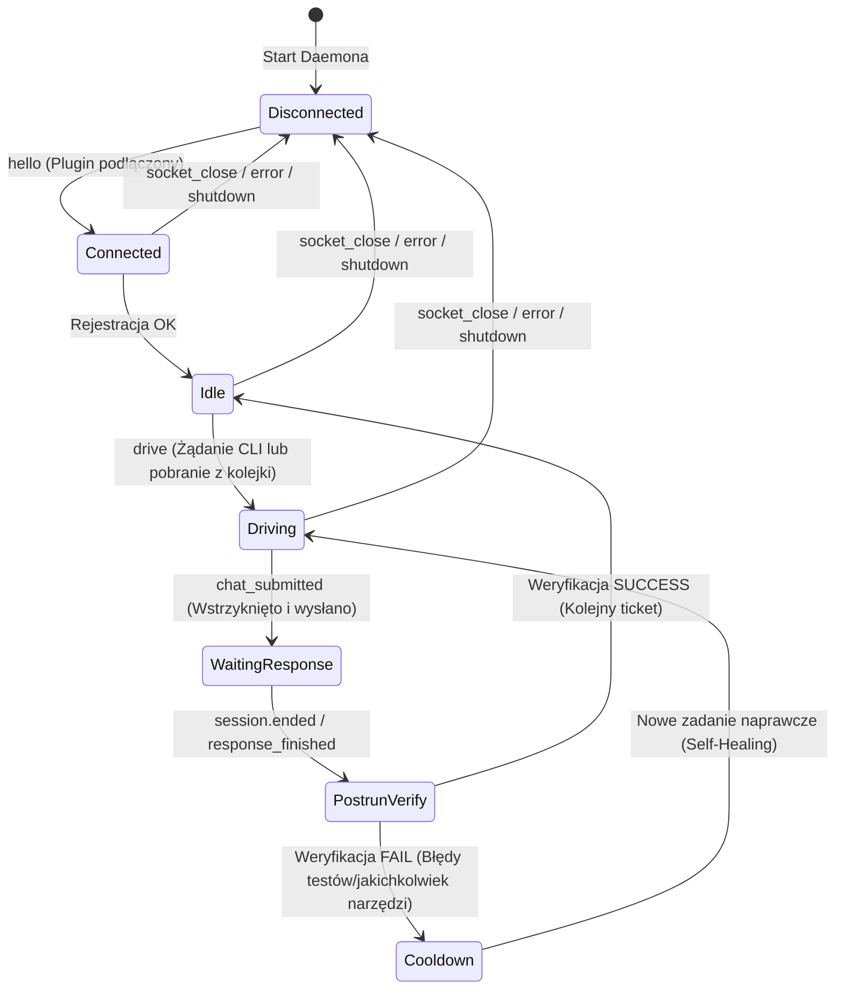

# Protokół Sterowania Koru IDE (Control Plane Protocol Specification) — v1

Niniejsza specyfikacja definiuje oficjalny protokół komunikacyjny (`v1`) pomiędzy lokalnym daemonem orkiestracji `koru` a wtyczkami klienckimi IDE (Cursor, Windsurf, VS Code, JetBrains). Protokół ten stanowi **warstwę sterowania (Control Plane)** nad istniejącym środowiskiem programistycznym użytkownika, umożliwiając automatyczne przesyłanie zadań, orkiestrację sesji chat, wykonywanie weryfikacji po-zadaniowej (post-run verify) oraz bezpieczne zarządzanie cyklem życia kodu.

---

## 1. Architektura i Koncepcja Integracji

Architektura opiera się na **trójwarstwowym modelu sterowania**, w którym `koru` nie zastępuje wbudowanego chatu IDE, lecz nim steruje:

```mermaid
flowchart TB
    subgraph Koru_Core ["Warstwa Autopilota Koru (Daemon)"]
        Daemon["Koru Daemon (AutopilotDaemon)"]
        Queue["Kolejka Planfile (Ticket Queue)"]
        Verify["Weryfikacja post-run (Shell/Pytest/Ruff)"]
        Audit["Audit Log (NDJSON)"]
    end

    subgraph IDE_Layer ["Warstwa Adapterów IDE"]
        VSCode["Plugin VS Code Bridge"]
        Cursor["Plugin Cursor Bridge"]
        Windsurf["Plugin Windsurf Bridge"]
        Fallback["OS Injector Fallback (xdotool / wtype / ydotool)"]
    end

    subgraph Chat_Layer ["Wbudowany Chat IDE"]
        IDE_Chat["Interfejs Chat IDE (Cascade / Copilot / AI Assistant)"]
    end

    %% Połączenia sterowania i przepływu
    Queue -->|Pobranie zadania| Daemon
    Daemon -->|1. NDJSON Socket (chat.send)| VSCode
    Daemon -->|1. NDJSON Socket (chat.send)| Cursor
    Daemon -->|1. NDJSON Socket (chat.send)| Windsurf
    Daemon -->|2. Fallback (Keyboard Sim)| Fallback
    
    VSCode -->|Wstrzyknięcie i Submit| IDE_Chat
    Cursor -->|Wstrzyknięcie i Submit| IDE_Chat
    Windsurf -->|Wstrzyknięcie i Submit| IDE_Chat
    Fallback -->|Symulacja klawiszy / kliknięć| IDE_Chat

    IDE_Chat -->|Zdarzenia sesji (session.ended)| VSCode
    IDE_Chat -->|Zdarzenia sesji (session.ended)| Cursor
    IDE_Chat -->|Zdarzenia sesji (session.ended)| Windsurf

    VSCode -->|session.ended (Zdarzenie statusu)| Daemon
    Cursor -->|session.ended (Zdarzenie statusu)| Daemon
    Windsurf -->|session.ended (Zdarzenie statusu)| Daemon

    Daemon -->|Uruchomienie testów i linterów| Verify
    Verify -->|Wynik OK / Fail| Daemon
    Daemon -->|Aktualizacja stanu zadania i Audit| Audit
```

### Role i Odpowiedzialności:
1. **Plugin IDE (Thin Bridge)**: Pozostaje maksymalnie uproszczony ("thin client"). Odpowiada za:
   - Połączenie się z lokalnym Unix socketem daemona przy starcie IDE.
   - Wstrzykiwanie tekstu do okna chatu IDE i opcjonalne kliknięcie "Submit".
   - Śledzenie i propagowanie zdarzeń cyklu życia chatu (`session.started` / `session.ended`).
   - Negocjację i raportowanie możliwości interfejsu (capabilities).
2. **Koru Daemon (Control Plane)**: Zawiera całą logikę biznesową:
   - Kolejkowanie zadań planfile, budowanie promptów i handoffów.
   - Decyzje o wyborze drogi (plugin vs. OS injector fallback).
   - Obsługa timeoutów, polityk cooldown, logowania audytowego oraz maszyn stanów sesji.
   - Wywoływanie zewnętrznych narzędzi weryfikacji i jakości kodu (`pytest`, `ruff`, `redup`, `regix`, `wup`).

---

## 2. Warstwa Transportowa i Ramkowanie

* **Protokół fizyczny**: Lokalny Unix Domain Socket (L.U.D.S).
* **Ścieżka gniazda**:
  - Podstawowa: `$XDG_RUNTIME_DIR/koru-autopilot.sock` (zazwyczaj `/run/user/$UID/koru-autopilot.sock`)
  - Awaryjna (fallback): `/tmp/koru-autopilot-$UID.sock`
* **Formatowanie ramki (NDJSON)**: Każda wiadomość jest zakodowana jako pojedyncza linia tekstu w standardzie UTF-8 zakończona znakiem nowej linii (`\n`).
* **Limit wielkości linii**: Maksymalnie **1 MiB** (`1024 * 1024` bajtów). Próba wysłania większej linii skutkuje natychmiastowym zamknięciem połączenia i błędem `line too large`.
* **Uwierzytelnianie i Bezpieczeństwo**:
  - Uprawnienia pliku socketu ustawiane są na `0600` (wyłącznie właściciel procesu).
  - Daemon weryfikuje tożsamość każdego klienta przy nawiązywaniu połączenia poprzez wbudowany mechanizm `SO_PEERCRED` na poziomie jądra Linux. Połączenia od użytkowników o UID innym niż UID daemona są natychmiast odrzucane (`reject foreign peer UID`).

---

## 3. Typy Wiadomości i Schematy Payloadów

Każda ramka NDJSON posiada następującą strukturę bazową:
```json
{
  "type": "NAZWA_TYPU",
  "id": "OPCJONALNE_ID_KORELACJI",
  ... PROPOLS_DEPENDING_ON_TYPE
}
```

### 3.1. Plugin → Daemon (Komunikaty Wtyczki)

#### A. `hello`
Wysyłane natychmiast po połączeniu wtyczki z socketem w celu rejestracji środowiska.
```json
{
  "type": "hello",
  "id": "vscode-hello-1a8f",
  "ide": "cursor",
  "version": "1.0.4",
  "pid": 28491
}
```
* **Pola**:
  - `ide` (string): Identyfikator środowiska (`vscode`, `cursor`, `windsurf`, `jetbrains`).
  - `version` (string): Wersja wtyczki koru-autopilot.
  - `pid` (integer): ID procesu wtyczki w systemie.

#### B. `session.started`
Informuje, że asystent LLM w IDE rozpoczął generowanie odpowiedzi.
```json
{
  "type": "session.started",
  "id": "ev-sess-start-992",
  "chat": "cascade"
}
```
* **Pola**:
  - `chat` (string): Identyfikator sub-systemu chat (np. `cascade`, `copilot`, `default`).

#### C. `session.ended`
Informuje, że asystent LLM w IDE zakończył swoją odpowiedź lub użytkownik przerwał sesję. Stanowi sygnał wyzwalający kolejny krok w pętli autopilota (`handoff` / `post-run verify`).
```json
{
  "type": "session.ended",
  "id": "ev-sess-end-993",
  "chat": "cascade",
  "reason": "completed"
}
```
* **Pola**:
  - `chat` (string): Identyfikator sub-systemu chat.
  - `reason` (string): Powód zakończenia (np. `completed`, `user-stop`, `error`, `timeout`).

#### D. `message.sent`
Potwierdzenie wysłania promptu przez użytkownika lub wstrzyknięte sterowanie.
```json
{
  "type": "message.sent",
  "id": "ev-msg-sent-01",
  "chat": "default",
  "text": "Refactor database connections",
  "length": 29
}
```

#### E. `message.received`
Odebranie odpowiedzi od modelu asystenta w IDE (częściowe lub całkowite).
```json
{
  "type": "message.received",
  "id": "ev-msg-recv-02",
  "chat": "default",
  "text": "Sure, I have updated the client.py file...",
  "summary": "Updated database pool configuration in client.py"
}
```

#### F. `status.error`
Błędy wewnętrzne wtyczki lub integracji IDE.
```json
{
  "type": "status.error",
  "id": "ev-err-409",
  "message": "Cascade input field not found in DOM",
  "severity": "warning",
  "source": "probe-ladder"
}
```

---

### 3.2. Daemon → Plugin (Komunikaty Sterujące)

#### A. `chat.send`
Żądanie wstrzyknięcia tekstu do aktywnego chatu IDE i opcjonalnego wykonania zatwierdzenia (Submit).
```json
{
  "type": "chat.send",
  "id": "drive-9a8f2c",
  "text": "Napisz test jednostkowy dla modułu protocol.py w pytest.",
  "submit": true
}
```
* **Pola**:
  - `text` (string): Prompt/wskazówki, które mają zostać wklejone.
  - `submit` (boolean): Jeśli `true`, wtyczka powinna automatycznie wysłać prompt (kliknąć wyślij / nacisnąć Enter). Jeśli `false`, wtyczka powinna tylko wkleić tekst do pola edycji.

#### B. `ping`
Zapytanie o stan aktywności (keep-alive).
```json
{
  "type": "ping",
  "id": "ping-482"
}
```

#### C. `shutdown`
Nakaz natychmiastowego wygaszenia integracji lub odłączenia klienta.
```json
{
  "type": "shutdown",
  "id": "shutdown-99"
}
```

---

### 3.3. CLI → Daemon (Komendy Operatora / Kolejki)

#### A. `drive`
Żądanie odpalenia autopilota. Wysyłane przez CLI `koru autopilot drive`.
```json
{
  "type": "drive",
  "id": "cli-drive-11",
  "text": "Refactor protocol decoding logic",
  "submit": true,
  "ide": "cursor",
  "require_plugin": false
}
```
* **Pola**:
  - `text` (string): Tekst zadania.
  - `submit` (boolean): Flaga natychmiastowego wysłania chatu.
  - `ide` (string): Wskazanie konkretnego IDE (`auto`, `cursor`, `windsurf`, `vscode`).
  - `require_plugin` (boolean): Jeśli `true`, uniemożliwi keyboard-injector fallback i wygeneruje błąd, jeśli dedykowana wtyczka nie jest połączona.

#### B. `status`
Zapytanie o bieżący stan daemona, podłączone wtyczki, statusy procesów i dostępne backendy wstrzykiwania.
```json
{
  "type": "status",
  "id": "cli-status-9"
}
```

---

### 3.4. Uniwersalne Wiadomości Kopertowe (Envelopes)

#### A. `ack`
Potwierdzenie pomyślnego wykonania operacji lub odebrania eventu. Zawsze niesie pasujące `id` w celu korelacji asynchronicznej.
```json
{
  "type": "ack",
  "id": "drive-9a8f2c",
  "ok": true,
  "delivered": true,
  "opened": true,
  "submitted": true,
  "winning_focus_open": "workbench.action.chat.open",
  "winning_paste": "type",
  "winning_submit": "type:\n"
}
```
* **Pola dodatkowe w sekcji `info` (spłaszczone)**:
  - `ok` (boolean): Flaga powodzenia.
  - `delivered` (boolean): Czy tekst trafił do edytora chatu.
  - `opened` (boolean): Czy panel chatu został otwarty/skupiony.
  - `submitted` (boolean): Czy prompt został wysłany.
  - `winning_focus_open`, `winning_paste`, `winning_submit`: Komendy VS Code wyłonione przez mechanizm `probe-ladder`.

#### B. `error`
Zgłoszenie błędu przetwarzania ramki lub awarii wykonania polecenia.
```json
{
  "type": "error",
  "id": "drive-9a8f2c",
  "ok": false,
  "message": "no connected autopilot plugin for ide=cursor; keyboard fallback disabled."
}
```

---

## 4. Negocjacja Zdolności (Capabilities)

Różne wersje IDE i wbudowane w nie chaty posiadają odmienne interfejsy programistyczne (API). Podczas wymiany komunikatów `hello` i `status`, daemon rejestruje aktualną macierz możliwości danego adaptera:

```json
{
  "ide": "windsurf",
  "capabilities": {
    "can_focus_chat": true,
    "can_insert_text": true,
    "can_submit": true,
    "can_detect_response": true,
    "can_read_selection": false,
    "can_report_workspace": true,
    "fallback_backend": "os-injector"
  }
}
```

Dzięki temu daemon nie zawiera twardo zakodowanych warunków "if-else" dla konkretnych IDE, lecz dynamicznie decyduje:
* Czy w przypadku braku wsparcia dla bezpośredniego `submit` wtyczki należy uruchomić **OS injector fallback** (symulację klawisza `Enter` / `Ctrl+Enter`).
* Czy wtyczka potrafi samodzielnie wykryć koniec sesji LLM, czy daemon musi monitorować pliki zdarzeń i stan procesów.

---

## 5. Automat Stanów Daemona (State Machine)

Daemon `koru` utrzymuje stan sesji sterowania w pętli autopilot. Poniższy automat opisuje dozwolone przejścia stanów:



### Opis przejść i logiki:
1. **Disconnected**: Daemon nasłuchuje na socket. Wszelkie zapytania `drive` kierowane są natychmiast na fallback klawiatury OS (`xdotool`/`wtype`).
2. **Connected & Idle**: Wtyczka pomyślnie przeszła uścisk dłoni. Daemon czeka na zadania z kolejki Planfile.
3. **Driving**: Autopilot wysyła pakiet `chat.send` z briefem do IDE. Zapisywana jest sygnatura czasowa `_last_chat_send_at`.
4. **WaitingResponse**: Daemon czeka na ukończenie pracy przez LLM w IDE. 
5. **PostrunVerify**: Odebranie zdarzenia `session.ended` z wtyczki powoduje natychmiastowe uruchomienie cyklu `postrun_verify`.
   * **UWAGA (Cooldown Safeguard)**: Aby zapobiec pętlom nieskończonym, wdrożono czas cooldown (`handoff_cooldown`, domyślnie `2.0s`). Jeśli zdarzenie `session.ended` nadejdzie zbyt szybko po wstrzyknięciu (np. natychmiastowy fail chatu), daemon zignoruje je i przejdzie w stan `cooldown` zamiast wstrzykiwać brief ponownie.
6. **Self-Healing / Diagnostics**: Jeśli weryfikacja post-run wykaże błędy (np. złamane asercje w `pytest` lub błędy `ruff`), daemon generuje nowy prompt diagnostyczny i wysyła go z powrotem do chatu w IDE, dając asystentowi szansę na automatyczne poprawienie kodu.

---

## 6. Przykładowa Sesja Komunikacyjna (End-to-End Walkthrough)

Scenariusz: Autopilot pobiera zadanie z kolejki, wstrzykuje je do Cursor, asystent wykonuje modyfikację kodu, wysyła sygnał o zakończeniu, a daemon odpala testy.

1. **Uruchomienie Daemona i podłączenie wtyczki (Cursor)**:
   ```
   [Plugin -> Daemon]: {"type":"hello","id":"h1","ide":"cursor","version":"0.1.0","pid":4012}
   [Daemon -> Plugin]: {"type":"ack","id":"h1","ok":true,"role":"plugin"}
   ```

2. **Wstrzyknięcie zadania autopilot (CLI / Queue Loop)**:
   ```
   [CLI -> Daemon]:    {"type":"drive","id":"drv-123","text":"Napisz funkcję add(a, b) w math.py","submit":true}
   [Daemon -> Plugin]: {"type":"chat.send","id":"drv-123","text":"Napisz funkcję add(a, b) w math.py","submit":true}
   ```

3. **Wtyczka otwiera chat, wkleja i submituje**:
   ```
   [Plugin -> Daemon]: {"type":"session.started","chat":"default"}
   [Plugin -> Daemon]: {"type":"message.sent","chat":"default","text":"Napisz funkcję add(a, b) w math.py","length":35}
   [Plugin -> Daemon]: {"type":"ack","id":"drv-123","ok":true,"delivered":true,"opened":true,"submitted":true}
   [Daemon -> CLI]:    {"type":"ack","id":"drv-123","ok":true,"delivered":true,"opened":true,"submitted":true,"backend":"plugin"}
   ```

4. **Asystent IDE (Cursor) generuje kod i kończy odpowiedź**:
   ```
   [Plugin -> Daemon]: {"type":"message.received","chat":"default","text":"Oto implementacja math.py: ...","summary":"Napisano funkcję add"}
   [Plugin -> Daemon]: {"type":"session.ended","chat":"default","reason":"completed"}
   ```

5. **Weryfikacja post-run**:
   * Daemon odbiera `session.ended`, natychmiast odsyła ack dla wtyczki:
     ```
     [Daemon -> Plugin]: {"type":"ack","id":"session-event","ok":true,"event":"session.ended"}
     ```
   * Daemon uruchamia w tle `pytest` i `ruff`.
   * Jeśli testy przejdą pomyślnie (`Exit Code: 0`):
     - Zapis do logu audytowego: `audit.record("cycle_completed", ticket="PLF-123", verify="success")`.
     - Stan daemona wraca do `Idle` (pobranie kolejnego zadania).

---

## 7. Wzorzec Fallback (OS Keyboard Injector)

Gdy bezpośrednia komunikacja z wtyczką nie powiedzie się lub wtyczka nie jest połączona (`require_plugin: false`), daemon uruchamia kaskadę fallbacków:

1. **Plugin (Primary)**: Próba wstrzyknięcia przez `chat.send`.
2. **OS Injector Profile (Secondary Fallback)**: Wykrycie aktywnego okna za pomocą profili interfejsu (np. wyznaczenie współrzędnych pola wprowadzania chatu i symulacja kliknięcia oraz pisania).
3. **Keyboard Simulation (Tertiary Fallback)**:
   - System **X11**: Uruchomienie narzędzia `xdotool` z matrixem czyszczenia modyfikatorów klawiatury (`--clearmodifiers`).
   - System **Wayland (Hyprland / Sway)**: Wykorzystanie wirtualnej konsoli `wtype`.
   - System **Wayland (GNOME)**: Wykorzystanie daemona `ydotool` (wymaga dostępu do `/dev/uinput`).
4. **Clipboard Injection (Last Resort)**: Zapisanie pierwotnego schowka użytkownika, wklejenie promptu do schowka, wstrzyknięcie sekwencji klawiszy `Ctrl+V`, a następnie natychmiastowe przywrócenie oryginalnej zawartości schowka użytkownika.

Wszystkie te zdarzenia są skrupulatnie rejestrowane w pliku `~/.local/state/koru/autopilot.log` z pełnym audytem wykonywanych sekwencji klawiszy.
