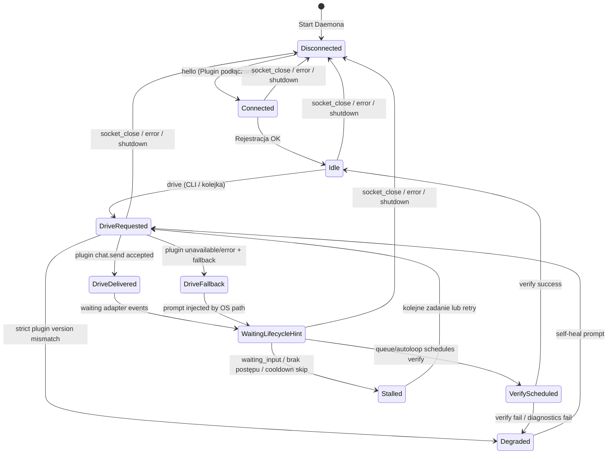

# Protokół Sterowania Koru IDE (Control Plane Protocol Specification) — v1

Niniejsza specyfikacja definiuje oficjalny protokół komunikacyjny (`v1`) pomiędzy lokalnym daemonem orkiestracji `koru` a wtyczkami klienckimi IDE (Cursor, Windsurf, VS Code, JetBrains). Protokół ten stanowi **warstwę sterowania (Control Plane)** nad istniejącym środowiskiem programistycznym użytkownika.

Dokument łączy trzy poziomy opisu:
- **kontrakt wire protocol `v1`** (stabilny, implementowany w `src/koruide/protocol.py`),
- **semantyka adapterów IDE** (zależna od API host IDE i wersji pluginów),
- **model operacyjny pętli autopilota** (decyzje runtime, fallbacki, verify, cooldown).

W efekcie nie wszystkie ścieżki opisane poniżej są obecnie osiągalne we wszystkich adapterach IDE (szczegóły w sekcjach 1, 5 i 6).

Techniczny kontrakt wire protocol jest utrzymywany równolegle w `docs/specs/kide-002-koruide-api-v1.md`, a aktualna implementacja dekodera i helperów znajduje się w `src/koruide/protocol.py`.

### Konwencja normatywna

W dokumencie stosowane są jawne etykiety statusu:
- **REQUIRED in v1** — część twardego kontraktu wire (`v1`), wymagana po stronie parsera/daemona.
- **OPTIONAL in v1** — legalne i obsługiwane w `v1`, ale niewymagane od każdego adaptera IDE.
- **IMPLEMENTATION-DEFINED** — semantyka zależna od pluginu/IDE; nie jest jednolicie gwarantowana.
- **NOT YET UNIVERSALLY AVAILABLE** — typ/ścieżka obecna w spec lub daemonie, ale niepowszechnie dostępna w aktywnych bridge'ach.

---

## 1. Architektura i Koncepcja Integracji

Architektura opiera się na **trójwarstwowym modelu sterowania**, w którym `koru` nie zastępuje wbudowanego chatu IDE, lecz nim steruje:

```mermaid
flowchart TB
    subgraph Koru_Core ["Warstwa Autopilota Koru (Daemon)"]
        Daemon["Koru Daemon (AutopilotDaemon)"]
        Queue["Kolejka Planfile (Ticket Queue)"]
        Verify["Weryfikacja post-run (Shell/Pytest/Ruff)"]
        Audit["Audit Log (NDJSON)"]
    end

    subgraph IDE_Layer ["Warstwa Adapterów IDE"]
        VSCode["Plugin VS Code Bridge"]
        Cursor["Plugin Cursor Bridge"]
        Windsurf["Plugin Windsurf Bridge"]
        Fallback["OS Injector Fallback (xdotool / wtype / ydotool)"]
    end

    subgraph Chat_Layer ["Wbudowany Chat IDE"]
        IDE_Chat["Interfejs Chat IDE (Cascade / Copilot / AI Assistant)"]
    end

    %% Połączenia sterowania i przepływu
    Queue -->|Pobranie zadania| Daemon
    Daemon -->|1. NDJSON Socket (chat.send)| VSCode
    Daemon -->|1. NDJSON Socket (chat.send)| Cursor
    Daemon -->|1. NDJSON Socket (chat.send)| Windsurf
    Daemon -->|2. Fallback (Keyboard Sim)| Fallback

    VSCode -->|Wstrzyknięcie i Submit| IDE_Chat
    Cursor -->|Wstrzyknięcie i Submit| IDE_Chat
    Windsurf -->|Wstrzyknięcie i Submit| IDE_Chat
    Fallback -->|Symulacja klawiszy / kliknięć| IDE_Chat

    IDE_Chat -->|Hinty lifecycle (opcjonalne)| VSCode
    IDE_Chat -->|Hinty lifecycle (opcjonalne)| Cursor
    IDE_Chat -->|Hinty lifecycle (opcjonalne)| Windsurf

    VSCode -->|session.* / message.* (best-effort)| Daemon
    Cursor -->|session.* / message.* (best-effort)| Daemon
    Windsurf -->|session.* / message.* (best-effort)| Daemon

    Queue -->|Planowanie verify| Verify
    Verify -->|Wynik verify -> status ticketu| Queue
    Daemon -->|Audit / event append| Audit
```

### Role i Odpowiedzialności:
1. **Plugin IDE (Thin Bridge)**: Pozostaje maksymalnie uproszczony ("thin client"). Odpowiada za:
   - Połączenie się z lokalnym Unix socketem daemona przy starcie IDE.
   - Wstrzykiwanie tekstu do okna chatu IDE i opcjonalne kliknięcie "Submit".
   - Propagowanie zdarzeń cyklu życia chatu (`session.started` / `session.ended`) **tam, gdzie API IDE to umożliwia**.
   - Raportowanie diagnostycznych metadanych w `ack` (np. wyniki probe ladder).
2. **Koru Daemon (Control Plane)**: Zawiera całą logikę biznesową:
   - Kolejkowanie zadań planfile, budowanie promptów i handoffów.
   - Decyzje o wyborze drogi (plugin vs. OS injector fallback).
   - Polityki runtime dla wersji pluginu (`connected` vs. `expected`) oraz
     blokadę stale-plugin drive przy `KORU_STRICT_PLUGIN_VERSION=1`.
   - Obsługa timeoutów, polityk cooldown, logowania audytowego oraz maszyn stanów sesji.
   - Wywoływanie zewnętrznych narzędzi weryfikacji i jakości kodu (`pytest`, `ruff`, `redup`, `regix`, `wup`).

### Status implementacji (snapshot)
- **Wire protocol `v1` i daemon**: wdrożone.
- **VS Code / Cursor / Windsurf plugin**: `hello`, `chat.send` i `message.sent` działają; `session.ended` oraz `message.received` pozostają ograniczone przez API i nie są emitowane jako pełny strumień lifecycle.
- **Instalacja i drift wersji pluginu**: `koru autopilot manage` raportuje
  `connected/version`, `installed` i `expected`; daemon może raportować drift
  w `ack` oraz blokować drive przez stary live plugin w trybie strict.
- **JetBrains plugin**: aktualnie scaffold (połączenie socket + `hello`), bez pełnej obsługi `chat.send` i stabilnych hooków lifecycle.
- **Post-run verify**: wykonywane w pętli autonomicznej `koru` (nie jako bezpośrednia akcja daemona po każdym `session.ended`).

---

## 2. Warstwa Transportowa i Ramkowanie

* **Protokół fizyczny**: Lokalny Unix domain socket (UDS).
* **Ścieżka gniazda**:
  - Podstawowa: `$XDG_RUNTIME_DIR/koru-autopilot.sock` (zazwyczaj `/run/user/$UID/koru-autopilot.sock`)
  - Instancjonowana: przy `KORU_AUTOPILOT_INSTANCE=vscode` socket ma postać
    `$XDG_RUNTIME_DIR/koru-autopilot-vscode.sock`. Zalecane, gdy jednocześnie
    działa kilka IDE lub kilka okien tego samego IDE.
  - Awaryjna (fallback): `/tmp/koru-autopilot-$UID.sock`
* **Formatowanie ramki (NDJSON)**: Każda wiadomość jest zakodowana jako pojedyncza linia tekstu w standardzie UTF-8 zakończona znakiem nowej linii (`\n`).
* **Limit wielkości linii**: Maksymalnie **1 MiB** (`1024 * 1024` bajtów). Próba wysłania większej linii skutkuje natychmiastowym zamknięciem połączenia i błędem `line too large`.
* **Uwierzytelnianie i Bezpieczeństwo**:
  - Uprawnienia pliku socketu ustawiane są na `0600` (wyłącznie właściciel procesu).
  - Daemon weryfikuje tożsamość każdego klienta przy nawiązywaniu połączenia poprzez wbudowany mechanizm `SO_PEERCRED` na poziomie jądra Linux. Połączenia od użytkowników o UID innym niż UID daemona są natychmiast odrzucane (`reject foreign peer UID`).

---

## 3. Typy Wiadomości i Schematy Payloadów

Każda ramka NDJSON posiada następującą strukturę bazową:
```json
{
  "type": "NAZWA_TYPU",
  "id": "OPCJONALNE_ID_KORELACJI"
}
```
Pozostałe pola są spłaszczonym payloadem zależnym od wartości `type`.

### 3.0. Status kontraktowy komunikatów (`v1`)

| Typ | Kierunek | Status | Uwagi |
| --- | --- | --- | --- |
| `hello` | plugin -> daemon | **REQUIRED in v1** | Podstawowy handshake adaptera |
| `chat.send` | daemon -> plugin | **REQUIRED in v1** | Główna komenda sterująca |
| `drive` | CLI -> daemon | **REQUIRED in v1** | Główny request operatora/autoloopu |
| `status` | CLI -> daemon | **REQUIRED in v1** | Health i introspekcja połączeń/backendów |
| `ping` | CLI/daemon -> daemon/plugin | **REQUIRED in v1** | Keep-alive/health check |
| `shutdown` | CLI/daemon -> daemon/plugin | **REQUIRED in v1** | Kontrolowane zatrzymanie |
| `ack` | uniwersalne | **REQUIRED in v1** | Potwierdzenie i nośnik metadanych wyniku |
| `error` | uniwersalne | **REQUIRED in v1** | Ramka błędu protokołu/wykonania |
| `session.started` | plugin -> daemon | **OPTIONAL in v1** | Zdarzenie lifecycle best-effort |
| `session.ended` | plugin -> daemon | **OPTIONAL in v1** | Hint lifecycle, nie gwarantowany |
| `message.sent` | plugin -> daemon | **OPTIONAL in v1** | Częsty event mostka pluginowego |
| `status.error` | plugin -> daemon | **IMPLEMENTATION-DEFINED** | Diagnostyka pluginu/specyficznego adaptera |
| `message.received` | plugin -> daemon | **NOT YET UNIVERSALLY AVAILABLE** | Przechwyt odpowiedzi LLM zależny od API IDE |

### 3.1. Plugin → Daemon (Komunikaty Wtyczki)

#### A. `hello`
Wysyłane natychmiast po połączeniu wtyczki z socketem w celu rejestracji środowiska.
**Status:** **REQUIRED in v1**.
```json
{
  "type": "hello",
  "id": "vscode-hello-1a8f",
  "ide": "cursor",
  "version": "1.0.4",
  "buildSha": "5bf6fc852b66c95a",
  "protocolVersion": 2,
  "pid": 28491
}
```
* **Pola**:
  - `ide` (string): Identyfikator środowiska (`vscode`, `vscodium`, `cursor`, `windsurf`, `jetbrains`, `zed`).
  - `version` (string): Wersja wtyczki koru-autopilot.
  - `buildSha` (string, optional): Hash konkretnego builda VSIX zapisany w `package.json` jako `koruAutopilotBuild.sha`.
  - `protocolVersion` (integer, optional): Wersja kontraktu plugin/daemon.
  - `pid` (integer): ID procesu wtyczki w systemie.

`version` jest używane przez daemon wyłącznie jako metadana runtime/policy.
Nie zmienia dekodowania ramek `v1`, ale może spowodować zablokowanie `drive`,
gdy `KORU_STRICT_PLUGIN_VERSION=1` i wersja live pluginu różni się od wersji
VSIX/package oczekiwanej przez bieżącą instalację koru.
`buildSha` domyka przypadek, w którym wersja VSIX jest taka sama, ale edytor nadal
uruchamia starszy kod. Przy strict policy daemon odrzuca połączenie, jeśli zna
oczekiwany hash builda, a live plugin wysyła inny hash albo nie wysyła go wcale.

#### B. `session.started`
Informuje, że asystent LLM w IDE rozpoczął generowanie odpowiedzi.
**Status:** **OPTIONAL in v1**.
```json
{
  "type": "session.started",
  "id": "ev-sess-start-992",
  "chat": "cascade"
}
```
* **Pola**:
  - `chat` (string): Identyfikator sub-systemu chat (np. `cascade`, `copilot`, `default`).
* **Uwaga implementacyjna**: traktowane jako zdarzenie opcjonalne; nie wszystkie pluginy potrafią je emitować stabilnie.

#### C. `session.ended`
Informuje, że asystent LLM w IDE zakończył swoją odpowiedź lub użytkownik przerwał sesję. W modelu runtime jest to hint lifecycle, który **może** zostać użyty do decyzji o dalszych krokach (`handoff`, verify scheduling), ale nie jest sygnałem gwarantowanym.
**Status:** **OPTIONAL in v1**.
```json
{
  "type": "session.ended",
  "id": "ev-sess-end-993",
  "chat": "cascade",
  "reason": "completed"
}
```
* **Pola**:
  - `chat` (string): Identyfikator sub-systemu chat.
  - `reason` (string): Powód zakończenia (np. `completed`, `user-stop`, `error`, `timeout`).
* **Uwaga implementacyjna**: daemon obsługuje ten typ wiadomości, ale pluginy IDE mogą go nie emitować w sposób ciągły.

#### D. `message.sent`
Potwierdzenie wysłania promptu przez użytkownika lub wstrzyknięte sterowanie.
**Status:** **OPTIONAL in v1**.
```json
{
  "type": "message.sent",
  "id": "ev-msg-sent-01",
  "chat": "default",
  "text": "Refactor database connections",
  "length": 29
}
```

#### E. `message.received`
Odebranie odpowiedzi od modelu asystenta w IDE (częściowe lub całkowite).
**Status:** **NOT YET UNIVERSALLY AVAILABLE**.
```json
{
  "type": "message.received",
  "id": "ev-msg-recv-02",
  "chat": "default",
  "text": "Sure, I have updated the client.py file...",
  "summary": "Updated database pool configuration in client.py"
}
```
* **Uwaga implementacyjna**: w aktualnym VS Code bridge tekst odpowiedzi LLM nie jest jeszcze przechwytywany.

#### F. `status.error`
Błędy wewnętrzne wtyczki lub integracji IDE.
**Status:** **IMPLEMENTATION-DEFINED**.
```json
{
  "type": "status.error",
  "id": "ev-err-409",
  "message": "Cascade input field not found in DOM",
  "severity": "warning",
  "source": "probe-ladder"
}
```

---

### 3.2. Daemon → Plugin (Komunikaty Sterujące)

#### A. `chat.send`
Żądanie wstrzyknięcia tekstu do aktywnego chatu IDE i opcjonalnego wykonania zatwierdzenia (Submit).
**Status:** **REQUIRED in v1**.
```json
{
  "type": "chat.send",
  "id": "drive-9a8f2c",
  "text": "Napisz test jednostkowy dla modułu protocol.py w pytest.",
  "submit": true
}
```
* **Pola**:
  - `text` (string): Prompt/wskazówki, które mają zostać wklejone.
  - `submit` (boolean): Jeśli `true`, wtyczka powinna automatycznie wysłać prompt (kliknąć wyślij / nacisnąć Enter). Jeśli `false`, wtyczka powinna tylko wkleić tekst do pola edycji.

#### B. `ping`
Zapytanie o stan aktywności (keep-alive).
**Status:** **REQUIRED in v1**.
```json
{
  "type": "ping",
  "id": "ping-482"
}
```

#### C. `shutdown`
Nakaz natychmiastowego wygaszenia integracji lub odłączenia klienta.
**Status:** **REQUIRED in v1**.
```json
{
  "type": "shutdown",
  "id": "shutdown-99"
}
```

---

### 3.3. CLI → Daemon (Komendy Operatora / Kolejki)

#### A. `drive`
Żądanie odpalenia autopilota. Wysyłane przez CLI `koru autopilot drive`.
**Status:** **REQUIRED in v1**.
```json
{
  "type": "drive",
  "id": "cli-drive-11",
  "text": "Refactor protocol decoding logic",
  "submit": true,
  "ide": "cursor",
  "require_plugin": false
}
```
* **Pola**:
  - `text` (string): Tekst zadania.
  - `submit` (boolean): Flaga natychmiastowego wysłania chatu.
  - `ide` (string): Wskazanie konkretnego IDE (`auto`, `cursor`, `windsurf`, `vscode`).
  - `require_plugin` (boolean): Jeśli `true`, uniemożliwi keyboard-injector fallback i wygeneruje błąd, jeśli dedykowana wtyczka nie jest połączona.

**Polityka wersji pluginu:** gdy daemon używa ścieżki pluginowej, do wyniku
`ack` może dodać `plugin_version`, `expected_plugin_version`,
`plugin_version_mismatch` i `plugin_version_policy`. Domyślnie mismatch jest
ostrzegawczy (`plugin_version_policy="warn"`). Przy `KORU_STRICT_PLUGIN_VERSION=1`
lub `KORU_PLUGIN_VERSION_POLICY=strict` daemon zwraca `error` przed wysłaniem
`chat.send` do stale pluginu. Tryb strict jest fail-closed: jeśli daemon nie
potrafi ustalić `expected_plugin_version`, blokuje plugin `drive` zamiast
akceptować potencjalnie stary runtime.

#### B. `status`
Zapytanie o bieżący stan daemona, podłączone wtyczki, statusy procesów i dostępne backendy wstrzykiwania.
**Status:** **REQUIRED in v1**.
```json
{
  "type": "status",
  "id": "cli-status-9"
}
```

Odpowiedź `status` zawiera listę `plugins`; każdy wpis zawiera co najmniej
`ide` i `fd`, a jeśli plugin zgłosił wersję w `hello`, także `version`.
Wersje zainstalowane na dysku (`installed`) i wersja oczekiwana (`expected`)
nie są częścią wire `status`; raportuje je komenda warstwy operacyjnej
`koru autopilot manage`.

---

### 3.4. Uniwersalne Wiadomości Kopertowe (Envelopes)

#### A. `ack`
Uniwersalna ramka potwierdzenia odbioru/przetwarzania. Zawsze niesie pasujące `id` w celu korelacji asynchronicznej.
**Status:** **REQUIRED in v1**.
```json
{
  "type": "ack",
  "id": "drive-9a8f2c",
  "ok": true,
  "delivered": true,
  "opened": true,
  "submitted": true,
  "winning_focus_open": "workbench.action.chat.open",
  "winning_paste": "type",
  "winning_submit": "type:\n"
}
```
* **Pola dodatkowe (spłaszczone z `info` po stronie helpera)**:
  - `ok` (boolean): Ramka została zaakceptowana/przetworzona na poziomie handlera.
  - `delivered` (boolean): Czy tekst trafił do edytora chatu.
  - `opened` (boolean): Czy panel chatu został otwarty/skupiony.
  - `submitted` (boolean): Czy prompt został wysłany.
  - `winning_focus_open`, `winning_paste`, `winning_submit`: opcjonalne pola diagnostyczne (`probe-ladder`).
  - `verification`: poziom potwierdzenia (`strict`, `plugin_ack`, `event_only`, `plugin_error`).
  - `plugin_version`, `expected_plugin_version`, `plugin_version_mismatch`,
    `plugin_version_policy`: opcjonalne metadane driftu wersji live pluginu.

**Normatywna semantyka `ack` (`v1`):**
- `ok=true` **nie musi** oznaczać pełnego sukcesu submitu end-to-end.
- Flagi `delivered`, `opened`, `submitted` są semantycznie niezależne i mogą występować w różnych kombinacjach.
- Pola `winning_*` oraz inne metadata są opcjonalne i implementacyjno-diagnostyczne.

#### B. `error`
Zgłoszenie błędu przetwarzania ramki lub awarii wykonania polecenia.
**Status:** **REQUIRED in v1**.
```json
{
  "type": "error",
  "id": "drive-9a8f2c",
  "ok": false,
  "message": "no connected autopilot plugin for ide=cursor; keyboard fallback disabled."
}
```

### 3.5. Minimalny profil interoperacyjny (rekomendowany)

Jeśli klient lub adapter implementuje tylko bazowy, stabilny zestaw `v1`,
rekomendowany profil minimalny obejmuje:

- plugin/adapter: `hello` + obsługa `chat.send` + odpowiedź `ack|error`,
- operator/CLI: `drive`, `status`, `ping`, `shutdown`,
- envelope: `ack`, `error`.

Eventy lifecycle (`session.*`, `message.*`) są wartościowe, ale nie są wymagane
do bazowej interoperacyjności sterowania.

---

## 4. Negocjacja Zdolności (Capabilities, poza ścisłym `v1`)

Różne wersje IDE i wbudowane w nie chaty posiadają odmienne interfejsy programistyczne (API). Ścisły kontrakt `v1` dopuszcza w `hello` tylko pola `ide`, `version` i `pid`, a decoder ignoruje pola spoza allowlisty. Capabilities pozostają więc opisowym modelem adaptera/future extension, a nie dodatkowym payloadem ramki `hello`.

W praktyce rolę „negocjacji” pełni dziś głównie:
- probe ladder po stronie pluginu VS Code/VSCodium/Windsurf/Cursor,
- metadane zwrotne w `ack` (`winning_focus_open`, `winning_paste`, `winning_submit`, `probe_ladder`).

Przykładowy JSON `capabilities` należy traktować jako **aspiracyjny model rozszerzenia**,
nie element normatywnego `hello` w `v1`.

### Polityka kompatybilności `v1`

- Nieznany `type` -> `error`.
- Nieprawidłowe ramki (UTF-8/JSON/schemat) -> `error`.
- Nieznane pola opcjonalne są ignorowane tylko tam, gdzie dopuszcza to schemat
  typu (w praktyce głównie `ack`/`error`).

### Ścieżka ewolucji

- `v1`: stabilne sterowanie (`hello`, `chat.send`, `drive`, `status`, `ack`, `error`).
- `v1.x` (opcjonalnie): capability hints bez łamania kompatybilności.
- `v2`: dedykowane ramki negocjacji (np. `capabilities.report`) i pełniejszy lifecycle/reply events.

W aktualnym stanie runtime decyzje daemona opierają się głównie na:
* wyniku wykonania komendy i metadanych `ack`,
* polityce fallback (`require_plugin`, dostępne backendy),
* polityce wersji pluginu (`plugin_version_mismatch`,
  `KORU_STRICT_PLUGIN_VERSION`, `KORU_PLUGIN_VERSION_POLICY`),
* sygnałach pętli autonomicznej (kolejka, verify, diagnostyka),
* opcjonalnych hintach lifecycle (`session.*`, `message.*`) gdy adapter je emituje.

---

## 5. Automat Stanów Daemona (State Machine)

Daemon `koru` utrzymuje stan sesji sterowania w pętli autopilot. Poniższy automat opisuje **model docelowy**, a nie gwarantowany przebieg każdego adaptera IDE:



### Opis przejść i logiki:
1. **DriveRequested**: daemon próbuje ścieżkę pluginową; przy błędzie/przerwie przechodzi do fallbacku (jeśli `require_plugin=false`). Przed `chat.send` może zablokować stale plugin, gdy strict version gate jest aktywny.
2. **DriveDelivered / DriveFallback**: prompt został przekazany odpowiednio przez plugin lub przez injector OS.
3. **WaitingLifecycleHint**: system czeka na hinty adaptera (`session.*`, `message.*`) i równolegle na sygnały postępu kolejki.
4. **VerifyScheduled**: `post_run_verify` jest planowane/uruchamiane przez pętlę autonomiczną, nie przez sam fakt nadejścia pojedynczego eventu pluginu.
5. **Stalled**: brak postępu (`waiting_input`, stagnacja, cooldown safeguard) — możliwe skipy lub retry.
6. **Degraded**: ścieżka po błędach verify/diagnostics; zwykle kończy się nowym promptem self-heal.

**UWAGA (Cooldown Safeguard):** aby ograniczyć pętle nieskończone, `session.ended`
odebrane zbyt szybko po `chat.send` może zostać zignorowane (cooldown), bez natychmiastowego reinject.

---

## 6. Przykładowa Sesja Komunikacyjna (End-to-End Walkthrough)

Scenariusz: Autopilot pobiera zadanie z kolejki i wstrzykuje je do IDE przez plugin; dalej pętla autonomiczna decyduje o verify.

1. **Uruchomienie Daemona i podłączenie wtyczki (Cursor)**:
   ```
   [Plugin -> Daemon]: {"type":"hello","id":"h1","ide":"cursor","version":"0.1.0","pid":4012}
   [Daemon -> Plugin]: {"type":"ack","id":"h1","ok":true,"role":"plugin"}
   ```

2. **Wstrzyknięcie zadania autopilot (CLI / Queue Loop)**:
   ```
   [CLI -> Daemon]:    {"type":"drive","id":"drv-123","text":"Napisz funkcję add(a, b) w math.py","submit":true}
   [Daemon -> Plugin]: {"type":"chat.send","id":"drv-123","text":"Napisz funkcję add(a, b) w math.py","submit":true}
   ```

3. **Wtyczka otwiera chat, wkleja i submituje**:
   ```
   [Plugin -> Daemon]: {"type":"message.sent","chat":"default","text":"Napisz funkcję add(a, b) w math.py","length":35}
   [Plugin -> Daemon]: {"type":"ack","id":"drv-123","ok":true,"delivered":true,"opened":true,"submitted":true}
   [Daemon -> CLI]:    {"type":"ack","id":"drv-123","ok":true,"delivered":true,"opened":true,"submitted":true,"backend":"plugin","plugin_version":"0.1.13","expected_plugin_version":"0.1.13","plugin_version_mismatch":false}
   ```

   Jeśli live plugin zgłosi np. `version="0.1.11"`, a bieżąca paczka koru
   oczekuje `0.1.13`, daemon może zwrócić `ack` z
   `plugin_version_mismatch=true` w trybie ostrzegawczym. Przy
   `KORU_STRICT_PLUGIN_VERSION=1` zamiast `chat.send` zwraca `error`.

4. **Asystent IDE generuje kod i kończy odpowiedź (zdarzenia lifecycle opcjonalne)**:
   ```
   [Plugin -> Daemon]: {"type":"session.ended","chat":"default","reason":"completed"}   // jeśli wspierane przez plugin/API IDE
   ```

5. **Weryfikacja post-run**:
   * Daemon odsyła `ack` dla każdego odebranego eventu pluginu (w tym `session.ended`, jeśli nadejdzie):
     ```
     [Daemon -> Plugin]: {"type":"ack","id":"session-event","ok":true,"event":"session.ended"}
     ```
   * Pętla autonomiczna uruchamia `pytest`/`ruff` zgodnie z konfiguracją `post_run_verify`.
   * Jeśli testy przejdą pomyślnie (`Exit Code: 0`):
     - Zapis do logu audytowego: `audit.record("cycle_completed", ticket="PLF-123", verify="success")`.
     - Stan daemona wraca do `Idle` (pobranie kolejnego zadania).

---

## 7. Wzorzec Fallback (OS Keyboard Injector)

Gdy bezpośrednia komunikacja z wtyczką nie powiedzie się lub wtyczka nie jest połączona (`require_plugin: false`), daemon uruchamia kaskadę fallbacków:

1. **Plugin (Primary)**: Próba wstrzyknięcia przez `chat.send`.
2. **OS Injector Profile (Secondary Fallback)**: Wykrycie aktywnego okna za pomocą profili interfejsu (np. wyznaczenie współrzędnych pola wprowadzania chatu i symulacja kliknięcia oraz pisania).
3. **Keyboard Simulation (Tertiary Fallback)**:
   - System **X11**: Uruchomienie narzędzia `xdotool` z matrixem czyszczenia modyfikatorów klawiatury (`--clearmodifiers`).
   - System **Wayland (Hyprland / Sway)**: Wykorzystanie wirtualnej konsoli `wtype`.
   - System **Wayland (GNOME)**: Wykorzystanie daemona `ydotool` (wymaga dostępu do `/dev/uinput`).
4. **Clipboard Injection (Last Resort)**: Wstrzyknięcie przez schowek (`Ctrl+V`) jest wykonywane jako tryb awaryjny. Przywrócenie schowka jest implementowane w ścieżce pluginowej VS Code, natomiast fallback `os_injector` nie gwarantuje obecnie pełnego restore.

Zdarzenia mogą być rejestrowane w `~/.local/state/koru/autopilot.log` (lub `$XDG_STATE_HOME/koru/autopilot.log`), gdy audit jest włączony. W trybie uruchomienia daemona przez CLI audit jest domyślnie aktywny.

---

## 8. Macierz wsparcia adapterów IDE (snapshot)

| Funkcja / Event | VS Code / Cursor / Windsurf | JetBrains |
| --- | --- | --- |
| `hello` | tak | tak |
| obsługa `chat.send` | tak | nie (scaffold) |
| emisja `message.sent` | tak | nie |
| emisja `session.started` | częściowo / best-effort | nie |
| emisja `session.ended` | częściowo / best-effort | nie (planowane) |
| emisja `message.received` | nie (w praktyce brak stabilnego capture) | nie |

Tabela opisuje bieżący stan implementacji adapterów i nie zmienia normatywnego
kontraktu wire `v1`.

---

## 9. Bezpieczeństwo operacyjne i efekty uboczne

- Dla środowisk produkcyjnych i przebiegów CI-like zalecany jest tryb
  `require_plugin=true` (bez fallbacku keyboard/clipboard).
- Dla soak/autonomous runs, w których niedopuszczalny jest stary live plugin,
  zalecane jest `KORU_STRICT_PLUGIN_VERSION=1`. W tym trybie drift wersji
  blokuje `drive` przed wysłaniem `chat.send`.
- Ścieżki `os_injector`/keyboard mają niższy poziom zaufania niż plugin bridge
  (ryzyko trafienia do niewłaściwego okna/pola wejścia).
- Użycie fallbacku powinno być logowane audytowo wraz z informacją o backendzie.
- Clipboard fallback może modyfikować schowek użytkownika; pełne restore nie jest
  gwarantowane na każdej ścieżce backendowej.

---

## 10. Profile operatora

- **plugin-only**: `require_plugin=true`, brak fallbacku OS; najwyższa przewidywalność.
- **plugin-only strict**: `require_plugin=true` + `KORU_STRICT_PLUGIN_VERSION=1`;
  najwyższa przewidywalność przy wielu wersjach pluginu/IDE.
- **plugin-preferred with fallback**: domyślny tryb roboczy desktop (`require_plugin=false`).
- **visible typing**: preferencja backendów typujących zamiast ukrytego paste.
- **unattended soak mode**: autoloop + diagnostyka + verify, z audit trail i kontrolą stagnacji.

---

## 11. Znane Problemy Implementacyjne

### 11.1. Capture odpowiedzi LLM jest nadal zależny od IDE
- **Problem**: `message.received` i pełny read-side odpowiedzi modelu nie są
  stabilnie dostępne we wszystkich IDE.
- **Wpływ**: `message.sent` potwierdza wysłanie promptu, ale nie jest dowodem,
  że agent IDE zakończył pracę ani że kod został zmieniony.
- **Obejście**: pętla autonomiczna używa queue state, `post_run_verify`,
  diagnostyki i TestQL/WUP zamiast traktować pojedynczy event chatu jako pełny
  sukces end-to-end.
