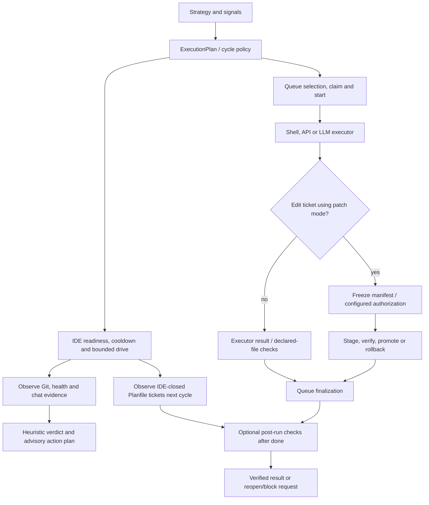

# Koru autonomy assessment — September 2026

Assessment date: **2026-09-05**. Source baseline:
`c695361224afbdd13dda6be89d6862a70300ee09` (PR #114).
Scope: source inspection, deterministic probes and targeted regression tests.
This documentation change does not change runtime behavior.

Koru can discover work, select a ticket, execute through queue or IDE adapters,
observe effects and schedule recovery. It already has transactional patch
execution and substantial safeguards. The highest-priority work is making
verification results and lifecycle acknowledgements trustworthy across these
paths. Adding another planner or increasing retries would not fix the confirmed
problems below.

## Execution map and existing controls



The diagram combines the paths under inspection; it is not a new shared state
machine. Post-drive advice is stored/emitted, while queue completion and
post-run lifecycle changes are separate operations.

| Boundary | Implemented behavior and practical limit | Source |
| --- | --- | --- |
| Plan | `koru.execution_plan/v1` compiles strategy, signals and task profiles. It coexists with `ActionPlan`, patch `PatchPlan` and cycle state. | [execution_plan.py](../../src/koru/autonomy/execution_plan.py), [decision_arbiter.py](../../src/koru/autonomy/decision_arbiter.py) |
| Queue ownership | POSIX per-project lock; default claim lease 7,200 seconds. Missing legacy `claim` command is tolerated; lock can be disabled by configuration. These are not proof that every executor has fenced, renewable ownership. | [locking.py](../../src/koru/queue/locking.py) |
| Retry and expiry | Persisted queue attempt budget defaults to one attempt. Drive retry loop stops on a repeated failure signature. Expired work is blocked and projected as `waiting_human_triage` / `sla:urgent`. | [runner.py](../../src/koru/queue/runner.py), [cycle_drive_retry.py](../../src/koru/autonomy/cycle/cycle_drive_retry.py), [ide_work.py](../../src/koru/autonomy/ide_work.py) |
| Patch transaction | Frozen manifest, journaled phases, workspace isolation, verification and promotion/rollback already exist. Branch promotion refuses to silently downgrade when isolation/verification is unavailable; artifact and direct apply modes have different guarantees. | [service.py](../../src/koru/queue/transaction/service.py), [manifest.py](../../src/koru/queue/manifest.py), [workspace.py](../../src/koru/queue/workspace.py) |
| Authorization | Named contracts constrain the patch. `KORU_QUEUE_REQUIRE_GRANT=1` adds signed Ed25519 grants, binding checks and a consumed JTI; it also requires `KORU_MUTATIONS_ENABLED=1`. Without a contract or required grant, the authorizer is absent. Local issuer and executor currently share a process. | [authorization.py](../../src/koru/queue/authorization.py), [grant.py](../../src/koru/queue/grant.py), [grant_store.py](../../src/koru/queue/grant_store.py) |
| Queue completion | Patch verification/evidence errors prevent completion. Ordinary successful shell execution can finish without a separate test profile. The finalizer invokes lifecycle commands but does not inspect the `ticket done` result before reporting `completed`. | [runner.py](../../src/koru/queue/runner.py), `_compute_verification_error`, `_finalize_ticket` |
| Drive observation | Git/WUP/chat evidence produces a heuristic verdict. `submitted_but_no_effect` is explicitly recognized. A generated `close_ticket` action is stored and emitted by the inspected post-drive path, not executed there. | [verification_engine.py](../../src/koru/autonomy/verification_engine.py), [cycle_post_drive.py](../../src/koru/autonomy/cycle/cycle_post_drive.py) |
| Post-run checks | Library default is disabled; enabled plus nonempty commands is required. This repository's [koru.yaml](../../koru.yaml) explicitly enables Ruff and pytest. These checks run after `done`, not as a universal pre-completion gate. | [post_run_verify.py](../../src/koru/autonomy/post_run_verify.py) |

Grant/replay controls above describe the queue patch path. They are not GitHub
merge approval, nor evidence that shell, IDE, scan and repair all pass through
the same authorization boundary.

## Confirmed findings

Priorities order the next implementation work; they are not incident severity
claims. F1–F5 have deterministic probes below. F6–F8 are source/test findings.

| ID | Priority | Observation | Effect and required change |
| --- | --- | --- | --- |
| F1 | P1 | A command list containing only spaces becomes a nonempty tuple of empty strings. Verification skips every command and reports `verified`. | Reject an enabled configuration without executable commands; distinguish `not_run` from `passed`. |
| F2 | P1 | `apply_verify_failure` reports `reopened` even when the lifecycle runner returns exit 1. The queue finalizer also ignores the `done` response (source inspection). | Report requested and acknowledged transitions separately; failed persistence must prevent a terminal success result. |
| F3 | P1 | `post_verify_seen` contains only ticket IDs. An already seen ID is skipped by IDE verification even if the ticket was reopened and completed again in the same session. | Bind evidence/cache to attempt, workspace/HEAD and command profile; invalidate on a new attempt or changed input. Queue verification itself still runs on its completed list. |
| F4 | P1 | The stock sanitized verification subprocess has no timeout argument. | Add a bounded command deadline and typed timeout/cancellation outcome; test that a stuck command cannot hold the cycle indefinitely. No hung production command was launched for this audit. |
| F5 | P1 | One changed file + unknown tests + `message.sent` gives heuristic `completed`, confidence 0.7; arbiter proposes `close_ticket`. WUP status is not a HEAD-bound test receipt. | Keep progress advice separate from completion authority. The inspected path emits this plan only; this probe does **not** demonstrate an unverified ticket being closed. |
| F6 | P2 | Existing `ExecutionPlan`, `ActionPlan`, patch manifest and cycle state have different roles. Authorization is optional and specific to the patch transaction. | Inventory each mutation path, reuse these contracts and connect them through bounded adapters; do not introduce duplicate grant/manifest stores. |
| F7 | P2 | Photo-VQL normalization retains the final successful code-edit override of earlier `ok` failures. `vdisplay_client.py` still has 6,454 lines after PR #114. | Specify operation success versus submission and task verification before further extraction. This is preserved legacy behavior, not proof of ticket closure. See [drive_result.py](../../src/koru/integrations/vdisplay/drive_result.py) and [characterization tests](../../tests/test_vdisplay_drive_result.py). |
| F8 | P1 | A lease test assumes a one-token Planfile command; slow cycle tests enable optional planning LLM by default. | Make test transports explicit and stub provider boundaries so regression results do not depend on installed CLI layout or provider availability. |

The proposal and acceptance criteria are in the
[current refactoring sequence](./autonomy-determinism-refactor-plan.md#0-current-refactoring-sequence-2026-09-05).
Expired tickets already escalate, patch recovery is already journaled, and
repeated identical drive failures already stop. Preserve those controls.

## Test results and limitations

Python **3.13**; source tree and tests unchanged from the baseline above.
Pytest's managed governance plugin remained enabled. Logs, JUnit files and probe
results are retained in the external receipt store for `ticket-080`.

| Selection | Result | Interpretation |
| --- | --- | --- |
| 23-file autonomy/queue regression selection below | **308 passed, 1 failed, 18 subtests passed** | Failure: `test_release_stale_in_progress_triages_old_ticket`. |
| Same failing test in isolation, default command resolution | **1 failed** | Reproducible environment-sensitive assertion, not order pollution. |
| Same test with `KORU_PLANFILE_CMD=planfile` | **1 passed** | Diagnostic run; does not erase the default-run failure. |
| `test_verification_cycle_integration.py`, explicit `-m slow`, `KORU_PLANNING_LLM=0` | **11 passed** | Initial default-LLM run timed out and was interrupted; isolated run tests cycle wiring without provider dependency. |
| Six transaction/checkpoint/SDK/drive-result files below | **88 passed** | Includes transaction phases, journal, lifecycle SDK and recent normalization contracts. |
| F1–F5 probes | **5 observations reproduced** | Four behavioral probes with fake runners; deadline checked through AST inspection. |
| Ruff `src tests`, Docker engine/Compose config, managed governance | **Passed** | Docker engine 29.1.3; Compose validation is not a container execution test. |

The default lease test checks `c[1:4] == ["ticket", "block", "PLF-7"]`.
Here the resolved prefix is `python3 -m planfile.cli`; the probe recorded a
successful `ticket block` request and a Living Status triage projection. The
assertion therefore misses a correctly formed multi-token command. A future
fix should normalize/assert the lifecycle operation or inject its transport.

The initial pytest launch also stopped before collection because an agent log
contained a machine-local path (`GOV-PATH-001`). The log was corrected and the
managed gate passed on the subsequent runs. This was an audit setup error.

No full-suite green claim, autonomous completion percentage, live desktop
reliability result or remote-executor qualification follows from these tests.
The first slow run exposed an uncontrolled optional provider dependency; its
output is not live end-to-end validation. Future lab measurements need a fixed
fixture corpus, explicit lane/profile, HEAD-bound evidence and attempt budgets.

### Reproduce the test selections

Run from a configured development checkout with its dependencies installed.
Use the project's Python executable; the commands below retain pytest's
managed gate and its normal `not slow` selection except where overridden.

```bash
PYTHONDONTWRITEBYTECODE=1 python -m pytest -q -p no:cacheprovider --timeout=30 \
  tests/test_execution_plan.py tests/test_decision_arbiter.py \
  tests/test_autonomy_policy_engine.py tests/test_autonomy_policy_decision.py \
  tests/test_code_change_autonomy.py tests/test_queue_contracts.py \
  tests/test_queue_grant.py tests/test_queue_recovery.py tests/test_queue_evidence.py \
  tests/test_queue_living_status.py tests/test_planfile_queue.py tests/test_ide_work.py \
  tests/test_autonomous_cycle_drive_retry.py tests/test_autonomous_redrive_cooldown.py \
  tests/test_autonomous_cycle_drive_outcome.py tests/test_autonomous_readiness.py \
  tests/test_autonomous_process_guard.py tests/test_verification_engine.py \
  tests/test_post_run_verify.py tests/test_post_run_verify_env.py \
  tests/test_autonomous_scenarios.py tests/test_autonomous_loop_runner.py \
  tests/test_autonomy_drive_result.py

KORU_PLANNING_LLM=0 python -m pytest -q -p no:cacheprovider -m slow --timeout=30 \
  tests/test_verification_cycle_integration.py

KORU_PLANNING_LLM=0 python -m pytest -q -p no:cacheprovider --timeout=30 \
  tests/test_queue_transaction_phases.py tests/test_queue_journal.py \
  tests/test_planfile_sdk.py tests/test_cqrs_autonomous_checkpoint_context.py \
  tests/test_ticket_hygiene.py tests/test_vdisplay_drive_result.py

KORU_PLANNING_LLM=0 KORU_PLANFILE_CMD=planfile python -m pytest -q \
  -p no:cacheprovider --timeout=30 \
  tests/test_ide_work.py::TestIdeWork::test_release_stale_in_progress_triages_old_ticket

python -m ruff check src tests
./project/governance-check.sh
docker info --format '{{.ServerVersion}}'
docker compose config --quiet
git diff --check
```

### Reproduce the five boundary observations

Run this snippet with the development Python from the repository root. It
loads the same import paths as pytest. Lifecycle and shell runners are fakes;
no real ticket is changed, no command is submitted to an IDE, and no LLM is used.
Assertions describe existing behavior to be corrected, not the desired contract.

```python
import ast
import inspect
import subprocess
import sys
import tomllib
from pathlib import Path
from unittest.mock import Mock, patch

paths = tomllib.loads(Path("pyproject.toml").read_text())["tool"]["pytest"]["ini_options"]["pythonpath"]
for path in reversed(paths):
    sys.path.insert(0, str(Path(path).resolve()))

from koru.autonomy import post_run_verify as verify
from koru.autonomy.decision_arbiter import ArbiterSignals, decide
from koru.autonomy.state import AutoloopState
from koru.autonomy.verification_engine import (
    ChatEvidence, Evidence, GitEvidence, TestEvidence, assess_verdict,
)

root = Path.cwd()
config = verify.PostRunVerifyConfig(
    enabled=True,
    commands=tuple(verify._parse_verify_commands({"commands": ["   "]})),
)
shell = Mock()
out = verify.verify_completed_tickets(
    root, ["AUDIT-1"], config=config, planfile_runner=Mock(), shell_runner=shell,
)
assert out[0]["ok"] and not shell.called  # F1: no command actually ran

failed = Mock(return_value=subprocess.CompletedProcess([], 1, "", "denied"))
assert verify.apply_verify_failure(
    root, "AUDIT-1", config=config, detail="test failed", exit_code=1, runner=failed,
) == "reopened"  # F2: transition was not acknowledged

state = AutoloopState(post_verify_seen={"AUDIT-1"}, pending_ide_verify_id="AUDIT-1")
shell = Mock()
with patch.object(verify, "fetch_recently_done_ticket_ids", return_value=["AUDIT-1"]):
    out = verify.verify_after_ide_work(
        root, state,
        config=verify.PostRunVerifyConfig(enabled=True, commands=("pytest -q",)),
        planfile_runner=Mock(), shell_runner=shell,
    )
assert out == [] and not shell.called  # F3: same ID suppresses another attempt

calls = [node for node in ast.walk(ast.parse(inspect.getsource(verify._run_verify_shell_command)))
         if isinstance(node, ast.Call) and isinstance(node.func, ast.Attribute)
         and node.func.attr == "run"]
assert len(calls) == 1 and "timeout" not in {kw.arg for kw in calls[0].keywords}  # F4

verdict = assess_verdict(Evidence(
    git=GitEvidence(files_changed=1), tests=TestEvidence(status="unknown"),
    chat=ChatEvidence(has_message_sent=True),
), ticket_id="AUDIT-1")
assert (verdict.outcome, verdict.confidence) == ("completed", 0.7)
assert decide(ArbiterSignals(verdict=verdict, test_status="unknown")).action == "close_ticket"  # F5
print("F1–F5 reproduced; no real lifecycle or shell mutation")
```
