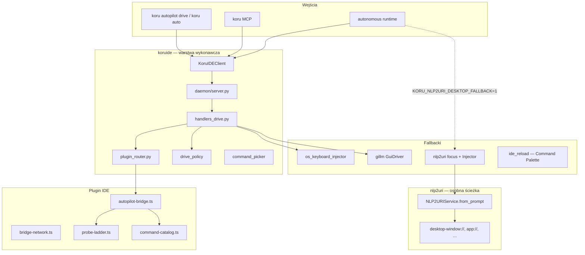

# Architektura sterowania IDE — Koru, koruide, pluginy i nlp2uri

**Status:** analysis baseline  
**Data:** 2026-06-07  
**Powiązane:** [agent-backends-architecture.md](agent-backends-architecture.md), [autopilot-design.md](autopilot-design.md), [IDE_PROTOCOL.md](IDE_PROTOCOL.md), [desktop-uri-orchestration.md](desktop-uri-orchestration.md), [koru-control-command-dsl.md](koru-control-command-dsl.md), [adr-kide-001](adr/adr-kide-001-koru-vs-koruide-boundary.md)

## Wniosek główny

`nlp2uri` jest używany w Koru, ale **nie jest głównym systemem kontroli IDE**.

Główna kontrola IDE idzie przez własny mechanizm **`koruide`**:

```text
CLI / MCP / autonomous runtime
  → KoruIDEClient.drive()
  → daemon (UNIX socket, NDJSON)
  → plugin router (IDE + workspace)
  → plugin IDE (VSIX / JetBrains)
  → focus → paste → submit → ack
```

`nlp2uri` działa jako warstwa **adresowania desktopu**: NL → URI → akcja OS / SystemMap / getv, plus opcjonalny fallback fokusu okna IDE. Nie obsługuje semantycznie: czatu IDE, katalogu komend pluginu, routingu workspace, ack ani weryfikacji submitu.

---

## Podział odpowiedzialności

| Warstwa | Właściciel | Zachowanie dziś |
|---------|------------|-----------------|
| Desktop NL → URI | `nlp2uri` | `app://`, `desktop-window://`, `file://`, `getv://`, SystemMap |
| Koru desktop MCP bridge | `koruapi/desktop_uri.py` | `koru_desktop_uri_plan`, `koru_desktop_uri_handle`, SystemMap/getv tools |
| IDE drive (główna ścieżka) | `koruide` | daemon, plugin router, command catalog, fallback OS, ack |
| Opcjonalny focus fallback | Koru + `nlp2uri` + gillm | `desktop-window://focus` → `Injector` (`KORU_NLP2URI_DESKTOP_FALLBACK=1`) |
| Audyt / replay | Koru | `koru.control.v1` (`src/koru/control_commands.py`) |

Docelowy podział (bez przenoszenia runtime do `nlp2uri`):

```text
natural language
  → IntentIR / UriIntent          (nlp2uri)
  → ide-chat:// / koru-control:// (nlp2uri)
  → koru.control.v1 plan          (nlp2uri compile, dry-run)
  → KoruIDEClient.drive           (Koru execute)
  → plugin / fallback             (Koru runtime)
  → ack + verification            (Koru observability)
```

**Zasada:** probe-ladder, heurystyki focusu (np. Cursor Glass), workspace routing, keyboard fallback i weryfikacja `message.sent` pozostają w Koru. `nlp2uri` **nazywa cel** i **kompiluje plan** — nie wykonuje go samodzielnie poza prostymi akcjami OS.

---

## Diagram architektury (stan obecny)



---

## Protokół koruide

Kontrakt wire protocol: [`IDE_PROTOCOL.md`](IDE_PROTOCOL.md), implementacja: `src/koruide/protocol.py`.

### Role i typy wiadomości

| Kierunek | Typy |
|----------|------|
| CLI → daemon | `drive`, `status`, `ping`, `shutdown` |
| daemon → plugin | `chat.send`, `ping`, `shutdown`, `ack`, `error` |
| plugin → daemon | `hello`, `ack`, `message.sent`, `message.received`, `chat.opened`, `console_log`, … |

Pola `drive`: `text`, `submit`, `ide`, `require_plugin`, `strategy_hint`.  
Pola `chat.send`: `text`, `submit`, `command_order`, `strategy_hint`.

### Przepływ `drive`

1. `handlers_drive.py` normalizuje `ide`, szuka pluginu (`daemon._plugin_for`).
2. Jeśli plugin istnieje i nie ma `KORU_AUTOPILOT_PREFER_KEYBOARD` → `_drive_via_plugin`.
3. Sprawdzenie wersji pluginu (`drive_policy`); blokada przy mismatch (konfigurowalne).
4. `chat.send` z opcjonalnym `command_order` z `command_picker`.
5. Plugin: `injectChat` → ladder focus/open/paste/submit → `ack` + `operation_trace`.
6. Bez pluginu: `_drive_via_keyboard` lub błąd przy `require_plugin=true`.

### Wykrywanie IDE i target

`src/koruide/ide.py`: `detect_running_ides`, `pick_target`, `resolve_drive_target`, host terminala (`TERM_PROGRAM`), aktywne okno.

---

## Pluginy IDE

### Rodzina VS Code / Cursor / Windsurf / VSCodium

| Moduł | Ścieżka | Rola |
|-------|---------|------|
| Bridge | `plugins/koru-autopilot-shared/src/autopilot-bridge.ts` | `injectChat`: focus, guard busy input, paste, submit, ack |
| Sieć | `plugins/koru-autopilot-shared/src/bridge-network.ts` | Socket, `hello`, capabilities, command catalog, eventy czatu |
| Katalog | `plugins/koru-autopilot-vscode/src/command-catalog.ts` | Capability: `focus_open`, `focus_input`, `paste`, `submit` |
| Ladder | `plugins/koru-autopilot-vscode/src/probe-ladder.ts` | Kandydaci komend per capability, trace per krok |

Każde IDE ma własny VSIX (`koru-autopilot-cursor`, `-vscode`, `-windsurf`, `-vscodium`) ze współdzielonym kodem w `koru-autopilot-shared`.

### JetBrains

| Moduł | Ścieżka | Rola |
|-------|---------|------|
| Service | `plugins/koru-autopilot-jetbrains/.../KoruAutopilotService.kt` | Socket, `chat.send` |
| Injector | `.../ChatInjector.kt` | Akcje IDE + clipboard + AWT Robot |

Mniej zaawansowany ladder i command catalog niż VS Code family.

### Komenda połączenia

`koru: Connect autopilot daemon` — łączy plugin z daemonem (status bar: `koru: on`). Nie przeładowuje rozszerzenia; po upgrade VSIX wymaga `Developer: Reload Window` + ponowne Connect.

---

## Backendy agenta (warstwa wyżej)

Rejestr: `src/koru/agent_backends.py`, runtime: `src/koru/agent_backend_runtime.py`.

| Backend ID | Transport | Push chat |
|------------|-----------|-----------|
| `vscode_family_plugin_socket` | UNIX socket + VSIX | tak |
| `jetbrains_plugin_socket` | UNIX socket + IntelliJ | tak |
| `gillm_gui_driver` | profil klawiatury gillm | tak |
| `os_keyboard_injector` | wtype / ydotool / xdotool | tak |
| `mcp_stdio_server` | MCP (IDE → Koru tools) | nie |
| `Nlp2UriDesktopBackend` | `desktop-window://focus` + Injector | tak (opcjonalny) |

Szczegóły: [agent-backends-architecture.md](agent-backends-architecture.md).

---

## Gdzie wchodzi nlp2uri

### 1. MCP desktop bridge

`src/koruapi/desktop_uri.py` → `NLP2URIService.from_prompt()` / `handle()`.

Narzędzia MCP: `koru_desktop_uri_plan`, `koru_desktop_uri_handle`, SystemMap, getv.  
Instrukcja operacyjna: [desktop-uri-orchestration.md](desktop-uri-orchestration.md).

### 2. Opcjonalny fallback w autonomous cycle

`src/koru/autonomous_cycle_gate.py` → `try_nlp2uri_focus_fallback()`:

- Włączone: `KORU_NLP2URI_DESKTOP_FALLBACK=1`
- Focus okna przez WM (`desktop-window://focus`), potem typing przez gillm `Injector`

### 3. Częściowe NL dla IDE w nlp2uri

`nlp2uri/parse_nl.py` — regex `_IDE_PROJECT_RE`:

- „otwórz cursor z projektem /path” → `IntentKind.OPEN`, `target="ide"`
- Kompiluje do otwarcia projektu / `app://`, **nie** do `chat.send`

### 4. Wykonanie control plan (Faza 3)

`nlp2uri/control_execute.py`:

- kompiluje `ide-chat://` / `koru-control://` → `koru.control.v1`
- wykonuje przez `koruide.client.KoruIDEClient` (socket) lub CLI fallback (`koru autopilot drive`)
- zwraca `verification_status` (`acknowledged`, `verified`, `blocked_require_plugin`, …)

Koru MCP: `koru_ide_control_plan`, `koru_ide_control_execute`.  
Autonomous gate: `KORU_IDE_CONTROL_VIA_NLP2URI=1` → `try_nlp2uri_ide_control()`.

### 6. SystemMap ingest (Faza 6)

- `koru autopilot status --format systemmap` → URI index (`ide_status_systemmap.py`)
- `nlp2uri/systemmap/koru_ide.py` — encje: `ide`, `ide_plugin`, `ide_workspace`, `ide_chat`, `ide_command`, `control_surface`
- MCP: `koru_ide_list_uris`, `nlp2uri_list_koru_ide_uris`

### 7. Czego nlp2uri nadal nie robi samodzielnie

- Protokół `koruide` pozostaje w Koru — nlp2uri tylko deleguje
- Live command catalog z pluginu
- Routing po `workspaceFolders`
- Weryfikacja submitu (`submit_unverified`, `intent_status`)
- Emisja `koru.control.v1` przy wykonaniu (to robi Koru)

---

## Fallbacki i OS injection

Kolejność w `handlers_drive.py` i `autonomous_cycle_gate.py`:

1. **Plugin socket** (domyślnie)
2. **Gillm GuiDriver** (`KORU_AUTOPILOT_GILLM_FALLBACK=1`)
3. **OS keyboard injector** (wtype/ydotool na Wayland; xdotool na X11)
4. **nlp2uri desktop focus** (`KORU_NLP2URI_DESKTOP_FALLBACK=1`)
5. **Command Palette injection** (`ide_reload.py`) — reload / connect; guard przed wpisaniem do integrated terminal

Na Waylandzie `xdotool` jest niedostępny; Koru preferuje `ydotool` / `wtype`. To runtime concern — nie należy do `nlp2uri`.

---

## Shimy koru.autopilot.*

Moduły `src/koru/autopilot/*` są głównie kompatybilnością wsteczną — realna logika jest w `src/koruide/` i `plugins/koru-autopilot-*`. Nowy kod powinien importować `koruide` (lub `IDEControlClient`), nie niskopoziomowe shims.

Granica: [adr-kide-001](adr/adr-kide-001-koru-vs-koruide-boundary.md).

---

## Observability i replay

- **Drive trace:** `koru-drive-dsl.md` — per-step `[DSL]` z pluginu
- **Control commands:** `koru-control-command-dsl.md` — `koru.control.v1` dla replay żądań
- **Integration ledger:** `src/koru/integration_ledger.py`

Dla integracji `nlp2uri` → Koru: kompilacja URI powinna produkować rekord `koru.control.v1`, nie tylko `OSAction` lub shell argv.

---

## Luki i granice odpowiedzialności

| Obszar | Koru (zostaje) | nlp2uri (docelowo) |
|--------|----------------|-------------------|
| Plugin probe / ladder | tak | nie |
| Workspace routing | tak | tylko adres w URI |
| Command catalog (live) | tak | indeks / mirror w SystemMap |
| ack / message.sent | tak | oczekiwania w planie (`verification`) |
| NL → intencja IDE chat | nie (dziś) | tak |
| URI → plan kontroli | nie (dziś) | tak |
| Desktop window focus | tak (fallback) + nlp2uri | tak (schemat `desktop-window://`) |
| Wykonanie planu IDE | tak | delegacja do `KoruIDEClient` |

---

## Powiązane dokumenty

| Dokument | Temat |
|----------|-------|
| [plans/nlp2uri-koruide-integration-refactor-plan.md](plans/nlp2uri-koruide-integration-refactor-plan.md) | Plan refaktoryzacji i fazy implementacji |
| [desktop-uri-orchestration.md](desktop-uri-orchestration.md) | MCP + nlp2uri operacyjnie |
| [ide-control-surfaces.md](ide-control-surfaces.md) | Dodatkowe powierzchnie kontroli (RPC, DAP, git) |
| [ide-command-api-map.md](ide-command-api-map.md) | Mapa komend IDE |
| [autopilot-quickstart.md](autopilot-quickstart.md) | Connect, drive, doctor |
| `../nlp2uri/SUMD.md` (sibling repo) | Sekcja „Koru IDE Control Integration” |
