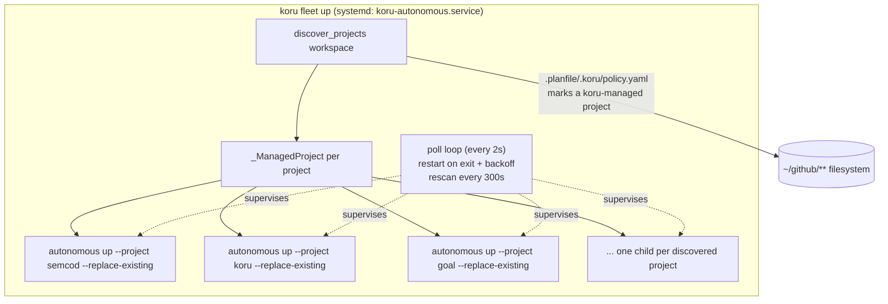
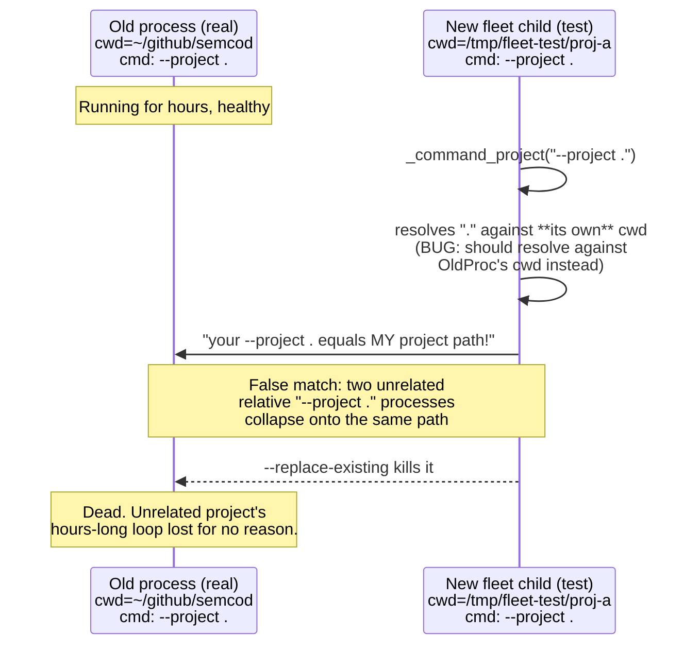

# `koru fleet` — one supervisor for every koru-managed project

`koru autonomous up` drives exactly one project (`--project`). Running it for
N projects meant hand-configuring N systemd units, each independently
subject to `systemctl stop`/restarts, with no single place to see "is koru
working on anything right now?" across the whole machine.

`koru fleet up` (`src/koru/cli_fleet.py`) is a thin supervisor: it discovers
every project that opted into koru's LLM-agent policy
(`.planfile/.koru/policy.yaml`, written by `koru --init`) under a workspace
root, and runs one supervised `koru autonomous up` **child process** per
project — a single broker-style service coordinating many project "topics"
(one child per project), analogous to how an MQTT broker manages many
topic subscribers from one process.

## Why process-per-project, not thread-per-project

Each project's autonomous loop keeps its own crash/resource blast radius —
matching how `--replace-existing` / `--allow-duplicate` already reason about
one loop per project. A runaway or crashing project can't take down every
other project's loop. The tradeoff is supervisor-level bookkeeping (start,
poll, restart-with-backoff, terminate-on-shutdown) instead of just spawning
threads; `cli_fleet.py` keeps that bookkeeping in one small module
(`_ManagedProject`).

## Architecture



ASCII view of the same shape, for a terminal/no-mermaid-renderer read:

```
                     ┌─────────────────────────────┐
                     │   koru fleet up (1 process)  │
                     │   systemd: koru-autonomous    │
                     └───────────────┬───────────────┘
                                     │ discover_projects(~/github)
                                     │ (finds .planfile/.koru/policy.yaml)
                 ┌───────────────────┼───────────────────┬─────────────────┐
                 ▼                   ▼                   ▼                 ▼
        ┌────────────────┐  ┌────────────────┐  ┌────────────────┐  ┌───────────┐
        │ autonomous up   │  │ autonomous up   │  │ autonomous up   │  │   ...     │
        │ --project semcod│  │ --project koru  │  │ --project goal  │  │  (N more) │
        │ --replace-exist.│  │ --replace-exist.│  │ --replace-exist.│  │           │
        └────────────────┘  └────────────────┘  └────────────────┘  └───────────┘
              child pid            child pid            child pid       child pid

        poll every 2s -> still alive? keep going. exited? restart after backoff.
        rescan every 300s -> new `koru --init`-ed project appears? add it, no restart needed.
        SIGTERM/SIGINT to the fleet -> terminate() every child, wait up to 30s, then kill -9.
```

## Usage

```bash
koru fleet ls                                    # preview discovery, no processes started
koru fleet ls --workspace /path/to/workspace-root

koru fleet up                                    # supervise every discovered project, ~/github default
koru fleet up --workspace /path/to/root \
  --restart-backoff-seconds 30 \
  --rescan-interval-seconds 300 \
  -- --ide claude --ticket-sources all            # everything after `--` is forwarded to each child
```

| Flag | Default | Effect |
| --- | --- | --- |
| `--workspace` | `$KORU_FLEET_WORKSPACE` or `~/github` | Root to discover koru-managed projects under |
| `--restart-backoff-seconds` | `30` | Delay before restarting a project's loop after it exits |
| `--rescan-interval-seconds` | `300` | How often to re-discover projects, so a newly `koru --init`-ed project joins without a fleet restart |
| `-- <args>` | — | Forwarded verbatim to every `koru autonomous up` child (e.g. `--ide`, `--ticket-sources`) |

Discovery prunes obvious non-project noise during the walk (`test-data`,
`tests`, `examples`, `plugins`, `archive`, `rebuild`, `node_modules`, VCS/venv
dirs) — see `_JUNK_PATH_SEGMENTS` in `src/koru/cli_fleet.py`. A project
nested inside another koru-managed project (e.g. `semcod/koru` inside
`semcod`) is legitimate and gets its own loop; only known junk directory
*names* are excluded, not nesting itself.

## Deploying as a systemd user service

Copy [`examples/systemd/koru-fleet.service.example`](../examples/systemd/koru-fleet.service.example)
to `~/.config/systemd/user/koru-autonomous.service`, adjust the paths, then:

```bash
systemctl --user daemon-reload
systemctl --user enable --now koru-autonomous.service
systemctl --user status koru-autonomous.service --no-pager
```

`Restart=always` on the *fleet* unit only needs to cover the supervisor
process crashing outright — each project child already has its own
restart-with-backoff handled inside `koru fleet up`.

## The bug this replaced a hand-rolled fix for

Building and load-testing this fleet surfaced a real, previously-untested
bug in the existing `--replace-existing` process-matching logic
(`autonomy/operator/operator_processes.py`), reproduced live in this
session:



Any two `koru autonomous up --project . --replace-existing` instances
anywhere on the machine — not just deliberately-concurrent fleet children —
were at risk of this, since `--project .` (relative) is the invocation shown
by `koru --doctor`'s own recovery hint. This is a strong candidate for at
least some of the autonomous loop's previously observed "why doesn't it stay
running" unreliability.

**Fix**: resolve a relative `--project` value against *that process's own*
cwd (`_process_cwd(pid)`, already computed by the caller) instead of the
checking process's `Path.cwd()`. See
[`tests/test_operator_processes_project_matching.py`](../tests/test_operator_processes_project_matching.py)
for the regression coverage (11 tests, including a direct reproduction of
the two-unrelated-instances collision) — this function had zero prior test
coverage.

A second, related race was also fixed in the same investigation: a
concurrent actor (a human, or another koru/agent session) closing a ticket
while a `tillm_shell`-driven vendor CLI (`claude -p ...`, can take minutes)
was still mid-flight could get its finished work reopened by a stale
`shell_drive_finalize` verify run. See
[`post-run-verify.md`](./post-run-verify.md) for the general
`queue.post_run_verify` mechanism this interacts with, and
[`tests/test_shell_drive_finalize.py`](../tests/test_shell_drive_finalize.py)
for the `_ticket_already_resolved()` fix.

## Known limitations / next steps

- No shared dashboard yet across fleet children — `koru serve --workspace`
  already supports multi-project discovery for the *read-only* dashboard;
  wiring `koru fleet up` to also launch (or point at) one shared
  `koru serve --workspace` instance instead of N per-project ones is a
  natural follow-up.
- `--rescan-interval-seconds` only *adds* newly discovered projects; a
  project that stops matching the policy marker (e.g. `.planfile/` removed)
  is not currently removed from the managed set until the fleet restarts.
- No per-project resource caps (CPU/memory) — a single project's heavy scan
  can still slow down the machine for all sibling children, even though it
  can no longer *kill* them.
- `_ManagedProject.command()` resolves the koru binary via `sys.argv[0]`;
  this is correct for the common case (systemd `ExecStart` uses an absolute
  path) but would fall back to a bare `"koru"` on `$PATH` if `koru fleet up`
  were ever invoked through a wrapper that rewrites `argv[0]`.

## See also

- [`post-run-verify.md`](./post-run-verify.md) — the `queue.post_run_verify`
  mechanism `shell_drive_finalize` calls into.
- [`project-discovery-strategy.md`](./project-discovery-strategy.md) — a
  different discovery concept (empty planfile queue → code2llm → new
  tickets *within* one project); not to be confused with `koru fleet`'s
  discovery of *which projects exist* on the machine.
- [`autonomy-ide-cursor.md`](./autonomy-ide-cursor.md) — package overview
  for the single-project `koru autonomous up` loop each fleet child runs.
- [`examples/systemd/koru-fleet.service.example`](../examples/systemd/koru-fleet.service.example) —
  the deployable systemd unit.
- [`../CHANGELOG.md`](../CHANGELOG.md) — `[Unreleased]` section has the
  full change log entries for both fixes plus the new `koru fleet` command.
