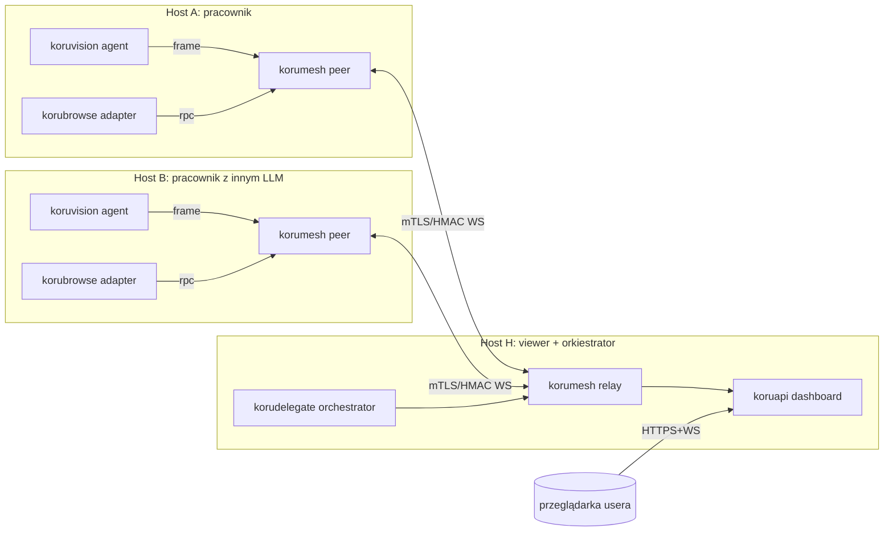

# Plan: obserwacja, delegacja i mesh przeglądarek (Koru Vision/Mesh/Browse)

Status: **draft**, autor: agent, data: 2026-05-22.
Powiązane: [`docs/ide-control-surfaces.md`](../ide-control-surfaces.md),
[`docs/local-service.md`](../local-service.md),
[`docs/autopilot-design.md`](../autopilot-design.md),
[`docs/plans/capture-providers-refactor.md`](./capture-providers-refactor.md) — refaktor warstwy capture,
[`src/koru/configurator/`](../../src/koru/configurator/) (package: schema, store, features, render, prompting, cli),
[`src/koruapi/dashboard_serve.py`](../../src/koruapi/dashboard_serve.py),
[`src/koruide/plugin_installer.py`](../../src/koruide/plugin_installer.py).

> Cel biznesowy: chcę móc z poziomu jednej przeglądarki podglądać, co dzieje się
> na kilku komputerach pracujących nad projektami (zrzuty ekranu monitorów oraz
> okien aplikacji co 1 min), zdalnie delegować zadania do hosta, który ma
> uruchomione inne narzędzia/LLM-y, i sterować wieloma przeglądarkami na moim
> lokalnym komputerze z poziomu shella + lekkiej wtyczki. Architektura ma być
> tak rozdzielona, by w przyszłości łatwo wydzielić podsystemy do osobnych
> paczek reużywanych w Koru.

---

## 1. Streszczenie wykonawcze

Dodajemy do Koru **paczki sąsiadujące** w `src/`, zaprojektowane od początku
tak, by mogły zostać wydzielone do osobnych repo/PyPI bez przepisywania
importów:

| Paczka          | Rola                                                                                       | Granica                                                          |
| --------------- | ------------------------------------------------------------------------------------------ | ---------------------------------------------------------------- |
| `koruvision`    | Capture monitorów i okien (screenshot, OCR opcjonalne, redakcja PII)                       | nie zna sieci ani przeglądarek                                   |
| `korumesh`      | Rejestr peerów (LAN/WAN), discovery (mDNS), relay (HTTP/WS), auth (HMAC + opcjonalnie mTLS) | nie zna treści (binary blob in/out)                              |
| `koruobserve`   | Orkiestrator `up/down/status` — startuje relay + vision + dashboard, zarządza PID-ami        | tylko zna istniejące CLI Koru, nie implementuje capture/transport |
| `korubrowse`   | Sterowanie wieloma przeglądarkami: WebExtension (Chrome/Firefox), CDP, native messaging    | nie zna mesh — używa adaptera transportu                        |
| `korudelegate`  | Pakiet zadań (Task Envelope), kolejka, podpisy, kwity wykonania                            | używa `korumesh` jako transportu                                |
| `korusandbox`   | Adapter do [clonebox](https://pypi.org/project/clonebox/) — uruchamia klony VM/kontenerów z przeglądarką + wstrzykniętą wtyczką | opcjonalna zależność, fallback do natywnej instalacji wtyczek |

### Najprostsze uruchomienie (po dodaniu `koruobserve`)

```bash
# jednorazowy bootstrap — tworzy config, klucz, włącza vision+mesh
koru observe up --project .

# w przeglądarce: stdout pokazuje URL np. http://127.0.0.1:8765/grid
koru observe status            # PIDy, log paths, alive
koru observe down              # zatrzymaj wszystko
```

`koru observe up` jest tylko convenience nad `koru configure --migrate / --enable vision,mesh`,
`koru mesh init`, `koru mesh relay`, `koru vision agent --publish-mesh`, `koru serve --no-open`.
Można dalej używać tych komend ręcznie — orkiestrator nie ukrywa żadnej z nich.

Reszta zostaje: `koruapi` rozszerzamy o nowe widoki dashboardu i endpointy WS;
`koruide` pozostaje wzorcem dla `korubrowse` (taki sam interfejs
`plugin_installer` / `plugin_router` / `protocol` / `socket`).

Konfigurator (`.koru/config.json` schema v1) dostaje sekcje `vision`, `mesh`,
`browse`, `delegate`, `sandbox` — wersja schematu rośnie do **v2** z migracją.

---

## 2. Cele i nie-cele

### Cele (must)

1. Każdy host w mesh emituje **co 60 s** zrzut każdego ekranu i opcjonalnie
   każdego okna nazwanej aplikacji.
2. Z poziomu jednego dashboardu (browser-side) widać siatkę kafelków: jeden
   kafelek = jeden monitor lub okno jednego peera.
3. Z dashboardu można wysłać zadanie do peera (np. "uruchom prompt X w narzędziu
   Y") i otrzymać **kwit wykonania** (status, log, opcjonalny artefakt).
4. Z shella (`koru browse …`) na moim lokalnym komputerze można sterować
   *wieloma* zainstalowanymi przeglądarkami: otworzyć URL, wstrzyknąć prompt,
   pobrać screen DOM-u.
5. Instalacja wtyczki przeglądarkowej działa w dwóch trybach:
   - **native**: auto-instalacja w użytkownikowym profilu (Chrome unpacked,
     Firefox temporary add-on, lub policy/registry dla Edge/Chrome enterprise),
   - **sandbox**: uruchomienie peera w klonie środowiska przez `clonebox`, w
     którym wtyczka jest preinstalowana w obrazie.
6. Każdy podsystem da się wyciąć z monorepo Koru bez modyfikacji innych —
   importy są jednokierunkowe, kontrakt API ma testy.

### Nie-cele (won't)

- Pełna platforma RMM (zarządzanie aktualizacjami OS, polityki AD).
- Reaktywne keylogging / monitoring aktywności użytkownika poza screenshotem
  okien aplikacji projektowych (na to zgoda per-host w configu).
- VPN/overlay własny — używamy **istniejących** rozwiązań (Tailscale, WireGuard)
  jako transportu dla `korumesh.wan`. Mesh LAN robimy natywnie.
- Wsparcie mobile (Android/iOS) w pierwszej iteracji.

---

## 3. Architektura (high-level)



Wszystko jest **opt-in per host** w `.koru/config.json`. Brak konfiguracji =
brak nasłuchu, brak zrzutów, brak otwartego portu.

---

## 4. Podział na paczki (granice importów)

Reguła: zależności idą tylko w jedną stronę.

```
koruvision ─┐
            ├─► korumesh ─► koruapi (dashboard) ─► UI
korubrowse ─┤              ▲
            │              │
            └─► korudelegate┘

korusandbox ─► (opcjonalnie) korubrowse plugin_installer
```

- `koruvision` nie zna `korumesh`. Zwraca strumień `VisionFrame`
  (dataclass: `frame_id`, `host`, `monitor_id`, `window_id?`, `ts`, `mime`,
  `bytes`, `redactions`, `hash`).
- `korumesh` przyjmuje dowolny `Envelope` (binary + nagłówek) i routuje. Nie
  parsuje obrazu.
- `koruapi` jest jedynym konsumentem UI — dostaje frame'y i renderuje.
- `korubrowse` i `koruvision` mogą żyć obok siebie na hoście, ale komunikują
  się wyłącznie przez `korumesh` (peer-local socket).
- `korudelegate` jest cienką warstwą nad `korumesh` z dodatkową semantyką
  zadań/kwitów (i tu wpina się logika polityki: kto może co delegować).
- `korusandbox` to most do `clonebox`; jest **opcjonalną** zależnością
  (`pip install koru[sandbox]`) — niedostępność nie psuje reszty.

W `pyproject.toml` każda paczka dostaje własny entry-point i własną sekcję
`[project.optional-dependencies]` (vision, mesh, browse, delegate, sandbox).
Dzięki temu wycięcie do osobnego repo to `git filter-repo --path src/koruvision`
plus własny pyproject — bez przerabiania kodu.

---

## 5. Komponenty — szczegóły

### 5.1 `koruvision` — capture

- Stack:
  - Linux: `mss` (multi-monitor) + `python-xlib`/`ewmh` do enumeracji okien
    pod X11, `pywayland`/`pipewire` portal pod Wayland (fallback: `grim` +
    `slurp`).
  - macOS: `Quartz` (CGWindowListCopyWindowInfo + CGWindowListCreateImage).
  - Windows: `mss` + `pywin32` do enumeracji okien.
- Cadence: domyślnie 60 s, konfigurowalny w `vision.interval_seconds`.
- Każdy frame: PNG zoptymalizowany (quant 8-bit + zlib) lub WebP. JPEG-quality
  dla pełnoekranowych klatek (60–75) — radykalnie tnie rozmiar.
- Redakcja: lista regexów do zamazania pasków (np. tokeny, hasła w
  notyfikacjach) — domyślnie maski na `Bearer …`, `ghp_…`, `sk-…` (te same
  wzorce co `goal.yaml::token_patterns`).
- Tryb okienny: lista nazw aplikacji w `vision.windows = [{name: "VS Code",
  match: "regex"}]`. Pominięcie = tylko ekrany.
- API:

  ```python
  class VisionAgent:
      def start(self) -> None: ...
      def stop(self) -> None: ...
      def latest(self) -> dict[str, VisionFrame]: ...
      async def stream(self) -> AsyncIterator[VisionFrame]: ...
  ```

- CLI: `koru vision capture --once`, `koru vision agent` (uruchamia daemon na
  pętli z respekrtem `vision.interval_seconds`), `koru vision list-monitors`.
- Bezpieczeństwo: agent działa pod userem; brak `sudo`. Jednorazowa zgoda w
  `koru configure` (`vision.enabled = true`).

### 5.2 `korumesh` — peer + relay

- Tryby:
  - **LAN**: mDNS service `_korumesh._tcp`, peer-to-peer WebSocket TLS, klucz
    HMAC z `.koru/keys/mesh.hmac` (32 bajty, generowany przez konfigurator).
  - **HUB**: dowolny host może być `relay` — agreguje peerów i wystawia na
    dashboard. To samo binarne (`koru mesh relay`), inny rola w configu.
  - **WAN**: relay nadal po WS, ale przez Tailscale/WireGuard — `korumesh` tego
    nie wie. Może też przejść przez SSH `LocalForward` jeśli ktoś nie chce
    overlaya.
- Wire format: `Envelope { id, ts, peer_from, peer_to|"*", topic, mime,
  bytes, hmac }`. Body binarny — `vision/frame`, `delegate/task`,
  `delegate/receipt`, `browse/rpc`, itd.
- Auth: HMAC-SHA256 z preshared key per-mesh + opcjonalny mTLS (klucze w
  `.koru/keys/`).
- Authorisation: `acl.yaml` per relay — kto może subskrybować jakie tematy z
  jakich peerów. Domyślnie peer widzi własne tematy + emituje do hub-a.
- Komendy CLI:
  - `koru mesh init` — wygeneruj key, wpisz do `.koru/config.json`.
  - `koru mesh peer` — uruchom peer-agenta.
  - `koru mesh relay` — uruchom hub.
  - `koru mesh trust <peer>` — zaakceptuj fingerprint nowego peera.
  - `koru mesh status` — kto jest online, opóźnienia, rozmiary frame'ów.

### 5.3 `korubrowse` — wielo-przeglądarkowy adapter

Trzy warstwy dostarczania komend do przeglądarki, w kolejności preferencji:

1. **WebExtension** (Manifest V3) — instalowana na hoście, działa w
   Chrome/Edge/Brave/Firefox, łączy się przez **native messaging** z lokalnym
   `koru browse host`.
2. **CDP (Chrome DevTools Protocol)** — uruchomienie istniejącej Chrome z
   `--remote-debugging-port=…` (Koru zarządza profilem osobnym, by nie zabić
   sesji usera). Świetne do automatyzacji bez wtyczki, ale wymaga restartu
   przeglądarki.
3. **Native window injection** (`koruide.os_injector`) — ostatecznie, tylko
   gdy nic powyżej niedostępne. Już istnieje w `koruide`, tylko parametryzujemy
   na konkretną przeglądarkę.

Wtyczka (paczka `plugins/koru-browse-extension/`):
- Manifest V3, permissions: `tabs`, `scripting`, `nativeMessaging`,
  `<all_urls>` z włączonym host-permission prompt.
- Native messaging host konfigurowany przez `koruide.plugin_installer`
  (analogicznie do VSIX); installer pisze `NativeMessagingHosts/koru.json`
  w `~/.config/google-chrome/`, `~/.mozilla/native-messaging-hosts/`, itd.
- Komendy z host-a do extension: `open(url, profile?)`, `tabs.list()`,
  `tabs.snapshot(tab_id)` (HTML+screenshot), `inject_prompt(tab_id, text,
  selector?)`, `eval(tab_id, code)`, `close(tab_id)`.
- Komendy z extension do host-a: `tab_changed`, `prompt_completed`,
  `dom_event(selector_match)`.

CLI: `koru browse open URL [--browser chrome|firefox|edge]`,
`koru browse list-tabs`, `koru browse send-prompt --tab 42 --text 'fix tests'`,
`koru browse snapshot --tab 42 --out /tmp/foo.png`,
`koru browse list-browsers`.

Konfigurator dopytuje: które przeglądarki uznać za zarządzane (`browse.targets`)
i czy automatycznie instalować rozszerzenie (`browse.autoinstall = true`).

### 5.4 `korudelegate` — delegacja zadań

- `TaskEnvelope { id, created_at, from_peer, to_peer, kind, payload, deadline?,
  policy }`. `kind` przykładowe: `browse.prompt`, `shell.run`,
  `koru.ticket.claim`, `koru.scan.run`, `llm.complete` (i tu pluginowo
  dochodzi support dla "innych LLM-ów na tamtym komputerze").
- `ReceiptEnvelope { task_id, peer, started_at, ended_at, status, log_url?,
  artifacts: [{name, mime, sha256, url}] }`.
- Polityki: `policy.yaml` mówi, jakie `kind` peer akceptuje od jakiego nadawcy.
  Domyślnie wszystko `deny`, white-listy w configu.
- Storage: kolejka jest w `~/.koru/delegate/queue.sqlite` (single-writer per
  peer); ulubione narzędzie do prostego, jednoplikowego store'u.
- Dashboard pokazuje "wysłane / odebrane / wykonane / nieudane" + przycisk
  *Delegate* na kafelku peera.

### 5.5 `korusandbox` — most do `clonebox`

Cel: zamiast walczyć z instalacją wtyczki w głównym profilu usera, możemy w
30 s odpalić klon środowiska z preinstalowaną wtyczką i preinstalowaną
przeglądarką.

- Adapter wywołuje `clonebox` jako subprocess (preferowane) lub używa
  jego Python API jeśli paczka zainstalowana w to samo venv.
- Predefiniowane profile w `koru/profiles/sandbox/`:
  - `browse-chrome.yaml` — Ubuntu + chromium + wtyczka koru-browse +
    bind-mount `~/.koru` (R/O).
  - `browse-firefox.yaml` — to samo dla Firefoxa.
  - `peer-only.yaml` — minimalny image dla peer-a mesh (bez GUI).
- `koru sandbox up <profile>` — utwórz klon, ustaw bind mounty, uruchom VM.
- `koru sandbox down <name>` — zatrzymaj/usuń.
- `koru sandbox list` — co biega.
- Klucze mesh dla sandboxa są generowane jednorazowo i podawane przez
  cloud-init usera, nie przez bind-mount (separacja zaufania).

Fallback: gdy clonebox nie jest zainstalowany lub user nie ma KVM (np. WSL
bez nested virt), `korusandbox` zwraca `Unsupported` i instrukcję
"użyj `--mode native`".

---

## 6. UX dashboardu (po stronie `koruapi`)

Trzy nowe widoki, dodane do istniejącego `koru serve`:

1. **/grid** — kafelkowa siatka monitorów/okien:
   - kafelek = `peer × monitor` lub `peer × window`,
   - klatka co 60 s (możliwość ręcznego refresh-now), miniatura JPG/WebP,
   - status: online/stale/offline, ostatni timestamp, latencja mesh.
2. **/peer/<id>** — szczegóły hosta: lista okien, listy procesów (opcjonalnie),
   przycisk *Delegate task*, podgląd ostatniego logu kwitów.
3. **/browse** — sterowanie lokalnym `korubrowse`: lista profili/przeglądarek
   znanych temu hostowi, lista kart, pole prompt + wybór karty docelowej.

Reużywamy istniejący stack (HTTP + WS) z `koruapi.dashboard_serve` (lifecycle:
`serve` / `start_serve_background`) oraz `koruapi.dashboard_routes`
(`build_dashboard_handler` — to tu rejestrujemy nowe trasy `/api/mesh/*`,
`/peer/*`, `/browse`). Klatki binarne lecą po WS, ale UI dostaje data-URI
z miniaturką + endpoint `/frames/<frame_id>` dla pełnej rozdzielczości
na żądanie.

---

## 7. Bezpieczeństwo (krytyczne)

Tu nie ma kompromisów — capture monitorów i sterowanie przeglądarką to dane
wrażliwe.

- **Domyślnie wyłączone.** `koru configure` wymusza świadomą zgodę
  (`vision.enabled`, `mesh.enabled`, `browse.enabled`) per-host.
- **Brak zewnętrznych portów bez konfiguracji.** `mesh.expose = "loopback"` lub
  `"lan"` lub `"wan"` — każdy poziom wymaga osobnej zgody.
- **PSK + opcjonalny mTLS.** PSK jest minimum; klucze leżą w `.koru/keys/` z
  perm `0600`. Konfigurator je generuje i pokazuje QR + plain text do ręcznego
  rozpropagowania na peerów.
- **Redakcja PII/tokenów** w `koruvision` przed wysłaniem klatki (lista regexów
  współdzielona z `goal.yaml::token_patterns`).
- **Audyt:** każda komenda przez `korudelegate` ląduje w append-only
  `~/.koru/audit/delegate.log.jsonl` po obu stronach, podpisana HMAC.
- **Allowlisty per `kind`.** Domyślnie peer NIC nie akceptuje. Wymaga jawnego
  `delegate.accept = ["browse.prompt"]` w configu.
- **Bezpieczne renderowanie HTML** w dashboardzie — żadnego inline JS z peerów;
  tylko binarki obrazu + JSON ze stringami.
- **Brak kluczy w bind-mountach do sandboxów.** `korusandbox` wstrzykuje klucz
  przez cloud-init user-data, nigdy z `.koru/keys/`.

---

## 8. Konfiguracja (schema v2)

```jsonc
{
  "schema": "koru.config/v2",
  "project": "/abs/path",
  "workspace": "/abs/path",
  "ide": "windsurf",
  "queue_name": "default",
  "serve": { "host": "127.0.0.1", "port": 8765, "lan": false, "auto_port": true },
  "vision": {
    "enabled": false,
    "interval_seconds": 60,
    "format": "webp",
    "monitors": "all",
    "windows": [],
    "redact": ["Bearer\\s+\\S+", "sk-[A-Za-z0-9]{20,}"]
  },
  "mesh": {
    "enabled": false,
    "role": "peer",
    "expose": "loopback",
    "psk_path": ".koru/keys/mesh.hmac",
    "relay_url": null,
    "discovery": "mdns"
  },
  "browse": {
    "enabled": false,
    "targets": [],
    "autoinstall": true,
    "native_messaging_host": ".koru/keys/native-host.json"
  },
  "delegate": {
    "accept": [],
    "policy_path": ".koru/policies/delegate.yaml"
  },
  "sandbox": {
    "enabled": false,
    "engine": "clonebox",
    "profile": "browse-chrome"
  }
}
```

Migracja v1 → v2: `koru configure --migrate` dokleja nowe sekcje z `enabled:
false`, żadnych side-effectów.

---

## 9. Plan iteracji (sprinty 1-tygodniowe, każdy = osobny ticket w planfile)

Każdy ticket trzyma się constraintu `.cursorrules` (≤ 80 linii diff, plus testy
regresji).

### Sprint 0 — fundament paczek
- `PLF-VISION-001` szkielet `src/koruvision/` + `mss` capture pojedynczego
  monitora + test snapshotu PNG.
- `PLF-VISION-002` enumeracja monitorów cross-platform (X11/Wayland/Win/Mac)
  pod warunkiem CI; degraduj do skip gdy brak.
- `PLF-MESH-001` szkielet `src/korumesh/` — `Envelope` dataclass + HMAC
  sign/verify + testy.
- `PLF-CFG-001` migracja `.koru/config.json` do schema v2 (`vision`, `mesh`,
  `browse`, `delegate`, `sandbox` z `enabled: false`).

### Sprint 1 — capture → relay → dashboard (minimalny e2e)
- `PLF-VISION-010` agent na pętli 60 s + lokalny endpoint `koru vision agent`.
- `PLF-MESH-010` peer (WS klient) + relay (WS serwer) po `loopback`, bez
  TLS.
- `PLF-API-010` widok `/grid` w `koruapi`, statyczny HTML + WS frame feed.
- `PLF-CFG-010` `koru configure` pyta o vision/mesh w trybie interaktywnym.

### Sprint 2 — LAN multi-peer + bezpieczeństwo
- `PLF-MESH-020` mDNS discovery + HMAC PSK + `koru mesh init/trust`.
- `PLF-VISION-020` redakcja PII przed wysyłką.
- `PLF-API-020` widok `/peer/<id>` z miniaturami i timestampami.
- `PLF-SEC-020` testy odmowy bez PSK / złego HMAC.

### Sprint 3 — delegacja zadań
- `PLF-DEL-001` `TaskEnvelope` + `ReceiptEnvelope` + SQLite queue.
- `PLF-DEL-010` `koru delegate send/list/status` CLI + UI w `/peer/<id>`.
- `PLF-DEL-020` policy file + allowlisty + audyt jsonl.

### Sprint 4 — wielo-przeglądarkowy adapter
- `PLF-BRW-001` szkielet `src/korubrowse/` + CLI `koru browse list-browsers`.
- `PLF-BRW-010` adapter CDP (Chrome/Edge) — `open`, `list-tabs`, `snapshot`.
- `PLF-BRW-020` WebExtension MV3 + native messaging host + auto-install
  (analogicznie do `koruide.plugin_installer`).
- `PLF-BRW-030` Firefox temporary add-on path + dokumentacja stałej instalacji.
- `PLF-BRW-040` integracja z `korudelegate` (`browse.prompt` kind).

### Sprint 5 — clonebox sandbox + WAN
- `PLF-SBX-001` szkielet `src/korusandbox/` + smoke test wywołania
  `clonebox detect`.
- `PLF-SBX-010` profile `browse-chrome.yaml` / `browse-firefox.yaml` z
  preinstalowaną wtyczką w cloud-init.
- `PLF-SBX-020` przekazanie kluczy mesh przez user-data, bez bind-mount.
- `PLF-MESH-040` dokumentacja transportu WAN przez Tailscale/WireGuard +
  fallback SSH `LocalForward`.

### Sprint 6 — odporność, telemetria, sprzątanie
- `PLF-OPS-001` health-checki peerów (`koru mesh status --watch`).
- `PLF-OPS-010` retencja klatek (domyślnie 24 h, sweep cron).
- `PLF-DOCS-010` `docs/observation-mesh-quickstart.md`.
- `PLF-PKG-010` `pyproject.toml` — entry-pointy i extras (`koru[vision,mesh,
  browse,delegate,sandbox]`).

---

## 10. Strategia testów

- **Jednostkowe per paczka**: każda paczka ma katalog `tests/test_<pkg>_*.py`
  bez zależności od innych paczek (kontrakt → mocks).
- **Kontraktowe**: `Envelope` HMAC, `TaskEnvelope` polityki, schema v1 → v2.
- **Integracyjne lokalne**: dwa procesy peer + relay na loopback, jeden screen
  z `mss` (capture syntetyczny w CI).
- **Smoke z przeglądarką**: Playwright odpala Chromium z `--load-extension` na
  packed wtyczce; symuluje "open / send-prompt / snapshot" bez sieci.
- **Smoke clonebox**: tylko na maszynach z KVM (skip w CI bez nested virt);
  uruchom `clonebox profile detect`, weryfikuj wynik.
- **Regresja LLM-free**: `task quality:regix:local` musi wracać 0 errors po
  każdym tickecie (jak w `.cursorrules`).

---

## 11. Otwarte decyzje (do zatwierdzenia przed Sprint 1)

1. **Transport klatek**: WebSocket binary frame vs WebRTC DataChannel? — WS
   wygrywa prostotą i już mamy w `koruapi`; WebRTC tylko jeśli okaże się, że
   pull frame 1×/min jest słaby (raczej nie).
2. **Format klatek**: WebP vs JPEG? — WebP daje ~30 % mniej przy zbliżonej
   jakości, ale wymaga `Pillow >= 9` z libwebp. Domyślnie WebP, fallback JPEG.
3. **mDNS biblioteka**: `zeroconf` (pure-Python) — preferowana.
4. **Wybór single-file queue**: SQLite (`sqlite3` w stdlib) — preferowane.
5. **Polityka domyślna `delegate.accept`**: pusta. User musi włączyć świadomie.
6. **Czy wtyczka browserowa wymaga signed builda?** — w pierwszej fazie nie
   (unpacked / temporary add-on). Sign tylko jeśli pójdziemy do Chrome Web
   Store.
7. **Czy `korusandbox` ma być w głównym pyproject, czy osobnym extras?** —
   osobny extras (`koru[sandbox]`), bo `clonebox` ciągnie `libvirt`/`qemu`.
8. **Polityka retencji nagrań**: 24 h domyślnie, opcja `vision.retention =
   forever | <hours>` — ale wymaga jawnej zgody i jasnej notki w UI.

---

## 12. Co już mamy w repo, co reużyjemy

- `src/koru/configurator/` — schema config + interactive prompter
  (`schema`, `store`, `features`, `render`, `prompting`, `cli`) →
  rozszerzamy o sekcje v2 (już w `features.py` / `CONFIG_SCHEMA_V2`).
- `src/koruapi/dashboard_serve.py` — lifecycle HTTP+WS serwera
  (`serve`, `start_serve_background`, `bind_serve_server`).
- `src/koruapi/dashboard_serve_utils.py` — port-locking, bind retry,
  `serve-endpoint.json` I/O.
- `src/koruapi/dashboard_routes.py` — `build_dashboard_handler(config)`:
  tu dochodzą nowe routy `/grid`, `/api/mesh/*`, `/peer/*`, `/browse`.
- `src/koruapi/dashboard_template.html` — UI dashboardu (auto-refresh,
  taby, link „Grid ↗”). Cache na pierwszym `GET /` przez `@lru_cache`.
- `src/koruide/plugin_installer.py`, `socket.py`, `protocol.py`,
  `plugin_router.py` — wzorzec dla `korubrowse`: rozszerzenie + native host +
  socket lokalny + protokół.
- `src/koruide/os_injector.py` — fallback do sterowania okienkami przeglądarki
  gdy plugin/CDP niedostępne.
- `goal.yaml::advanced.file_validation.token_patterns` — wspólne wzorce do
  redakcji w `koruvision`.
- `plugins/koru-autopilot-vscode/` — szablon TS + package.json + tsconfig do
  bootstrapu `plugins/koru-browse-extension/`.

Nie reużywamy `_archive/` i nic w `archive/**` (zgodnie z `.cursorrules`).

---

## 13. Definicja sukcesu (acceptance)

Plan uznajemy za zrealizowany, gdy:

1. Z jednego dashboardu (`koru serve`) widzę kafelki dwóch hostów po LAN, każdy
   z ≥ 1 monitorem i ≥ 1 oknem aplikacji, klatki nie starsze niż 90 s.
2. Z dashboardu wysyłam `browse.prompt` do hosta B z włączonym Firefoxem; w
   tabie hosta B pojawia się prompt + dostaję kwit z `status=ok` w ≤ 5 s.
3. Z shella na hoście A wykonuję `koru browse open https://… --browser chrome`
   i karta otwiera się w **moim** Chrome z preinstalowaną wtyczką
   (`autoinstall`).
4. Wyłączenie `mesh.enabled` na hoście B sprawia, że jego kafelki znikają z
   dashboardu, a `koru mesh status` raportuje `offline`.
5. Każda z paczek (`koruvision`, `korumesh`, `korubrowse`, `korudelegate`,
   `korusandbox`) ma własny zestaw testów przechodzących bez importów z innych
   paczek (poza definicjami kontraktów typu `Envelope`).
6. `task quality:regix:local` zwraca 0 errors po każdym z ticketów wymienionych
   w sekcji 9.

---

## 14. Najbliższy ruch (po akceptacji planu)

1. `PLF-CFG-001` (migracja schema v2) — czysty, mały ticket, niski risk.
2. `PLF-VISION-001` + `PLF-VISION-002` — bo capture jest najbardziej platformowy
   i odkryje grube braki wcześnie.
3. `PLF-MESH-001` — kontrakt `Envelope` + HMAC; daje granicę dla wszystkich
   kolejnych paczek.

Te trzy tickety wystarczą na pierwszy commit/sprint i nie blokują niczego
innego.
