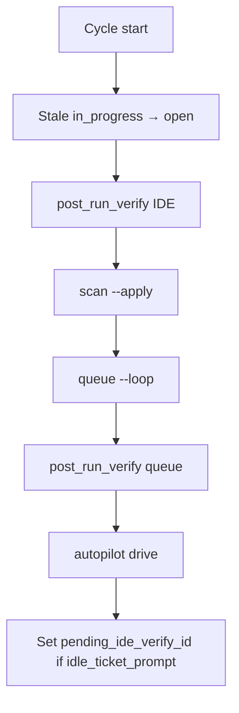

# Post-run verify (`queue.post_run_verify`)

Closed-loop check after planfile tickets are marked **done**. Configured in the
project root **`koru.yaml`** under `queue.post_run_verify`. Used by
`koru autonomous up` (and `koru autonomous safe-up`).

## Why

- **Queue** may close a `shell` ticket while the repo is still red.
- **IDE / MCP** may mark a ticket `done` in planfile without running gates.
- Koru does **not** read LLM chat replies; it detects IDE completion via
  **planfile status** (`done`).

On failure, the ticket is **reopened** (`open` + note) or **blocked** (config).

## Configuration (`koru.yaml`)

```yaml
queue:
  in_progress_stale_minutes: 120   # optional: reopen stale in_progress each cycle
  post_run_verify:
    enabled: true
    on_failure: reopen             # reopen | block
    after_ide_drive: true          # verify IDE-closed tickets (default true)
    ide_done_window_minutes: 30    # scan recent done tickets each cycle
    commands:
      - .venv/bin/python -m pytest --collect-only -q
      # - task quality:regix:local
```

Environment overrides:

| Variable | Effect |
| --- | --- |
| `KORU_POST_RUN_VERIFY` | `1` / `0` forces enable/disable |
| `KORU_INPROGRESS_STALE_MINUTES` | Overrides `in_progress_stale_minutes` |

## When verification runs

| Trigger | When |
| --- | --- |
| **Queue** | After `koru --queue --loop` completes one or more tickets in the cycle |
| **IDE** | Start of each autonomous cycle: pending ticket from last `idle_ticket_prompt` if now `done`, plus any `done` ticket updated in the last `ide_done_window_minutes` |
| **Dedup** | `post_verify_seen` in the autoloop session skips tickets already verified OK |

Flow within one cycle:



## Operator usage (c2004)

```bash
cd /path/to/c2004
pip install -e ~/github/semcod/koru
task koru:server                    # terminal A
task koru:start-autonomous IDE=vscode # or koru:autonomous:up
```

In VS Code / Cursor: enable MCP **koru**, connect autopilot, work tickets via
`koru_run_ticket` or the autopilot prompt, then `planfile ticket done PLF-…`.

**Next cycle** runs `post_run_verify`. If pytest collect fails, the ticket
returns to `open` with a note.

Manual check (same commands as koru):

```bash
.venv/bin/python -m pytest --collect-only -q
```

## Log lines

| Message | Meaning |
| --- | --- |
| `post_run_verify (queue): tickets=N failed=M` | After queue closed tickets |
| `post_run_verify (IDE): tickets=N failed=M` | After detecting IDE `done` |
| `queue hygiene: reopened K stale in_progress` | Stale lease cleanup |

## Tests

```bash
cd ~/github/semcod/koru
python3 -m pytest tests/test_post_run_verify.py tests/test_ide_work.py -q
```

## See also

- [autonomy-ide-cursor.md](./autonomy-ide-cursor.md) (Koru package overview)
- c2004: `docs/autonomy-ide-cursor.md`, `koru.yaml`, `task koru:autonomous:up`
