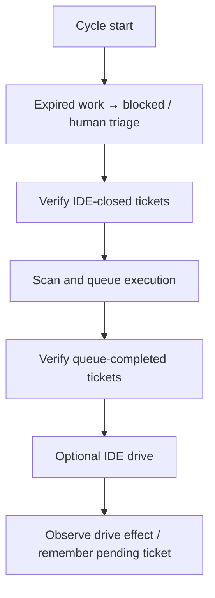

# Post-run verify (`queue.post_run_verify`)

Post-run verification executes configured checks **after** Planfile tickets
are marked `done`. The autonomous loop checks queue-completed tickets and
recently IDE-closed tickets. On failure it requests reopening or blocking.
It is separate from the queue patch transaction's pre-promotion verification.

Source: [post_run_verify.py](../src/koru/autonomy/post_run_verify.py).
Reviewed 2026-09-05 against `c695361224afbdd13dda6be89d6862a70300ee09`.

## Configuration

The library default is disabled. Both `enabled: true` and executable commands
are needed; `KORU_POST_RUN_VERIFY=1` alone does not supply checks. This
repository's [koru.yaml](../koru.yaml) enables Ruff and pytest explicitly.
Configure each target project's root `koru.yaml` with its actual test commands:

```yaml
queue:
  in_progress_stale_minutes: 120   # expired work goes to human triage
  post_run_verify:
    enabled: true
    on_failure: reopen           # reopen | block
    after_ide_drive: true         # default true
    ide_done_window_minutes: 30   # default 30
    max_output_chars: 1200       # failure-output tail; default 800
    commands:
      - .venv/bin/python -m ruff check src tests
      - .venv/bin/python -m pytest tests/ -q -x
```

Use commands appropriate to the target stack and its installed environment.
`pytest --collect-only` checks collection, not test behavior; it is insufficient
when completion requires passing tests. Keep commands nonblank: the current
parser can accept a whitespace-only list and incorrectly report verification
success without executing a command (assessment F1).

| Variable | Effect |
| --- | --- |
| `KORU_POST_RUN_VERIFY` | `1` / `0` overrides enablement; commands still come from configuration |
| `KORU_INPROGRESS_STALE_MINUTES` | Overrides the stale-work threshold; nonpositive disables that threshold |
| `KORU_TICKET_LEASE_SECONDS` | Queue claim duration; default 7,200 seconds, clamped to 60 seconds–7 days |

## Cycle behavior

| Trigger | Behavior |
| --- | --- |
| Queue | After the autonomous queue phase returns completed ticket IDs, run the configured command sequence once for the batch and associate its result with those IDs. Standalone queue execution is not itself this post-run phase. |
| IDE | At cycle start, inspect the pending driven ticket if now `done`, plus recently updated `done` tickets in the configured window. This trigger reads Planfile state; other autonomy features also inspect chat events. |
| Deduplication | Successful IDs enter the in-session `post_verify_seen` set. IDE checks skip those IDs; the key currently has no attempt, HEAD or profile binding. |
| Failure | Stop at the first nonzero command result. Request `open` + note, or `block` + reason according to `on_failure`. |
| Stale work | An expired explicit lease, or the age fallback when no lease is present, blocks the ticket and projects `waiting_human_triage` with `sla:urgent`. It does not automatically reopen stale work. |



Commands run sequentially from the project root. The stock runner removes
`KORU_*`, `TILLM_*` and `VDISPLAY_*` variables from the subprocess environment;
injected runners retain their behavior. Output notes keep the tail, where test
failure summaries usually appear.

The current stock runner has no command timeout. Also, the failure handler
reports a requested `reopened`/`blocked` action without checking the lifecycle
command's exit status. Inspect persisted ticket state when troubleshooting;
that action label alone is not acknowledgement that the transition succeeded.
The [September assessment](./architecture/autonomy-audit-2026-09.md) reproduces
these boundaries and the [refactoring plan](./architecture/autonomy-determinism-refactor-plan.md#0-current-refactoring-sequence-2026-09-05)
specifies deadlines, acknowledged transitions and attempt-bound evidence.

## Operator evidence

| Message | Meaning |
| --- | --- |
| `post_run_verify (queue): tickets=N failed=M` | Checks associated with queue-completed tickets |
| `post_run_verify (IDE): tickets=N failed=M` | Checks associated with observed IDE-closed tickets |
| `queue hygiene: triaged K stale in_progress` | Expired work sent to human triage |

For a failed check, reproduce the exact configured command from the same
project and inspect its failure tail. Confirm whether the ticket actually
became open/blocked and whether a later completion is being suppressed by the
ID-only session cache. A drive acknowledgement, chat reply or heuristic
`completed` verdict is not equivalent to passing the target's checks.

## Tests

```bash
python -m pytest -q tests/test_post_run_verify.py tests/test_post_run_verify_env.py
KORU_PLANNING_LLM=0 python -m pytest -q -m slow tests/test_verification_cycle_integration.py
python -m pytest -q tests/test_ide_work.py
```

The September audit recorded 11 passing cycle integration tests with optional
planning LLM disabled. The lease test in `test_ide_work.py` failed under a
multi-token Planfile command prefix and passed when pinned to `planfile`; see
the assessment for the exact selection and diagnostic distinction.
