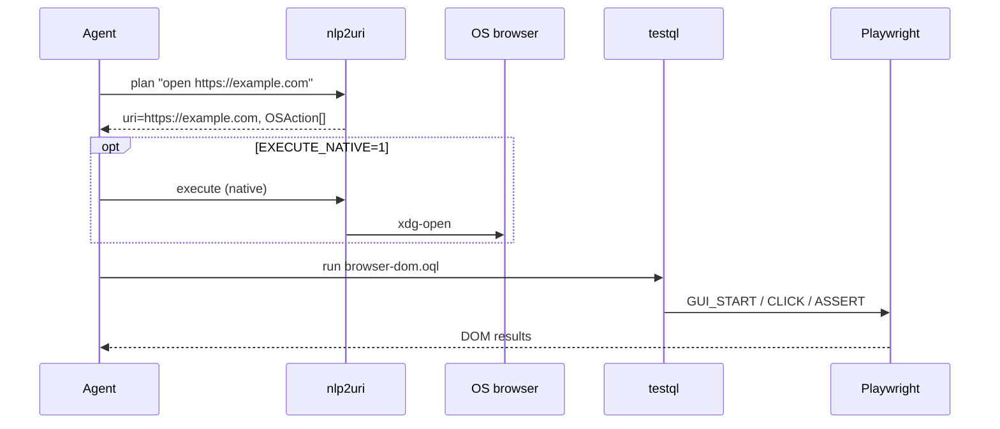

# nlp2uri + TestQL — browser URI i DOM

Scenariusz łączy dwie warstwy Semcod:

| Faza | Narzędzie | Co robi |
|------|-----------|---------|
| **1** | [nlp2uri](https://github.com/semcod/nlp2uri) | NL → URI → akcja OS (`xdg-open https://…`) |
| **2** | [testql](https://github.com/oqlos/testql) | Playwright: nawigacja, klik, asercje DOM |

Domyślny URL: **https://example.com** (stabilny, bez auth).

## Wymagania

```bash
# Koru + nlp2uri (editable sibling)
cd ~/github/semcod/koru && ./project.sh

# TestQL + Playwright (do pełnego GUI, nie dry-run)
cd ~/github/oqlos/testql
pip install -e ".[dev]"
pip install playwright && playwright install chromium
```

## Szybki start

```bash
cd ~/github/semcod/koru/examples/nlp2uri-testql-browser
chmod +x run.sh e2e.sh

# Walidacja składni (dry-run, bez przeglądarki)
./run.sh

# Własny URL
TARGET_URL=https://tom.sapletta.com/ ./run.sh

# Pełne wykonanie DOM (Playwright)
DRY_RUN=0 ./run.sh

# Otwórz też natywną przeglądarkę (osobna instancja od Playwright)
EXECUTE_NATIVE=1 DRY_RUN=0 ./run.sh
```

## Pliki

| Plik | Format | Opis |
|------|--------|------|
| `browser-dom.oql` | OQL | `GUI_START` → `GUI_ASSERT_TEXT` → `GUI_CLICK` |
| `browser-dom.testql.toon.yaml` | TestTOON | `SHELL` (nlp2uri plan) + `NAVIGATE` + `FLOW` + `ASSERT` |
| `run.sh` | bash | Orchestracja obu faz + `TARGET_URL` |
| `e2e.sh` | bash | Smoke dry-run (CI-friendly) |

## Przepływ



**Uwaga:** Faza 1 (natywny Firefox/Chromium) i faza 2 (Playwright) używają **osobnych** instancji przeglądarki. TestQL nie steruje oknem otwartym przez nlp2uri — to zamierzone: nlp2uri = desktop URI, testql = test automation DOM.

## Przykład NL → URI (faza 1)

```bash
nlp2uri plan "otwórz przeglądarkę na https://example.com" --json
# → "uri": "https://example.com"

nlp2uri plan "open firefox" --json
# → "uri": "app://firefox/open"
```

## Przykład DOM (faza 2)

Fragment `browser-dom.oql`:

```testql
GUI_START "https://example.com"
GUI_ASSERT_TEXT "h1" "Example Domain"
GUI_CLICK "a"
```

## MCP (agent w Cursor)

```json
{
  "name": "koru_desktop_uri_plan",
  "arguments": { "prompt": "open https://example.com", "platform": "linux" }
}
```

Następnie uruchom testql (MCP `testql` → `run_scenarios`) z plikiem tego katalogu.

## Dostosowanie do własnej strony

1. Ustaw `TARGET_URL` w `run.sh`.
2. Zaktualizuj selektory w `browser-dom.oql` / `ASSERT` w `.testql.toon.yaml`.
3. Opcjonalnie: `testql inspect "$TARGET_URL" --browser --out-dir .testql` — wygeneruj topologię DOM.
