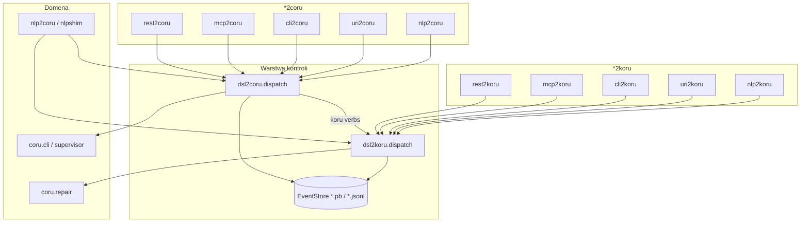

# Koru / Coru control layers (`*2koru`, `*2coru`)

Warstwa kontroli według `CONTROL_LAYER_PROMPT.template.md` (referencja: `doql`, `nlp2dsl`).

## `*2koru` — repair / lane CQRS

| Pakiet | Rola |
|--------|------|
| **dsl2koru** | DSL + JSON Schema + Protobuf + CQRS bus + EventStore |
| **uri2koru** | `koru://` → linia DSL → `dispatch()` |
| **nlp2koru** | NL → DSL (`to-dsl`); `apply` = dispatch |
| **cli2koru** | Shell REPL / exec / run |
| **mcp2koru** | MCP stdio (`koru_run_command`, `koru_run_command_pb`, …) |
| **rest2koru** | FastAPI `/v1/dsl`, port **8216** |

## `*2coru` — runtime autonomy / chat

| Pakiet | Rola |
|--------|------|
| **dsl2coru** | DSL runtime (AUTO, LANE, STATUS, …) + delegacja verbów koru |
| **uri2coru** | `coru://` → linia DSL → `dispatch()` |
| **nlp2coru** | NL → DSL; `apply` = `dsl2coru.dispatch()` |
| **cli2coru** | Shell REPL / exec / run |
| **mcp2coru** | MCP stdio (`coru_run_command`, `coru_to_dsl`, …) |
| **rest2coru** | FastAPI `/v1/dsl`, port **8218** |

## Paczki LLM (shim, nie pełna migracja)

| Pakiet | Verb DSL | Shim |
|--------|----------|------|
| **coru** | repair CQRS | handlery `dsl2koru` → `coru.repair` |
| **nlp2coru** | NL plan/rewrite | `control.py` → `dsl2koru` / `dsl2coru` |
| **nlpshim** | workflow NLP | `nlp2koru workflow` → `nlp2dsl_sdk` |



## Instalacja (dev)

```bash
cd /home/tom/github/semcod/koru
pip install -e packages/koruenv -e packages/nlpshim \
  -e packages/dsl2koru -e packages/uri2koru -e packages/nlp2koru \
  -e packages/cli2koru -e packages/mcp2koru -e packages/rest2koru \
  -e packages/dsl2coru -e packages/uri2coru -e packages/nlp2coru \
  -e packages/cli2coru -e packages/mcp2coru -e packages/rest2coru \
  -e packages/coru -e .
```

## Testy

```bash
# *2koru + *2coru — 52 testy; uruchamiaj python3 -m pytest (nie globalny pytest)
python3 -m pytest packages/dsl2koru/tests packages/uri2koru/tests packages/nlp2koru/tests \
       packages/cli2koru/tests packages/mcp2koru/tests packages/rest2koru/tests \
       packages/dsl2coru/tests packages/uri2coru/tests packages/nlp2coru/tests \
       packages/cli2coru/tests packages/mcp2coru/tests packages/rest2coru/tests -q
```

Testy parity cross-adapter: `test_adapter_parity.py` (bus + URI + REST + protobuf).

## DSL koru (repair / lane)

```text
QUERY_REPAIR_HISTORY PROJECT . [LIMIT N] [CODE x]
QUERY_LANE_STATUS IDE auto INSTANCE default
VALIDATE_LANE IDE auto INSTANCE default
REPAIR_RUN IDE auto INSTANCE default PROJECT .
RESOLVE "repair history" PROJECT .
```

## DSL coru (runtime)

```text
STATUS
AUTO --shell bash
LANE --ide auto --instance default
DOCTOR --probe
CHAT --llm
TEXT "status ide"
UI_TYPE "prompt" IN "Chat input" WINDOW region-bottom
UI_KEY ctrl+Return
UI_CLICK "Projects" WINDOW region-top
UI_NL "wpisz test w Chat input"
```

Verby `UI_*` delegują do `koru.integrations.imgl_client` → `nlp2imgl` / `rest2imgl` (:8219).
Zobacz [`docs/imgl-integration.md`](../docs/imgl-integration.md).
