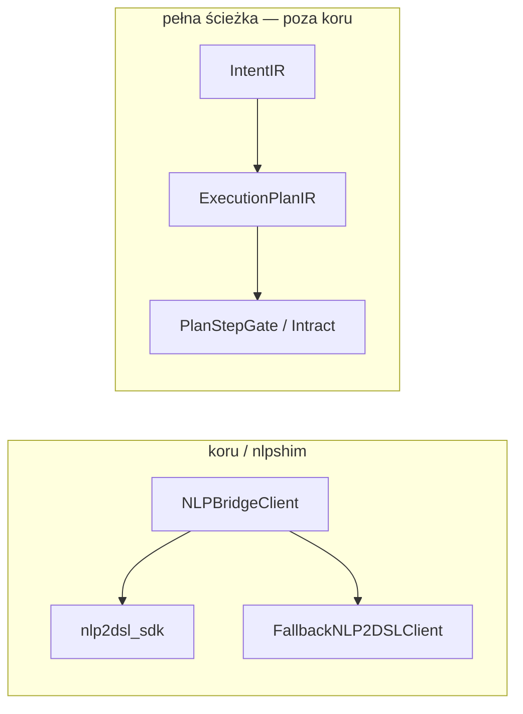

# nlpshim

Shared NLP bridge utilities for `gillm` and `sillm`.
This package safely loads `nlp2dsl_sdk` and provides fallback heuristics when the SDK is not present.

## Relacja z nlp2dsl / Intract

`nlpshim` używa `nlp2dsl_sdk.workflow_from_text` — **nie** przechodzi przez `IntentIR` ani kontrakty Intract.

Aby w koru dostać walidację kontraktów, trzeba by routować przez `nlp2cmd_intent.analyze_query` + opcjonalnie `nlp2cmd.intract.plan_gate` zamiast samego SDK workflow.

Zob. [nlp2cmd/docs/architecture/intract-integration.md](https://github.com/wronai/nlp2cmd/blob/main/docs/architecture/intract-integration.md).
