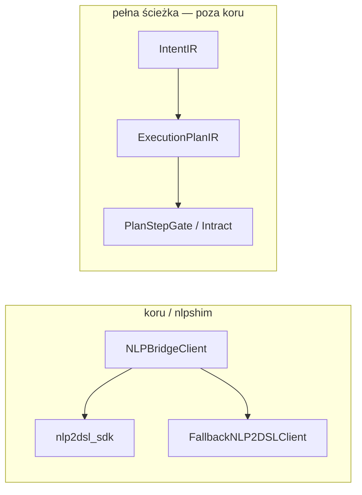

# nlpshim

Shared NLP bridge utilities for `gillm` and `tillm`.
This package safely loads `nlp2dsl_sdk` and provides fallback heuristics when the SDK is not present.

## Relacja z nlp2dsl / Intract

`nlpshim` domyślnie używa `nlp2dsl_sdk.workflow_from_text`. Z `NLP2CMD_INTEGRATION=1` najpierw analizuje `IntentIR` (`nlp2cmd_intent`), potem planuje workflow przez backend.



```bash
pip install -e packages/nlpshim[nlp2dsl]
export NLP2DSL_BACKEND_URL=http://localhost:8010
export NLP2CMD_INTEGRATION=1   # opcjonalnie IntentIR
export NLP2DSL_MOCK=1          # tylko testy offline
```

Walidacja scenariuszy TestTOON konwersacji: `testql_conversations` (`nlp2dsl/packages/testql-conversations`).

Zob. [nlp2cmd/docs/architecture/intract-integration.md](https://github.com/wronai/nlp2cmd/blob/main/docs/architecture/intract-integration.md).
