# System Architecture Analysis
<!-- generated in 0.01s -->

## Overview

- **Project**: /home/tom/github/semcod/koru
- **Primary Language**: python
- **Languages**: python: 129, shell: 42, yaml: 15, yml: 8, typescript: 6
- **Analysis Mode**: static
- **Total Functions**: 1286
- **Total Classes**: 91
- **Modules**: 215
- **Entry Points**: 433

## Architecture by Module

### plugins.koru-autopilot-vscode.src.extension
- **Functions**: 111
- **Classes**: 2
- **File**: `extension.ts`

### src.koru.autopilot.cli_command
- **Functions**: 50
- **File**: `cli_command.py`

### src.koru.context
- **Functions**: 48
- **File**: `context.py`

### src.koru.autonomous
- **Functions**: 48
- **Classes**: 2
- **File**: `autonomous.py`

### src.koru.autonomous_cycle
- **Functions**: 38
- **Classes**: 2
- **File**: `autonomous_cycle.py`

### src.koruapi.mcp_server
- **Functions**: 34
- **File**: `mcp_server.py`

### src.koruide.daemon
- **Functions**: 32
- **Classes**: 2
- **File**: `daemon.py`

### src.koruide.ide
- **Functions**: 29
- **Classes**: 1
- **File**: `ide.py`

### services.healing-webhook.app
- **Functions**: 27
- **File**: `app.py`

### src.koru.autonomous_wup
- **Functions**: 25
- **Classes**: 3
- **File**: `autonomous_wup.py`

### src.koruide.os_injector
- **Functions**: 24
- **Classes**: 2
- **File**: `os_injector.py`

### src.koru.scan
- **Functions**: 24
- **Classes**: 2
- **File**: `scan.py`

### plugins.koru-autopilot-vscode.src.probe-ladder
- **Functions**: 24
- **Classes**: 3
- **File**: `probe-ladder.ts`

### src.koru.mcp_provision
- **Functions**: 21
- **File**: `mcp_provision.py`

### src.koru.doctor
- **Functions**: 21
- **Classes**: 2
- **File**: `doctor.py`

### src.koru.autonomy.operator_pipeline
- **Functions**: 21
- **Classes**: 2
- **File**: `operator_pipeline.py`

### src.koruide.injector
- **Functions**: 20
- **Classes**: 4
- **File**: `injector.py`

### src.korudsl.library
- **Functions**: 19
- **File**: `library.py`

### src.koru.bootstrap
- **Functions**: 19
- **Classes**: 2
- **File**: `bootstrap.py`

### src.koru.tools
- **Functions**: 19
- **File**: `tools.py`

## Key Entry Points

Main execution flows into the system:

### src.koru.autonomous_parser.build_parser
- **Calls**: argparse.ArgumentParser, parser.add_argument, parser.add_subparsers, sub.add_parser, doctor.add_argument, sub.add_parser, heal.add_argument, heal.add_argument

### src.koru.autonomy.config.AutonomyConfig.from_env
> Create config from environment variables (shell compatibility).
- **Calls**: os.getenv, cls, None.strip, max, Path, os.getenv, os.getenv, src.koru.autonomy.env.env_truthy

### src.koruide.daemon.AutopilotDaemon._drive_via_keyboard
> Fallback: OS injector profile (X11) or :class:`Injector` keyboard sim.
- **Calls**: src.koruide.ide.resolve_drive_target, src.koruide.ide.pick_target, self.log, self._send, self.log, self.audit.record, self.log, text.replace

### src.koruide.daemon.AutopilotDaemon._handle_plugin_event
- **Calls**: self.log, self._append_event, self.audit.record, None.encode, self._send, time.monotonic, len, self._send

### src.koru.autopilot.cli_command._action_install_plugin_jetbrains
- **Calls**: proc.stdout.strip, proc.stderr.strip, src.koru.autopilot.cli_command._resolve_jetbrains_plugin_dir, src.koru.autopilot.cli_command._resolve_gradle_bin, subprocess.run, src.koru.autopilot.cli_command._resolve_jetbrains_plugin_artifact, scripts.koru-soak-monitor.print, scripts.koru-soak-monitor.print

### src.koru.autonomous_cycle.run_cycle
- **Calls**: src.koru.autonomous_cycle._initialize_cycle_telemetry, src.koru.autonomous_cycle._heal_stale_socket, src.koru.autonomous_cycle._handle_autopilot_events, src.koru.run_log.RunLogWriter._emit, src.koru.autonomous_cycle._handle_queue_hygiene, src.koru.autonomous_cycle._handle_post_run_verify_ide, src.koru.autonomous_cycle._handle_scan_phase, src.koru.autonomous_cycle._handle_queue_loop_phase

### src.koru.cli._topology_main
- **Calls**: None.parse_args, args.project.resolve, src.koru.topology.load_topology, src.koru.topology_cli.apply_topology_mutations, src.koru.topology.load_topology, None.get, None.get, isinstance

### src.koru.queue.runners.run_api_request
> Execute an HTTP API request.
- **Calls**: request.get, urllib.request.Request, float, str, str, None.encode, headers.setdefault, str

### src.koru.autonomy.env.autonomous_environ_doctor_probe
> Return ``(status, detail)`` for ``koru --doctor``; process-global, no I/O.
- **Calls**: os.environ.get, src.koru.autonomy.env.env_truthy, os.environ.get, os.environ.get, src.koru.autonomy.env.env_truthy, None.strip, None.lower, None.strip

### src.koru.autopilot.cli_command._action_drive
- **Calls**: src.koru.autopilot.cli_command._client, src.koru.autopilot.cli_command._should_fallback_to_direct, scripts.koru-soak-monitor.print, None.strip, None.strip, scripts.koru-soak-monitor.print, src.koru.autopilot.cli_command._run_direct_drive, client.is_running

### src.koru.cli._task_main
- **Calls**: None.parse_args, scripts.koru-soak-monitor.print, scripts.koru-soak-monitor.print, scripts.koru-soak-monitor.print, scripts.koru-soak-monitor.print, src.koru.events.emit_management_event, src.koru.tools.load_tool_registry, src.koru.tools.find_tool_entry

### src.koru.cli._agent_backends_main
> List or describe IDE agent backend profiles (``agent_backends``).
- **Calls**: argparse.ArgumentParser, parser.add_argument, parser.add_argument, parser.parse_args, src.koru.agent_backends.iter_agent_backend_profiles, src.koru.agent_backends.get_agent_backend_profile, scripts.koru-soak-monitor.print, scripts.koru-soak-monitor.print

### src.koru.gate.parse_authorizations
> Extract all gate authorizations recorded on a ticket.

Returns them in insertion order so callers can pick the most
recent one with ``parse_authorizat
- **Calls**: str, out.append, isinstance, note.startswith, json.loads, payload.get, payload.get, isinstance

### src.koruide.daemon.AutopilotDaemon._handle_drive
- **Calls**: msg.data.get, bool, bool, self._plugin_for, self._drive_via_keyboard, self._send, isinstance, msg.data.get

### services.healing-webhook.app.heal_vallm_validate
> Run vallm tier-1 (check) on all files mapped from the alert component.

Cheap pre-flight gate: blocks AI patches if affected files are already
syntact
- **Calls**: services.healing-webhook.app._resolve_affected_files, services.healing-webhook.app._record_action, isinstance, detail.get, services.healing-webhook.app._record_action, services.healing-webhook.app._run_vallm_check, sum, max

### services.healing-webhook.app.probe_failure
> Accept the testql-watchdog probe-failure payload.
- **Calls**: app.post, None.inc, payload.get, log.info, services.healing-webhook.app.create_planfile_ticket, request.json, payload.get, len

### src.koruide.injector.Injector._type_with_backend
- **Calls**: src.koruide.injector._extra_enter_count, self._call, self._call, range, self._call, self._call, self._press_wtype, range

### src.koru.doctor.render_text
> Human-readable rendering — fixed-width status column.
- **Calls**: lines.append, lines.append, max, report.summary, sum, counts.get, counts.get, counts.get

### src.koruapi.cli.main
- **Calls**: src.koruapi.cli._build_parser, parser.parse_known_args, args.project.resolve, sys.stdout.write, src.koru.activity_log.activity, src.koru.activity_log.activity, sys.stdout.write, api_serve

### services.healing-webhook.app.alertmanager_webhook
> Accept the Alertmanager webhook payload (v4).
- **Calls**: app.post, payload.get, request.json, alert.get, labels.get, labels.get, labels.get, alert.get

### src.koruapi.dashboard_serve.serve
> Start the dashboard server and block until Ctrl-C.

Returns the process exit code (0 on clean shutdown).
- **Calls**: src.koruapi.dashboard_serve.write_serve_endpoint_file, scripts.koru-soak-monitor.print, scripts.koru-soak-monitor.print, scripts.koru-soak-monitor.print, src.koru.events.emit_management_event, src.koruapi.dashboard_serve.bind_serve_server, scripts.koru-soak-monitor.print, None.start

### src.koruide.daemon.AutopilotDaemon._on_readable
- **Calls**: client.buf.extend, client.sock.recv, self._drop, len, self._send, self._drop, client.buf.partition, bytearray

### src.korudsl.cli.main
- **Calls**: None.parse_args, src.korudsl.cli._read_input, src.korudsl.transform.library_from_any, src.korudsl.cli._read_input, src.korudsl.transform.library_from_any, src.korudsl.transform.library_to_any, src.korudsl.cli._read_input, src.korudsl.transform.dsl_roundtrip_report

### src.koru.agent_backends.load_agent_integration_config
> Load ``ide_integration`` from ``<project>/koru.yaml`` if present.
- **Calls**: data.get, block.get, block.get, raw_lanes.items, AgentIntegrationConfig, path.is_file, isinstance, isinstance

### src.koru.dev_sync.dev_main
- **Calls**: argparse.ArgumentParser, parser.add_subparsers, sub.add_parser, sync.add_argument, sync.add_argument, sync.add_argument, sync.add_argument, parser.parse_args

### src.koru.cli._tools_main
- **Calls**: None.parse_args, src.koru.tools.load_tool_registry, src.koru.tools.detect_tools, src.koru.events.emit_management_event, scripts.koru-soak-monitor.print, args.project.resolve, scripts.koru-soak-monitor.print, scripts.koru-soak-monitor.print

### src.koru.autopilot.cli_command._action_calibrate
- **Calls**: None.strip, max, scripts.koru-soak-monitor.print, time.sleep, raw.lower, src.koruide.ide.resolve_drive_target, float, oi.capture_mouse_xy

### src.koru.autopilot.cli_command._action_handoff
> P2.5: build the koru brief and pipe it through ``drive``.
- **Calls**: args.project.resolve, src.koru.autopilot.cli_command._client, scripts.koru-soak-monitor.print, src.koru.autopilot.cli_command._build_brief, brief.strip, scripts.koru-soak-monitor.print, scripts.koru-soak-monitor.print, client.is_running

### src.koru.autopilot.cli_command._action_install_unit
> P2.6: install the systemd --user service unit.
- **Calls**: src.koru.autopilot.cli_command._resolve_koru_bin, src.koru.autopilot.cli_command._render_unit, scripts.koru-soak-monitor.print, scripts.koru-soak-monitor.print, scripts.koru-soak-monitor.print, scripts.koru-soak-monitor.print, scripts.koru-soak-monitor.print, scripts.koru-soak-monitor.print

### src.koruapi.invoke_handlers._handle_autopilot_drive
- **Calls**: str, src.koru.ide_client.build_ide_client, client.drive, text.strip, InvokeError, client.is_running, InvokeError, bool

## Process Flows

Key execution flows identified:

### Flow 1: build_parser
```
build_parser [src.koru.autonomous_parser]
```

### Flow 2: from_env
```
from_env [src.koru.autonomy.config.AutonomyConfig]
```

### Flow 3: _drive_via_keyboard
```
_drive_via_keyboard [src.koruide.daemon.AutopilotDaemon]
  └─ →> resolve_drive_target
      └─> detect_running_ides
          └─> _iter_proc_pids
          └─> _read_comm
  └─ →> pick_target
      └─> focused_ide
          └─> detect_focused_ide_id
      └─> detect_terminal_host_ide_id
```

### Flow 4: _handle_plugin_event
```
_handle_plugin_event [src.koruide.daemon.AutopilotDaemon]
```

### Flow 5: _action_install_plugin_jetbrains
```
_action_install_plugin_jetbrains [src.koru.autopilot.cli_command]
  └─> _resolve_jetbrains_plugin_dir
  └─> _resolve_gradle_bin
```

### Flow 6: run_cycle
```
run_cycle [src.koru.autonomous_cycle]
  └─> _initialize_cycle_telemetry
  └─> _heal_stale_socket
      └─ →> probe_socket_health
      └─ →> default_socket_path
          └─> _autopilot_socket_basename
  └─ →> _emit
      └─ →> print
```

### Flow 7: _topology_main
```
_topology_main [src.koru.cli]
  └─ →> load_topology
      └─> topology_path
      └─> _read_yaml
      └─ →> detect_semcod_tools
  └─ →> load_topology
      └─> topology_path
      └─> _read_yaml
      └─ →> detect_semcod_tools
  └─ →> apply_topology_mutations
      └─ →> print
      └─ →> print
```

### Flow 8: run_api_request
```
run_api_request [src.koru.queue.runners]
```

### Flow 9: autonomous_environ_doctor_probe
```
autonomous_environ_doctor_probe [src.koru.autonomy.env]
  └─> env_truthy
  └─> env_truthy
```

### Flow 10: _action_drive
```
_action_drive [src.koru.autopilot.cli_command]
  └─> _client
  └─> _should_fallback_to_direct
      └─> _auto_direct_fallback_enabled
  └─ →> print
```

## Key Classes

### plugins.koru-autopilot-vscode.src.extension.AutopilotBridge
- **Methods**: 109
- **Key Methods**: plugins.koru-autopilot-vscode.src.extension.AutopilotBridge.socketPath, plugins.koru-autopilot-vscode.src.extension.AutopilotBridge.cfg, plugins.koru-autopilot-vscode.src.extension.AutopilotBridge.override, plugins.koru-autopilot-vscode.src.extension.AutopilotBridge.connect, plugins.koru-autopilot-vscode.src.extension.AutopilotBridge.cfg, plugins.koru-autopilot-vscode.src.extension.AutopilotBridge.override, plugins.koru-autopilot-vscode.src.extension.AutopilotBridge.tryConnectNext, plugins.koru-autopilot-vscode.src.extension.AutopilotBridge.p, plugins.koru-autopilot-vscode.src.extension.AutopilotBridge.debugLog, plugins.koru-autopilot-vscode.src.extension.AutopilotBridge.sock

### src.koruide.daemon.AutopilotDaemon
> Selector-based unix-socket broker.

Parameters
----------
socket_path:
    Where to bind. Defaults t
- **Methods**: 27
- **Key Methods**: src.koruide.daemon.AutopilotDaemon.__init__, src.koruide.daemon.AutopilotDaemon.start, src.koruide.daemon.AutopilotDaemon.serve_forever, src.koruide.daemon.AutopilotDaemon.stop, src.koruide.daemon.AutopilotDaemon._shutdown, src.koruide.daemon.AutopilotDaemon._accept, src.koruide.daemon.AutopilotDaemon._on_readable, src.koruide.daemon.AutopilotDaemon._dispatch, src.koruide.daemon.AutopilotDaemon._send, src.koruide.daemon.AutopilotDaemon._drop

### src.koruide.injector.Injector
> Pick the best available backend and type text through it.

Parameters
----------
session:
    Overri
- **Methods**: 9
- **Key Methods**: src.koruide.injector.Injector.probe, src.koruide.injector.Injector._candidate_backends, src.koruide.injector.Injector.select_backend, src.koruide.injector.Injector._type_with_backend, src.koruide.injector.Injector.type_text, src.koruide.injector.Injector.submit_only, src.koruide.injector.Injector._probe_one, src.koruide.injector.Injector._call, src.koruide.injector.Injector._press_wtype

### src.koruide.client.KoruIDEClient
> Connect, send one message, read one reply, disconnect.
- **Methods**: 7
- **Key Methods**: src.koruide.client.KoruIDEClient.__init__, src.koruide.client.KoruIDEClient._connect, src.koruide.client.KoruIDEClient.request, src.koruide.client.KoruIDEClient.is_running, src.koruide.client.KoruIDEClient.drive, src.koruide.client.KoruIDEClient.status, src.koruide.client.KoruIDEClient.shutdown

### src.koru.ide_client.IDEControlClient
> Minimal interface `koru` runtime code expects from an IDE client.
- **Methods**: 4
- **Key Methods**: src.koru.ide_client.IDEControlClient.is_running, src.koru.ide_client.IDEControlClient.drive, src.koru.ide_client.IDEControlClient.status, src.koru.ide_client.IDEControlClient.shutdown
- **Inherits**: Protocol

### src.koru.ide_client.LegacyAutopilotClientAdapter
> Expose legacy :class:`AutopilotClient` through :class:`IDEControlClient`.
- **Methods**: 4
- **Key Methods**: src.koru.ide_client.LegacyAutopilotClientAdapter.is_running, src.koru.ide_client.LegacyAutopilotClientAdapter.drive, src.koru.ide_client.LegacyAutopilotClientAdapter.status, src.koru.ide_client.LegacyAutopilotClientAdapter.shutdown

### src.koru.init.InitReport
> Summary of what ``init_project`` actually changed on disk.
- **Methods**: 4
- **Key Methods**: src.koru.init.InitReport._env_bit, src.koru.init.InitReport._lane_summary, src.koru.init.InitReport._init_summary, src.koru.init.InitReport.summary

### src.koru.doctor.DoctorReport
> Aggregate result of ``run_diagnostics``.
- **Methods**: 4
- **Key Methods**: src.koru.doctor.DoctorReport.has_failures, src.koru.doctor.DoctorReport.has_warnings, src.koru.doctor.DoctorReport.summary, src.koru.doctor.DoctorReport.to_dict

### src.koru.run_log.RunLogWriter
> Append-only JSONL writer with best-effort durability.

The constructor does not open the file — that
- **Methods**: 4
- **Key Methods**: src.koru.run_log.RunLogWriter._emit, src.koru.run_log.RunLogWriter.write_header, src.koru.run_log.RunLogWriter.write_iteration, src.koru.run_log.RunLogWriter.write_footer

### src.koruapi.server.KoruAPIHandler
- **Methods**: 3
- **Key Methods**: src.koruapi.server.KoruAPIHandler.log_message, src.koruapi.server.KoruAPIHandler.do_GET, src.koruapi.server.KoruAPIHandler.do_POST
- **Inherits**: BaseHTTPRequestHandler

### src.koruide.audit.AuditLog
> Append-only audit log for autopilot events.

Construct once at daemon start; call :meth:`record` for
- **Methods**: 3
- **Key Methods**: src.koruide.audit.AuditLog.__init__, src.koruide.audit.AuditLog.record, src.koruide.audit.AuditLog.close

### src.koru.local_service._EventBuffer
> Thread-safe ring of recent event records (oldest dropped at maxlen).
- **Methods**: 3
- **Key Methods**: src.koru.local_service._EventBuffer.__init__, src.koru.local_service._EventBuffer.append, src.koru.local_service._EventBuffer.snapshot

### src.koruide.protocol.Message
- **Methods**: 2
- **Key Methods**: src.koruide.protocol.Message.to_dict, src.koruide.protocol.Message.encode

### src.koru.autonomy.environment.EnvironmentReport
> Snapshot of the autonomy-relevant environment.

Designed to be cheap (<200 ms) so it can be called o
- **Methods**: 2
- **Key Methods**: src.koru.autonomy.environment.EnvironmentReport.installed_ides, src.koru.autonomy.environment.EnvironmentReport.mcp_enabled_ides

### src.koru.queue.types.QueueLoopResult
> Aggregate result of draining the planfile queue with run_planfile_queue_loop.
- **Methods**: 2
- **Key Methods**: src.koru.queue.types.QueueLoopResult.ticket_id, src.koru.queue.types.QueueLoopResult.summary

### src.koruide.config.AutopilotConfig
> In-memory view of ``autopilot.toml`` (or defaults).
- **Methods**: 1
- **Key Methods**: src.koruide.config.AutopilotConfig.submit_key_for

### src.koruide.ide.RunningIDE
> A single IDE process discovered on the system.
- **Methods**: 1
- **Key Methods**: src.koruide.ide.RunningIDE.to_dict

### src.koruide.injector.BackendStatus
> Result of probing a single backend.
- **Methods**: 1
- **Key Methods**: src.koruide.injector.BackendStatus.to_dict

### src.koruide.injector.InjectionResult
- **Methods**: 1
- **Key Methods**: src.koruide.injector.InjectionResult.to_dict

### src.koruide.audit._JSONFormatter
> Emit ``record.msg`` verbatim — we hand it in pre-serialised.
- **Methods**: 1
- **Key Methods**: src.koruide.audit._JSONFormatter.format
- **Inherits**: logging.Formatter

## Data Transformation Functions

Key functions that process and transform data:

### services.healing-webhook.app._run_vallm_validate
> Full pipeline including LLM-as-judge (tier 2). Slower; uses LLM API key.
- **Output to**: cmd.extend, subprocess.run, None.set, None.inc, _json.loads

### services.healing-webhook.app.heal_vallm_validate
> Run vallm tier-1 (check) on all files mapped from the alert component.

Cheap pre-flight gate: block
- **Output to**: services.healing-webhook.app._resolve_affected_files, services.healing-webhook.app._record_action, isinstance, detail.get, services.healing-webhook.app._record_action

### services.healing-webhook.app._parse_redup_summary
> Parse redup-check.sh JSON payload into summary dict.
- **Output to**: payload.get, int, int, sorted, s.get

### services.healing-webhook.ticket_builder._format_paths
- **Output to**: None.join

### services.healing-webhook.ticket_builder._format_acceptance
- **Output to**: None.join

### src.korudsl.cli._build_parser
- **Output to**: argparse.ArgumentParser, parser.add_subparsers, sub.add_parser, to_lib.add_argument, to_lib.add_argument

### src.korudsl.library.convert_goals_json_to_library
> Convert legacy goals JSON to OQL library.
- **Output to**: src.korudsl.library.ensure_library_structure, isinstance, isinstance, isinstance, json.loads

### src.koruapi.dashboard.build_serve_parser
- **Output to**: argparse.ArgumentParser, parser.add_argument, parser.add_argument, parser.add_argument, parser.add_argument

### src.koruapi.cli._build_parser
- **Output to**: argparse.ArgumentParser, parser.add_argument, parser.add_subparsers, sub.add_parser, sub.add_parser

### src.koruapi.cli._parse_body
- **Output to**: raw.startswith, json.loads, json.loads, None.read_text, Path

### src.koruapi.local.build_local_parser
- **Output to**: argparse.ArgumentParser, parser.add_argument, parser.add_argument, parser.add_argument

### src.koruapi.server._parse_invoke_request
- **Output to**: str, str, None.resolve, body.get, str

### src.koruapi.mcp_server._get_process_memory_mb
> Get process memory usage in MB.
- **Output to**: psutil.Process, process.memory_info

### src.koruapi.mcp_server._monitor_subprocess_oom
> Monitor subprocess for OOM conditions.

Returns (should_kill, logs) tuple.
- **Output to**: proc.poll, src.koruapi.mcp_server._get_process_memory_mb, time.sleep, logs.append, logs.append

### src.koruapi.mcp_server._parse_tickets_json
> Parse planfile ticket list JSON output.
- **Output to**: stdout.strip, isinstance, isinstance, json.loads, isinstance

### src.koruapi.mcp_server._serialize_mcp_ticket
- **Output to**: ticket.get, ticket.get, ticket.get, ticket.get, ticket.get

### src.koruapi.mcp_server._collect_process_logs
- **Output to**: logs.extend, logs.extend, None.split, None.split, result.stdout.strip

### src.koruide.protocol.Message.encode
- **Output to**: None.encode, json.dumps, self.to_dict

### src.koruide.protocol.decode
- **Output to**: isinstance, text.strip, obj.get, obj.get, src.koruide.protocol._filter_extras

### src.koruide.ide._ide_id_from_process
> Map a single process to a known IDE id, if any.
- **Output to**: src.koruide.ide._read_comm, src.koruide.ide._read_cmdline, _IDE_SIGNATURES.items, src.koruide.ide._matches

### src.koruide.audit._JSONFormatter.format
- **Output to**: record.getMessage

### src.koruide.audit._isoformat_utc
- **Output to**: int, int, time.gmtime, time.time, time.strftime

### src.koruide.plugin_installer.format_plugin_install_result
> Human-friendly single-line status for autonomous startup.
- **Output to**: None.join

### src.koru.agent_backends._parse_lane
- **Output to**: raw.get, raw.get, raw.get, raw.get, raw.get

### src.koru.agent_backends.validate_agent_integration_config
> Return human-readable validation errors (empty list when OK).
- **Output to**: config.lanes.items, errors.append, src.koru.agent_backends.get_agent_backend_profile, errors.append

## Behavioral Patterns

### state_machine_AutopilotBridge
- **Type**: state_machine
- **Confidence**: 0.70
- **Functions**: plugins.koru-autopilot-vscode.src.extension.AutopilotBridge.socketPath, plugins.koru-autopilot-vscode.src.extension.AutopilotBridge.cfg, plugins.koru-autopilot-vscode.src.extension.AutopilotBridge.override, plugins.koru-autopilot-vscode.src.extension.AutopilotBridge.connect, plugins.koru-autopilot-vscode.src.extension.AutopilotBridge.cfg

## Public API Surface

Functions exposed as public API (no underscore prefix):

- `src.koru.autonomous_parser.build_parser` - 65 calls
- `src.koru.autonomy.config.AutonomyConfig.from_env` - 50 calls
- `src.koru.context.render_markdown_handoff` - 47 calls
- `src.koru.policy.load_policy` - 43 calls
- `src.koruapi.mcp_server.tool_run_ticket` - 33 calls
- `src.koru.autonomous_cycle.run_cycle` - 33 calls
- `src.koru.queue.runners.run_api_request` - 30 calls
- `src.koru.autonomy.env.autonomous_environ_doctor_probe` - 29 calls
- `src.koru.tasks.create_nl_task` - 28 calls
- `services.healing-webhook.ticket_builder.build_ticket_payload` - 25 calls
- `src.koru.scan.scan_pytest_collect` - 24 calls
- `src.koru.init.init_project` - 23 calls
- `src.koru.autonomy.ide_work.build_ide_work_prompt` - 23 calls
- `src.koruapi.dashboard_serve.apply_topology_post_update` - 22 calls
- `src.koru.gate.parse_authorizations` - 22 calls
- `src.koru.agents.detect_project_environment` - 22 calls
- `src.koru.queue.runner.run_next_planfile_task` - 22 calls
- `services.healing-webhook.app.heal_vallm_validate` - 21 calls
- `services.healing-webhook.app.probe_failure` - 21 calls
- `src.koruide.protocol.decode` - 21 calls
- `src.koru.doctor.render_text` - 21 calls
- `src.koru.gc.collect_gc_candidates` - 21 calls
- `src.koru.agents.detect_agent_options` - 21 calls
- `src.koru.autonomous_startup.build_startup_probe` - 21 calls
- `src.koruapi.cli.main` - 20 calls
- `src.koruide.os_injector.inject_with_profile` - 20 calls
- `src.koru.autonomous_diagnostics.build_idle_checks` - 20 calls
- `src.koru.tools.render_tools_detect_text` - 20 calls
- `scripts.planfile-sync-todo.do_from_planfile` - 20 calls
- `services.healing-webhook.app.alertmanager_webhook` - 19 calls
- `src.koruapi.dashboard_serve.serve` - 19 calls
- `plugins.koru-autopilot-vscode.src.extension.AutopilotBridge.focusChat` - 19 calls
- `src.korudsl.cli.main` - 18 calls
- `src.koruide.plugin_installer.resolve_extension_vsix` - 18 calls
- `src.koru.agent_backends.load_agent_integration_config` - 18 calls
- `src.koru.dev_sync.dev_main` - 18 calls
- `src.koru.loop.run_closed_loop` - 18 calls
- `src.koru.init_host_environment.build_host_environment_report` - 18 calls
- `plugins.koru-autopilot-vscode.src.extension.AutopilotBridge.pasteText` - 18 calls
- `src.koru.autonomy.operator_pipeline.run_startup_operator_pipeline` - 18 calls

## System Interactions

How components interact:

```mermaid
graph TD
    build_parser --> ArgumentParser
    build_parser --> add_argument
    build_parser --> add_subparsers
    build_parser --> add_parser
    from_env --> getenv
    from_env --> cls
    from_env --> strip
    from_env --> max
    from_env --> Path
    _drive_via_keyboard --> resolve_drive_target
    _drive_via_keyboard --> pick_target
    _drive_via_keyboard --> log
    _drive_via_keyboard --> _send
    _handle_plugin_event --> log
    _handle_plugin_event --> _append_event
    _handle_plugin_event --> record
    _handle_plugin_event --> encode
    _handle_plugin_event --> _send
    _action_install_plug --> strip
    _action_install_plug --> _resolve_jetbrains_p
    _action_install_plug --> _resolve_gradle_bin
    _action_install_plug --> run
    run_cycle --> _initialize_cycle_te
    run_cycle --> _heal_stale_socket
    run_cycle --> _handle_autopilot_ev
    run_cycle --> _emit
    run_cycle --> _handle_queue_hygien
    _topology_main --> parse_args
    _topology_main --> resolve
    _topology_main --> load_topology
```



## Reverse Engineering Guidelines

1. **Entry Points**: Start analysis from the entry points listed above
2. **Core Logic**: Focus on classes with many methods
3. **Data Flow**: Follow data transformation functions
4. **Process Flows**: Use the flow diagrams for execution paths
5. **API Surface**: Public API functions reveal the interface

## Context for LLM

Maintain the identified architectural patterns and public API surface when suggesting changes.