# System Architecture Analysis
<!-- generated in 0.01s -->

## Overview

- **Project**: /home/tom/github/semcod/koru
- **Primary Language**: python
- **Languages**: python: 534, md: 98, shell: 53, yaml: 24, yml: 10
- **Analysis Mode**: static
- **Total Functions**: 4262
- **Total Classes**: 406
- **Modules**: 739
- **Entry Points**: 1375

## Architecture by Module

### packages.coru.src.coru.cli
- **Functions**: 157
- **Classes**: 3
- **File**: `cli.py`

### src.koru.autonomous
- **Functions**: 62
- **File**: `autonomous.py`

### src.koru.scan
- **Functions**: 61
- **File**: `scan.py`

### src.koruide.drive_orchestrator
- **Functions**: 56
- **Classes**: 1
- **File**: `drive_orchestrator.py`

### src.koru.autonomous_loop_runner
- **Functions**: 56
- **Classes**: 1
- **File**: `autonomous_loop_runner.py`

### src.koru.autopilot.install_manager
- **Functions**: 56
- **Classes**: 1
- **File**: `install_manager.py`

### src.koruide.plugin_installer
- **Functions**: 55
- **Classes**: 3
- **File**: `plugin_installer.py`

### src.koruide.ide
- **Functions**: 51
- **Classes**: 2
- **File**: `ide.py`

### src.koruapi.mcp_server
- **Functions**: 47
- **File**: `mcp_server.py`

### src.koru.wizard.gui.static.wizard
- **Functions**: 47
- **File**: `wizard.js`

### src.koru.autonomous_cycle
- **Functions**: 46
- **File**: `autonomous_cycle.py`

### src.koru.autonomy.operator_pipeline
- **Functions**: 44
- **Classes**: 2
- **File**: `operator_pipeline.py`

### src.koru.autonomous_wup
- **Functions**: 39
- **Classes**: 3
- **File**: `autonomous_wup.py`

### src.koru.autonomous_startup
- **Functions**: 37
- **Classes**: 3
- **File**: `autonomous_startup.py`

### src.koruapi.dashboard_routes
- **Functions**: 35
- **File**: `dashboard_routes.py`

### koru.observability_dsl
- **Functions**: 35
- **Classes**: 1
- **File**: `observability_dsl.py`

### src.koruide.os_injector
- **Functions**: 32
- **Classes**: 2
- **File**: `os_injector.py`

### src.koru.context
- **Functions**: 31
- **File**: `context.py`

### src.koru.autonomy.code2llm_discovery
- **Functions**: 31
- **Classes**: 1
- **File**: `code2llm_discovery.py`

### src.koru.configurator
- **Functions**: 29
- **Classes**: 3
- **File**: `configurator.py`

## Key Entry Points

Main execution flows into the system:

### src.koru.autonomous_auto_pipeline._select_auto_pipeline_profile
- **Calls**: src.koru.autonomous_auto_pipeline._auto_pipeline_stage, AutoPipelineProfile, max, AutoPipelineProfile, AutoPipelineProfile, int, int, src.koru.autonomous_auto_pipeline._auto_value

### src.koru.autonomy.config.AutonomyConfig.from_env
> Create config from environment variables (shell compatibility).
- **Calls**: max, cls, src.koru.env_flags.env_int, int, Path, src.koruvision.providers.env.env_truthy, src.koru.env_flags.env_int, src.koru.env_flags.env_int

### packages.coru.src.coru.repair.pipeline.run_repair_pipeline
> Execute registry repairs until problems clear or rounds exhaust.
- **Calls**: src.koru.wizard.gui.static.wizard.list, packages.coru.src.coru.repair.pipeline._expected_build_from_problems, packages.coru.src.coru.repair.pipeline._emit, packages.coru.src.coru.repair.pipeline._emit, range, packages.coru.src.coru.repair.pipeline._emit, RepairPlan, max

### packages.coru.src.coru.repair.diagnostics.collect_problems_from_manage_report
- **Calls**: problems.extend, packages.coru.src.coru.repair.diagnostics._dedupe_problems, report.get, None.strip, problems.append, isinstance, report.get, packages.coru.src.coru.repair.diagnostics._collect_plugin_alignment_problems

### src.koru.queue.runners.run_api_request
> Execute an HTTP API request.
- **Calls**: request.get, str, urlparse, src.koru.control_commands.api_command, urllib.request.Request, float, str, str

### src.koru.local_manager_state.WorkerRegistry.register
- **Calls**: src.koru.local_manager_state.utc_now, str, str, self._workers.get, self._reconcile_locked, self._reply_locked, payload.get, src.koru.local_manager_state.koru_version

### src.koru.autopilot.cli_trace.action_trace
> Print the structured ``DecisionRecord`` ring buffer.
- **Calls**: args.project.resolve, src.koru.autonomy.decision_trace.load_recent_decisions, scripts.koru-soak-monitor.print, src.koru.autopilot.cli_trace._print_observability_dsl_trace, src.koru.autopilot.cli_trace._print_drive_dsl_trace, scripts.koru-soak-monitor.print, scripts.koru-soak-monitor.print, scripts.koru-soak-monitor.print

### src.koru.autopilot.commands.drive._diagnose_bridge_after_drive_failure
- **Calls**: bool, None.resolve, str, src.koru.cqrs.runtime_for_project, RepairCommandService, RepairQueryService, src.koru.autopilot.commands.drive._bridge_hypotheses_payload, src.koru.autopilot.commands.drive._bridge_subject

### koru.cli_tagi.auto
> Auto-commit all changes using Tagi's auto-ordering.
- **Calls**: tagi.command, click.argument, click.option, click.option, click.option, None.resolve, click.echo, TagiIntegration

### src.koru.ide_client.LegacyAutopilotClientAdapter.drive
- **Calls**: src.koru.activity_log.activity, self.client.drive, reply.get, bool, reply.get, src.koru.activity_log.activity, reply.get, isinstance

### src.koru.cli_topology.topology_main
- **Calls**: None.parse_args, args.project.resolve, TopologyCommandService, TopologyQueryService, query_service.load, src.koru.topology_cli.apply_topology_mutations, query_service.is_enabled, scripts.koru-soak-monitor.print

### src.koru.autopilot.commands.handoff.action_handoff
> Execute ``koru autopilot handoff`` command (P2.5).

Builds the koru brief and pipes it through ``drive``.

Args:
    args: Parsed command-line argumen
- **Calls**: args.project.resolve, src.koru.autopilot.log_contract.emit_log, client_fn, scripts.koru-soak-monitor.print, src.koru.autopilot.log_contract.emit_log, src.koru.autopilot.commands.handoff._build_brief, brief.strip, scripts.koru-soak-monitor.print

### src.koruide.daemon.handlers_drive.handle_drive
> Handle a drive request from CLI client.
- **Calls**: msg.data.get, src.koruide.ide.normalize_ide_id, bool, bool, msg.data.get, daemon.log, daemon._plugin_for, daemon.log

### packages.coru.src.coru.supervisor.models.LaneRecord.from_dict
- **Calls**: LaneHealth, cls, isinstance, raw.get, raw.get, bool, bool, int

### src.koruide.daemon.handlers.handle_status
- **Calls**: daemon._plugin_router.drop_version_mismatch_plugins, src.koruide.daemon.protocol._daemon_package_version, daemon._send, daemon.log, row.to_dict, hasattr, daemon.daemon_metadata, str

### src.koru.deployment_events.models.DeploymentEvent.from_dict
> Create event from dictionary.
- **Calls**: data.get, cls, Component, data.get, data.get, DeploymentEventType, EventSource, Severity

### src.koru.autopilot.commands.drive.action_drive
> Execute ``koru autopilot drive`` command.

Args:
    args: Parsed command-line arguments
    client_fn: Factory for AutopilotClient (injected for test
- **Calls**: src.koru.autopilot.commands.drive._drive_text_from_args, src.koru.autopilot.commands.drive._record_drive_command, src.koru.autopilot.log_contract.emit_log, src.koru.autopilot.commands.drive._connect_drive_client, src.koru.autopilot.commands.drive._drive_daemon, src.koru.autopilot.commands.drive._finish_drive_reply, src.koru.autopilot.log_contract.emit_log, src.koru.autopilot.log_contract.emit_log

### src.koru.autonomy.env.autonomous_environ_doctor_probe
> Return ``(status, detail)`` for ``koru --doctor``; process-global, no I/O.
- **Calls**: os.environ.get, src.koru.autonomy.env.env_truthy, os.environ.get, os.environ.get, src.koru.autonomy.env.env_truthy, None.strip, None.lower, None.strip

### src.koru.autopilot.commands.status.action_status
> Execute ``koru autopilot status`` command.

Args:
    args: Parsed command-line arguments
    client_fn: Factory for AutopilotClient
    daemon_start_
- **Calls**: client_fn, src.koru.autopilot.log_contract.emit_log, src.koru.autopilot.commands.status._print_status_json, src.koru.autopilot.commands.status._maybe_print_empty_plugin_bridge_explain, src.koru.autopilot.log_contract.emit_log, client.is_running, scripts.koru-soak-monitor.print, scripts.koru-soak-monitor.print

### src.koru.control_commands.control_command_replay_plan
> Return a structured, non-executing replay plan for a control command.
- **Calls**: src.koru.control_commands._require_control_command, dict, str, str, data.get, data.get, bool, plan.update

### koru.cli_tagi.analyze
> Analyze project changes using Tagi.
- **Calls**: tagi.command, click.argument, click.option, None.resolve, click.echo, src.koru.tagi_integration.analyze_project_changes, click.echo, click.echo

### src.koru.autonomy.phases.scan_phase.handle_scan_phase
- **Calls**: src.koru.autonomy.phases.scan_phase._should_skip_repeated_create_failed_scan, src.koru.autonomy.phases.scan_phase._should_skip_repeated_duplicate_scan, src.koru.autonomy.phases.utils.is_topology_enabled, _hp, packages.coru.src.coru.repair.pipeline._emit, _hp, packages.coru.src.coru.repair.pipeline._emit, _hp

### packages.coru.src.coru.repair.diagnostics.collect_problems_from_status
- **Calls**: status.get, isinstance, packages.coru.src.coru.repair.diagnostics._plugin_row_for_ide, None.strip, packages.coru.src.coru.repair.diagnostics._dedupe_problems, problems.append, packages.coru.src.coru.repair.diagnostics._dedupe_problems, packages.coru.src.coru.repair.diagnostics._installed_extension_dir

### src.koru.doctor_render.render_text
> Human-readable rendering — fixed-width status column.
- **Calls**: lines.append, lines.append, max, report.summary, sum, counts.get, counts.get, counts.get

### src.koru.autonomous_runtime.setup_autonomous_session
- **Calls**: apply_env_defaults, str, args.project.resolve, project.mkdir, src.koru.activity_log.configure_nfo_activity_log, src.koru.activity_log.activity, src.koru.autonomous_runtime.project_venv_warning_lines, src.koru.autonomous_runtime._log_runtime_readiness_gate

### src.koru.cli_strategy.strategy_main
- **Calls**: argparse.ArgumentParser, parser.add_argument, parser.add_argument, parser.add_argument, parser.add_argument, parser.add_argument, parser.add_argument, parser.parse_args

### koru.cli_tagi.deploy
> Deploy changes using Tagi's intelligent prioritization.
- **Calls**: tagi.command, click.argument, click.option, click.option, None.resolve, click.echo, TagiIntegration, tagi.get_deployment_plan

### examples.remote_orchestration_demo.run_multi_node_orchestration
- **Calls**: scripts.koru-soak-monitor.print, scripts.koru-soak-monitor.print, scripts.koru-soak-monitor.print, scripts.koru-soak-monitor.print, KoruRemoteClient, scripts.koru-soak-monitor.print, client.get_status, status.get

### src.koruapi.dashboard_routes._post_remote_drive
- **Calls**: None.strip, None.strip, bool, None.strip, body.get, handler._send_json, handler._selected_project, src.koru.control_commands.api_command

### src.koruide.drive_orchestrator.DriveOrchestrator.annotate_plugin_ack
- **Calls**: dict, enriched.update, enriched.setdefault, enriched.update, enriched.get, enriched.update, bool, bool

## Process Flows

Key execution flows identified:

### Flow 1: _select_auto_pipeline_profile
```
_select_auto_pipeline_profile [src.koru.autonomous_auto_pipeline]
  └─> _auto_pipeline_stage
      └─> _auto_pipeline_has_pressure
```

### Flow 2: from_env
```
from_env [src.koru.autonomy.config.AutonomyConfig]
  └─ →> env_int
```

### Flow 3: run_repair_pipeline
```
run_repair_pipeline [packages.coru.src.coru.repair.pipeline]
  └─> _expected_build_from_problems
  └─> _emit
  └─ →> list
```

### Flow 4: collect_problems_from_manage_report
```
collect_problems_from_manage_report [packages.coru.src.coru.repair.diagnostics]
  └─> _dedupe_problems
```

### Flow 5: run_api_request
```
run_api_request [src.koru.queue.runners]
  └─ →> api_command
      └─> emit_control_command
          └─ →> record_obs_event
      └─> control_command
```

### Flow 6: register
```
register [src.koru.local_manager_state.WorkerRegistry]
  └─ →> utc_now
```

### Flow 7: action_trace
```
action_trace [src.koru.autopilot.cli_trace]
  └─> _print_observability_dsl_trace
      └─ →> print
      └─ →> observability_event_store_path
          └─ →> project_event_store_path
  └─> _print_drive_dsl_trace
      └─ →> print
  └─ →> load_recent_decisions
      └─> decision_trace_path
```

### Flow 8: _diagnose_bridge_after_drive_failure
```
_diagnose_bridge_after_drive_failure [src.koru.autopilot.commands.drive]
  └─ →> runtime_for_project
      └─ →> project_event_store_path
```

### Flow 9: auto
```
auto [koru.cli_tagi]
```

### Flow 10: drive
```
drive [src.koru.ide_client.LegacyAutopilotClientAdapter]
  └─ →> activity
      └─> _out_stream
      └─> _color_category
          └─> _ansi
```

## Key Classes

### src.koruide.drive_orchestrator.DriveOrchestrator
> Pure helpers used by the autopilot daemon.
- **Methods**: 56
- **Key Methods**: src.koruide.drive_orchestrator.DriveOrchestrator.plugin_required_message, src.koruide.drive_orchestrator.DriveOrchestrator.should_try_os_fallback, src.koruide.drive_orchestrator.DriveOrchestrator.build_message_sent_info, src.koruide.drive_orchestrator.DriveOrchestrator.annotate_plugin_ack, src.koruide.drive_orchestrator.DriveOrchestrator.drive_intent_evidence, src.koruide.drive_orchestrator.DriveOrchestrator._deliver_prompt_evidence, src.koruide.drive_orchestrator.DriveOrchestrator._submit_evidence_is_untrusted, src.koruide.drive_orchestrator.DriveOrchestrator._untrusted_submit_evidence, src.koruide.drive_orchestrator.DriveOrchestrator._strict_submit_evidence, src.koruide.drive_orchestrator.DriveOrchestrator._submit_failure_reason

### src.koruide.injector.Injector
> Pick the best available backend and type text through it.

Parameters
----------
session:
    Overri
- **Methods**: 15
- **Key Methods**: src.koruide.injector.Injector.probe, src.koruide.injector.Injector._candidate_backends, src.koruide.injector.Injector._forced_backend_candidates, src.koruide.injector.Injector._available_backend_candidates, src.koruide.injector.Injector.select_backend, src.koruide.injector.Injector._type_with_backend, src.koruide.injector.Injector._type_text_backends, src.koruide.injector.Injector._log_type_text_request, src.koruide.injector.Injector._dry_run_type_text_result, src.koruide.injector.Injector._try_type_text_backends

### src.koruide.plugin_router.PluginRouter
> Select, enumerate and deduplicate connected plugin sessions.
- **Methods**: 15
- **Key Methods**: src.koruide.plugin_router.PluginRouter.__init__, src.koruide.plugin_router.PluginRouter.plugin_for, src.koruide.plugin_router.PluginRouter._plugin_candidates, src.koruide.plugin_router.PluginRouter._matches_plugin_target, src.koruide.plugin_router.PluginRouter._match_project_plugin, src.koruide.plugin_router.PluginRouter._first_workspace_match, src.koruide.plugin_router.PluginRouter._has_workspace_aware_candidates, src.koruide.plugin_router.PluginRouter._project_mismatch_blocks_fallback, src.koruide.plugin_router.PluginRouter._log_project_match, src.koruide.plugin_router.PluginRouter._log_workspace_mismatches

### src.koruide.daemon.server.AutopilotDaemon
> Selector-based unix-socket broker.
- **Methods**: 15
- **Key Methods**: src.koruide.daemon.server.AutopilotDaemon.__init__, src.koruide.daemon.server.AutopilotDaemon.start, src.koruide.daemon.server.AutopilotDaemon.daemon_metadata, src.koruide.daemon.server.AutopilotDaemon.serve_forever, src.koruide.daemon.server.AutopilotDaemon.stop, src.koruide.daemon.server.AutopilotDaemon._shutdown, src.koruide.daemon.server.AutopilotDaemon._accept, src.koruide.daemon.server.AutopilotDaemon._on_readable, src.koruide.daemon.server.AutopilotDaemon._dispatch, src.koruide.daemon.server.AutopilotDaemon._send

### src.koruide.ides.base.IdeStrategy
> Per-IDE knowledge object.

Subclasses are **pure data + thin helpers** — no global mutable state,
no
- **Methods**: 15
- **Key Methods**: src.koruide.ides.base.IdeStrategy.id, src.koruide.ides.base.IdeStrategy.label, src.koruide.ides.base.IdeStrategy.detection, src.koruide.ides.base.IdeStrategy.terminal, src.koruide.ides.base.IdeStrategy.aliases, src.koruide.ides.base.IdeStrategy.config_home, src.koruide.ides.base.IdeStrategy.user_settings_path, src.koruide.ides.base.IdeStrategy.workspace_settings_path, src.koruide.ides.base.IdeStrategy.state_vscdb_path, src.koruide.ides.base.IdeStrategy.extensions_metadata_path
- **Inherits**: ABC

### packages.coru.src.coru.supervisor.service.SupervisorService
- **Methods**: 12
- **Key Methods**: packages.coru.src.coru.supervisor.service.SupervisorService.__init__, packages.coru.src.coru.supervisor.service.SupervisorService.url, packages.coru.src.coru.supervisor.service.SupervisorService._record_for, packages.coru.src.coru.supervisor.service.SupervisorService.refresh_lane_health, packages.coru.src.coru.supervisor.service.SupervisorService.refresh_all_health, packages.coru.src.coru.supervisor.service.SupervisorService.start_lane_daemon, packages.coru.src.coru.supervisor.service.SupervisorService.stop_lane_daemon, packages.coru.src.coru.supervisor.service.SupervisorService.reconnect_lane, packages.coru.src.coru.supervisor.service.SupervisorService.ensure_http, packages.coru.src.coru.supervisor.service.SupervisorService.write_pid_file

### src.korullm.strategies.base.LlmStrategy
> Per-LLM knowledge object.
- **Methods**: 12
- **Key Methods**: src.korullm.strategies.base.LlmStrategy.id, src.korullm.strategies.base.LlmStrategy.label, src.korullm.strategies.base.LlmStrategy.matches_environment, src.korullm.strategies.base.LlmStrategy.capabilities, src.korullm.strategies.base.LlmStrategy.assess_drive_failure, src.korullm.strategies.base.LlmStrategy.idle_marker_patterns, src.korullm.strategies.base.LlmStrategy.prompt_envelope, src.korullm.strategies.base.LlmStrategy._reply_message, src.korullm.strategies.base.LlmStrategy._reply_verification, src.korullm.strategies.base.LlmStrategy._reply_reason
- **Inherits**: ABC

### src.koru.deployment_events.analyzer.DeploymentEventAnalyzer
> Analyzer for deployment event history with reflection capabilities.
- **Methods**: 12
- **Key Methods**: src.koru.deployment_events.analyzer.DeploymentEventAnalyzer.__init__, src.koru.deployment_events.analyzer.DeploymentEventAnalyzer.add_events, src.koru.deployment_events.analyzer.DeploymentEventAnalyzer.filter_by_type, src.koru.deployment_events.analyzer.DeploymentEventAnalyzer.filter_by_source, src.koru.deployment_events.analyzer.DeploymentEventAnalyzer.filter_by_correlation, src.koru.deployment_events.analyzer.DeploymentEventAnalyzer.filter_by_time_range, src.koru.deployment_events.analyzer.DeploymentEventAnalyzer.get_errors, src.koru.deployment_events.analyzer.DeploymentEventAnalyzer.get_plugin_events, src.koru.deployment_events.analyzer.DeploymentEventAnalyzer.get_deployment_summary, src.koru.deployment_events.analyzer.DeploymentEventAnalyzer.analyze_deployment_flow

### src.koru.tagi_integration.TagiIntegration
> Integration with Tagi for change analysis and prioritization.
- **Methods**: 10
- **Key Methods**: src.koru.tagi_integration.TagiIntegration.__init__, src.koru.tagi_integration.TagiIntegration._run_tagi_command, src.koru.tagi_integration.TagiIntegration.scan_changes, src.koru.tagi_integration.TagiIntegration.analyze_priorities, src.koru.tagi_integration.TagiIntegration.get_deployment_plan, src.koru.tagi_integration.TagiIntegration._get_deployment_strategy, src.koru.tagi_integration.TagiIntegration.commit_changes, src.koru.tagi_integration.TagiIntegration.auto_commit_all, src.koru.tagi_integration.TagiIntegration._parse_text_scan_output, src.koru.tagi_integration.TagiIntegration.is_available

### src.koruide.client.KoruIDEClient
> Connect, send one message, read one reply, disconnect.
- **Methods**: 9
- **Key Methods**: src.koruide.client.KoruIDEClient.__init__, src.koruide.client.KoruIDEClient._drive_timeout, src.koruide.client.KoruIDEClient._connect, src.koruide.client.KoruIDEClient.request, src.koruide.client.KoruIDEClient._extract_reply, src.koruide.client.KoruIDEClient.is_running, src.koruide.client.KoruIDEClient.drive, src.koruide.client.KoruIDEClient.status, src.koruide.client.KoruIDEClient.shutdown

### src.koruide.command_telemetry.CommandTelemetry
> Tracks attempts/ok per (ide, plugin_version, capability, command).
- **Methods**: 9
- **Key Methods**: src.koruide.command_telemetry.CommandTelemetry.__init__, src.koruide.command_telemetry.CommandTelemetry.record, src.koruide.command_telemetry.CommandTelemetry.success_rate, src.koruide.command_telemetry.CommandTelemetry.attempts, src.koruide.command_telemetry.CommandTelemetry.rows_for, src.koruide.command_telemetry.CommandTelemetry.record_from_ack, src.koruide.command_telemetry.CommandTelemetry._trim, src.koruide.command_telemetry.CommandTelemetry._persist, src.koruide.command_telemetry.CommandTelemetry._load

### src.koru.decision_engine.EnvironmentDecisionEngine
> Resolve environment-scoped decisions from the three strategy axes.
- **Methods**: 9
- **Key Methods**: src.koru.decision_engine.EnvironmentDecisionEngine.__init__, src.koru.decision_engine.EnvironmentDecisionEngine.decision_key, src.koru.decision_engine.EnvironmentDecisionEngine.focus_ide_window, src.koru.decision_engine.EnvironmentDecisionEngine.assess_drive_failure, src.koru.decision_engine.EnvironmentDecisionEngine._submit_retry_is_known_unsafe, src.koru.decision_engine.EnvironmentDecisionEngine.detect_stale_extension_host, src.koru.decision_engine.EnvironmentDecisionEngine.reload_capability_detail, src.koru.decision_engine.EnvironmentDecisionEngine._window_name_hints, src.koru.decision_engine.EnvironmentDecisionEngine._ide_accepts_integrated_terminal

### packages.coru.src.coru.repair.query.RepairHistoryQuery
- **Methods**: 8
- **Key Methods**: packages.coru.src.coru.repair.query.RepairHistoryQuery.__init__, packages.coru.src.coru.repair.query.RepairHistoryQuery.for_project, packages.coru.src.coru.repair.query.RepairHistoryQuery.store_path, packages.coru.src.coru.repair.query.RepairHistoryQuery.cases, packages.coru.src.coru.repair.query.RepairHistoryQuery.cases_for_lane, packages.coru.src.coru.repair.query.RepairHistoryQuery.cases_matching_code, packages.coru.src.coru.repair.query.RepairHistoryQuery.format_llm, packages.coru.src.coru.repair.query.RepairHistoryQuery.format_json

### src.koruos.strategies.base.OsStrategy
> Per-OS knowledge object.

The constructor must be argument-less so strategies can be
instantiated an
- **Methods**: 8
- **Key Methods**: src.koruos.strategies.base.OsStrategy.id, src.koruos.strategies.base.OsStrategy.label, src.koruos.strategies.base.OsStrategy.matches_current_environment, src.koruos.strategies.base.OsStrategy.capabilities, src.koruos.strategies.base.OsStrategy.focus_window, src.koruos.strategies.base.OsStrategy.inject_keys, src.koruos.strategies.base.OsStrategy._term_program_is_vscode_family, src.koruos.strategies.base.OsStrategy.__repr__
- **Inherits**: ABC

### koruide.command_catalog_store.CommandCatalogStore
> In-memory catalog per IDE with optional on-disk persistence.
- **Methods**: 8
- **Key Methods**: koruide.command_catalog_store.CommandCatalogStore.__init__, koruide.command_catalog_store.CommandCatalogStore.update, koruide.command_catalog_store.CommandCatalogStore.get, koruide.command_catalog_store.CommandCatalogStore.catalog_for, koruide.command_catalog_store.CommandCatalogStore.unknown_chat_commands_for, koruide.command_catalog_store.CommandCatalogStore.all_ides, koruide.command_catalog_store.CommandCatalogStore._persist, koruide.command_catalog_store.CommandCatalogStore._load_from_disk

### src.koruide.ides.cursor.CursorStrategy
> Strategy for Cursor (VS Code-fork by Anysphere).
- **Methods**: 8
- **Key Methods**: src.koruide.ides.cursor.CursorStrategy.workspace_settings_folder_name, src.koruide.ides.cursor.CursorStrategy.detection, src.koruide.ides.cursor.CursorStrategy.terminal, src.koruide.ides.cursor.CursorStrategy.aliases, src.koruide.ides.cursor.CursorStrategy.extensions_metadata_path, src.koruide.ides.cursor.CursorStrategy.plugin, src.koruide.ides.cursor.CursorStrategy.editor_cli_candidates, src.koruide.ides.cursor.CursorStrategy.window_name_hints
- **Inherits**: StaticIdeIdentityMixin, StaticVscodeFolderMixin, VscodeFamilyStrategy

### packages.coru.src.coru.repair.store.RepairEventStore
- **Methods**: 7
- **Key Methods**: packages.coru.src.coru.repair.store.RepairEventStore.__init__, packages.coru.src.coru.repair.store.RepairEventStore.path, packages.coru.src.coru.repair.store.RepairEventStore.for_project, packages.coru.src.coru.repair.store.RepairEventStore.append, packages.coru.src.coru.repair.store.RepairEventStore.append_many, packages.coru.src.coru.repair.store.RepairEventStore.read_all, packages.coru.src.coru.repair.store.RepairEventStore.read_recent

### src.koruos.strategies.wayland_linux.WaylandLinuxStrategy
- **Methods**: 7
- **Key Methods**: src.koruos.strategies.wayland_linux.WaylandLinuxStrategy.matches_current_environment, src.koruos.strategies.wayland_linux.WaylandLinuxStrategy.capabilities, src.koruos.strategies.wayland_linux.WaylandLinuxStrategy.focus_window, src.koruos.strategies.wayland_linux.WaylandLinuxStrategy.inject_keys, src.koruos.strategies.wayland_linux.WaylandLinuxStrategy._focus_via_wmctrl, src.koruos.strategies.wayland_linux.WaylandLinuxStrategy._inject_via_wtype, src.koruos.strategies.wayland_linux.WaylandLinuxStrategy._inject_via_ydotool
- **Inherits**: StaticOsIdentityMixin, OsStrategy

### src.koruos.strategies.x11_linux.X11LinuxStrategy
- **Methods**: 7
- **Key Methods**: src.koruos.strategies.x11_linux.X11LinuxStrategy.matches_current_environment, src.koruos.strategies.x11_linux.X11LinuxStrategy.capabilities, src.koruos.strategies.x11_linux.X11LinuxStrategy.focus_window, src.koruos.strategies.x11_linux.X11LinuxStrategy.inject_keys, src.koruos.strategies.x11_linux.X11LinuxStrategy._focus_via_xdotool, src.koruos.strategies.x11_linux.X11LinuxStrategy._focus_via_wmctrl, src.koruos.strategies.x11_linux.X11LinuxStrategy._inject_via_xdotool
- **Inherits**: StaticOsIdentityMixin, OsStrategy

### src.koruide.ides.antigravity.AntigravityStrategy
- **Methods**: 7
- **Key Methods**: src.koruide.ides.antigravity.AntigravityStrategy.detection, src.koruide.ides.antigravity.AntigravityStrategy.terminal, src.koruide.ides.antigravity.AntigravityStrategy.aliases, src.koruide.ides.antigravity.AntigravityStrategy.extensions_metadata_path, src.koruide.ides.antigravity.AntigravityStrategy.plugin, src.koruide.ides.antigravity.AntigravityStrategy.editor_cli_candidates, src.koruide.ides.antigravity.AntigravityStrategy.window_name_hints
- **Inherits**: StaticIdeIdentityMixin, StaticVscodeFolderMixin, VscodeFamilyStrategy

## Data Transformation Functions

Key functions that process and transform data:

### packages.koruenv.src.koruenv.cli._normalize_log_format
- **Output to**: None.lower, None.strip

### packages.koruenv.src.koruenv.cli._build_parser
- **Output to**: argparse.ArgumentParser, parser.add_argument, parser.add_subparsers, sub.add_parser, p_env.add_argument

### packages.koruenv.src.koruenv.lane.validate_ide
- **Output to**: None.lower, None.join, ValueError, None.strip, sorted

### packages.koruenv.src.koruenv.lane.validate_instance
- **Output to**: None.strip, _INSTANCE_RE.fullmatch, ValueError, str

### packages.coru.src.coru.cli._normalize_log_format
- **Output to**: None.lower, None.lower, None.strip, None.strip, os.environ.get

### packages.coru.src.coru.cli._current_log_format
- **Output to**: packages.coru.src.coru.cli._normalize_log_format, os.environ.get

### packages.coru.src.coru.cli._lane_subprocess_env
- **Output to**: dict, env.pop

### packages.coru.src.coru.cli._build_parser
- **Output to**: argparse.ArgumentParser, p.add_subparsers, sub.add_parser, p_ensure.add_argument, sub.add_parser

### packages.coru.src.coru.cli._restore_log_format
- **Output to**: os.environ.pop

### packages.coru.src.coru.repair.query.RepairHistoryQuery.format_llm
- **Output to**: packages.coru.src.coru.repair.projector.format_history_llm, self.cases_matching_code, self.cases

### packages.coru.src.coru.repair.query.RepairHistoryQuery.format_json
- **Output to**: json.dumps, self.cases_matching_code, self.cases, asdict

### packages.coru.src.coru.repair.projector.format_case_llm
- **Output to**: None.join, None.join, None.join, lines.append, lines.append

### packages.coru.src.coru.repair.projector.format_history_llm
- **Output to**: None.join, packages.coru.src.coru.repair.projector.format_case_llm

### packages.coru.src.coru.repair.pipeline.format_repair_lines
- **Output to**: lines.append, lines.append, lines.append, lines.append, lines.append

### packages.coru.src.coru.supervisor.cli.build_parser
- **Output to**: argparse.ArgumentParser, parser.add_subparsers, packages.coru.src.coru.supervisor.cli._register_start_command, packages.coru.src.coru.supervisor.cli._register_registry_commands, packages.coru.src.coru.supervisor.cli._register_daemon_commands

### packages.coru.src.coru.supervisor.service.stop_supervisor_process
- **Output to**: packages.coru.src.coru.supervisor.service.read_supervisor_pid, os.kill, time.monotonic, time.monotonic, time.sleep

### services.healing-webhook.app._run_vallm_validate
> Full pipeline including LLM-as-judge (tier 2). Slower; uses LLM API key.
- **Output to**: cmd.extend, subprocess.run, None.set, None.inc, _json.loads

### services.healing-webhook.app.heal_vallm_validate
> Run vallm tier-1 (check) on all files mapped from the alert component.

Cheap pre-flight gate: block
- **Output to**: services.healing-webhook.app._resolve_affected_files, services.healing-webhook.app._record_action, isinstance, detail.get, services.healing-webhook.app._record_action

### services.healing-webhook.app._parse_redup_summary
> Parse redup-check.sh JSON payload into summary dict.
- **Output to**: payload.get, int, int, sorted, s.get

### services.healing-webhook.ticket_builder._format_paths
- **Output to**: None.join

### services.healing-webhook.ticket_builder._format_acceptance
- **Output to**: None.join

### src.koruobserve.lifecycle._stop_orphan_observe_processes
> SIGTERM stale observe children when pidfiles are missing (e.g. after crash).
- **Output to**: needles.items, src.koruobserve.lifecycle._pids_matching_koru_cmdline, None.unlink, contextlib.suppress, os.kill

### src.koruobserve.lifecycle._spawn_observe_processes
- **Output to**: src.koruobserve.lifecycle._spawn, src.koruobserve.lifecycle._koru_cmd, src.koruobserve.lifecycle._spawn, src.koruobserve.lifecycle._spawn, ObserveProcesses

### src.koruobserve.cli_parser.build_observe_parser
- **Output to**: argparse.ArgumentParser, parser.add_argument, parser.add_subparsers, sub.add_parser, src.koruobserve.cli_parser._add_subproject

### src.korudsl.cli._build_parser
- **Output to**: argparse.ArgumentParser, parser.add_argument, parser.add_subparsers, sub.add_parser, to_lib.add_argument

## Behavioral Patterns

### recursion_main
- **Type**: recursion
- **Confidence**: 0.90
- **Functions**: packages.coru.src.coru.cli.main

### recursion_create_ticket_from_dashboard
- **Type**: recursion
- **Confidence**: 0.90
- **Functions**: src.koruapi.dashboard_tickets.DashboardTicketCommands.create_ticket_from_dashboard

### recursion_update_ticket_from_dashboard
- **Type**: recursion
- **Confidence**: 0.90
- **Functions**: src.koruapi.dashboard_tickets.DashboardTicketCommands.update_ticket_from_dashboard

### recursion_reorder_ticket_from_dashboard
- **Type**: recursion
- **Confidence**: 0.90
- **Functions**: src.koruapi.dashboard_tickets.DashboardTicketCommands.reorder_ticket_from_dashboard

### recursion__sum_structured_counts
- **Type**: recursion
- **Confidence**: 0.90
- **Functions**: src.koru.scan._sum_structured_counts

### recursion_enabled_components_for_pipeline
- **Type**: recursion
- **Confidence**: 0.90
- **Functions**: src.koru.bounded_contexts.topology.application.TopologyQueryService.enabled_components_for_pipeline

### state_machine_EventBuffer
- **Type**: state_machine
- **Confidence**: 0.70
- **Functions**: src.koru.local_manager_state.EventBuffer.__init__, src.koru.local_manager_state.EventBuffer.append, src.koru.local_manager_state.EventBuffer.snapshot

### state_machine_ActionQueue
- **Type**: state_machine
- **Confidence**: 0.70
- **Functions**: src.koru.local_manager_state.ActionQueue.__init__, src.koru.local_manager_state.ActionQueue.enqueue, src.koru.local_manager_state.ActionQueue.claim, src.koru.local_manager_state.ActionQueue.complete, src.koru.local_manager_state.ActionQueue.snapshot

### state_machine_WorkerRegistry
- **Type**: state_machine
- **Confidence**: 0.70
- **Functions**: src.koru.local_manager_state.WorkerRegistry.__init__, src.koru.local_manager_state.WorkerRegistry.register, src.koru.local_manager_state.WorkerRegistry.heartbeat, src.koru.local_manager_state.WorkerRegistry._reconcile_locked, src.koru.local_manager_state.WorkerRegistry._reply_locked

## Public API Surface

Functions exposed as public API (no underscore prefix):

- `packages.coru.src.coru.supervisor.http_server.make_handler` - 97 calls
- `src.koru.autonomy.config.AutonomyConfig.from_env` - 46 calls
- `packages.coru.src.coru.repair.pipeline.run_repair_pipeline` - 43 calls
- `src.koru.policy.load_policy` - 43 calls
- `packages.coru.src.coru.repair.diagnostics.collect_problems_from_manage_report` - 40 calls
- `src.koru.queue.runners.run_api_request` - 39 calls
- `src.koru.local_manager_state.WorkerRegistry.register` - 37 calls
- `src.koru.autopilot.cli_trace.action_trace` - 37 calls
- `koru.cli_tagi.auto` - 36 calls
- `packages.coru.src.coru.supervisor.cli.cmd_start` - 35 calls
- `packages.coru.src.coru.repair.pipeline.manual_vsix_unpack` - 34 calls
- `src.koru.ide_client.LegacyAutopilotClientAdapter.drive` - 34 calls
- `src.koru.context_render.render_markdown_handoff` - 33 calls
- `src.koru.cli_topology.topology_main` - 33 calls
- `src.koru.autopilot.commands.handoff.action_handoff` - 33 calls
- `src.koruide.daemon.handlers_drive.handle_drive` - 32 calls
- `src.koru.bounded_contexts.repairs.read_model.format_repair_history_for_llm` - 32 calls
- `packages.coru.src.coru.supervisor.models.LaneRecord.from_dict` - 30 calls
- `src.koruide.daemon.handlers.handle_status` - 30 calls
- `src.koru.autonomous_readiness.check_runtime_consistency` - 30 calls
- `src.koru.deployment_events.models.DeploymentEvent.from_dict` - 30 calls
- `src.koru.autopilot.commands.drive.action_drive` - 30 calls
- `koru.observability_dsl.parse_observability_dsl` - 29 calls
- `src.koru.autonomous_readiness.check_lane_terminal_socket_alignment` - 29 calls
- `src.koru.autonomy.env.autonomous_environ_doctor_probe` - 29 calls
- `src.koru.autopilot.commands.status.action_status` - 29 calls
- `src.koru.control_commands.control_command_replay_plan` - 28 calls
- `koru.cli_queue.render_clean_report_text` - 28 calls
- `koru.cli_tagi.analyze` - 28 calls
- `src.koru.autonomy.phases.scan_phase.handle_scan_phase` - 28 calls
- `packages.coru.src.coru.repair.diagnostics.collect_problems_from_status` - 28 calls
- `src.koru.autonomous_readiness.check_workspace_socket_ownership` - 27 calls
- `src.koru.doctor_render.render_text` - 27 calls
- `src.koru.autonomous_runtime.setup_autonomous_session` - 27 calls
- `src.koru.autonomy.ide_work.build_ide_work_prompt` - 27 calls
- `src.koru.autonomous_daemon.start_or_reuse_daemon` - 26 calls
- `src.koru.cli_strategy.strategy_main` - 26 calls
- `services.healing-webhook.ticket_builder.build_ticket_payload` - 25 calls
- `src.koru.scan.scan_semcod_quality_artifacts` - 25 calls
- `src.koru.autonomous_readiness.check_daemon_client_alignment` - 25 calls

## System Interactions

How components interact:

```mermaid
graph TD
    _select_auto_pipelin --> _auto_pipeline_stage
    _select_auto_pipelin --> AutoPipelineProfile
    _select_auto_pipelin --> max
    from_env --> max
    from_env --> cls
    from_env --> env_int
    from_env --> int
    from_env --> Path
    run_repair_pipeline --> list
    run_repair_pipeline --> _expected_build_from
    run_repair_pipeline --> _emit
    run_repair_pipeline --> range
    collect_problems_fro --> extend
    collect_problems_fro --> _dedupe_problems
    collect_problems_fro --> get
    collect_problems_fro --> strip
    collect_problems_fro --> append
    run_api_request --> get
    run_api_request --> str
    run_api_request --> urlparse
    run_api_request --> api_command
    run_api_request --> Request
    register --> utc_now
    register --> str
    register --> get
    register --> _reconcile_locked
    action_trace --> resolve
    action_trace --> load_recent_decision
    action_trace --> print
    action_trace --> _print_observability
```



## Reverse Engineering Guidelines

1. **Entry Points**: Start analysis from the entry points listed above
2. **Core Logic**: Focus on classes with many methods
3. **Data Flow**: Follow data transformation functions
4. **Process Flows**: Use the flow diagrams for execution paths
5. **API Surface**: Public API functions reveal the interface

## Context for LLM

Maintain the identified architectural patterns and public API surface when suggesting changes.