# System Architecture Analysis
<!-- generated in 0.02s -->

## Overview

- **Project**: /home/tom/github/semcod/koru
- **Primary Language**: python
- **Languages**: python: 458, md: 94, shell: 49, yaml: 24, yml: 10
- **Analysis Mode**: static
- **Total Functions**: 3471
- **Total Classes**: 342
- **Modules**: 652
- **Entry Points**: 1163

## Architecture by Module

### src.koru.doctor
- **Functions**: 71
- **Classes**: 2
- **File**: `doctor.py`

### src.koru.autonomous
- **Functions**: 62
- **File**: `autonomous.py`

### src.koru.scan
- **Functions**: 55
- **File**: `scan.py`

### src.koru.autonomous_loop_runner
- **Functions**: 52
- **Classes**: 1
- **File**: `autonomous_loop_runner.py`

### src.koru.wizard.gui.static.wizard
- **Functions**: 47
- **File**: `wizard.js`

### src.koruide.ide
- **Functions**: 46
- **Classes**: 1
- **File**: `ide.py`

### src.koru.cli_cleaned
- **Functions**: 45
- **File**: `cli_cleaned.py`

### src.koru.autonomy.operator_pipeline
- **Functions**: 44
- **Classes**: 2
- **File**: `operator_pipeline.py`

### src.koruide.plugin_installer
- **Functions**: 43
- **Classes**: 1
- **File**: `plugin_installer.py`

### src.koruapi.mcp_server
- **Functions**: 42
- **File**: `mcp_server.py`

### src.koru.autonomous_wup
- **Functions**: 39
- **Classes**: 3
- **File**: `autonomous_wup.py`

### src.koruapi.dashboard_routes
- **Functions**: 35
- **File**: `dashboard_routes.py`

### src.koru.autonomous_cycle
- **Functions**: 35
- **File**: `autonomous_cycle.py`

### src.koru.observability_dsl
- **Functions**: 33
- **Classes**: 1
- **File**: `observability_dsl.py`

### src.koruide.os_injector
- **Functions**: 32
- **Classes**: 2
- **File**: `os_injector.py`

### src.koru.autonomous_startup
- **Functions**: 32
- **Classes**: 3
- **File**: `autonomous_startup.py`

### src.koru.context
- **Functions**: 31
- **File**: `context.py`

### src.koruide.drive_orchestrator
- **Functions**: 30
- **Classes**: 1
- **File**: `drive_orchestrator.py`

### src.koru.configurator
- **Functions**: 29
- **Classes**: 3
- **File**: `configurator.py`

### services.healing-webhook.app
- **Functions**: 27
- **File**: `app.py`

## Key Entry Points

Main execution flows into the system:

### src.koru.autonomous_auto_pipeline._select_auto_pipeline_profile
- **Calls**: src.koru.autonomous_auto_pipeline._auto_pipeline_stage, AutoPipelineProfile, max, AutoPipelineProfile, AutoPipelineProfile, int, int, src.koru.autonomous_auto_pipeline._auto_value

### src.koru.autonomy.config.AutonomyConfig.from_env
> Create config from environment variables (shell compatibility).
- **Calls**: os.getenv, cls, None.strip, max, Path, os.getenv, os.getenv, src.koruvision.providers.env.env_truthy

### src.koru.autopilot.commands.drive.action_drive
> Execute ``koru autopilot drive`` command.

Args:
    args: Parsed command-line arguments
    client_fn: Factory for AutopilotClient (injected for test
- **Calls**: getattr, src.koru.control_commands.shell_command, client_fn, should_fallback_fn, docs.deployment-events.print, text.strip, docs.deployment-events.print, getattr

### src.koru.queue.runners.run_api_request
> Execute an HTTP API request.
- **Calls**: request.get, str, urlparse, src.koru.control_commands.api_command, urllib.request.Request, float, str, str

### src.koru.local_manager_state.WorkerRegistry.register
- **Calls**: src.koru.local_manager_state.utc_now, str, str, self._workers.get, self._reconcile_locked, self._reply_locked, payload.get, src.koru.local_manager_state.koru_version

### src.koru.autopilot.cli_trace.action_trace
> Print the structured ``DecisionRecord`` ring buffer.
- **Calls**: args.project.resolve, src.koru.autonomy.decision_trace.load_recent_decisions, docs.deployment-events.print, src.koru.autopilot.cli_trace._print_observability_dsl_trace, src.koru.autopilot.cli_trace._print_drive_dsl_trace, docs.deployment-events.print, docs.deployment-events.print, docs.deployment-events.print

### src.koru.ide_client.LegacyAutopilotClientAdapter.drive
- **Calls**: src.koru.activity_log.activity, self.client.drive, reply.get, bool, reply.get, src.koru.activity_log.activity, reply.get, isinstance

### src.koru.cli_topology.topology_main
- **Calls**: None.parse_args, args.project.resolve, TopologyCommandService, TopologyQueryService, query_service.load, src.koru.topology_cli.apply_topology_mutations, query_service.is_enabled, docs.deployment-events.print

### src.koruide.daemon.handlers_drive.handle_drive
> Handle a drive request from CLI client.
- **Calls**: msg.data.get, src.koruide.ide.normalize_ide_id, bool, bool, msg.data.get, daemon.log, daemon._plugin_for, daemon.log

### src.koru.deployment_events.models.DeploymentEvent.from_dict
> Create event from dictionary.
- **Calls**: data.get, cls, Component, data.get, data.get, DeploymentEventType, EventSource, Severity

### src.koru.autonomy.phases.scan_phase.handle_scan_after_idle
- **Calls**: src.koru.autonomy.phases.utils.is_topology_enabled, src.koru.autonomy.phases.scan_phase._should_skip_repeated_create_failed_scan, src.koru.autonomy.phases.scan_phase._should_skip_repeated_duplicate_scan, time.time, _hp, src.koru.run_log.RunLogWriter._emit, _hp, src.koru.run_log.RunLogWriter._emit

### src.koru.autonomy.env.autonomous_environ_doctor_probe
> Return ``(status, detail)`` for ``koru --doctor``; process-global, no I/O.
- **Calls**: os.environ.get, src.koru.autonomy.env.env_truthy, os.environ.get, os.environ.get, src.koru.autonomy.env.env_truthy, None.strip, None.lower, None.strip

### src.koru.autopilot.commands.status.action_status
> Execute ``koru autopilot status`` command.

Args:
    args: Parsed command-line arguments
    client_fn: Factory for AutopilotClient
    daemon_start_
- **Calls**: client_fn, src.koru.autopilot.commands.status._print_status_json, client.is_running, docs.deployment-events.print, docs.deployment-events.print, getattr, client.status, src.koru.autopilot.commands.status._print_status_explain_summary

### src.koru.control_commands.control_command_replay_plan
> Return a structured, non-executing replay plan for a control command.
- **Calls**: src.koru.control_commands._require_control_command, dict, str, str, data.get, data.get, bool, plan.update

### src.koruide.daemon.handlers_hello.handle_hello
> Handle plugin hello message.
- **Calls**: src.koruide.daemon.handlers_hello._extract_hello_metadata, DriveOrchestrator.plugin_version_info, src.koruide.daemon.handlers_hello._configure_plugin_client, msg.data.get, koruide.command_catalog_store.parse_hello_command_catalog, src.koruide.daemon.handlers_hello._log_plugin_hello_accepted, daemon._send, daemon.audit.record

### src.koruide.daemon.handlers.handle_status
- **Calls**: src.koruide.daemon.protocol._daemon_package_version, daemon._send, row.to_dict, hasattr, daemon.daemon_metadata, str, os.getpid, src.koru.wizard.gui.static.wizard.list

### src.koru.doctor_render.render_text
> Human-readable rendering — fixed-width status column.
- **Calls**: lines.append, lines.append, max, report.summary, sum, counts.get, counts.get, counts.get

### src.koru.cli_strategy.strategy_main
- **Calls**: argparse.ArgumentParser, parser.add_argument, parser.add_argument, parser.add_argument, parser.add_argument, parser.add_argument, parser.add_argument, parser.parse_args

### src.koru.autonomous_runtime.setup_autonomous_session
- **Calls**: apply_env_defaults, str, args.project.resolve, project.mkdir, src.koru.activity_log.configure_nfo_activity_log, src.koru.activity_log.activity, src.koru.autonomous_runtime.project_venv_warning_lines, guard_existing_processes

### src.koru.autonomy.phases.scan_phase.handle_scan_phase
- **Calls**: src.koru.autonomy.phases.scan_phase._should_skip_repeated_create_failed_scan, src.koru.autonomy.phases.scan_phase._should_skip_repeated_duplicate_scan, src.koru.autonomy.phases.utils.is_topology_enabled, _hp, src.koru.run_log.RunLogWriter._emit, _hp, src.koru.run_log.RunLogWriter._emit, _hp

### examples.remote_orchestration_demo.run_multi_node_orchestration
- **Calls**: docs.deployment-events.print, docs.deployment-events.print, docs.deployment-events.print, docs.deployment-events.print, KoruRemoteClient, docs.deployment-events.print, client.get_status, status.get

### src.koruapi.dashboard_routes._post_remote_drive
- **Calls**: None.strip, None.strip, bool, None.strip, body.get, handler._send_json, handler._selected_project, src.koru.control_commands.api_command

### src.koruide.drive_orchestrator.DriveOrchestrator.annotate_plugin_ack
- **Calls**: dict, enriched.update, enriched.setdefault, enriched.update, enriched.get, enriched.update, bool, bool

### src.koruide.drive_orchestrator.DriveOrchestrator.operation_trace_dsl
> Render the plugin's ``operation_trace`` as one DSL line per step.

Returns at most 40 lines (the same cap the plugin already
enforces on the wire) so 
- **Calls**: info.get, enumerate, isinstance, str, str, raw_step.get, raw_step.get, raw_step.get

### src.koru.cli_agent_backends.agent_backends_main
> List or describe IDE agent backend profiles (``agent_backends``).
- **Calls**: argparse.ArgumentParser, parser.add_argument, parser.add_argument, parser.parse_args, src.koru.agent_backends.iter_agent_backend_profiles, src.koru.agent_backends.get_agent_backend_profile, docs.deployment-events.print, docs.deployment-events.print

### src.koruide.drive_orchestrator.DriveOrchestrator.plugin_ack_summary
- **Calls**: info.get, info.get, DriveOrchestrator.operation_trace_summary, info.get, info.get, None.join, parts.append, info.get

### src.koru.autonomous_cli_config.apply_autonomy_strategy_defaults
> Apply ``koru.yaml`` autonomy.strategy as runtime defaults for ``koru auto``.

Explicit CLI flags still win. The strategy file is meant to describe the
- **Calls**: strategy.get, isinstance, strategy.get, isinstance, src.koru.autonomy_strategy.config.load_autonomy_strategy, isinstance, getattr, set

### src.koru.cli_cleaned._agent_backends_main
> List or describe IDE agent backend profiles (``agent_backends``).
- **Calls**: argparse.ArgumentParser, parser.add_argument, parser.add_argument, parser.parse_args, src.koru.agent_backends.iter_agent_backend_profiles, src.koru.agent_backends.get_agent_backend_profile, docs.deployment-events.print, docs.deployment-events.print

### src.koru.dev_sync.dev_main
- **Calls**: argparse.ArgumentParser, parser.add_subparsers, sub.add_parser, sync.add_argument, sync.add_argument, sync.add_argument, sync.add_argument, sync.add_argument

### src.koru.autopilot.install_manager.format_install_manager_report
- **Calls**: report.to_dict, src.koru.autopilot.install_manager._supports_color, None.join, lines.append, lines.append, lines.append, action.get, lines.append

## Process Flows

Key execution flows identified:

### Flow 1: _select_auto_pipeline_profile
```
_select_auto_pipeline_profile [src.koru.autonomous_auto_pipeline]
  └─> _auto_pipeline_stage
      └─> _auto_pipeline_has_pressure
```

### Flow 2: from_env
```
from_env [src.koru.autonomy.config.AutonomyConfig]
```

### Flow 3: action_drive
```
action_drive [src.koru.autopilot.commands.drive]
  └─ →> shell_command
      └─> emit_control_command
          └─ →> record_obs_event
      └─> control_command
  └─ →> print
```

### Flow 4: run_api_request
```
run_api_request [src.koru.queue.runners]
  └─ →> api_command
      └─> emit_control_command
          └─ →> record_obs_event
      └─> control_command
```

### Flow 5: register
```
register [src.koru.local_manager_state.WorkerRegistry]
  └─ →> utc_now
```

### Flow 6: action_trace
```
action_trace [src.koru.autopilot.cli_trace]
  └─> _print_observability_dsl_trace
      └─ →> print
      └─ →> observability_event_store_path
          └─ →> project_event_store_path
  └─> _print_drive_dsl_trace
      └─ →> print
  └─ →> load_recent_decisions
      └─> decision_trace_path
```

### Flow 7: drive
```
drive [src.koru.ide_client.LegacyAutopilotClientAdapter]
  └─ →> activity
      └─> _out_stream
      └─> _color_category
          └─> _ansi
```

### Flow 8: topology_main
```
topology_main [src.koru.cli_topology]
```

### Flow 9: handle_drive
```
handle_drive [src.koruide.daemon.handlers_drive]
  └─ →> normalize_ide_id
```

### Flow 10: from_dict
```
from_dict [src.koru.deployment_events.models.DeploymentEvent]
```

## Key Classes

### src.koruide.drive_orchestrator.DriveOrchestrator
> Pure helpers used by the autopilot daemon.
- **Methods**: 30
- **Key Methods**: src.koruide.drive_orchestrator.DriveOrchestrator.plugin_required_message, src.koruide.drive_orchestrator.DriveOrchestrator.should_try_os_fallback, src.koruide.drive_orchestrator.DriveOrchestrator.build_message_sent_info, src.koruide.drive_orchestrator.DriveOrchestrator.annotate_plugin_ack, src.koruide.drive_orchestrator.DriveOrchestrator.drive_intent_evidence, src.koruide.drive_orchestrator.DriveOrchestrator.is_poisoned_submit_ack, src.koruide.drive_orchestrator.DriveOrchestrator.has_strong_submit_verification, src.koruide.drive_orchestrator.DriveOrchestrator.has_message_sent_event, src.koruide.drive_orchestrator.DriveOrchestrator.strict_plugin_ack_required, src.koruide.drive_orchestrator.DriveOrchestrator.should_defer_submit_unverified_for_message_sent

### src.koruide.injector.Injector
> Pick the best available backend and type text through it.

Parameters
----------
session:
    Overri
- **Methods**: 15
- **Key Methods**: src.koruide.injector.Injector.probe, src.koruide.injector.Injector._candidate_backends, src.koruide.injector.Injector._forced_backend_candidates, src.koruide.injector.Injector._available_backend_candidates, src.koruide.injector.Injector.select_backend, src.koruide.injector.Injector._type_with_backend, src.koruide.injector.Injector._type_text_backends, src.koruide.injector.Injector._log_type_text_request, src.koruide.injector.Injector._dry_run_type_text_result, src.koruide.injector.Injector._try_type_text_backends

### src.koruide.ides.base.IdeStrategy
> Per-IDE knowledge object.

Subclasses are **pure data + thin helpers** — no global mutable state,
no
- **Methods**: 15
- **Key Methods**: src.koruide.ides.base.IdeStrategy.id, src.koruide.ides.base.IdeStrategy.label, src.koruide.ides.base.IdeStrategy.detection, src.koruide.ides.base.IdeStrategy.terminal, src.koruide.ides.base.IdeStrategy.aliases, src.koruide.ides.base.IdeStrategy.config_home, src.koruide.ides.base.IdeStrategy.user_settings_path, src.koruide.ides.base.IdeStrategy.workspace_settings_path, src.koruide.ides.base.IdeStrategy.state_vscdb_path, src.koruide.ides.base.IdeStrategy.extensions_metadata_path
- **Inherits**: ABC

### src.koruide.daemon.server.AutopilotDaemon
> Selector-based unix-socket broker.
- **Methods**: 15
- **Key Methods**: src.koruide.daemon.server.AutopilotDaemon.__init__, src.koruide.daemon.server.AutopilotDaemon.start, src.koruide.daemon.server.AutopilotDaemon.daemon_metadata, src.koruide.daemon.server.AutopilotDaemon.serve_forever, src.koruide.daemon.server.AutopilotDaemon.stop, src.koruide.daemon.server.AutopilotDaemon._shutdown, src.koruide.daemon.server.AutopilotDaemon._accept, src.koruide.daemon.server.AutopilotDaemon._on_readable, src.koruide.daemon.server.AutopilotDaemon._dispatch, src.koruide.daemon.server.AutopilotDaemon._send

### src.korullm.strategies.base.LlmStrategy
> Per-LLM knowledge object.
- **Methods**: 12
- **Key Methods**: src.korullm.strategies.base.LlmStrategy.id, src.korullm.strategies.base.LlmStrategy.label, src.korullm.strategies.base.LlmStrategy.matches_environment, src.korullm.strategies.base.LlmStrategy.capabilities, src.korullm.strategies.base.LlmStrategy.assess_drive_failure, src.korullm.strategies.base.LlmStrategy.idle_marker_patterns, src.korullm.strategies.base.LlmStrategy.prompt_envelope, src.korullm.strategies.base.LlmStrategy._reply_message, src.korullm.strategies.base.LlmStrategy._reply_verification, src.korullm.strategies.base.LlmStrategy._reply_reason
- **Inherits**: ABC

### src.koru.deployment_events.analyzer.DeploymentEventAnalyzer
> Analyzer for deployment event history with reflection capabilities.
- **Methods**: 12
- **Key Methods**: src.koru.deployment_events.analyzer.DeploymentEventAnalyzer.__init__, src.koru.deployment_events.analyzer.DeploymentEventAnalyzer.add_events, src.koru.deployment_events.analyzer.DeploymentEventAnalyzer.filter_by_type, src.koru.deployment_events.analyzer.DeploymentEventAnalyzer.filter_by_source, src.koru.deployment_events.analyzer.DeploymentEventAnalyzer.filter_by_correlation, src.koru.deployment_events.analyzer.DeploymentEventAnalyzer.filter_by_time_range, src.koru.deployment_events.analyzer.DeploymentEventAnalyzer.get_errors, src.koru.deployment_events.analyzer.DeploymentEventAnalyzer.get_plugin_events, src.koru.deployment_events.analyzer.DeploymentEventAnalyzer.get_deployment_summary, src.koru.deployment_events.analyzer.DeploymentEventAnalyzer.analyze_deployment_flow

### src.koruide.ides.cursor.CursorStrategy
> Strategy for Cursor (VS Code-fork by Anysphere).
- **Methods**: 11
- **Key Methods**: src.koruide.ides.cursor.CursorStrategy.id, src.koruide.ides.cursor.CursorStrategy.label, src.koruide.ides.cursor.CursorStrategy.config_folder_name, src.koruide.ides.cursor.CursorStrategy.workspace_settings_folder_name, src.koruide.ides.cursor.CursorStrategy.detection, src.koruide.ides.cursor.CursorStrategy.terminal, src.koruide.ides.cursor.CursorStrategy.aliases, src.koruide.ides.cursor.CursorStrategy.extensions_metadata_path, src.koruide.ides.cursor.CursorStrategy.plugin, src.koruide.ides.cursor.CursorStrategy.editor_cli_candidates
- **Inherits**: VscodeFamilyStrategy

### src.koruide.ides.antigravity.AntigravityStrategy
- **Methods**: 10
- **Key Methods**: src.koruide.ides.antigravity.AntigravityStrategy.id, src.koruide.ides.antigravity.AntigravityStrategy.label, src.koruide.ides.antigravity.AntigravityStrategy.config_folder_name, src.koruide.ides.antigravity.AntigravityStrategy.detection, src.koruide.ides.antigravity.AntigravityStrategy.terminal, src.koruide.ides.antigravity.AntigravityStrategy.aliases, src.koruide.ides.antigravity.AntigravityStrategy.extensions_metadata_path, src.koruide.ides.antigravity.AntigravityStrategy.plugin, src.koruide.ides.antigravity.AntigravityStrategy.editor_cli_candidates, src.koruide.ides.antigravity.AntigravityStrategy.window_name_hints
- **Inherits**: VscodeFamilyStrategy

### src.koruide.ides.windsurf.WindsurfStrategy
- **Methods**: 10
- **Key Methods**: src.koruide.ides.windsurf.WindsurfStrategy.id, src.koruide.ides.windsurf.WindsurfStrategy.label, src.koruide.ides.windsurf.WindsurfStrategy.config_folder_name, src.koruide.ides.windsurf.WindsurfStrategy.detection, src.koruide.ides.windsurf.WindsurfStrategy.terminal, src.koruide.ides.windsurf.WindsurfStrategy.aliases, src.koruide.ides.windsurf.WindsurfStrategy.extensions_metadata_path, src.koruide.ides.windsurf.WindsurfStrategy.plugin, src.koruide.ides.windsurf.WindsurfStrategy.editor_cli_candidates, src.koruide.ides.windsurf.WindsurfStrategy.window_name_hints
- **Inherits**: VscodeFamilyStrategy

### src.koruos.strategies.wayland_linux.WaylandLinuxStrategy
- **Methods**: 9
- **Key Methods**: src.koruos.strategies.wayland_linux.WaylandLinuxStrategy.id, src.koruos.strategies.wayland_linux.WaylandLinuxStrategy.label, src.koruos.strategies.wayland_linux.WaylandLinuxStrategy.matches_current_environment, src.koruos.strategies.wayland_linux.WaylandLinuxStrategy.capabilities, src.koruos.strategies.wayland_linux.WaylandLinuxStrategy.focus_window, src.koruos.strategies.wayland_linux.WaylandLinuxStrategy.inject_keys, src.koruos.strategies.wayland_linux.WaylandLinuxStrategy._focus_via_wmctrl, src.koruos.strategies.wayland_linux.WaylandLinuxStrategy._inject_via_wtype, src.koruos.strategies.wayland_linux.WaylandLinuxStrategy._inject_via_ydotool
- **Inherits**: OsStrategy

### src.koruos.strategies.x11_linux.X11LinuxStrategy
- **Methods**: 9
- **Key Methods**: src.koruos.strategies.x11_linux.X11LinuxStrategy.id, src.koruos.strategies.x11_linux.X11LinuxStrategy.label, src.koruos.strategies.x11_linux.X11LinuxStrategy.matches_current_environment, src.koruos.strategies.x11_linux.X11LinuxStrategy.capabilities, src.koruos.strategies.x11_linux.X11LinuxStrategy.focus_window, src.koruos.strategies.x11_linux.X11LinuxStrategy.inject_keys, src.koruos.strategies.x11_linux.X11LinuxStrategy._focus_via_xdotool, src.koruos.strategies.x11_linux.X11LinuxStrategy._focus_via_wmctrl, src.koruos.strategies.x11_linux.X11LinuxStrategy._inject_via_xdotool
- **Inherits**: OsStrategy

### src.koruide.command_telemetry.CommandTelemetry
> Tracks attempts/ok per (ide, plugin_version, capability, command).
- **Methods**: 9
- **Key Methods**: src.koruide.command_telemetry.CommandTelemetry.__init__, src.koruide.command_telemetry.CommandTelemetry.record, src.koruide.command_telemetry.CommandTelemetry.success_rate, src.koruide.command_telemetry.CommandTelemetry.attempts, src.koruide.command_telemetry.CommandTelemetry.rows_for, src.koruide.command_telemetry.CommandTelemetry.record_from_ack, src.koruide.command_telemetry.CommandTelemetry._trim, src.koruide.command_telemetry.CommandTelemetry._persist, src.koruide.command_telemetry.CommandTelemetry._load

### src.koruide.ides.vscode.VscodeStrategy
- **Methods**: 9
- **Key Methods**: src.koruide.ides.vscode.VscodeStrategy.id, src.koruide.ides.vscode.VscodeStrategy.label, src.koruide.ides.vscode.VscodeStrategy.config_folder_name, src.koruide.ides.vscode.VscodeStrategy.detection, src.koruide.ides.vscode.VscodeStrategy.terminal, src.koruide.ides.vscode.VscodeStrategy.aliases, src.koruide.ides.vscode.VscodeStrategy.extensions_metadata_path, src.koruide.ides.vscode.VscodeStrategy.editor_cli_candidates, src.koruide.ides.vscode.VscodeStrategy.window_name_hints
- **Inherits**: VscodeFamilyStrategy

### src.koru.decision_engine.EnvironmentDecisionEngine
> Resolve environment-scoped decisions from the three strategy axes.
- **Methods**: 9
- **Key Methods**: src.koru.decision_engine.EnvironmentDecisionEngine.__init__, src.koru.decision_engine.EnvironmentDecisionEngine.decision_key, src.koru.decision_engine.EnvironmentDecisionEngine.focus_ide_window, src.koru.decision_engine.EnvironmentDecisionEngine.assess_drive_failure, src.koru.decision_engine.EnvironmentDecisionEngine._submit_retry_is_known_unsafe, src.koru.decision_engine.EnvironmentDecisionEngine.detect_stale_extension_host, src.koru.decision_engine.EnvironmentDecisionEngine.reload_capability_detail, src.koru.decision_engine.EnvironmentDecisionEngine._window_name_hints, src.koru.decision_engine.EnvironmentDecisionEngine._ide_accepts_integrated_terminal

### src.koruide.client.KoruIDEClient
> Connect, send one message, read one reply, disconnect.
- **Methods**: 9
- **Key Methods**: src.koruide.client.KoruIDEClient.__init__, src.koruide.client.KoruIDEClient._drive_timeout, src.koruide.client.KoruIDEClient._connect, src.koruide.client.KoruIDEClient.request, src.koruide.client.KoruIDEClient._extract_reply, src.koruide.client.KoruIDEClient.is_running, src.koruide.client.KoruIDEClient.drive, src.koruide.client.KoruIDEClient.status, src.koruide.client.KoruIDEClient.shutdown

### src.koruos.strategies.base.OsStrategy
> Per-OS knowledge object.

The constructor must be argument-less so strategies can be
instantiated an
- **Methods**: 8
- **Key Methods**: src.koruos.strategies.base.OsStrategy.id, src.koruos.strategies.base.OsStrategy.label, src.koruos.strategies.base.OsStrategy.matches_current_environment, src.koruos.strategies.base.OsStrategy.capabilities, src.koruos.strategies.base.OsStrategy.focus_window, src.koruos.strategies.base.OsStrategy.inject_keys, src.koruos.strategies.base.OsStrategy._term_program_is_vscode_family, src.koruos.strategies.base.OsStrategy.__repr__
- **Inherits**: ABC

### src.korullm.strategies.ide_chat.IdeChatStrategy
- **Methods**: 8
- **Key Methods**: src.korullm.strategies.ide_chat.IdeChatStrategy.id, src.korullm.strategies.ide_chat.IdeChatStrategy.label, src.korullm.strategies.ide_chat.IdeChatStrategy.matches_environment, src.korullm.strategies.ide_chat.IdeChatStrategy.capabilities, src.korullm.strategies.ide_chat.IdeChatStrategy.assess_drive_failure, src.korullm.strategies.ide_chat.IdeChatStrategy._requires_manual_chat_focus, src.korullm.strategies.ide_chat.IdeChatStrategy._needs_submit_retry, src.korullm.strategies.ide_chat.IdeChatStrategy._needs_plugin_retry
- **Inherits**: LlmStrategy

### koruide.command_catalog_store.CommandCatalogStore
> In-memory catalog per IDE with optional on-disk persistence.
- **Methods**: 8
- **Key Methods**: koruide.command_catalog_store.CommandCatalogStore.__init__, koruide.command_catalog_store.CommandCatalogStore.update, koruide.command_catalog_store.CommandCatalogStore.get, koruide.command_catalog_store.CommandCatalogStore.catalog_for, koruide.command_catalog_store.CommandCatalogStore.unknown_chat_commands_for, koruide.command_catalog_store.CommandCatalogStore.all_ides, koruide.command_catalog_store.CommandCatalogStore._persist, koruide.command_catalog_store.CommandCatalogStore._load_from_disk

### src.koruide.ides.vscodium.VscodiumStrategy
- **Methods**: 8
- **Key Methods**: src.koruide.ides.vscodium.VscodiumStrategy.id, src.koruide.ides.vscodium.VscodiumStrategy.label, src.koruide.ides.vscodium.VscodiumStrategy.config_folder_name, src.koruide.ides.vscodium.VscodiumStrategy.detection, src.koruide.ides.vscodium.VscodiumStrategy.aliases, src.koruide.ides.vscodium.VscodiumStrategy.extensions_metadata_path, src.koruide.ides.vscodium.VscodiumStrategy.editor_cli_candidates, src.koruide.ides.vscodium.VscodiumStrategy.window_name_hints
- **Inherits**: VscodeFamilyStrategy

### src.korullm.strategies.codex.CodexStrategy
- **Methods**: 7
- **Key Methods**: src.korullm.strategies.codex.CodexStrategy.id, src.korullm.strategies.codex.CodexStrategy.label, src.korullm.strategies.codex.CodexStrategy.matches_environment, src.korullm.strategies.codex.CodexStrategy.capabilities, src.korullm.strategies.codex.CodexStrategy.assess_drive_failure, src.korullm.strategies.codex.CodexStrategy.idle_marker_patterns, src.korullm.strategies.codex.CodexStrategy.prompt_envelope
- **Inherits**: LlmStrategy

## Data Transformation Functions

Key functions that process and transform data:

### services.healing-webhook.app._run_vallm_validate
> Full pipeline including LLM-as-judge (tier 2). Slower; uses LLM API key.
- **Output to**: cmd.extend, subprocess.run, None.set, None.inc, _json.loads

### services.healing-webhook.app.heal_vallm_validate
> Run vallm tier-1 (check) on all files mapped from the alert component.

Cheap pre-flight gate: block
- **Output to**: services.healing-webhook.app._resolve_affected_files, services.healing-webhook.app._record_action, isinstance, detail.get, services.healing-webhook.app._record_action

### services.healing-webhook.app._parse_redup_summary
> Parse redup-check.sh JSON payload into summary dict.
- **Output to**: payload.get, int, int, sorted, s.get

### services.healing-webhook.ticket_builder._format_paths
- **Output to**: None.join

### services.healing-webhook.ticket_builder._format_acceptance
- **Output to**: None.join

### src.koruobserve.lifecycle._stop_orphan_observe_processes
> SIGTERM stale observe children when pidfiles are missing (e.g. after crash).
- **Output to**: needles.items, src.koruobserve.lifecycle._pids_matching_koru_cmdline, None.unlink, contextlib.suppress, os.kill

### src.koruobserve.cli_parser.build_observe_parser
- **Output to**: argparse.ArgumentParser, parser.add_argument, parser.add_subparsers, sub.add_parser, src.koruobserve.cli_parser._add_subproject

### src.korudsl.cli._build_parser
- **Output to**: argparse.ArgumentParser, parser.add_argument, parser.add_subparsers, sub.add_parser, to_lib.add_argument

### src.korudsl.library.convert_goals_json_to_library
> Convert legacy goals JSON to OQL library.
- **Output to**: src.korudsl.library.ensure_library_structure, isinstance, isinstance, isinstance, json.loads

### src.koruapi.runtime_insights._classify_process
- **Output to**: None.lower, None.lower, src.koruapi.runtime_insights._looks_project_related, any, str

### src.koruapi.runtime_insights._top_processes
- **Output to**: sorted, out.append, src.koruapi.runtime_insights._classify_process, src.koruapi.runtime_insights._looks_project_related, int

### src.koruapi.dashboard.build_serve_parser
- **Output to**: argparse.ArgumentParser, parser.add_argument, parser.add_argument, parser.add_argument, parser.add_argument

### src.koruapi.cli._build_parser
- **Output to**: argparse.ArgumentParser, parser.add_argument, parser.add_argument, parser.add_subparsers, sub.add_parser

### src.koruapi.cli._parse_body
- **Output to**: raw.startswith, json.loads, json.loads, None.read_text, Path

### src.koruapi.local.build_local_parser
- **Output to**: argparse.ArgumentParser, parser.add_argument, parser.add_argument, parser.add_argument

### src.koruapi.invoke_handlers._handle_ide_scenario_validate
- **Output to**: src.koruide.command_scenario.validate_ide_command_scenario, payload.get, isinstance, InvokeError, result.to_dict

### src.koruapi.server._parse_invoke_request
- **Output to**: str, str, None.resolve, body.get, str

### src.koruapi.mcp_server._get_process_memory_mb
> Get process memory usage in MB.
- **Output to**: psutil.Process, process.memory_info

### src.koruapi.mcp_server._monitor_subprocess_oom
> Monitor subprocess for OOM conditions.

Returns (should_kill, logs) tuple.
- **Output to**: proc.poll, src.koruapi.mcp_server._get_process_memory_mb, time.sleep, logs.append, logs.append

### src.koruapi.mcp_server._parse_tickets_json
> Parse planfile ticket list JSON output.
- **Output to**: stdout.strip, isinstance, isinstance, json.loads, isinstance

### src.koruapi.mcp_server._serialize_mcp_ticket
- **Output to**: ticket.get, ticket.get, ticket.get, ticket.get, ticket.get

### src.koruapi.mcp_server.tool_validate_ide_command_scenario
- **Output to**: arguments.get, src.koruide.command_scenario.validate_ide_command_scenario, isinstance, validation.to_dict

### src.koruapi.mcp_server._collect_process_logs
- **Output to**: logs.extend, logs.extend, None.split, None.split, result.stdout.strip

### src.koruvision.cli_parser._add_capture_subparser
- **Output to**: sub.add_parser, once.add_argument, src.koruvision.cli_parser.register_mesh_publish_args

### src.koruvision.cli_parser._add_agent_subparser
- **Output to**: sub.add_parser, agent.add_argument, agent.add_argument, agent.add_argument, src.koruvision.cli_parser.register_mesh_publish_args

## Behavioral Patterns

### recursion_enabled_components_for_pipeline
- **Type**: recursion
- **Confidence**: 0.90
- **Functions**: src.koru.bounded_contexts.topology.application.TopologyQueryService.enabled_components_for_pipeline

### recursion__sum_structured_counts
- **Type**: recursion
- **Confidence**: 0.90
- **Functions**: src.koru.scan._sum_structured_counts

### state_machine_EventBuffer
- **Type**: state_machine
- **Confidence**: 0.70
- **Functions**: src.koru.local_manager_state.EventBuffer.__init__, src.koru.local_manager_state.EventBuffer.append, src.koru.local_manager_state.EventBuffer.snapshot

### state_machine_ActionQueue
- **Type**: state_machine
- **Confidence**: 0.70
- **Functions**: src.koru.local_manager_state.ActionQueue.__init__, src.koru.local_manager_state.ActionQueue.enqueue, src.koru.local_manager_state.ActionQueue.claim, src.koru.local_manager_state.ActionQueue.complete, src.koru.local_manager_state.ActionQueue.snapshot

### state_machine_WorkerRegistry
- **Type**: state_machine
- **Confidence**: 0.70
- **Functions**: src.koru.local_manager_state.WorkerRegistry.__init__, src.koru.local_manager_state.WorkerRegistry.register, src.koru.local_manager_state.WorkerRegistry.heartbeat, src.koru.local_manager_state.WorkerRegistry._reconcile_locked, src.koru.local_manager_state.WorkerRegistry._reply_locked

## Public API Surface

Functions exposed as public API (no underscore prefix):

- `src.koru.autonomy.config.AutonomyConfig.from_env` - 50 calls
- `src.koru.context_render.render_markdown_handoff` - 47 calls
- `src.koru.policy.load_policy` - 43 calls
- `src.koru.autopilot.commands.drive.action_drive` - 40 calls
- `src.koru.queue.runners.run_api_request` - 39 calls
- `src.koru.local_manager_state.WorkerRegistry.register` - 37 calls
- `src.koru.autopilot.cli_trace.action_trace` - 37 calls
- `src.koruide.command_scenario.validate_ide_command_scenario` - 34 calls
- `src.koru.ide_client.LegacyAutopilotClientAdapter.drive` - 34 calls
- `src.koru.cli_topology.topology_main` - 33 calls
- `src.koruobserve.lifecycle.observe_up` - 32 calls
- `src.koruide.daemon.handlers_drive.handle_drive` - 32 calls
- `src.koruapi.mcp_server.tool_run_ticket` - 31 calls
- `src.koru.deployment_events.models.DeploymentEvent.from_dict` - 30 calls
- `src.koru.autonomy.phases.scan_phase.handle_scan_after_idle` - 30 calls
- `src.koru.observability_dsl.parse_observability_dsl` - 29 calls
- `src.koru.autonomy.env.autonomous_environ_doctor_probe` - 29 calls
- `src.koru.ide_adapters.bridge.evaluate_bridge` - 29 calls
- `src.koru.autopilot.commands.status.action_status` - 29 calls
- `src.koru.control_commands.control_command_replay_plan` - 28 calls
- `src.koruide.daemon.handlers_hello.handle_hello` - 28 calls
- `src.koru.cli_queue.render_clean_report_text` - 28 calls
- `src.koruide.daemon.handlers.handle_status` - 28 calls
- `src.koru.doctor_render.render_text` - 27 calls
- `src.koru.autonomy.ide_work.build_ide_work_prompt` - 27 calls
- `src.koru.cli_strategy.strategy_main` - 26 calls
- `src.koru.autonomous_runtime.setup_autonomous_session` - 26 calls
- `src.koru.autonomous_daemon.start_or_reuse_daemon` - 26 calls
- `src.koru.autonomy.phases.scan_phase.handle_scan_phase` - 26 calls
- `src.koru.autopilot.install_manager.repair_installation` - 26 calls
- `services.healing-webhook.ticket_builder.build_ticket_payload` - 25 calls
- `src.koru.autonomous_cycle.run_cycle` - 25 calls
- `examples.remote_orchestration_demo.run_multi_node_orchestration` - 24 calls
- `src.koru.configurator.render_shell_exports` - 24 calls
- `src.koru.agents.detect_project_environment` - 24 calls
- `src.koruide.drive_orchestrator.DriveOrchestrator.annotate_plugin_ack` - 24 calls
- `src.koruide.drive_orchestrator.DriveOrchestrator.operation_trace_dsl` - 24 calls
- `src.koru.scan.scan_pytest_collect` - 24 calls
- `src.koru.autonomous_diagnostics.build_idle_checks` - 23 calls
- `src.koru.cli_agent_backends.agent_backends_main` - 23 calls

## System Interactions

How components interact:

```mermaid
graph TD
    _select_auto_pipelin --> _auto_pipeline_stage
    _select_auto_pipelin --> AutoPipelineProfile
    _select_auto_pipelin --> max
    from_env --> getenv
    from_env --> cls
    from_env --> strip
    from_env --> max
    from_env --> Path
    action_drive --> getattr
    action_drive --> shell_command
    action_drive --> client_fn
    action_drive --> should_fallback_fn
    action_drive --> print
    run_api_request --> get
    run_api_request --> str
    run_api_request --> urlparse
    run_api_request --> api_command
    run_api_request --> Request
    register --> utc_now
    register --> str
    register --> get
    register --> _reconcile_locked
    action_trace --> resolve
    action_trace --> load_recent_decision
    action_trace --> print
    action_trace --> _print_observability
    action_trace --> _print_drive_dsl_tra
    drive --> activity
    drive --> drive
    drive --> get
```



## Reverse Engineering Guidelines

1. **Entry Points**: Start analysis from the entry points listed above
2. **Core Logic**: Focus on classes with many methods
3. **Data Flow**: Follow data transformation functions
4. **Process Flows**: Use the flow diagrams for execution paths
5. **API Surface**: Public API functions reveal the interface

## Context for LLM

Maintain the identified architectural patterns and public API surface when suggesting changes.