# System Architecture Analysis

## Overview

- **Project**: /home/tom/github/semcod/koru
- **Primary Language**: python
- **Languages**: python: 759, md: 120, shell: 64, json: 34, yaml: 32
- **Analysis Mode**: static
- **Total Functions**: 5947
- **Total Classes**: 449
- **Modules**: 1054
- **Entry Points**: 1812

## Architecture by Module

### src.koru.integrations.vdisplay_client
- **Functions**: 291
- **File**: `vdisplay_client.py`

### packages.coru.src.coru.cli
- **Functions**: 200
- **Classes**: 3
- **File**: `cli.py`

### src.koru.autonomous
- **Functions**: 76
- **File**: `autonomous.py`

### src.koruide.plugin_installer
- **Functions**: 64
- **Classes**: 3
- **File**: `plugin_installer.py`

### src.koru.scan
- **Functions**: 61
- **File**: `scan.py`

### src.koruide.ide
- **Functions**: 59
- **Classes**: 2
- **File**: `ide.py`

### src.koru.autopilot.install_manager
- **Functions**: 58
- **Classes**: 1
- **File**: `install_manager.py`

### src.koruide.drive_orchestrator
- **Functions**: 56
- **Classes**: 1
- **File**: `drive_orchestrator.py`

### src.koru.autonomy.readiness.readiness
- **Functions**: 47
- **Classes**: 3
- **File**: `readiness.py`

### src.koru.wizard.gui.static.wizard
- **Functions**: 47
- **File**: `wizard.js`

### src.koru.autonomy.operator_pipeline
- **Functions**: 46
- **Classes**: 2
- **File**: `operator_pipeline.py`

### src.koru.integrations.photo_vql_target
- **Functions**: 45
- **Classes**: 1
- **File**: `photo_vql_target.py`

### packages.coru.src.coru.repair.pipeline
- **Functions**: 42
- **Classes**: 2
- **File**: `pipeline.py`

### src.koru.autonomy.configuration.config_startup
- **Functions**: 42
- **Classes**: 3
- **File**: `config_startup.py`

### src.koru.autonomy.cycle.cycle_drive_retry
- **Functions**: 40
- **File**: `cycle_drive_retry.py`

### src.koru.autonomy.operator.operator_wup
- **Functions**: 39
- **Classes**: 3
- **File**: `operator_wup.py`

### src.koru.ide_adapters.ide_reload
- **Functions**: 39
- **Classes**: 1
- **File**: `ide_reload.py`

### src.koruapi.dashboard_routes
- **Functions**: 35
- **File**: `dashboard_routes.py`

### src.koruide.daemon.handlers_drive
- **Functions**: 35
- **File**: `handlers_drive.py`

### src.koru.observability_dsl
- **Functions**: 35
- **Classes**: 1
- **File**: `observability_dsl.py`

## Key Entry Points

Main execution flows into the system:

### scripts.e2e_envmap_koru.main
- **Calls**: scripts.e2e_envmap_koru._section, project.print, project.print, scripts.e2e_envmap_koru._section, scripts.e2e_envmap_koru._section, env2llm_registry.env2llm_available, scripts.e2e_envmap_koru._section, scripts.e2e_envmap_koru._section

### src.koru.autonomy.orchestrator.orchestrator._select_auto_pipeline_profile
- **Calls**: src.koru.autonomy.orchestrator.orchestrator._auto_pipeline_stage, AutoPipelineProfile, max, AutoPipelineProfile, AutoPipelineProfile, int, int, src.koru.autonomy.orchestrator.orchestrator._auto_value

### src.koru.autonomy.config.AutonomyConfig.from_env
> Create config from environment variables (shell compatibility).
- **Calls**: max, cls, src.koru.env_flags.env_int, int, Path, src.koruvision.providers.env.env_truthy, src.koru.env_flags.env_int, src.koru.env_flags.env_int

### src.koru.integrations.vdisplay.portal_input.type_into_chat_via_portal
> Full portal flow: locate the chat input on the portal's own frame and
type (guarded). Returns a result dict.
- **Calls**: src.koru.integrations.vdisplay.portal_input._get_session, src.koru.integrations.vdisplay.portal_input._cached_input_xy, p.grab_frame, src.koru.integrations.vdisplay.portal_input._png_size, src.koru.integrations.vdisplay.portal_input._anchor_precise, p.type_into_input_verified, logger.info, src.koru.integrations.vdisplay.portal_input._png_size

### src.koru.autopilot.cli_snapshot.action_snapshot
> Print a unified shell OQL/DSL snapshot with replay/validate commands.
- **Calls**: None.resolve, src.koruide.ide.canonical_autopilot_ide_id, max, src.koru.autopilot.cli_snapshot._snapshot_runtime_block, src.koru.autopilot.cli_snapshot_lines._decision_lines, lines.extend, src.koru.autopilot.cli_snapshot_lines._skip_code_from_decision_lines, lines.extend

### src.koru.autopilot.vdisplay_up_cli.action_vdisplay_up
- **Calls**: None.lower, src.koru.autonomy.operator.operator_vdisplay_defaults.apply_vdisplay_drive_defaults, int, project.print, getattr, src.koru.autopilot.vdisplay_up_cli._resolve_bridge_source, getattr, None.environ.get

### packages.rest2koru.src.rest2koru.app.create_app
- **Calls**: FastAPI, app.get, app.get, app.get, app.post, app.post, app.get, app.get

### src.koru.queue.runners.run_api_request
> Execute an HTTP API request.
- **Calls**: request.get, str, urlparse, src.koru.control_commands.api_command, urllib.request.Request, float, str, str

### src.koru.autopilot.daemon_cli.run_daemon_command
- **Calls**: src.koru.koruide_bridge.install_koruide_host_hooks, src.koru.ide_adapters.bridge.gc_stale_sockets_for_lane, src.koru.autopilot.daemon_cli._daemon_already_running, args.project.resolve, src.koru.dotenv_loader.load_dotenv, None.lower, src.koru.autopilot.daemon_cli._start_local_manager, AuditLog

### src.koru.ide_client.LegacyAutopilotClientAdapter.drive
- **Calls**: src.koru.activity_log.activity, self.client.drive, reply.get, bool, reply.get, src.koru.activity_log.activity, reply.get, isinstance

### src.koru.local_manager_state.WorkerRegistry.register
- **Calls**: src.koru.local_manager_state.utc_now, str, str, self._workers.get, self._reconcile_locked, self._reply_locked, payload.get, src.koru.local_manager_state.koru_version

### src.koru.autopilot.cli_trace.action_trace
> Print the structured ``DecisionRecord`` ring buffer.
- **Calls**: args.project.resolve, src.koru.autonomy.decision_trace.load_recent_decisions, project.print, src.koru.autopilot.cli_trace._print_observability_dsl_trace, src.koru.autopilot.cli_trace._print_drive_dsl_trace, project.print, project.print, project.print

### src.koru.autopilot.commands.drive._diagnose_bridge_after_drive_failure
- **Calls**: bool, None.resolve, str, src.koru.cqrs.runtime_for_project, RepairCommandService, RepairQueryService, src.koru.autopilot.commands.drive._bridge_hypotheses_payload, src.koru.autopilot.commands.drive._bridge_subject

### packages.dsl2koru.src.dsl2koru.events.EventStore.append_command
- **Calls**: StoredEvent, self.path.parent.mkdir, uuid.uuid4, result_pb2.DslEvent, pb.command.ParseFromString, DslResult, pb.result.CopyFrom, pb.SerializeToString

### src.koru.autopilot.commands.handoff.action_handoff
> Execute ``koru autopilot handoff`` command (P2.5).

Builds the koru brief and pipes it through ``drive``.

Args:
    args: Parsed command-line argumen
- **Calls**: args.project.resolve, src.koru.autopilot.log_contract.emit_log, client_fn, project.print, src.koru.autopilot.log_contract.emit_log, src.koru.autopilot.commands.handoff._build_brief, brief.strip, project.print

### src.koru.autopilot.commands.status.action_status
> Execute ``koru autopilot status`` command.

Args:
    args: Parsed command-line arguments
    client_fn: Factory for AutopilotClient
    daemon_start_
- **Calls**: client_fn, src.koru.autopilot.log_contract.emit_log, str, src.koru.autopilot.commands.status._print_status_json, src.koru.autopilot.commands.status._maybe_print_empty_plugin_bridge_explain, src.koru.autopilot.log_contract.emit_log, client.is_running, project.print

### packages.coru.src.coru.supervisor.models.LaneRecord.from_dict
- **Calls**: LaneHealth, cls, isinstance, raw.get, raw.get, bool, bool, int

### src.koruide.daemon.handlers.handle_status
- **Calls**: daemon._plugin_router.drop_version_mismatch_plugins, src.koruide.daemon.protocol._daemon_package_version, daemon._send, daemon.log, row.to_dict, hasattr, daemon.daemon_metadata, str

### src.koru.deployment_events.models.DeploymentEvent.from_dict
> Create event from dictionary.
- **Calls**: data.get, cls, Component, data.get, data.get, DeploymentEventType, EventSource, Severity

### src.koru.autopilot.commands.drive.action_drive
> Execute ``koru autopilot drive`` command.

Args:
    args: Parsed command-line arguments
    client_fn: Factory for AutopilotClient (injected for test
- **Calls**: src.koru.autopilot.commands.drive._drive_text_from_args, src.koru.autopilot.commands.drive._record_drive_command, src.koru.autopilot.log_contract.emit_log, src.koru.autopilot.commands.drive._connect_drive_client, src.koru.autopilot.commands.drive._drive_daemon, src.koru.autopilot.commands.drive._finish_drive_reply, src.koru.autopilot.log_contract.emit_log, src.koru.autopilot.log_contract.emit_log

### packages.nlp2koru.src.nlp2koru.cli.main
- **Calls**: argparse.ArgumentParser, parser.add_subparsers, sub.add_parser, to.add_argument, to.add_argument, to.add_argument, sub.add_parser, apply.add_argument

### src.koru.autonomy.env.autonomous_environ_doctor_probe
> Return ``(status, detail)`` for ``koru --doctor``; process-global, no I/O.
- **Calls**: os.environ.get, src.koru.autonomy.env.env_truthy, os.environ.get, os.environ.get, src.koru.autonomy.env.env_truthy, None.strip, None.lower, None.strip

### packages.uri2coru.src.uri2coru.cli.main
- **Calls**: argparse.ArgumentParser, parser.add_subparsers, sub.add_parser, dec.add_argument, dec.add_argument, sub.add_parser, run.add_argument, run.add_argument

### packages.uri2koru.src.uri2koru.cli.main
- **Calls**: argparse.ArgumentParser, parser.add_subparsers, sub.add_parser, dec.add_argument, sub.add_parser, run.add_argument, run.add_argument, run.add_argument

### src.koru.control_commands.control_command_replay_plan
> Return a structured, non-executing replay plan for a control command.
- **Calls**: src.koru.control_commands._require_control_command, dict, str, str, data.get, data.get, bool, plan.update

### src.koru.autonomy.cycle.cycle_skip_conditions._check_autopilot_skip_conditions
> Check if autopilot should be skipped and return (should_skip, skip_reason).
- **Calls**: src.koru.autonomy.cycle.cycle_skip_conditions._diagnostics_fail_skip_result, src.koru.autonomy.cycle.cycle_skip_conditions._manual_send_required_skip_result, src.koru.autonomy.cycle.cycle_skip_conditions._should_skip_for_idle_streak, src.koru.autonomy.cycle.cycle_skip_conditions._is_waiting_llm_ready_ticket, src.koru.autonomy.cycle.cycle_skip_conditions._is_stuck_status_skip_candidate, None.as_skip_tuple, src.koru.autonomy.cycle.cycle_skip_conditions._is_topology_enabled, _hp

### src.koru.autonomy.phases.scan_phase.handle_scan_phase
- **Calls**: src.koru.autonomy.phases.scan_phase._should_skip_repeated_create_failed_scan, src.koru.autonomy.phases.scan_phase._should_skip_repeated_duplicate_scan, src.koru.autonomy.phases.utils.is_topology_enabled, _hp, packages.nlp2coru.src.nlp2coru.cli._emit, _hp, packages.nlp2coru.src.nlp2coru.cli._emit, _hp

### src.koru.doctor_render.render_text
> Human-readable rendering — fixed-width status column.
- **Calls**: lines.append, lines.append, max, report.summary, sum, counts.get, counts.get, counts.get

### src.koru.cli_tagi.deploy
> Deploy changes using Tagi's intelligent prioritization.
- **Calls**: tagi.command, click.argument, click.option, click.option, None.resolve, click.echo, TagiIntegration, tagi.get_deployment_plan

### src.koru.autonomy.operator.operator_runtime.setup_autonomous_session
- **Calls**: apply_env_defaults, str, args.project.resolve, project.mkdir, src.koru.activity_log.configure_nfo_activity_log, src.koru.activity_log.activity, src.koru.autonomy.operator.operator_runtime.project_venv_warning_lines, src.koru.autonomy.operator.operator_runtime._log_runtime_readiness_gate

## Process Flows

Key execution flows identified:

### Flow 1: main
```
main [scripts.e2e_envmap_koru]
  └─> _section
      └─ →> print
  └─> _section
      └─ →> print
  └─ →> print
```

### Flow 2: _select_auto_pipeline_profile
```
_select_auto_pipeline_profile [src.koru.autonomy.orchestrator.orchestrator]
  └─> _auto_pipeline_stage
      └─> _auto_pipeline_has_pressure
          └─ →> parse_autopilot_status
```

### Flow 3: from_env
```
from_env [src.koru.autonomy.config.AutonomyConfig]
  └─ →> env_int
```

### Flow 4: type_into_chat_via_portal
```
type_into_chat_via_portal [src.koru.integrations.vdisplay.portal_input]
  └─> _get_session
  └─> _cached_input_xy
```

### Flow 5: action_snapshot
```
action_snapshot [src.koru.autopilot.cli_snapshot]
  └─> _snapshot_runtime_block
  └─ →> canonical_autopilot_ide_id
      └─> normalize_ide_id
  └─ →> _decision_lines
      └─ →> load_recent_decisions
          └─> decision_trace_path
```

### Flow 6: action_vdisplay_up
```
action_vdisplay_up [src.koru.autopilot.vdisplay_up_cli]
  └─ →> apply_vdisplay_drive_defaults
      └─> _session_type
      └─ →> apply_vdisplay_agent_env
          └─> resolve_vdisplay_agent_url
  └─ →> print
```

### Flow 7: create_app
```
create_app [packages.rest2koru.src.rest2koru.app]
```

### Flow 8: run_api_request
```
run_api_request [src.koru.queue.runners]
  └─ →> api_command
      └─> emit_control_command
          └─ →> record_obs_event
      └─> control_command
```

### Flow 9: run_daemon_command
```
run_daemon_command [src.koru.autopilot.daemon_cli]
  └─> _daemon_already_running
      └─ →> print
  └─ →> install_koruide_host_hooks
  └─ →> gc_stale_sockets_for_lane
```

### Flow 10: drive
```
drive [src.koru.ide_client.LegacyAutopilotClientAdapter]
  └─ →> activity
      └─> _out_stream
      └─> _color_category
          └─> _ansi
```

## Key Classes

### src.koruide.drive_orchestrator.DriveOrchestrator
> Pure helpers used by the autopilot daemon.
- **Methods**: 56
- **Key Methods**: src.koruide.drive_orchestrator.DriveOrchestrator.plugin_required_message, src.koruide.drive_orchestrator.DriveOrchestrator.should_try_os_fallback, src.koruide.drive_orchestrator.DriveOrchestrator.build_message_sent_info, src.koruide.drive_orchestrator.DriveOrchestrator.annotate_plugin_ack, src.koruide.drive_orchestrator.DriveOrchestrator.drive_intent_evidence, src.koruide.drive_orchestrator.DriveOrchestrator._deliver_prompt_evidence, src.koruide.drive_orchestrator.DriveOrchestrator._submit_evidence_is_untrusted, src.koruide.drive_orchestrator.DriveOrchestrator._untrusted_submit_evidence, src.koruide.drive_orchestrator.DriveOrchestrator._strict_submit_evidence, src.koruide.drive_orchestrator.DriveOrchestrator._submit_failure_reason

### src.koru.integrations.photo_vql_drive.PhotoVqlDrive
> One-shot photo-VQL drive: prepare (observe) then send_chat (decide/act/verify).
- **Methods**: 16
- **Key Methods**: src.koru.integrations.photo_vql_drive.PhotoVqlDrive.__init__, src.koru.integrations.photo_vql_drive.PhotoVqlDrive.prepare, src.koru.integrations.photo_vql_drive.PhotoVqlDrive._set_source_env, src.koru.integrations.photo_vql_drive.PhotoVqlDrive.act, src.koru.integrations.photo_vql_drive.PhotoVqlDrive._surface_only_blocked, src.koru.integrations.photo_vql_drive.PhotoVqlDrive._act_surface_only, src.koru.integrations.photo_vql_drive.PhotoVqlDrive._act_map_only_with_photo_vql, src.koru.integrations.photo_vql_drive.PhotoVqlDrive._observe_png, src.koru.integrations.photo_vql_drive.PhotoVqlDrive._photo_vql_attempt_succeeded, src.koru.integrations.photo_vql_drive.PhotoVqlDrive._mark_llm_backend_if_used

### src.koruide.plugin_router.PluginRouter
> Select, enumerate and deduplicate connected plugin sessions.
- **Methods**: 15
- **Key Methods**: src.koruide.plugin_router.PluginRouter.__init__, src.koruide.plugin_router.PluginRouter.plugin_for, src.koruide.plugin_router.PluginRouter._plugin_candidates, src.koruide.plugin_router.PluginRouter._matches_plugin_target, src.koruide.plugin_router.PluginRouter._match_project_plugin, src.koruide.plugin_router.PluginRouter._first_workspace_match, src.koruide.plugin_router.PluginRouter._has_workspace_aware_candidates, src.koruide.plugin_router.PluginRouter._project_mismatch_blocks_fallback, src.koruide.plugin_router.PluginRouter._log_project_match, src.koruide.plugin_router.PluginRouter._log_workspace_mismatches

### src.koruide.daemon.server.AutopilotDaemon
> Selector-based unix-socket broker.
- **Methods**: 15
- **Key Methods**: src.koruide.daemon.server.AutopilotDaemon.__init__, src.koruide.daemon.server.AutopilotDaemon.start, src.koruide.daemon.server.AutopilotDaemon.daemon_metadata, src.koruide.daemon.server.AutopilotDaemon.serve_forever, src.koruide.daemon.server.AutopilotDaemon.stop, src.koruide.daemon.server.AutopilotDaemon._shutdown, src.koruide.daemon.server.AutopilotDaemon._accept, src.koruide.daemon.server.AutopilotDaemon._on_readable, src.koruide.daemon.server.AutopilotDaemon._dispatch, src.koruide.daemon.server.AutopilotDaemon._send

### src.koruide.ides.base.IdeStrategy
> Per-IDE knowledge object.

Subclasses are **pure data + thin helpers** — no global mutable state,
no
- **Methods**: 15
- **Key Methods**: src.koruide.ides.base.IdeStrategy.id, src.koruide.ides.base.IdeStrategy.label, src.koruide.ides.base.IdeStrategy.detection, src.koruide.ides.base.IdeStrategy.terminal, src.koruide.ides.base.IdeStrategy.aliases, src.koruide.ides.base.IdeStrategy.config_home, src.koruide.ides.base.IdeStrategy.user_settings_path, src.koruide.ides.base.IdeStrategy.workspace_settings_path, src.koruide.ides.base.IdeStrategy.state_vscdb_path, src.koruide.ides.base.IdeStrategy.extensions_metadata_path
- **Inherits**: ABC

### packages.coru.src.coru.supervisor.service.SupervisorService
- **Methods**: 12
- **Key Methods**: packages.coru.src.coru.supervisor.service.SupervisorService.__init__, packages.coru.src.coru.supervisor.service.SupervisorService.url, packages.coru.src.coru.supervisor.service.SupervisorService._record_for, packages.coru.src.coru.supervisor.service.SupervisorService.refresh_lane_health, packages.coru.src.coru.supervisor.service.SupervisorService.refresh_all_health, packages.coru.src.coru.supervisor.service.SupervisorService.start_lane_daemon, packages.coru.src.coru.supervisor.service.SupervisorService.stop_lane_daemon, packages.coru.src.coru.supervisor.service.SupervisorService.reconnect_lane, packages.coru.src.coru.supervisor.service.SupervisorService.ensure_http, packages.coru.src.coru.supervisor.service.SupervisorService.write_pid_file

### src.korullm.strategies.base.LlmStrategy
> Per-LLM knowledge object.
- **Methods**: 12
- **Key Methods**: src.korullm.strategies.base.LlmStrategy.id, src.korullm.strategies.base.LlmStrategy.label, src.korullm.strategies.base.LlmStrategy.matches_environment, src.korullm.strategies.base.LlmStrategy.capabilities, src.korullm.strategies.base.LlmStrategy.assess_drive_failure, src.korullm.strategies.base.LlmStrategy.idle_marker_patterns, src.korullm.strategies.base.LlmStrategy.prompt_envelope, src.korullm.strategies.base.LlmStrategy._reply_message, src.korullm.strategies.base.LlmStrategy._reply_verification, src.korullm.strategies.base.LlmStrategy._reply_reason
- **Inherits**: ABC

### src.koru.deployment_events.analyzer.DeploymentEventAnalyzer
> Analyzer for deployment event history with reflection capabilities.
- **Methods**: 12
- **Key Methods**: src.koru.deployment_events.analyzer.DeploymentEventAnalyzer.__init__, src.koru.deployment_events.analyzer.DeploymentEventAnalyzer.add_events, src.koru.deployment_events.analyzer.DeploymentEventAnalyzer.filter_by_type, src.koru.deployment_events.analyzer.DeploymentEventAnalyzer.filter_by_source, src.koru.deployment_events.analyzer.DeploymentEventAnalyzer.filter_by_correlation, src.koru.deployment_events.analyzer.DeploymentEventAnalyzer.filter_by_time_range, src.koru.deployment_events.analyzer.DeploymentEventAnalyzer.get_errors, src.koru.deployment_events.analyzer.DeploymentEventAnalyzer.get_plugin_events, src.koru.deployment_events.analyzer.DeploymentEventAnalyzer.get_deployment_summary, src.koru.deployment_events.analyzer.DeploymentEventAnalyzer.analyze_deployment_flow

### src.koru.decision_engine.EnvironmentDecisionEngine
> Resolve environment-scoped decisions from the three strategy axes.
- **Methods**: 10
- **Key Methods**: src.koru.decision_engine.EnvironmentDecisionEngine.__init__, src.koru.decision_engine.EnvironmentDecisionEngine.decision_key, src.koru.decision_engine.EnvironmentDecisionEngine.focus_ide_window, src.koru.decision_engine.EnvironmentDecisionEngine.assess_drive_failure, src.koru.decision_engine.EnvironmentDecisionEngine._submit_retry_is_known_unsafe, src.koru.decision_engine.EnvironmentDecisionEngine.detect_stale_extension_host, src.koru.decision_engine.EnvironmentDecisionEngine.reload_capability_detail, src.koru.decision_engine.EnvironmentDecisionEngine.recovery_hints_for_drive_reply, src.koru.decision_engine.EnvironmentDecisionEngine._window_name_hints, src.koru.decision_engine.EnvironmentDecisionEngine._ide_accepts_integrated_terminal

### src.koru.tagi_integration.TagiIntegration
> Integration with Tagi for change analysis and prioritization.
- **Methods**: 10
- **Key Methods**: src.koru.tagi_integration.TagiIntegration.__init__, src.koru.tagi_integration.TagiIntegration._run_tagi_command, src.koru.tagi_integration.TagiIntegration.scan_changes, src.koru.tagi_integration.TagiIntegration.analyze_priorities, src.koru.tagi_integration.TagiIntegration.get_deployment_plan, src.koru.tagi_integration.TagiIntegration._get_deployment_strategy, src.koru.tagi_integration.TagiIntegration.commit_changes, src.koru.tagi_integration.TagiIntegration.auto_commit_all, src.koru.tagi_integration.TagiIntegration._parse_text_scan_output, src.koru.tagi_integration.TagiIntegration.is_available

### src.env2llm.service.registry_service.RegistryService
- **Methods**: 9
- **Key Methods**: src.env2llm.service.registry_service.RegistryService.__init__, src.env2llm.service.registry_service.RegistryService.to_dict, src.env2llm.service.registry_service.RegistryService.render, src.env2llm.service.registry_service.RegistryService.refresh, src.env2llm.service.registry_service.RegistryService.registry_path, src.env2llm.service.registry_service.RegistryService.desktop_payload, src.env2llm.service.registry_service.RegistryService.commands_payload, src.env2llm.service.registry_service.RegistryService.uris_payload, src.env2llm.service.registry_service.RegistryService.mqtt_status

### src.koruide.client.KoruIDEClient
> Connect, send one message, read one reply, disconnect.
- **Methods**: 9
- **Key Methods**: src.koruide.client.KoruIDEClient.__init__, src.koruide.client.KoruIDEClient._drive_timeout, src.koruide.client.KoruIDEClient._connect, src.koruide.client.KoruIDEClient.request, src.koruide.client.KoruIDEClient._extract_reply, src.koruide.client.KoruIDEClient.is_running, src.koruide.client.KoruIDEClient.drive, src.koruide.client.KoruIDEClient.status, src.koruide.client.KoruIDEClient.shutdown

### src.koruide.command_telemetry.CommandTelemetry
> Tracks attempts/ok per (ide, plugin_version, capability, command).
- **Methods**: 9
- **Key Methods**: src.koruide.command_telemetry.CommandTelemetry.__init__, src.koruide.command_telemetry.CommandTelemetry.record, src.koruide.command_telemetry.CommandTelemetry.success_rate, src.koruide.command_telemetry.CommandTelemetry.attempts, src.koruide.command_telemetry.CommandTelemetry.rows_for, src.koruide.command_telemetry.CommandTelemetry.record_from_ack, src.koruide.command_telemetry.CommandTelemetry._trim, src.koruide.command_telemetry.CommandTelemetry._persist, src.koruide.command_telemetry.CommandTelemetry._load

### packages.dsl2coru.src.dsl2coru.events.EventStore
- **Methods**: 8
- **Key Methods**: packages.dsl2coru.src.dsl2coru.events.EventStore.__init__, packages.dsl2coru.src.dsl2coru.events.EventStore.for_default, packages.dsl2coru.src.dsl2coru.events.EventStore.append_command, packages.dsl2coru.src.dsl2coru.events.EventStore._append_pb, packages.dsl2coru.src.dsl2coru.events.EventStore._append_jsonl, packages.dsl2coru.src.dsl2coru.events.EventStore.read_all, packages.dsl2coru.src.dsl2coru.events.EventStore.replay_pb, packages.dsl2coru.src.dsl2coru.events.EventStore.replay

### packages.coru.src.coru.repair.query.RepairHistoryQuery
- **Methods**: 8
- **Key Methods**: packages.coru.src.coru.repair.query.RepairHistoryQuery.__init__, packages.coru.src.coru.repair.query.RepairHistoryQuery.for_project, packages.coru.src.coru.repair.query.RepairHistoryQuery.store_path, packages.coru.src.coru.repair.query.RepairHistoryQuery.cases, packages.coru.src.coru.repair.query.RepairHistoryQuery.cases_for_lane, packages.coru.src.coru.repair.query.RepairHistoryQuery.cases_matching_code, packages.coru.src.coru.repair.query.RepairHistoryQuery.format_llm, packages.coru.src.coru.repair.query.RepairHistoryQuery.format_json

### src.koruide.command_catalog_store.CommandCatalogStore
> In-memory catalog per IDE with optional on-disk persistence.
- **Methods**: 8
- **Key Methods**: src.koruide.command_catalog_store.CommandCatalogStore.__init__, src.koruide.command_catalog_store.CommandCatalogStore.update, src.koruide.command_catalog_store.CommandCatalogStore.get, src.koruide.command_catalog_store.CommandCatalogStore.catalog_for, src.koruide.command_catalog_store.CommandCatalogStore.unknown_chat_commands_for, src.koruide.command_catalog_store.CommandCatalogStore.all_ides, src.koruide.command_catalog_store.CommandCatalogStore._persist, src.koruide.command_catalog_store.CommandCatalogStore._load_from_disk

### src.koruide.ides.cursor.CursorStrategy
> Strategy for Cursor (VS Code-fork by Anysphere).
- **Methods**: 8
- **Key Methods**: src.koruide.ides.cursor.CursorStrategy.workspace_settings_folder_name, src.koruide.ides.cursor.CursorStrategy.detection, src.koruide.ides.cursor.CursorStrategy.terminal, src.koruide.ides.cursor.CursorStrategy.aliases, src.koruide.ides.cursor.CursorStrategy.extensions_metadata_path, src.koruide.ides.cursor.CursorStrategy.plugin, src.koruide.ides.cursor.CursorStrategy.editor_cli_candidates, src.koruide.ides.cursor.CursorStrategy.window_name_hints
- **Inherits**: StaticIdeIdentityMixin, StaticVscodeFolderMixin, VscodeFamilyStrategy

### packages.nlpshim.src.nlpshim.conversation_client.ConversationTestClient
> Thin wrapper for TestQL-style multi-turn tests against nlp2dsl.
- **Methods**: 7
- **Key Methods**: packages.nlpshim.src.nlpshim.conversation_client.ConversationTestClient.__init__, packages.nlpshim.src.nlpshim.conversation_client.ConversationTestClient.state, packages.nlpshim.src.nlpshim.conversation_client.ConversationTestClient.start, packages.nlpshim.src.nlpshim.conversation_client.ConversationTestClient.message, packages.nlpshim.src.nlpshim.conversation_client.ConversationTestClient.run_dsl, packages.nlpshim.src.nlpshim.conversation_client.ConversationTestClient.export_trace, packages.nlpshim.src.nlpshim.conversation_client.ConversationTestClient._record

### packages.coru.src.coru.repair.store.RepairEventStore
- **Methods**: 7
- **Key Methods**: packages.coru.src.coru.repair.store.RepairEventStore.__init__, packages.coru.src.coru.repair.store.RepairEventStore.path, packages.coru.src.coru.repair.store.RepairEventStore.for_project, packages.coru.src.coru.repair.store.RepairEventStore.append, packages.coru.src.coru.repair.store.RepairEventStore.append_many, packages.coru.src.coru.repair.store.RepairEventStore.read_all, packages.coru.src.coru.repair.store.RepairEventStore.read_recent

### src.koruide.ides.antigravity.AntigravityStrategy
- **Methods**: 7
- **Key Methods**: src.koruide.ides.antigravity.AntigravityStrategy.detection, src.koruide.ides.antigravity.AntigravityStrategy.terminal, src.koruide.ides.antigravity.AntigravityStrategy.aliases, src.koruide.ides.antigravity.AntigravityStrategy.extensions_metadata_path, src.koruide.ides.antigravity.AntigravityStrategy.plugin, src.koruide.ides.antigravity.AntigravityStrategy.editor_cli_candidates, src.koruide.ides.antigravity.AntigravityStrategy.window_name_hints
- **Inherits**: StaticIdeIdentityMixin, StaticVscodeFolderMixin, VscodeFamilyStrategy

## Data Transformation Functions

Key functions that process and transform data:

### packages.dsl2koru.src.dsl2koru.grammar._parse_query_repair_history
- **Output to**: packages.dsl2koru.src.dsl2koru.grammar._flag, packages.dsl2koru.src.dsl2koru.grammar._flag, packages.dsl2koru.src.dsl2koru.grammar._flag, int

### packages.dsl2koru.src.dsl2koru.grammar._parse_query_lane_status
- **Output to**: packages.dsl2koru.src.dsl2koru.grammar._flag, packages.dsl2koru.src.dsl2koru.grammar._flag

### packages.dsl2koru.src.dsl2koru.grammar._parse_validate_lane
- **Output to**: packages.dsl2koru.src.dsl2koru.grammar._flag, packages.dsl2koru.src.dsl2koru.grammar._flag

### packages.dsl2koru.src.dsl2koru.grammar._parse_resolve
- **Output to**: None.startswith, None.strip, None.join, packages.dsl2koru.src.dsl2koru.grammar._flag, None.join

### packages.dsl2koru.src.dsl2koru.grammar._parse_repair_run
- **Output to**: packages.dsl2koru.src.dsl2koru.grammar._flag, packages.dsl2koru.src.dsl2koru.grammar._flag, packages.dsl2koru.src.dsl2koru.grammar._flag, packages.dsl2koru.src.dsl2koru.grammar._flag

### packages.dsl2koru.src.dsl2koru.grammar.parse_line
- **Output to**: line.strip, shlex.split, None.upper, _PARSERS.get, parser

### packages.dsl2koru.src.dsl2koru.grammar._serialize_query_repair_history
- **Output to**: payload.get, None.join, payload.get, parts.extend, parts.extend

### packages.dsl2koru.src.dsl2koru.grammar._serialize_query_lane_status
- **Output to**: payload.get, payload.get

### packages.dsl2koru.src.dsl2koru.grammar._serialize_validate_lane
- **Output to**: payload.get, payload.get

### packages.dsl2koru.src.dsl2koru.grammar._serialize_resolve
- **Output to**: payload.get

### packages.dsl2koru.src.dsl2koru.grammar._serialize_repair_run
- **Output to**: payload.get, payload.get, payload.get

### packages.dsl2koru.src.dsl2koru.schema_registry.validate_schemas
- **Output to**: None.items, None.get, packages.dsl2koru.src.dsl2koru.schema_registry._load_schemas, errors.append, None.get

### packages.uri2coru.src.uri2coru.decode._cmd_validate_lane
- **Output to**: params.get, params.get

### packages.uri2coru.src.uri2coru.uri._encode
- **Output to**: quote

### packages.uri2coru.src.uri2coru.uri._decode
- **Output to**: unquote

### packages.uri2coru.src.uri2coru.uri.parse_coru_uri
- **Output to**: urlparse, packages.uri2coru.src.uri2coru.uri._decode, packages.uri2coru.src.uri2coru.uri.is_coru_uri, ValueError, packages.uri2coru.src.uri2coru.uri._decode

### packages.koruenv.src.koruenv.lane.validate_ide
- **Output to**: None.lower, None.join, ValueError, None.strip, sorted

### packages.koruenv.src.koruenv.lane.validate_instance
- **Output to**: None.strip, _INSTANCE_RE.fullmatch, ValueError, str

### packages.koruenv.src.koruenv.cli._normalize_log_format
- **Output to**: None.lower, None.strip

### packages.koruenv.src.koruenv.cli._build_parser
- **Output to**: argparse.ArgumentParser, parser.add_argument, parser.add_subparsers, sub.add_parser, p_env.add_argument

### packages.dsl2koru.src.dsl2koru.codegen.validate_payload
- **Output to**: None.upper, packages.dsl2koru.src.dsl2koru.codegen.build_model_registry, models.get, model.model_validate, KeyError

### packages.nlpshim.src.nlpshim.client.NLPBridgeClient.parse_intent
> Parse natural language command into structured workflow steps.
- **Output to**: packages.nlpshim.src.nlpshim.client.analyze_text_structure, packages.nlpshim.src.nlpshim.client._workflow_steps_from_client, packages.nlpshim.src.nlpshim.client._intent_ir_steps

### packages.dsl2koru.src.dsl2koru.pb_codec._set_validate_lane
- **Output to**: str, str, cmd.get, cmd.get

### packages.dsl2koru.src.dsl2koru.pb_codec._extract_validate_lane

### packages.dsl2koru.src.dsl2koru.pb_codec.encode_protobuf
- **Output to**: command_pb2.DslEnvelope, None.upper, packages.dsl2koru.src.dsl2koru.pb_codec._set_body, envelope.SerializeToString, str

## Behavioral Patterns

### recursion_to_dsl
- **Type**: recursion
- **Confidence**: 0.90
- **Functions**: packages.nlpshim.src.nlpshim.control.to_dsl

### recursion_create_ticket_from_dashboard
- **Type**: recursion
- **Confidence**: 0.90
- **Functions**: src.koruapi.dashboard_tickets.DashboardTicketCommands.create_ticket_from_dashboard

### recursion_update_ticket_from_dashboard
- **Type**: recursion
- **Confidence**: 0.90
- **Functions**: src.koruapi.dashboard_tickets.DashboardTicketCommands.update_ticket_from_dashboard

### recursion_reorder_ticket_from_dashboard
- **Type**: recursion
- **Confidence**: 0.90
- **Functions**: src.koruapi.dashboard_tickets.DashboardTicketCommands.reorder_ticket_from_dashboard

### recursion_main
- **Type**: recursion
- **Confidence**: 0.90
- **Functions**: packages.coru.src.coru.cli.main

### recursion__sum_structured_counts
- **Type**: recursion
- **Confidence**: 0.90
- **Functions**: src.koru.scan._sum_structured_counts

### recursion_enabled_components_for_pipeline
- **Type**: recursion
- **Confidence**: 0.90
- **Functions**: src.koru.bounded_contexts.topology.application.TopologyQueryService.enabled_components_for_pipeline

### recursion_send_chat
- **Type**: recursion
- **Confidence**: 0.90
- **Functions**: src.koru.agent_backend_runtime.ImglDesktopBackend.send_chat

### recursion_send_chat
- **Type**: recursion
- **Confidence**: 0.90
- **Functions**: src.koru.agent_backend_runtime.VdisplayControlBackend.send_chat

### recursion__capture_for_verify
- **Type**: recursion
- **Confidence**: 0.90
- **Functions**: src.koru.integrations.vdisplay_client._capture_for_verify

### state_machine_FallbackNLP2DSLClient
- **Type**: state_machine
- **Confidence**: 0.70
- **Functions**: packages.nlpshim.src.nlpshim.client.FallbackNLP2DSLClient.__init__, packages.nlpshim.src.nlpshim.client.FallbackNLP2DSLClient.__enter__, packages.nlpshim.src.nlpshim.client.FallbackNLP2DSLClient.__exit__, packages.nlpshim.src.nlpshim.client.FallbackNLP2DSLClient.from_env, packages.nlpshim.src.nlpshim.client.FallbackNLP2DSLClient.workflow_from_text

### state_machine_EventBuffer
- **Type**: state_machine
- **Confidence**: 0.70
- **Functions**: src.koru.local_manager_state.EventBuffer.__init__, src.koru.local_manager_state.EventBuffer.append, src.koru.local_manager_state.EventBuffer.snapshot

### state_machine_ActionQueue
- **Type**: state_machine
- **Confidence**: 0.70
- **Functions**: src.koru.local_manager_state.ActionQueue.__init__, src.koru.local_manager_state.ActionQueue.enqueue, src.koru.local_manager_state.ActionQueue.claim, src.koru.local_manager_state.ActionQueue.complete, src.koru.local_manager_state.ActionQueue.snapshot

### state_machine_WorkerRegistry
- **Type**: state_machine
- **Confidence**: 0.70
- **Functions**: src.koru.local_manager_state.WorkerRegistry.__init__, src.koru.local_manager_state.WorkerRegistry.register, src.koru.local_manager_state.WorkerRegistry.heartbeat, src.koru.local_manager_state.WorkerRegistry._reconcile_locked, src.koru.local_manager_state.WorkerRegistry._reply_locked

## Public API Surface

Functions exposed as public API (no underscore prefix):

- `scripts.e2e_envmap_koru.main` - 73 calls
- `src.koru.integrations.vdisplay_client.get_vql_chat_target_from_photo` - 54 calls
- `src.koru.autonomy.config.AutonomyConfig.from_env` - 47 calls
- `src.koru.integrations.vdisplay.portal_input.type_into_chat_via_portal` - 45 calls
- `src.koru.policy.load_policy` - 43 calls
- `src.koru.autopilot.cli_snapshot.action_snapshot` - 43 calls
- `src.koru.autopilot.vdisplay_up_cli.action_vdisplay_up` - 42 calls
- `packages.rest2koru.src.rest2koru.app.create_app` - 41 calls
- `packages.rest2coru.src.rest2coru.app.create_app` - 40 calls
- `src.koru.queue.runners.run_api_request` - 39 calls
- `src.koru.autopilot.daemon_cli.run_daemon_command` - 38 calls
- `src.koru.ide_client.LegacyAutopilotClientAdapter.drive` - 37 calls
- `src.koru.local_manager_state.WorkerRegistry.register` - 37 calls
- `src.koru.autopilot.cli_trace.action_trace` - 37 calls
- `src.koru.integrations.vdisplay_client.prepare_photo_vql_for_drive` - 34 calls
- `packages.dsl2koru.src.dsl2koru.events.EventStore.append_command` - 33 calls
- `src.koru.context_render.render_markdown_handoff` - 33 calls
- `src.koru.autopilot.commands.handoff.action_handoff` - 33 calls
- `src.koru.integrations.vdisplay_client.sync_prepare_capture_flags_to_env` - 33 calls
- `src.koru.autopilot.commands.status.action_status` - 32 calls
- `src.koru.integrations.vdisplay_client.record_koru_drive_step` - 31 calls
- `packages.coru.src.coru.supervisor.models.LaneRecord.from_dict` - 30 calls
- `src.koruide.daemon.handlers.handle_status` - 30 calls
- `src.koru.deployment_events.models.DeploymentEvent.from_dict` - 30 calls
- `src.koru.autopilot.commands.drive.action_drive` - 30 calls
- `packages.nlp2koru.src.nlp2koru.cli.main` - 29 calls
- `src.koru.observability_dsl.parse_observability_dsl` - 29 calls
- `src.koru.autonomy.env.autonomous_environ_doctor_probe` - 29 calls
- `packages.uri2coru.src.uri2coru.cli.main` - 28 calls
- `packages.uri2koru.src.uri2koru.cli.main` - 28 calls
- `src.koru.control_commands.control_command_replay_plan` - 28 calls
- `src.koru.cli_queue.render_clean_report_text` - 28 calls
- `src.koru.autonomy.phases.scan_phase.handle_scan_phase` - 28 calls
- `src.koru.integrations.vdisplay_client.refresh_photo_vql_sidecar` - 28 calls
- `src.koruapi.desktop_uri.desktop_uri_handle` - 27 calls
- `src.koru.doctor_render.render_text` - 27 calls
- `src.koru.cli_tagi.deploy` - 27 calls
- `src.koru.autonomy.nxdo_discovery.run_nxdo_discovery` - 27 calls
- `src.koru.autonomy.ide_work.build_ide_work_prompt` - 27 calls
- `src.koru.autonomy.operator.operator_runtime.setup_autonomous_session` - 27 calls

## System Interactions

How components interact:

```mermaid
graph TD
    main --> _section
    main --> print
    _select_auto_pipelin --> _auto_pipeline_stage
    _select_auto_pipelin --> AutoPipelineProfile
    _select_auto_pipelin --> max
    from_env --> max
    from_env --> cls
    from_env --> env_int
    from_env --> int
    from_env --> Path
    type_into_chat_via_p --> _get_session
    type_into_chat_via_p --> _cached_input_xy
    type_into_chat_via_p --> grab_frame
    type_into_chat_via_p --> _png_size
    type_into_chat_via_p --> _anchor_precise
    action_snapshot --> resolve
    action_snapshot --> canonical_autopilot_
    action_snapshot --> max
    action_snapshot --> _snapshot_runtime_bl
    action_snapshot --> _decision_lines
    action_vdisplay_up --> lower
    action_vdisplay_up --> apply_vdisplay_drive
    action_vdisplay_up --> int
    action_vdisplay_up --> print
    action_vdisplay_up --> getattr
    create_app --> FastAPI
    create_app --> get
    create_app --> post
    run_api_request --> get
    run_api_request --> str
```



## Reverse Engineering Guidelines

1. **Entry Points**: Start analysis from the entry points listed above
2. **Core Logic**: Focus on classes with many methods
3. **Data Flow**: Follow data transformation functions
4. **Process Flows**: Use the flow diagrams for execution paths
5. **API Surface**: Public API functions reveal the interface

## Context for LLM

Maintain the identified architectural patterns and public API surface when suggesting changes.