# System Architecture Analysis
<!-- generated in 0.00s -->

## Overview

- **Project**: /home/tom/github/semcod/koru
- **Primary Language**: python
- **Languages**: python: 56, shell: 28, yaml: 9, yml: 2, json: 2
- **Analysis Mode**: static
- **Total Functions**: 502
- **Total Classes**: 44
- **Modules**: 103
- **Entry Points**: 199

## Architecture by Module

### plugins.koru-autopilot-vscode.src.extension
- **Functions**: 36
- **Classes**: 2
- **File**: `extension.ts`

### src.koru.context
- **Functions**: 32
- **File**: `context.py`

### src.koru.autopilot.cli_command
- **Functions**: 25
- **File**: `cli_command.py`

### src.koru.autopilot.daemon
- **Functions**: 24
- **Classes**: 2
- **File**: `daemon.py`

### services.healing-webhook.app
- **Functions**: 21
- **File**: `app.py`

### src.koru.scan
- **Functions**: 18
- **Classes**: 2
- **File**: `scan.py`

### src.koru.doctor
- **Functions**: 17
- **Classes**: 2
- **File**: `doctor.py`

### src.koru.topology
- **Functions**: 15
- **Classes**: 1
- **File**: `topology.py`

### src.koru.autopilot.injector
- **Functions**: 15
- **Classes**: 4
- **File**: `injector.py`

### scripts.koru-autoloop
- **Functions**: 14
- **File**: `koru-autoloop.sh`

### src.koru.autopilot.ide
- **Functions**: 13
- **Classes**: 1
- **File**: `ide.py`

### src.koru.bootstrap
- **Functions**: 12
- **Classes**: 2
- **File**: `bootstrap.py`

### src.koru.gc
- **Functions**: 12
- **Classes**: 2
- **File**: `gc.py`

### src.koru.agents
- **Functions**: 12
- **Classes**: 1
- **File**: `agents.py`

### src.koru.autopilot.plugin_installer
- **Functions**: 12
- **Classes**: 1
- **File**: `plugin_installer.py`

### src.koru.autopilot.protocol
- **Functions**: 11
- **Classes**: 2
- **File**: `protocol.py`

### src.koru.queue_clean
- **Functions**: 10
- **Classes**: 2
- **File**: `queue_clean.py`

### src.koru.init
- **Functions**: 10
- **Classes**: 1
- **File**: `init.py`

### src.koru.autonomous
- **Functions**: 9
- **File**: `autonomous.py`

### src.koru.tools
- **Functions**: 9
- **File**: `tools.py`

## Key Entry Points

Main execution flows into the system:

### src.koru.queue.runners.run_llm_request
> Call an OpenAI-compatible chat-completion endpoint (default OpenRouter).

Reads ``OPENROUTER_API_KEY`` from the environment when ``endpoint``
points a
- **Calls**: str, str, request.get, messages.append, request.get, os.getenv, os.getenv, urllib.request.Request

### src.koru.cli._topology_main
- **Calls**: None.parse_args, args.project.resolve, src.koru.topology.load_topology, src.koru.topology.load_topology, None.get, None.get, isinstance, scripts.planfile-export-prompt.print

### src.koru.autopilot.daemon.AutopilotDaemon._handle_session_event
- **Calls**: self.log, None.encode, self._send, time.monotonic, len, self._send, self.log, self.audit.record

### src.koru.queue.runners.run_api_request
> Execute an HTTP API request.
- **Calls**: request.get, urllib.request.Request, float, str, str, None.encode, headers.setdefault, str

### src.koru.autopilot.cli_command._action_doctor
- **Calls**: Injector, injector.probe, injector.select_backend, scripts.planfile-export-prompt.print, scripts.planfile-export-prompt.print, scripts.planfile-export-prompt.print, src.koru.autopilot.ide.detect_running_ides, src.koru.autopilot.ide.detect_focused_ide_id

### src.koru.cli._gc_main
- **Calls**: None.parse_args, frozenset, src.koru.gc.run_gc, src.koru.events.emit_management_event, args.project.resolve, scripts.planfile-export-prompt.print, src.koru.cli._build_gc_parser, s.strip

### src.koru.cli._task_main
- **Calls**: None.parse_args, scripts.planfile-export-prompt.print, scripts.planfile-export-prompt.print, scripts.planfile-export-prompt.print, scripts.planfile-export-prompt.print, src.koru.events.emit_management_event, src.koru.tools.load_tool_registry, src.koru.tools.find_tool_entry

### src.koru.cli._agent_main
- **Calls**: None.parse_args, args.project.resolve, src.koru.agents.detect_agent_options, None.strip, src.koru.context.build_context, src.koru.context.render_markdown_handoff, src.koru.agents.select_agent, src.koru.agents.launch_agent

### src.koru.autopilot.cli_command._action_install_plugin
- **Calls**: proc.stdout.strip, proc.stderr.strip, src.koru.autopilot.cli_command._resolve_plugin_target_ide, src.koru.autopilot.cli_command._resolve_plugin_editor_bin, src.koru.autopilot.cli_command._resolve_plugin_vsix_path, str, cmd.append, str

### src.koru.gate.parse_authorizations
> Extract all gate authorizations recorded on a ticket.

Returns them in insertion order so callers can pick the most
recent one with ``parse_authorizat
- **Calls**: str, out.append, isinstance, note.startswith, json.loads, payload.get, payload.get, isinstance

### services.healing-webhook.app.heal_vallm_validate
> Run vallm tier-1 (check) on all files mapped from the alert component.

Cheap pre-flight gate: blocks AI patches if affected files are already
syntact
- **Calls**: services.healing-webhook.app._resolve_affected_files, services.healing-webhook.app._record_action, isinstance, detail.get, services.healing-webhook.app._record_action, services.healing-webhook.app._run_vallm_check, sum, max

### services.healing-webhook.app.probe_failure
> Accept the testql-watchdog probe-failure payload.
- **Calls**: app.post, None.inc, payload.get, log.info, services.healing-webhook.app.create_planfile_ticket, request.json, payload.get, len

### src.koru.doctor.render_text
> Human-readable rendering — fixed-width status column.
- **Calls**: lines.append, lines.append, max, report.summary, sum, counts.get, counts.get, counts.get

### services.healing-webhook.app.alertmanager_webhook
> Accept the Alertmanager webhook payload (v4).
- **Calls**: app.post, payload.get, request.json, alert.get, labels.get, labels.get, labels.get, alert.get

### src.koru.autopilot.daemon.AutopilotDaemon._on_readable
- **Calls**: client.buf.extend, client.sock.recv, self._drop, len, self._send, self._drop, client.buf.partition, bytearray

### src.koru.autopilot.daemon.AutopilotDaemon._drive_via_keyboard
> Fallback: type the text via the local keyboard injector.
- **Calls**: src.koru.autopilot.ide.detect_running_ides, src.koru.autopilot.ide.pick_target, self._send, self.log, self.audit.record, self.injector.type_text, target.to_dict, None.encode

### src.koru.cli._tools_main
- **Calls**: None.parse_args, src.koru.tools.load_tool_registry, src.koru.tools.detect_tools, src.koru.events.emit_management_event, scripts.planfile-export-prompt.print, args.project.resolve, scripts.planfile-export-prompt.print, scripts.planfile-export-prompt.print

### src.koru.autopilot.cli_command._action_handoff
> P2.5: build the koru brief and pipe it through ``drive``.
- **Calls**: args.project.resolve, src.koru.autopilot.cli_command._client, scripts.planfile-export-prompt.print, src.koru.autopilot.cli_command._build_brief, brief.strip, scripts.planfile-export-prompt.print, scripts.planfile-export-prompt.print, client.is_running

### src.koru.autopilot.cli_command._action_install_unit
> P2.6: install the systemd --user service unit.
- **Calls**: src.koru.autopilot.cli_command._resolve_koru_bin, src.koru.autopilot.cli_command._render_unit, scripts.planfile-export-prompt.print, scripts.planfile-export-prompt.print, scripts.planfile-export-prompt.print, scripts.planfile-export-prompt.print, scripts.planfile-export-prompt.print, scripts.planfile-export-prompt.print

### src.koru.doctor._check_planfile_sprints
- **Calls**: sorted, src.koru.runtime.planfile_dir, sprints.is_dir, sprints.glob, data.get, isinstance, yaml.safe_load, isinstance

### src.koru.autopilot.cli_command._action_drive
- **Calls**: None.join, src.koru.autopilot.cli_command._client, scripts.planfile-export-prompt.print, Injector, scripts.planfile-export-prompt.print, client.is_running, scripts.planfile-export-prompt.print, scripts.planfile-export-prompt.print

### services.healing-webhook.app._run_vallm_validate
> Full pipeline including LLM-as-judge (tier 2). Slower; uses LLM API key.
- **Calls**: cmd.extend, subprocess.run, None.set, None.inc, _json.loads, float, None.inc, None.inc

### src.koru.cli._scan_main
- **Calls**: None.parse_args, src.koru.scan.run_scan, src.koru.events.emit_management_event, scripts.planfile-export-prompt.print, src.koru.cli._build_scan_parser, args.project.resolve, json.dumps, scripts.planfile-export-prompt.print

### src.koru.cli._queue_main
- **Calls**: None.parse_args, src.koru.events.emit_management_event, scripts.planfile-export-prompt.print, src.koru.queue_clean.clean_queue, scripts.planfile-export-prompt.print, scripts.planfile-export-prompt.print, src.koru.cli._build_queue_parser, scripts.planfile-export-prompt.print

### src.koru.events.main
- **Calls**: argparse.ArgumentParser, parser.add_argument, parser.add_argument, parser.add_argument, parser.add_argument, parser.add_argument, parser.add_argument, parser.add_argument

### src.koru.autopilot.cli_command._action_daemon
- **Calls**: AuditLog, AutopilotDaemon, src.koru.autopilot.default_socket_path, AutopilotClient, probe.is_running, args.project.resolve, scripts.planfile-export-prompt.print, daemon.start

### scripts._koru_autodiag_filter_tickets.main
- **Calls**: argparse.ArgumentParser, parser.add_argument, parser.parse_args, None.lower, re.compile, json.load, isinstance, entry.get

### src.koru.cli.main
- **Calls**: None.parse_args, src.koru.cli._is_bare_invocation, src.koru.cli._command_loop_main, src.koru.cli._doctor_main, src.koru.cli._init_agent_lane_main, src.koru.cli._init_main, src.koru.cli._context_main, src.koru.cli._bootstrap_main

### src.koru.doctor._check_policy_yaml
- **Calls**: src.koru.policy.policy_path, data.get, isinstance, path.exists, yaml.safe_load, isinstance, llm.items, path.read_text

### src.koru.serve.start_serve_background
> Bind the dashboard, write ``serve-endpoint.json``, and run ``serve_forever`` on a thread.

The caller should ``shutdown()`` the server, ``server_close
- **Calls**: src.koru.serve.bind_serve_server, src.koru.serve.write_serve_endpoint_file, log, log, src.koru.events.emit_management_event, threading.Thread, thread.start, time.sleep

## Process Flows

Key execution flows identified:

### Flow 1: run_llm_request
```
run_llm_request [src.koru.queue.runners]
```

### Flow 2: _topology_main
```
_topology_main [src.koru.cli]
  └─ →> load_topology
      └─> topology_path
      └─> _read_yaml
      └─ →> detect_semcod_tools
  └─ →> load_topology
      └─> topology_path
      └─> _read_yaml
      └─ →> detect_semcod_tools
```

### Flow 3: _handle_session_event
```
_handle_session_event [src.koru.autopilot.daemon.AutopilotDaemon]
```

### Flow 4: run_api_request
```
run_api_request [src.koru.queue.runners]
```

### Flow 5: _action_doctor
```
_action_doctor [src.koru.autopilot.cli_command]
  └─ →> print
  └─ →> print
```

### Flow 6: _gc_main
```
_gc_main [src.koru.cli]
  └─ →> run_gc
      └─> collect_gc_candidates
          └─> _now_utc
          └─> _load_tickets_from_sprint
  └─ →> emit_management_event
```

### Flow 7: _task_main
```
_task_main [src.koru.cli]
  └─ →> print
  └─ →> print
```

### Flow 8: _agent_main
```
_agent_main [src.koru.cli]
  └─ →> detect_agent_options
      └─> _which
      └─> _which
  └─ →> build_context
      └─> _load_project_dotenv
      └─> _fetch_ticket_data
          └─> _run_planfile
```

### Flow 9: _action_install_plugin
```
_action_install_plugin [src.koru.autopilot.cli_command]
  └─> _resolve_plugin_target_ide
      └─> _ide_from_terminal_env
      └─ →> detect_focused_ide_id
          └─> _read_comm
  └─> _resolve_plugin_editor_bin
```

### Flow 10: parse_authorizations
```
parse_authorizations [src.koru.gate]
```

## Key Classes

### plugins.koru-autopilot-vscode.src.extension.AutopilotBridge
- **Methods**: 36
- **Key Methods**: plugins.koru-autopilot-vscode.src.extension.AutopilotBridge.socketPath, plugins.koru-autopilot-vscode.src.extension.AutopilotBridge.cfg, plugins.koru-autopilot-vscode.src.extension.AutopilotBridge.override, plugins.koru-autopilot-vscode.src.extension.AutopilotBridge.connect, plugins.koru-autopilot-vscode.src.extension.AutopilotBridge.p, plugins.koru-autopilot-vscode.src.extension.AutopilotBridge.sock, plugins.koru-autopilot-vscode.src.extension.AutopilotBridge.disconnect, plugins.koru-autopilot-vscode.src.extension.AutopilotBridge.clearTimeout, plugins.koru-autopilot-vscode.src.extension.AutopilotBridge.scheduleRetry, plugins.koru-autopilot-vscode.src.extension.AutopilotBridge.delay

### src.koru.autopilot.daemon.AutopilotDaemon
> Selector-based unix-socket broker.

Parameters
----------
socket_path:
    Where to bind. Defaults t
- **Methods**: 21
- **Key Methods**: src.koru.autopilot.daemon.AutopilotDaemon.__init__, src.koru.autopilot.daemon.AutopilotDaemon.start, src.koru.autopilot.daemon.AutopilotDaemon.serve_forever, src.koru.autopilot.daemon.AutopilotDaemon.stop, src.koru.autopilot.daemon.AutopilotDaemon._shutdown, src.koru.autopilot.daemon.AutopilotDaemon._accept, src.koru.autopilot.daemon.AutopilotDaemon._on_readable, src.koru.autopilot.daemon.AutopilotDaemon._dispatch, src.koru.autopilot.daemon.AutopilotDaemon._send, src.koru.autopilot.daemon.AutopilotDaemon._drop

### src.koru.autopilot.injector.Injector
> Pick the best available backend and type text through it.

Parameters
----------
session:
    Overri
- **Methods**: 8
- **Key Methods**: src.koru.autopilot.injector.Injector.probe, src.koru.autopilot.injector.Injector._candidate_backends, src.koru.autopilot.injector.Injector.select_backend, src.koru.autopilot.injector.Injector._type_with_backend, src.koru.autopilot.injector.Injector.type_text, src.koru.autopilot.injector.Injector._probe_one, src.koru.autopilot.injector.Injector._call, src.koru.autopilot.injector.Injector._press_wtype

### src.koru.autopilot.client.AutopilotClient
> Connect, send one message, read one reply, disconnect.
- **Methods**: 7
- **Key Methods**: src.koru.autopilot.client.AutopilotClient.__init__, src.koru.autopilot.client.AutopilotClient._connect, src.koru.autopilot.client.AutopilotClient.request, src.koru.autopilot.client.AutopilotClient.is_running, src.koru.autopilot.client.AutopilotClient.drive, src.koru.autopilot.client.AutopilotClient.status, src.koru.autopilot.client.AutopilotClient.shutdown

### src.koru.doctor.DoctorReport
> Aggregate result of ``run_diagnostics``.
- **Methods**: 4
- **Key Methods**: src.koru.doctor.DoctorReport.has_failures, src.koru.doctor.DoctorReport.has_warnings, src.koru.doctor.DoctorReport.summary, src.koru.doctor.DoctorReport.to_dict

### src.koru.run_log.RunLogWriter
> Append-only JSONL writer with best-effort durability.

The constructor does not open the file — that
- **Methods**: 4
- **Key Methods**: src.koru.run_log.RunLogWriter._emit, src.koru.run_log.RunLogWriter.write_header, src.koru.run_log.RunLogWriter.write_iteration, src.koru.run_log.RunLogWriter.write_footer

### src.koru.autopilot.audit.AuditLog
> Append-only audit log for autopilot events.

Construct once at daemon start; call :meth:`record` for
- **Methods**: 3
- **Key Methods**: src.koru.autopilot.audit.AuditLog.__init__, src.koru.autopilot.audit.AuditLog.record, src.koru.autopilot.audit.AuditLog.close

### src.koru.autopilot.protocol.Message
> A single protocol envelope.

The constructor is intentionally permissive — extra fields land in
:att
- **Methods**: 2
- **Key Methods**: src.koru.autopilot.protocol.Message.to_dict, src.koru.autopilot.protocol.Message.encode

### src.koru.gate.GateAuthorization
> Parsed gate-authorization record extracted from a ticket note.
- **Methods**: 1
- **Key Methods**: src.koru.gate.GateAuthorization.to_note

### src.koru.bootstrap.ValidationError
- **Methods**: 1
- **Key Methods**: src.koru.bootstrap.ValidationError.__str__

### src.koru.bootstrap.ImportReport
- **Methods**: 1
- **Key Methods**: src.koru.bootstrap.ImportReport.summary

### src.koru.queue_clean.CleanupCandidate
> A planfile ticket selected for cleanup, with the reasons why.
- **Methods**: 1
- **Key Methods**: src.koru.queue_clean.CleanupCandidate.explanation

### src.koru.queue_clean.CleanupReport
> Outcome of a (dry-run or applied) sweep.
- **Methods**: 1
- **Key Methods**: src.koru.queue_clean.CleanupReport.to_dict

### src.koru.init.InitReport
> Summary of what ``init_project`` actually changed on disk.
- **Methods**: 1
- **Key Methods**: src.koru.init.InitReport.summary

### src.koru.doctor.Check
> A single diagnostic outcome.
- **Methods**: 1
- **Key Methods**: src.koru.doctor.Check.to_dict

### src.koru.gc.GcResult
> Outcome of a gc run.
- **Methods**: 1
- **Key Methods**: src.koru.gc.GcResult.summary

### src.koru.scan.Suggestion
> One proposed planfile ticket derived from a repo signal.
- **Methods**: 1
- **Key Methods**: src.koru.scan.Suggestion.to_dict

### src.koru.scan.ScanResult
> Aggregate output of ``run_scan``.
- **Methods**: 1
- **Key Methods**: src.koru.scan.ScanResult.to_dict

### src.koru.policy.Policy
> Resolved policy for an LLM agent operating on a koru project.

All boolean fields default to the *mo
- **Methods**: 1
- **Key Methods**: src.koru.policy.Policy.to_dict

### src.koru.semcod_tools.SemcodTool
> One detected (or absent) semcod tool.
- **Methods**: 1
- **Key Methods**: src.koru.semcod_tools.SemcodTool.to_dict

## Data Transformation Functions

Key functions that process and transform data:

### services.healing-webhook.app._run_vallm_validate
> Full pipeline including LLM-as-judge (tier 2). Slower; uses LLM API key.
- **Output to**: cmd.extend, subprocess.run, None.set, None.inc, _json.loads

### services.healing-webhook.app.heal_vallm_validate
> Run vallm tier-1 (check) on all files mapped from the alert component.

Cheap pre-flight gate: block
- **Output to**: services.healing-webhook.app._resolve_affected_files, services.healing-webhook.app._record_action, isinstance, detail.get, services.healing-webhook.app._record_action

### services.healing-webhook.ticket_builder._format_paths
- **Output to**: None.join

### services.healing-webhook.ticket_builder._format_acceptance
- **Output to**: None.join

### src.koru.watch.format_queue_event
> Return a compact human-readable line for a planfile WebSocket event.
- **Output to**: str, str, str, ticket.get, execution.get

### src.koru.gate.parse_authorizations
> Extract all gate authorizations recorded on a ticket.

Returns them in insertion order so callers ca
- **Output to**: str, out.append, isinstance, note.startswith, json.loads

### src.koru.bootstrap._validate_task
> Validate a single task. Returns a list of errors.
- **Output to**: str, task.get, task.get, task.get, execution.get

### src.koru.bootstrap._validate_cross_task_dependencies
> Validate cross-task dependencies (blocked_by references and cycles).
- **Output to**: src.koru.bootstrap._detect_cycle, str, str, errors.append, t.get

### src.koru.bootstrap.validate_flat_pipeline
> Validate a flat pipeline. Returns a list of errors (empty == valid).
- **Output to**: set, errors.extend, src.koru.bootstrap._validate_task, errors.extend, task.get

### src.koru.cli._build_parser
- **Output to**: argparse.ArgumentParser, parser.add_argument, parser.add_argument, parser.add_argument, parser.add_argument

### src.koru.cli._build_tools_parser
- **Output to**: argparse.ArgumentParser, parser.add_subparsers, sub.add_parser, detect.add_argument, detect.add_argument

### src.koru.cli._build_task_parser
- **Output to**: argparse.ArgumentParser, parser.add_argument, parser.add_argument, parser.add_argument, parser.add_argument

### src.koru.cli._build_serve_parser
- **Output to**: argparse.ArgumentParser, parser.add_argument, parser.add_argument, parser.add_argument, parser.add_argument

### src.koru.cli._build_scan_parser
- **Output to**: argparse.ArgumentParser, parser.add_argument, parser.add_argument, parser.add_argument, parser.add_argument

### src.koru.cli._build_gate_parser
- **Output to**: argparse.ArgumentParser, parser.add_subparsers, sub.add_parser, auth.add_argument, auth.add_argument

### src.koru.cli._build_gc_parser
- **Output to**: argparse.ArgumentParser, parser.add_argument, parser.add_argument, parser.add_argument, parser.add_argument

### src.koru.cli._build_queue_parser
- **Output to**: argparse.ArgumentParser, parser.add_subparsers, sub.add_parser, clean.add_argument, clean.add_argument

### src.koru.cli._build_agent_parser
- **Output to**: argparse.ArgumentParser, parser.add_argument, parser.add_argument, parser.add_argument, parser.add_argument

### src.koru.cli._build_topology_parser
- **Output to**: argparse.ArgumentParser, parser.add_argument, parser.add_argument, parser.add_argument, parser.add_argument

### src.koru.cli._build_runtime_context_parser
- **Output to**: argparse.ArgumentParser, parser.add_argument, parser.add_argument, Path.cwd

### src.koru.queue_clean._parse_age_days
> Best-effort parse of a ticket's age in days from ``created_at``.
- **Output to**: max, ticket.get, ticket.get, datetime.fromisoformat, created.replace

### src.koru.autonomous._build_parser
- **Output to**: argparse.ArgumentParser, parser.add_argument, parser.add_subparsers, sub.add_parser, up.add_argument

### src.koru.gc._parse_ts
> Best-effort ISO-8601 timestamp parse.
- **Output to**: datetime.fromisoformat, raw.replace

### src.koru.agents.format_agent_lane_exports
> POSIX ``export`` lines for eval in bash/zsh.
- **Output to**: sorted, val.replace, env.keys, lines.append, None.join

### src.koru.dotenv_loader._parse_value
> Strip surrounding quotes and trailing whitespace from a raw value.
- **Output to**: raw.strip, len, None.replace, None.replace, None.replace

## Behavioral Patterns

### state_machine_AutopilotBridge
- **Type**: state_machine
- **Confidence**: 0.70
- **Functions**: plugins.koru-autopilot-vscode.src.extension.AutopilotBridge.socketPath, plugins.koru-autopilot-vscode.src.extension.AutopilotBridge.cfg, plugins.koru-autopilot-vscode.src.extension.AutopilotBridge.override, plugins.koru-autopilot-vscode.src.extension.AutopilotBridge.connect, plugins.koru-autopilot-vscode.src.extension.AutopilotBridge.p

## Public API Surface

Functions exposed as public API (no underscore prefix):

- `src.koru.agents.detect_agent_options` - 50 calls
- `src.koru.queue.runners.run_llm_request` - 46 calls
- `src.koru.context.render_markdown_handoff` - 45 calls
- `src.koru.policy.load_policy` - 43 calls
- `src.koru.queue.runner.run_next_planfile_task` - 43 calls
- `services.healing-webhook.app.create_planfile_ticket` - 39 calls
- `src.koru.tasks.create_nl_task` - 39 calls
- `src.koru.watch.format_queue_event` - 35 calls
- `scripts.planfile-sync-todo.do_from_todo` - 31 calls
- `src.koru.queue.runners.run_api_request` - 30 calls
- `src.koru.autopilot.plugin_installer.install_plugin_for_ide` - 27 calls
- `services.healing-webhook.ticket_builder.build_ticket_payload` - 25 calls
- `src.koru.tools.detect_tools` - 25 calls
- `src.koru.scan.scan_pytest_collect` - 24 calls
- `src.koru.gate.parse_authorizations` - 22 calls
- `src.koru.agents.detect_project_environment` - 22 calls
- `services.healing-webhook.app.heal_vallm_validate` - 21 calls
- `services.healing-webhook.app.probe_failure` - 21 calls
- `src.koru.tools.build_tool_task_scaffold` - 21 calls
- `src.koru.init.init_project` - 21 calls
- `src.koru.doctor.render_text` - 21 calls
- `src.koru.gc.collect_gc_candidates` - 21 calls
- `src.koru.autopilot.protocol.decode` - 21 calls
- `src.koru.tools.render_tools_detect_text` - 20 calls
- `scripts.planfile-sync-todo.do_from_planfile` - 20 calls
- `services.healing-webhook.app.alertmanager_webhook` - 19 calls
- `src.koru.queue_clean.find_candidates` - 19 calls
- `src.koru.loop.run_closed_loop` - 18 calls
- `src.koru.serve.serve` - 18 calls
- `src.koru.gate.authorize_gate` - 16 calls
- `src.koru.bootstrap.materialize_to_planfile` - 16 calls
- `src.koru.events.main` - 15 calls
- `src.koru.scan.scan_missing_tools` - 15 calls
- `src.koru.context.build_context` - 15 calls
- `src.koru.autopilot.plugin_installer.resolve_extension_vsix` - 15 calls
- `src.koru.scan.run_scan` - 14 calls
- `src.koru.project_pipeline.build_project_pipeline_brief` - 14 calls
- `src.koru.queue.ticket.ticket_llm_request` - 14 calls
- `src.koru.autopilot.default_socket_path` - 14 calls
- `scripts._koru_autodiag_filter_tickets.main` - 14 calls

## System Interactions

How components interact:

```mermaid
graph TD
    run_llm_request --> str
    run_llm_request --> get
    run_llm_request --> append
    _topology_main --> parse_args
    _topology_main --> resolve
    _topology_main --> load_topology
    _topology_main --> get
    _handle_session_even --> log
    _handle_session_even --> encode
    _handle_session_even --> _send
    _handle_session_even --> monotonic
    _handle_session_even --> len
    run_api_request --> get
    run_api_request --> Request
    run_api_request --> float
    run_api_request --> str
    _action_doctor --> Injector
    _action_doctor --> probe
    _action_doctor --> select_backend
    _action_doctor --> print
    _gc_main --> parse_args
    _gc_main --> frozenset
    _gc_main --> run_gc
    _gc_main --> emit_management_even
    _gc_main --> resolve
    _task_main --> parse_args
    _task_main --> print
    _agent_main --> parse_args
    _agent_main --> resolve
    _agent_main --> detect_agent_options
```



## Reverse Engineering Guidelines

1. **Entry Points**: Start analysis from the entry points listed above
2. **Core Logic**: Focus on classes with many methods
3. **Data Flow**: Follow data transformation functions
4. **Process Flows**: Use the flow diagrams for execution paths
5. **API Surface**: Public API functions reveal the interface

## Context for LLM

Maintain the identified architectural patterns and public API surface when suggesting changes.