# System Architecture Analysis
<!-- generated in 0.02s -->

## Overview

- **Project**: /home/tom/github/semcod/koru
- **Primary Language**: python
- **Languages**: python: 387, shell: 49, typescript: 33, yaml: 23, json: 10
- **Analysis Mode**: static
- **Total Functions**: 3379
- **Total Classes**: 318
- **Modules**: 529
- **Entry Points**: 1304

## Architecture by Module

### plugins.koru-autopilot-vscode.src.extension
- **Functions**: 351
- **Classes**: 2
- **File**: `extension.ts`

### src.koru.doctor
- **Functions**: 98
- **Classes**: 2
- **File**: `doctor.py`

### plugins.koru-autopilot-vscode.src.probe-ladder.test
- **Functions**: 69
- **File**: `probe-ladder.test.ts`

### src.koru.autonomous
- **Functions**: 61
- **Classes**: 2
- **File**: `autonomous.py`

### src.koru.autonomous_cycle_chat_activity
- **Functions**: 52
- **File**: `autonomous_cycle_chat_activity.py`

### plugins.koru-autopilot-vscode.src.probe-ladder
- **Functions**: 49
- **Classes**: 3
- **File**: `probe-ladder.ts`

### src.koru.wizard.gui.static.wizard
- **Functions**: 47
- **File**: `wizard.js`

### src.koruide.ide
- **Functions**: 44
- **Classes**: 1
- **File**: `ide.py`

### src.koru.autonomy.operator_pipeline
- **Functions**: 44
- **Classes**: 2
- **File**: `operator_pipeline.py`

### plugins.koru-autopilot-vscode.src.chat-history-watcher.test
- **Functions**: 42
- **File**: `chat-history-watcher.test.ts`

### src.koru.cli_cleaned
- **Functions**: 41
- **File**: `cli_cleaned.py`

### src.koru.autonomous_wup
- **Functions**: 39
- **Classes**: 3
- **File**: `autonomous_wup.py`

### src.koruide.daemon.handlers
- **Functions**: 38
- **File**: `handlers.py`

### src.koruapi.mcp_server
- **Functions**: 35
- **File**: `mcp_server.py`

### src.koru.autopilot.install_manager
- **Functions**: 33
- **Classes**: 2
- **File**: `install_manager.py`

### src.koru.autonomous_startup
- **Functions**: 32
- **Classes**: 3
- **File**: `autonomous_startup.py`

### src.koru.context
- **Functions**: 31
- **File**: `context.py`

### src.koruide.os_injector
- **Functions**: 30
- **Classes**: 2
- **File**: `os_injector.py`

### src.koru.autonomous_cycle_drive_retry
- **Functions**: 30
- **File**: `autonomous_cycle_drive_retry.py`

### src.koru.configurator
- **Functions**: 29
- **Classes**: 3
- **File**: `configurator.py`

## Key Entry Points

Main execution flows into the system:

### src.koru.autonomous_auto_pipeline._select_auto_pipeline_profile
- **Calls**: src.koru.autonomous_auto_pipeline._auto_pipeline_stage, AutoPipelineProfile, max, AutoPipelineProfile, AutoPipelineProfile, int, int, src.koru.autonomous_auto_pipeline._auto_value

### src.koru.autonomy.config.AutonomyConfig.from_env
> Create config from environment variables (shell compatibility).
- **Calls**: os.getenv, cls, None.strip, max, Path, os.getenv, os.getenv, src.koruvision.providers.env.env_truthy

### src.koru.local_manager_state.WorkerRegistry.register
- **Calls**: src.koru.local_manager_state.utc_now, str, str, self._workers.get, self._reconcile_locked, self._reply_locked, payload.get, src.koru.local_manager_state.koru_version

### src.koru.autopilot.cli_command._action_trace
> Print the structured ``DecisionRecord`` ring buffer.

Default output is one compact ``observed=… → decided=… → action=…``
line per record, prefixed wi
- **Calls**: args.project.resolve, src.koru.autonomy.decision_trace.load_recent_decisions, scripts.koru-soak-monitor.print, scripts.koru-soak-monitor.print, scripts.koru-soak-monitor.print, scripts.koru-soak-monitor.print, scripts.koru-soak-monitor.print, scripts.koru-soak-monitor.print

### src.koru.cli_topology.topology_main
- **Calls**: None.parse_args, args.project.resolve, TopologyCommandService, TopologyQueryService, query_service.load, src.koru.topology_cli.apply_topology_mutations, query_service.is_enabled, scripts.koru-soak-monitor.print

### src.koru.autonomy.phases.scan_phase.handle_scan_after_idle
- **Calls**: src.koru.autonomy.phases.utils.is_topology_enabled, src.koru.autonomy.phases.scan_phase._should_skip_repeated_create_failed_scan, src.koru.autonomy.phases.scan_phase._should_skip_repeated_duplicate_scan, time.time, _hp, src.koru.run_log.RunLogWriter._emit, _hp, src.koru.run_log.RunLogWriter._emit

### src.koru.queue.runners.run_api_request
> Execute an HTTP API request.
- **Calls**: request.get, urllib.request.Request, float, str, str, None.encode, headers.setdefault, str

### src.koruide.daemon.handlers.handle_drive
- **Calls**: msg.data.get, src.koruide.ide.normalize_ide_id, bool, bool, daemon.log, daemon._plugin_for, daemon.log, src.koruide.daemon.handlers._drive_via_keyboard

### src.koru.autonomy.env.autonomous_environ_doctor_probe
> Return ``(status, detail)`` for ``koru --doctor``; process-global, no I/O.
- **Calls**: os.environ.get, src.koru.autonomy.env.env_truthy, os.environ.get, os.environ.get, src.koru.autonomy.env.env_truthy, None.strip, None.lower, None.strip

### src.koru.autopilot.cli_command._action_drive
- **Calls**: src.koru.autopilot.cli_command._client, src.koru.autopilot.cli_command._should_fallback_to_direct, scripts.koru-soak-monitor.print, None.strip, None.strip, scripts.koru-soak-monitor.print, src.koru.autopilot.cli_command._run_direct_drive, client.is_running

### src.koru.doctor_render.render_text
> Human-readable rendering — fixed-width status column.
- **Calls**: lines.append, lines.append, max, report.summary, sum, counts.get, counts.get, counts.get

### src.koru.autonomous_runtime.setup_autonomous_session
- **Calls**: apply_env_defaults, str, args.project.resolve, project.mkdir, src.koru.activity_log.configure_nfo_activity_log, src.koru.activity_log.activity, src.koru.autonomous_runtime.project_venv_warning_lines, guard_existing_processes

### src.koru.autonomy.phases.scan_phase.handle_scan_phase
- **Calls**: src.koru.autonomy.phases.scan_phase._should_skip_repeated_create_failed_scan, src.koru.autonomy.phases.scan_phase._should_skip_repeated_duplicate_scan, src.koru.autonomy.phases.utils.is_topology_enabled, _hp, src.koru.run_log.RunLogWriter._emit, _hp, src.koru.run_log.RunLogWriter._emit, _hp

### examples.remote_orchestration_demo.run_multi_node_orchestration
- **Calls**: scripts.koru-soak-monitor.print, scripts.koru-soak-monitor.print, scripts.koru-soak-monitor.print, scripts.koru-soak-monitor.print, KoruRemoteClient, scripts.koru-soak-monitor.print, client.get_status, status.get

### src.koru.autopilot.cli_command._action_status
- **Calls**: src.koru.autopilot.cli_command._client, scripts.koru-soak-monitor.print, client.is_running, scripts.koru-soak-monitor.print, scripts.koru-soak-monitor.print, client.status, json.dumps, isinstance

### src.koru.dev_sync.dev_main
- **Calls**: argparse.ArgumentParser, parser.add_subparsers, sub.add_parser, sync.add_argument, sync.add_argument, sync.add_argument, sync.add_argument, sync.add_argument

### src.koru.cli_agent_backends.agent_backends_main
> List or describe IDE agent backend profiles (``agent_backends``).
- **Calls**: argparse.ArgumentParser, parser.add_argument, parser.add_argument, parser.parse_args, src.koru.agent_backends.iter_agent_backend_profiles, src.koru.agent_backends.get_agent_backend_profile, scripts.koru-soak-monitor.print, scripts.koru-soak-monitor.print

### src.koru.cli_cleaned._agent_backends_main
> List or describe IDE agent backend profiles (``agent_backends``).
- **Calls**: argparse.ArgumentParser, parser.add_argument, parser.add_argument, parser.parse_args, src.koru.agent_backends.iter_agent_backend_profiles, src.koru.agent_backends.get_agent_backend_profile, scripts.koru-soak-monitor.print, scripts.koru-soak-monitor.print

### src.koruide.client.KoruIDEClient.request
- **Calls**: getattr, req, self._connect, sock.sendall, bytearray, callable, RuntimeError, msg.encode

### src.koruide.daemon.server.AutopilotDaemon._on_readable
- **Calls**: client.buf.extend, client.sock.recv, src.koruide.daemon.server._verbose_io, self._drop, len, self._send, self._drop, client.buf.partition

### src.koru.gate.parse_authorizations
> Extract all gate authorizations recorded on a ticket.

Returns them in insertion order so callers can pick the most
recent one with ``parse_authorizat
- **Calls**: str, out.append, isinstance, note.startswith, json.loads, payload.get, payload.get, isinstance

### services.healing-webhook.app.heal_vallm_validate
> Run vallm tier-1 (check) on all files mapped from the alert component.

Cheap pre-flight gate: blocks AI patches if affected files are already
syntact
- **Calls**: services.healing-webhook.app._resolve_affected_files, services.healing-webhook.app._record_action, isinstance, detail.get, services.healing-webhook.app._record_action, services.healing-webhook.app._run_vallm_check, sum, max

### services.healing-webhook.app.probe_failure
> Accept the testql-watchdog probe-failure payload.
- **Calls**: app.post, None.inc, payload.get, log.info, services.healing-webhook.app.create_planfile_ticket, request.json, payload.get, len

### src.koruapi.cli.main
- **Calls**: src.koru.wizard.gui.static.wizard.list, src.koruapi.cli._build_parser, parser.parse_known_args, args.project.resolve, sys.stdout.write, src.koru.activity_log.activity, src.koru.activity_log.activity, sys.stdout.write

### src.koru.ide_client.LegacyAutopilotClientAdapter.drive
- **Calls**: src.koru.activity_log.activity, self.client.drive, reply.get, bool, reply.get, src.koru.activity_log.activity, reply.get, reply.get

### src.koru.autopilot.daemon_cli.action_daemon
- **Calls**: src.koru.ide_adapters.bridge.gc_stale_sockets_for_lane, src.koru.autopilot.daemon_cli._daemon_already_running, src.koru.autopilot.daemon_cli._start_local_manager, AuditLog, AutopilotDaemon, src.koru.autopilot.local_manager.start_autopilot_manager_heartbeat, default_socket_fn, scripts.koru-soak-monitor.print

### src.koru.autopilot.install_plugin_cli.action_install_plugin_jetbrains
- **Calls**: proc.stdout.strip, proc.stderr.strip, src.koru.autopilot.install_plugin_cli._render_jetbrains_success, resolve_plugin_dir, resolve_gradle, subprocess.run, src.koru.autopilot.install_plugin_cli._render_jetbrains_failure, resolve_artifact

### src.koru.wizard.orchestrator.run_wizard
> Programmatic entrypoint used by both the CLI and tests.
- **Calls**: src.koru.wizard.tree.load_tree, None.resolve, src.koru.wizard.orchestrator._walk_with_llx, src.koru.wizard.orchestrator._finalise_ticket, WizardResult, src.koru.wizard.gui.static.wizard.list, src.koru.wizard.tree.walk_path, None.resolve

### src.koru.local_manager_state.ActionQueue.claim
- **Calls**: src.koru.local_manager_state.utc_now, max, None.replace, set, set, min, src.koru.local_manager_state.normalize_capabilities, int

### src.koru.local_manager_state.WorkerRegistry.heartbeat
- **Calls**: str, self.register, self._workers.get, dict, self.register, isinstance, src.koru.local_manager_state.utc_now, self._reconcile_locked

## Process Flows

Key execution flows identified:

### Flow 1: _select_auto_pipeline_profile
```
_select_auto_pipeline_profile [src.koru.autonomous_auto_pipeline]
  └─> _auto_pipeline_stage
      └─> _auto_pipeline_has_pressure
```

### Flow 2: from_env
```
from_env [src.koru.autonomy.config.AutonomyConfig]
```

### Flow 3: register
```
register [src.koru.local_manager_state.WorkerRegistry]
  └─ →> utc_now
```

### Flow 4: _action_trace
```
_action_trace [src.koru.autopilot.cli_command]
  └─ →> load_recent_decisions
      └─> decision_trace_path
  └─ →> print
  └─ →> print
```

### Flow 5: topology_main
```
topology_main [src.koru.cli_topology]
```

### Flow 6: handle_scan_after_idle
```
handle_scan_after_idle [src.koru.autonomy.phases.scan_phase]
  └─> _should_skip_repeated_create_failed_scan
      └─> _create_failed_scan_cooldown_seconds
  └─> _should_skip_repeated_duplicate_scan
      └─> _duplicate_only_scan_cooldown_seconds
  └─ →> is_topology_enabled
      └─ →> is_component_enabled
          └─> load_topology
      └─ →> is_pipeline_enabled
```

### Flow 7: run_api_request
```
run_api_request [src.koru.queue.runners]
```

### Flow 8: handle_drive
```
handle_drive [src.koruide.daemon.handlers]
  └─ →> normalize_ide_id
```

### Flow 9: autonomous_environ_doctor_probe
```
autonomous_environ_doctor_probe [src.koru.autonomy.env]
  └─> env_truthy
  └─> env_truthy
```

### Flow 10: _action_drive
```
_action_drive [src.koru.autopilot.cli_command]
  └─> _client
      └─> _resolve_client_socket
          └─> _resolve_cli_ide_lane
          └─> _temporary_autopilot_instance
  └─> _should_fallback_to_direct
      └─> _auto_direct_fallback_enabled
  └─ →> print
```

## Key Classes

### plugins.koru-autopilot-vscode.src.extension.AutopilotBridge
- **Methods**: 336
- **Key Methods**: plugins.koru-autopilot-vscode.src.extension.AutopilotBridge.isConnected, plugins.koru-autopilot-vscode.src.extension.AutopilotBridge.sendConsoleLog, plugins.koru-autopilot-vscode.src.extension.AutopilotBridge.resetOperationTrace, plugins.koru-autopilot-vscode.src.extension.AutopilotBridge.traceOperation, plugins.koru-autopilot-vscode.src.extension.AutopilotBridge.safeLog, plugins.koru-autopilot-vscode.src.extension.AutopilotBridge.currentOperationTrace, plugins.koru-autopilot-vscode.src.extension.AutopilotBridge.socketPath, plugins.koru-autopilot-vscode.src.extension.AutopilotBridge.cfg, plugins.koru-autopilot-vscode.src.extension.AutopilotBridge.override, plugins.koru-autopilot-vscode.src.extension.AutopilotBridge.connect

### plugins.koru-autopilot-vscode.src.cursor-bubble-adapter.CursorBubbleAdapter
- **Methods**: 20
- **Key Methods**: plugins.koru-autopilot-vscode.src.cursor-bubble-adapter.CursorBubbleAdapter.storeAvailable, plugins.koru-autopilot-vscode.src.cursor-bubble-adapter.CursorBubbleAdapter.fetchNewer, plugins.koru-autopilot-vscode.src.cursor-bubble-adapter.CursorBubbleAdapter.lastRowid, plugins.koru-autopilot-vscode.src.cursor-bubble-adapter.CursorBubbleAdapter.latestBubbleRowid, plugins.koru-autopilot-vscode.src.cursor-bubble-adapter.CursorBubbleAdapter.exec, plugins.koru-autopilot-vscode.src.cursor-bubble-adapter.CursorBubbleAdapter.r, plugins.koru-autopilot-vscode.src.cursor-bubble-adapter.CursorBubbleAdapter.r, plugins.koru-autopilot-vscode.src.cursor-bubble-adapter.CursorBubbleAdapter.n, plugins.koru-autopilot-vscode.src.cursor-bubble-adapter.CursorBubbleAdapter.exec, plugins.koru-autopilot-vscode.src.cursor-bubble-adapter.CursorBubbleAdapter.r

### plugins.koru-autopilot-vscode.src.vscode-chat-session-adapter.VSCodeChatSessionAdapter
- **Methods**: 19
- **Key Methods**: plugins.koru-autopilot-vscode.src.vscode-chat-session-adapter.VSCodeChatSessionAdapter.storeAvailable, plugins.koru-autopilot-vscode.src.vscode-chat-session-adapter.VSCodeChatSessionAdapter.fetchNewer, plugins.koru-autopilot-vscode.src.vscode-chat-session-adapter.VSCodeChatSessionAdapter.exec, plugins.koru-autopilot-vscode.src.vscode-chat-session-adapter.VSCodeChatSessionAdapter.r, plugins.koru-autopilot-vscode.src.vscode-chat-session-adapter.VSCodeChatSessionAdapter.r, plugins.koru-autopilot-vscode.src.vscode-chat-session-adapter.VSCodeChatSessionAdapter.extractResponsesFromSession, plugins.koru-autopilot-vscode.src.vscode-chat-session-adapter.VSCodeChatSessionAdapter.responses, plugins.koru-autopilot-vscode.src.vscode-chat-session-adapter.VSCodeChatSessionAdapter.resp, plugins.koru-autopilot-vscode.src.vscode-chat-session-adapter.VSCodeChatSessionAdapter.ts, plugins.koru-autopilot-vscode.src.vscode-chat-session-adapter.VSCodeChatSessionAdapter.text

### src.koruide.ides.base.IdeStrategy
> Per-IDE knowledge object.

Subclasses are **pure data + thin helpers** — no global mutable state,
no
- **Methods**: 15
- **Key Methods**: src.koruide.ides.base.IdeStrategy.id, src.koruide.ides.base.IdeStrategy.label, src.koruide.ides.base.IdeStrategy.detection, src.koruide.ides.base.IdeStrategy.terminal, src.koruide.ides.base.IdeStrategy.aliases, src.koruide.ides.base.IdeStrategy.config_home, src.koruide.ides.base.IdeStrategy.user_settings_path, src.koruide.ides.base.IdeStrategy.workspace_settings_path, src.koruide.ides.base.IdeStrategy.state_vscdb_path, src.koruide.ides.base.IdeStrategy.extensions_metadata_path
- **Inherits**: ABC

### src.koruide.drive_orchestrator.DriveOrchestrator
> Pure helpers used by the autopilot daemon.
- **Methods**: 14
- **Key Methods**: src.koruide.drive_orchestrator.DriveOrchestrator.plugin_required_message, src.koruide.drive_orchestrator.DriveOrchestrator.should_try_os_fallback, src.koruide.drive_orchestrator.DriveOrchestrator.build_message_sent_info, src.koruide.drive_orchestrator.DriveOrchestrator.annotate_plugin_ack, src.koruide.drive_orchestrator.DriveOrchestrator.strict_plugin_ack_required, src.koruide.drive_orchestrator.DriveOrchestrator.expected_plugin_version, src.koruide.drive_orchestrator.DriveOrchestrator.strict_plugin_version_required, src.koruide.drive_orchestrator.DriveOrchestrator.protocol_plugin_version_policy, src.koruide.drive_orchestrator.DriveOrchestrator.plugin_version_info, src.koruide.drive_orchestrator.DriveOrchestrator.should_block_plugin_version

### src.koruide.daemon.server.AutopilotDaemon
> Selector-based unix-socket broker.
- **Methods**: 14
- **Key Methods**: src.koruide.daemon.server.AutopilotDaemon.__init__, src.koruide.daemon.server.AutopilotDaemon.start, src.koruide.daemon.server.AutopilotDaemon.serve_forever, src.koruide.daemon.server.AutopilotDaemon.stop, src.koruide.daemon.server.AutopilotDaemon._shutdown, src.koruide.daemon.server.AutopilotDaemon._accept, src.koruide.daemon.server.AutopilotDaemon._on_readable, src.koruide.daemon.server.AutopilotDaemon._dispatch, src.koruide.daemon.server.AutopilotDaemon._send, src.koruide.daemon.server.AutopilotDaemon._drop

### src.koruide.injector.Injector
> Pick the best available backend and type text through it.

Parameters
----------
session:
    Overri
- **Methods**: 13
- **Key Methods**: src.koruide.injector.Injector.probe, src.koruide.injector.Injector._candidate_backends, src.koruide.injector.Injector.select_backend, src.koruide.injector.Injector._type_with_backend, src.koruide.injector.Injector._type_text_backends, src.koruide.injector.Injector._log_type_text_request, src.koruide.injector.Injector._dry_run_type_text_result, src.koruide.injector.Injector._try_type_text_backends, src.koruide.injector.Injector._all_type_backends_failed, src.koruide.injector.Injector.type_text

### src.korullm.strategies.base.LlmStrategy
> Per-LLM knowledge object.
- **Methods**: 12
- **Key Methods**: src.korullm.strategies.base.LlmStrategy.id, src.korullm.strategies.base.LlmStrategy.label, src.korullm.strategies.base.LlmStrategy.matches_environment, src.korullm.strategies.base.LlmStrategy.capabilities, src.korullm.strategies.base.LlmStrategy.assess_drive_failure, src.korullm.strategies.base.LlmStrategy.idle_marker_patterns, src.korullm.strategies.base.LlmStrategy.prompt_envelope, src.korullm.strategies.base.LlmStrategy._reply_message, src.korullm.strategies.base.LlmStrategy._reply_verification, src.korullm.strategies.base.LlmStrategy._reply_reason
- **Inherits**: ABC

### src.koruide.ides.cursor.CursorStrategy
> Strategy for Cursor (VS Code-fork by Anysphere).
- **Methods**: 11
- **Key Methods**: src.koruide.ides.cursor.CursorStrategy.id, src.koruide.ides.cursor.CursorStrategy.label, src.koruide.ides.cursor.CursorStrategy.config_folder_name, src.koruide.ides.cursor.CursorStrategy.workspace_settings_folder_name, src.koruide.ides.cursor.CursorStrategy.detection, src.koruide.ides.cursor.CursorStrategy.terminal, src.koruide.ides.cursor.CursorStrategy.aliases, src.koruide.ides.cursor.CursorStrategy.extensions_metadata_path, src.koruide.ides.cursor.CursorStrategy.plugin, src.koruide.ides.cursor.CursorStrategy.editor_cli_candidates
- **Inherits**: VscodeFamilyStrategy

### plugins.koru-autopilot-vscode.src.chat-history-watcher.ChatHistoryWatcher
- **Methods**: 11
- **Key Methods**: plugins.koru-autopilot-vscode.src.chat-history-watcher.ChatHistoryWatcher.currentCursor, plugins.koru-autopilot-vscode.src.chat-history-watcher.ChatHistoryWatcher.adapterDescription, plugins.koru-autopilot-vscode.src.chat-history-watcher.ChatHistoryWatcher.setCursor, plugins.koru-autopilot-vscode.src.chat-history-watcher.ChatHistoryWatcher.start, plugins.koru-autopilot-vscode.src.chat-history-watcher.ChatHistoryWatcher.tick, plugins.koru-autopilot-vscode.src.chat-history-watcher.ChatHistoryWatcher.stop, plugins.koru-autopilot-vscode.src.chat-history-watcher.ChatHistoryWatcher.clearInterval, plugins.koru-autopilot-vscode.src.chat-history-watcher.ChatHistoryWatcher.pollOnce, plugins.koru-autopilot-vscode.src.chat-history-watcher.ChatHistoryWatcher.cursorAdvances, plugins.koru-autopilot-vscode.src.chat-history-watcher.ChatHistoryWatcher.a

### src.koruide.ides.antigravity.AntigravityStrategy
- **Methods**: 10
- **Key Methods**: src.koruide.ides.antigravity.AntigravityStrategy.id, src.koruide.ides.antigravity.AntigravityStrategy.label, src.koruide.ides.antigravity.AntigravityStrategy.config_folder_name, src.koruide.ides.antigravity.AntigravityStrategy.detection, src.koruide.ides.antigravity.AntigravityStrategy.terminal, src.koruide.ides.antigravity.AntigravityStrategy.aliases, src.koruide.ides.antigravity.AntigravityStrategy.extensions_metadata_path, src.koruide.ides.antigravity.AntigravityStrategy.plugin, src.koruide.ides.antigravity.AntigravityStrategy.editor_cli_candidates, src.koruide.ides.antigravity.AntigravityStrategy.window_name_hints
- **Inherits**: VscodeFamilyStrategy

### src.koruide.ides.windsurf.WindsurfStrategy
- **Methods**: 10
- **Key Methods**: src.koruide.ides.windsurf.WindsurfStrategy.id, src.koruide.ides.windsurf.WindsurfStrategy.label, src.koruide.ides.windsurf.WindsurfStrategy.config_folder_name, src.koruide.ides.windsurf.WindsurfStrategy.detection, src.koruide.ides.windsurf.WindsurfStrategy.terminal, src.koruide.ides.windsurf.WindsurfStrategy.aliases, src.koruide.ides.windsurf.WindsurfStrategy.extensions_metadata_path, src.koruide.ides.windsurf.WindsurfStrategy.plugin, src.koruide.ides.windsurf.WindsurfStrategy.editor_cli_candidates, src.koruide.ides.windsurf.WindsurfStrategy.window_name_hints
- **Inherits**: VscodeFamilyStrategy

### src.koruos.strategies.x11_linux.X11LinuxStrategy
- **Methods**: 9
- **Key Methods**: src.koruos.strategies.x11_linux.X11LinuxStrategy.id, src.koruos.strategies.x11_linux.X11LinuxStrategy.label, src.koruos.strategies.x11_linux.X11LinuxStrategy.matches_current_environment, src.koruos.strategies.x11_linux.X11LinuxStrategy.capabilities, src.koruos.strategies.x11_linux.X11LinuxStrategy.focus_window, src.koruos.strategies.x11_linux.X11LinuxStrategy.inject_keys, src.koruos.strategies.x11_linux.X11LinuxStrategy._focus_via_xdotool, src.koruos.strategies.x11_linux.X11LinuxStrategy._focus_via_wmctrl, src.koruos.strategies.x11_linux.X11LinuxStrategy._inject_via_xdotool
- **Inherits**: OsStrategy

### src.koruide.client.KoruIDEClient
> Connect, send one message, read one reply, disconnect.
- **Methods**: 9
- **Key Methods**: src.koruide.client.KoruIDEClient.__init__, src.koruide.client.KoruIDEClient._drive_timeout, src.koruide.client.KoruIDEClient._connect, src.koruide.client.KoruIDEClient.request, src.koruide.client.KoruIDEClient._extract_reply, src.koruide.client.KoruIDEClient.is_running, src.koruide.client.KoruIDEClient.drive, src.koruide.client.KoruIDEClient.status, src.koruide.client.KoruIDEClient.shutdown

### src.koruide.ides.vscode.VscodeStrategy
- **Methods**: 9
- **Key Methods**: src.koruide.ides.vscode.VscodeStrategy.id, src.koruide.ides.vscode.VscodeStrategy.label, src.koruide.ides.vscode.VscodeStrategy.config_folder_name, src.koruide.ides.vscode.VscodeStrategy.detection, src.koruide.ides.vscode.VscodeStrategy.terminal, src.koruide.ides.vscode.VscodeStrategy.aliases, src.koruide.ides.vscode.VscodeStrategy.extensions_metadata_path, src.koruide.ides.vscode.VscodeStrategy.editor_cli_candidates, src.koruide.ides.vscode.VscodeStrategy.window_name_hints
- **Inherits**: VscodeFamilyStrategy

### src.koruos.strategies.wayland_linux.WaylandLinuxStrategy
- **Methods**: 9
- **Key Methods**: src.koruos.strategies.wayland_linux.WaylandLinuxStrategy.id, src.koruos.strategies.wayland_linux.WaylandLinuxStrategy.label, src.koruos.strategies.wayland_linux.WaylandLinuxStrategy.matches_current_environment, src.koruos.strategies.wayland_linux.WaylandLinuxStrategy.capabilities, src.koruos.strategies.wayland_linux.WaylandLinuxStrategy.focus_window, src.koruos.strategies.wayland_linux.WaylandLinuxStrategy.inject_keys, src.koruos.strategies.wayland_linux.WaylandLinuxStrategy._focus_via_wmctrl, src.koruos.strategies.wayland_linux.WaylandLinuxStrategy._inject_via_wtype, src.koruos.strategies.wayland_linux.WaylandLinuxStrategy._inject_via_ydotool
- **Inherits**: OsStrategy

### src.koruos.strategies.base.OsStrategy
> Per-OS knowledge object.

The constructor must be argument-less so strategies can be
instantiated an
- **Methods**: 8
- **Key Methods**: src.koruos.strategies.base.OsStrategy.id, src.koruos.strategies.base.OsStrategy.label, src.koruos.strategies.base.OsStrategy.matches_current_environment, src.koruos.strategies.base.OsStrategy.capabilities, src.koruos.strategies.base.OsStrategy.focus_window, src.koruos.strategies.base.OsStrategy.inject_keys, src.koruos.strategies.base.OsStrategy._term_program_is_vscode_family, src.koruos.strategies.base.OsStrategy.__repr__
- **Inherits**: ABC

### src.korullm.strategies.ide_chat.IdeChatStrategy
- **Methods**: 8
- **Key Methods**: src.korullm.strategies.ide_chat.IdeChatStrategy.id, src.korullm.strategies.ide_chat.IdeChatStrategy.label, src.korullm.strategies.ide_chat.IdeChatStrategy.matches_environment, src.korullm.strategies.ide_chat.IdeChatStrategy.capabilities, src.korullm.strategies.ide_chat.IdeChatStrategy.assess_drive_failure, src.korullm.strategies.ide_chat.IdeChatStrategy._requires_manual_chat_focus, src.korullm.strategies.ide_chat.IdeChatStrategy._needs_submit_retry, src.korullm.strategies.ide_chat.IdeChatStrategy._needs_plugin_retry
- **Inherits**: LlmStrategy

### src.koruide.ides.vscodium.VscodiumStrategy
- **Methods**: 8
- **Key Methods**: src.koruide.ides.vscodium.VscodiumStrategy.id, src.koruide.ides.vscodium.VscodiumStrategy.label, src.koruide.ides.vscodium.VscodiumStrategy.config_folder_name, src.koruide.ides.vscodium.VscodiumStrategy.detection, src.koruide.ides.vscodium.VscodiumStrategy.aliases, src.koruide.ides.vscodium.VscodiumStrategy.extensions_metadata_path, src.koruide.ides.vscodium.VscodiumStrategy.editor_cli_candidates, src.koruide.ides.vscodium.VscodiumStrategy.window_name_hints
- **Inherits**: VscodeFamilyStrategy

### src.koru.decision_engine.EnvironmentDecisionEngine
> Resolve environment-scoped decisions from the three strategy axes.
- **Methods**: 8
- **Key Methods**: src.koru.decision_engine.EnvironmentDecisionEngine.__init__, src.koru.decision_engine.EnvironmentDecisionEngine.decision_key, src.koru.decision_engine.EnvironmentDecisionEngine.focus_ide_window, src.koru.decision_engine.EnvironmentDecisionEngine.assess_drive_failure, src.koru.decision_engine.EnvironmentDecisionEngine.detect_stale_extension_host, src.koru.decision_engine.EnvironmentDecisionEngine.reload_capability_detail, src.koru.decision_engine.EnvironmentDecisionEngine._window_name_hints, src.koru.decision_engine.EnvironmentDecisionEngine._ide_accepts_integrated_terminal

## Data Transformation Functions

Key functions that process and transform data:

### services.healing-webhook.app._run_vallm_validate
> Full pipeline including LLM-as-judge (tier 2). Slower; uses LLM API key.
- **Output to**: cmd.extend, subprocess.run, None.set, None.inc, _json.loads

### services.healing-webhook.app.heal_vallm_validate
> Run vallm tier-1 (check) on all files mapped from the alert component.

Cheap pre-flight gate: block
- **Output to**: services.healing-webhook.app._resolve_affected_files, services.healing-webhook.app._record_action, isinstance, detail.get, services.healing-webhook.app._record_action

### services.healing-webhook.app._parse_redup_summary
> Parse redup-check.sh JSON payload into summary dict.
- **Output to**: payload.get, int, int, sorted, s.get

### src.koruobserve.lifecycle._stop_orphan_observe_processes
> SIGTERM stale observe children when pidfiles are missing (e.g. after crash).
- **Output to**: needles.items, src.koruobserve.lifecycle._pids_matching_koru_cmdline, None.unlink, contextlib.suppress, os.kill

### src.koruobserve.cli_parser.build_observe_parser
- **Output to**: argparse.ArgumentParser, parser.add_argument, parser.add_subparsers, sub.add_parser, src.koruobserve.cli_parser._add_subproject

### src.korudsl.cli._build_parser
- **Output to**: argparse.ArgumentParser, parser.add_argument, parser.add_subparsers, sub.add_parser, to_lib.add_argument

### src.korudsl.library.convert_goals_json_to_library
> Convert legacy goals JSON to OQL library.
- **Output to**: src.korudsl.library.ensure_library_structure, isinstance, isinstance, isinstance, json.loads

### src.koruapi.runtime_insights._classify_process
- **Output to**: None.lower, None.lower, src.koruapi.runtime_insights._looks_project_related, any, str

### src.koruapi.runtime_insights._top_processes
- **Output to**: sorted, out.append, src.koruapi.runtime_insights._classify_process, src.koruapi.runtime_insights._looks_project_related, int

### src.koruapi.dashboard.build_serve_parser
- **Output to**: argparse.ArgumentParser, parser.add_argument, parser.add_argument, parser.add_argument, parser.add_argument

### src.koruapi.cli._build_parser
- **Output to**: argparse.ArgumentParser, parser.add_argument, parser.add_argument, parser.add_subparsers, sub.add_parser

### src.koruapi.cli._parse_body
- **Output to**: raw.startswith, json.loads, json.loads, None.read_text, Path

### src.koruapi.local.build_local_parser
- **Output to**: argparse.ArgumentParser, parser.add_argument, parser.add_argument, parser.add_argument

### src.koruapi.server._parse_invoke_request
- **Output to**: str, str, None.resolve, body.get, str

### src.koruapi.mcp_server._get_process_memory_mb
> Get process memory usage in MB.
- **Output to**: psutil.Process, process.memory_info

### src.koruapi.mcp_server._monitor_subprocess_oom
> Monitor subprocess for OOM conditions.

Returns (should_kill, logs) tuple.
- **Output to**: proc.poll, src.koruapi.mcp_server._get_process_memory_mb, time.sleep, logs.append, logs.append

### src.koruapi.mcp_server._parse_tickets_json
> Parse planfile ticket list JSON output.
- **Output to**: stdout.strip, isinstance, isinstance, json.loads, isinstance

### src.koruapi.mcp_server._serialize_mcp_ticket
- **Output to**: ticket.get, ticket.get, ticket.get, ticket.get, ticket.get

### src.koruapi.mcp_server._collect_process_logs
- **Output to**: logs.extend, logs.extend, None.split, None.split, result.stdout.strip

### src.koruvision.cli_parser._add_capture_subparser
- **Output to**: sub.add_parser, once.add_argument, src.koruvision.cli_parser.register_mesh_publish_args

### src.koruvision.cli_parser._add_agent_subparser
- **Output to**: sub.add_parser, agent.add_argument, agent.add_argument, agent.add_argument, src.koruvision.cli_parser.register_mesh_publish_args

### src.koruvision.cli_parser.build_vision_parser
> Build the ``koru vision`` argparse tree (capture + agent subcommands).
- **Output to**: argparse.ArgumentParser, parser.add_argument, parser.add_subparsers, src.koruvision.cli_parser._add_capture_subparser, src.koruvision.cli_parser._add_agent_subparser

### src.koruvision.providers.portal_screencast._run_screencast_subprocess
- **Output to**: subprocess.run, RuntimeError

### src.koruvision.providers.portal_screencast._parse_screencast_stdout
- **Output to**: stdout.strip, RuntimeError, json.loads, RuntimeError, dict

### src.koruvision.providers.browser_getdisplay._decode_browser_png_upload
- **Output to**: body.get, body.get, ValueError, base64.b64decode, payload.startswith

## Behavioral Patterns

### recursion_enabled_components_for_pipeline
- **Type**: recursion
- **Confidence**: 0.90
- **Functions**: src.koru.bounded_contexts.topology.application.TopologyQueryService.enabled_components_for_pipeline

### state_machine_EventBuffer
- **Type**: state_machine
- **Confidence**: 0.70
- **Functions**: src.koru.local_manager_state.EventBuffer.__init__, src.koru.local_manager_state.EventBuffer.append, src.koru.local_manager_state.EventBuffer.snapshot

### state_machine_ActionQueue
- **Type**: state_machine
- **Confidence**: 0.70
- **Functions**: src.koru.local_manager_state.ActionQueue.__init__, src.koru.local_manager_state.ActionQueue.enqueue, src.koru.local_manager_state.ActionQueue.claim, src.koru.local_manager_state.ActionQueue.complete, src.koru.local_manager_state.ActionQueue.snapshot

### state_machine_WorkerRegistry
- **Type**: state_machine
- **Confidence**: 0.70
- **Functions**: src.koru.local_manager_state.WorkerRegistry.__init__, src.koru.local_manager_state.WorkerRegistry.register, src.koru.local_manager_state.WorkerRegistry.heartbeat, src.koru.local_manager_state.WorkerRegistry._reconcile_locked, src.koru.local_manager_state.WorkerRegistry._reply_locked

### state_machine_AutopilotBridge
- **Type**: state_machine
- **Confidence**: 0.70
- **Functions**: plugins.koru-autopilot-vscode.src.extension.AutopilotBridge.isConnected, plugins.koru-autopilot-vscode.src.extension.AutopilotBridge.sendConsoleLog, plugins.koru-autopilot-vscode.src.extension.AutopilotBridge.resetOperationTrace, plugins.koru-autopilot-vscode.src.extension.AutopilotBridge.traceOperation, plugins.koru-autopilot-vscode.src.extension.AutopilotBridge.safeLog

## Public API Surface

Functions exposed as public API (no underscore prefix):

- `src.koru.wizard.gui.app.create_app` - 96 calls
- `src.koru.autonomy.config.AutonomyConfig.from_env` - 50 calls
- `src.koru.context_render.render_markdown_handoff` - 47 calls
- `src.koru.autonomous_cycle.run_cycle` - 44 calls
- `src.koru.policy.load_policy` - 43 calls
- `src.koru.git_cli.build_parser` - 39 calls
- `src.koru.local_manager_state.WorkerRegistry.register` - 37 calls
- `src.koru.ide_doctor_cli.build_parser` - 33 calls
- `src.koru.cli_topology.topology_main` - 33 calls
- `src.koruobserve.lifecycle.observe_up` - 32 calls
- `src.koruapi.mcp_server.tool_run_ticket` - 31 calls
- `src.koru.autonomy.phases.scan_phase.handle_scan_after_idle` - 31 calls
- `src.koru.queue.runners.run_api_request` - 30 calls
- `src.koruide.daemon.handlers.handle_drive` - 30 calls
- `src.koru.scan.run_scan` - 29 calls
- `src.koru.autonomy.env.autonomous_environ_doctor_probe` - 29 calls
- `src.koruide.plugin_installer.resolve_extension_vsix` - 28 calls
- `src.koru.cli_queue.render_clean_report_text` - 28 calls
- `src.koru.doctor_render.render_text` - 27 calls
- `src.koru.autonomy.ide_work.build_ide_work_prompt` - 27 calls
- `src.koru.autonomous_daemon.start_or_reuse_daemon` - 26 calls
- `src.koru.autonomous_runtime.setup_autonomous_session` - 26 calls
- `src.koru.autonomy.phases.scan_phase.handle_scan_phase` - 26 calls
- `src.koru.autopilot.install_manager.repair_installation` - 26 calls
- `src.koru.ide_adapters.bridge.evaluate_bridge` - 26 calls
- `services.healing-webhook.ticket_builder.build_ticket_payload` - 25 calls
- `examples.remote_orchestration_demo.run_multi_node_orchestration` - 24 calls
- `src.koru.configurator.render_shell_exports` - 24 calls
- `src.koru.scan.scan_pytest_collect` - 24 calls
- `src.koru.agents.detect_project_environment` - 24 calls
- `src.koru.autopilot.install_manager.collect_install_manager_report` - 24 calls
- `src.koru.dev_sync.dev_main` - 23 calls
- `src.koru.autonomous_diagnostics.build_idle_checks` - 23 calls
- `src.koru.cli_agent_backends.agent_backends_main` - 23 calls
- `src.koru.init.init_project` - 23 calls
- `src.koru.context_render.render_active_ticket` - 23 calls
- `src.koruapi.dashboard_tickets.create_ticket_from_dashboard` - 22 calls
- `src.koruapi.topology_post.apply_topology_post_update` - 22 calls
- `src.koruide.client.KoruIDEClient.request` - 22 calls
- `src.koru.gate.parse_authorizations` - 22 calls

## System Interactions

How components interact:

```mermaid
graph TD
    _select_auto_pipelin --> _auto_pipeline_stage
    _select_auto_pipelin --> AutoPipelineProfile
    _select_auto_pipelin --> max
    from_env --> getenv
    from_env --> cls
    from_env --> strip
    from_env --> max
    from_env --> Path
    register --> utc_now
    register --> str
    register --> get
    register --> _reconcile_locked
    _action_trace --> resolve
    _action_trace --> load_recent_decision
    _action_trace --> print
    topology_main --> parse_args
    topology_main --> resolve
    topology_main --> TopologyCommandServi
    topology_main --> TopologyQueryService
    topology_main --> load
    handle_scan_after_id --> is_topology_enabled
    handle_scan_after_id --> _should_skip_repeate
    handle_scan_after_id --> time
    handle_scan_after_id --> _hp
    run_api_request --> get
    run_api_request --> Request
    run_api_request --> float
    run_api_request --> str
    handle_drive --> get
    handle_drive --> normalize_ide_id
```



## Reverse Engineering Guidelines

1. **Entry Points**: Start analysis from the entry points listed above
2. **Core Logic**: Focus on classes with many methods
3. **Data Flow**: Follow data transformation functions
4. **Process Flows**: Use the flow diagrams for execution paths
5. **API Surface**: Public API functions reveal the interface

## Context for LLM

Maintain the identified architectural patterns and public API surface when suggesting changes.