# System Architecture Analysis
<!-- generated in 0.02s -->

## Overview

- **Project**: /home/tom/github/semcod/koru
- **Primary Language**: python
- **Languages**: python: 768, typescript: 94, shell: 58, json: 41, yaml: 31
- **Analysis Mode**: static
- **Total Functions**: 7306
- **Total Classes**: 498
- **Modules**: 1045
- **Entry Points**: 2740

## Architecture by Module

### src.koru.integrations.vdisplay_client
- **Functions**: 280
- **File**: `vdisplay_client.py`

### packages.coru.src.coru.cli
- **Functions**: 192
- **Classes**: 3
- **File**: `cli.py`

### plugins.koru-autopilot-shared.src.bridge-submit
- **Functions**: 102
- **Classes**: 1
- **File**: `bridge-submit.ts`

### plugins.koru-autopilot-shared.src.bridge-paste
- **Functions**: 94
- **Classes**: 1
- **File**: `bridge-paste.ts`

### src.koru.autonomous
- **Functions**: 76
- **File**: `autonomous.py`

### plugins.koru-autopilot-shared.src.bridge-network
- **Functions**: 72
- **Classes**: 1
- **File**: `bridge-network.ts`

### src.koruide.plugin_installer
- **Functions**: 64
- **Classes**: 3
- **File**: `plugin_installer.py`

### plugins.koru-autopilot-shared.src.bridge-focus-strategy
- **Functions**: 64
- **Classes**: 1
- **File**: `bridge-focus-strategy.ts`

### src.koru.scan
- **Functions**: 63
- **File**: `scan.py`

### src.koruide.ide
- **Functions**: 59
- **Classes**: 2
- **File**: `ide.py`

### src.koru.autopilot.install_manager
- **Functions**: 58
- **Classes**: 1
- **File**: `install_manager.py`

### src.koruide.drive_orchestrator
- **Functions**: 56
- **Classes**: 1
- **File**: `drive_orchestrator.py`

### plugins.koru-autopilot-shared.src.bridge-fastpath
- **Functions**: 54
- **Classes**: 1
- **File**: `bridge-fastpath.ts`

### plugins.koru-autopilot-antigravity.src.probe-ladder
- **Functions**: 53
- **Classes**: 3
- **File**: `probe-ladder.ts`

### plugins.koru-autopilot-vscodium.src.probe-ladder
- **Functions**: 53
- **Classes**: 3
- **File**: `probe-ladder.ts`

### plugins.koru-autopilot-cursor.src.chat-history-watcher.test
- **Functions**: 51
- **File**: `chat-history-watcher.test.ts`

### plugins.koru-autopilot-cursor.src.probe-ladder.test
- **Functions**: 50
- **File**: `probe-ladder.test.ts`

### src.koru.autonomy.readiness.readiness
- **Functions**: 47
- **Classes**: 3
- **File**: `readiness.py`

### src.koru.wizard.gui.static.wizard
- **Functions**: 47
- **File**: `wizard.js`

### src.koru.autonomy.operator_pipeline
- **Functions**: 46
- **Classes**: 2
- **File**: `operator_pipeline.py`

## Key Entry Points

Main execution flows into the system:

### scripts.e2e_envmap_koru.main
- **Calls**: scripts.e2e_envmap_koru._section, project.print, project.print, scripts.e2e_envmap_koru._section, scripts.e2e_envmap_koru._section, env2llm_registry.env2llm_available, scripts.e2e_envmap_koru._section, scripts.e2e_envmap_koru._section

### src.koru.autonomy.orchestrator.orchestrator._select_auto_pipeline_profile
- **Calls**: src.koru.autonomy.orchestrator.orchestrator._auto_pipeline_stage, AutoPipelineProfile, max, AutoPipelineProfile, AutoPipelineProfile, int, int, src.koru.autonomy.orchestrator.orchestrator._auto_value

### src.koru.autonomy.config.AutonomyConfig.from_env
> Create config from environment variables (shell compatibility).
- **Calls**: max, cls, src.koru.env_flags.env_int, int, Path, src.koruvision.providers.env.env_truthy, src.koru.env_flags.env_int, src.koru.env_flags.env_int

### packages.rest2koru.src.rest2koru.app.create_app
- **Calls**: FastAPI, app.get, app.get, app.get, app.post, app.post, app.get, app.get

### src.koru.queue.runners.run_api_request
> Execute an HTTP API request.
- **Calls**: request.get, str, urlparse, src.koru.control_commands.api_command, urllib.request.Request, float, str, str

### src.koru.ide_client.LegacyAutopilotClientAdapter.drive
- **Calls**: src.koru.activity_log.activity, self.client.drive, reply.get, bool, reply.get, src.koru.activity_log.activity, reply.get, isinstance

### src.koru.local_manager_state.WorkerRegistry.register
- **Calls**: src.koru.local_manager_state.utc_now, str, str, self._workers.get, self._reconcile_locked, self._reply_locked, payload.get, src.koru.local_manager_state.koru_version

### src.koru.autopilot.cli_trace.action_trace
> Print the structured ``DecisionRecord`` ring buffer.
- **Calls**: args.project.resolve, src.koru.autonomy.decision_trace.load_recent_decisions, project.print, src.koru.autopilot.cli_trace._print_observability_dsl_trace, src.koru.autopilot.cli_trace._print_drive_dsl_trace, project.print, project.print, project.print

### src.koru.autopilot.commands.drive._diagnose_bridge_after_drive_failure
- **Calls**: bool, None.resolve, str, src.koru.cqrs.runtime_for_project, RepairCommandService, RepairQueryService, src.koru.autopilot.commands.drive._bridge_hypotheses_payload, src.koru.autopilot.commands.drive._bridge_subject

### packages.dsl2koru.src.dsl2koru.events.EventStore.append_command
- **Calls**: StoredEvent, self.path.parent.mkdir, uuid.uuid4, result_pb2.DslEvent, pb.command.ParseFromString, DslResult, pb.result.CopyFrom, pb.SerializeToString

### src.koru.autopilot.commands.handoff.action_handoff
> Execute ``koru autopilot handoff`` command (P2.5).

Builds the koru brief and pipes it through ``drive``.

Args:
    args: Parsed command-line argumen
- **Calls**: args.project.resolve, src.koru.autopilot.log_contract.emit_log, client_fn, project.print, src.koru.autopilot.log_contract.emit_log, src.koru.autopilot.commands.handoff._build_brief, brief.strip, project.print

### src.koru.autopilot.commands.status.action_status
> Execute ``koru autopilot status`` command.

Args:
    args: Parsed command-line arguments
    client_fn: Factory for AutopilotClient
    daemon_start_
- **Calls**: client_fn, src.koru.autopilot.log_contract.emit_log, str, src.koru.autopilot.commands.status._print_status_json, src.koru.autopilot.commands.status._maybe_print_empty_plugin_bridge_explain, src.koru.autopilot.log_contract.emit_log, client.is_running, project.print

### packages.coru.src.coru.supervisor.models.LaneRecord.from_dict
- **Calls**: LaneHealth, cls, isinstance, raw.get, raw.get, bool, bool, int

### src.koruide.daemon.handlers.handle_status
- **Calls**: daemon._plugin_router.drop_version_mismatch_plugins, src.koruide.daemon.protocol._daemon_package_version, daemon._send, daemon.log, row.to_dict, hasattr, daemon.daemon_metadata, str

### src.koru.deployment_events.models.DeploymentEvent.from_dict
> Create event from dictionary.
- **Calls**: data.get, cls, Component, data.get, data.get, DeploymentEventType, EventSource, Severity

### src.koru.autopilot.commands.drive.action_drive
> Execute ``koru autopilot drive`` command.

Args:
    args: Parsed command-line arguments
    client_fn: Factory for AutopilotClient (injected for test
- **Calls**: src.koru.autopilot.commands.drive._drive_text_from_args, src.koru.autopilot.commands.drive._record_drive_command, src.koru.autopilot.log_contract.emit_log, src.koru.autopilot.commands.drive._connect_drive_client, src.koru.autopilot.commands.drive._drive_daemon, src.koru.autopilot.commands.drive._finish_drive_reply, src.koru.autopilot.log_contract.emit_log, src.koru.autopilot.log_contract.emit_log

### packages.nlp2koru.src.nlp2koru.cli.main
- **Calls**: argparse.ArgumentParser, parser.add_subparsers, sub.add_parser, to.add_argument, to.add_argument, to.add_argument, sub.add_parser, apply.add_argument

### src.koru.autonomy.env.autonomous_environ_doctor_probe
> Return ``(status, detail)`` for ``koru --doctor``; process-global, no I/O.
- **Calls**: os.environ.get, src.koru.autonomy.env.env_truthy, os.environ.get, os.environ.get, src.koru.autonomy.env.env_truthy, None.strip, None.lower, None.strip

### packages.uri2coru.src.uri2coru.cli.main
- **Calls**: argparse.ArgumentParser, parser.add_subparsers, sub.add_parser, dec.add_argument, dec.add_argument, sub.add_parser, run.add_argument, run.add_argument

### packages.uri2koru.src.uri2koru.cli.main
- **Calls**: argparse.ArgumentParser, parser.add_subparsers, sub.add_parser, dec.add_argument, sub.add_parser, run.add_argument, run.add_argument, run.add_argument

### src.koru.control_commands.control_command_replay_plan
> Return a structured, non-executing replay plan for a control command.
- **Calls**: src.koru.control_commands._require_control_command, dict, str, str, data.get, data.get, bool, plan.update

### src.koru.autonomy.cycle.cycle_skip_conditions._check_autopilot_skip_conditions
> Check if autopilot should be skipped and return (should_skip, skip_reason).
- **Calls**: src.koru.autonomy.cycle.cycle_skip_conditions._diagnostics_fail_skip_result, src.koru.autonomy.cycle.cycle_skip_conditions._manual_send_required_skip_result, src.koru.autonomy.cycle.cycle_skip_conditions._should_skip_for_idle_streak, src.koru.autonomy.cycle.cycle_skip_conditions._is_waiting_llm_ready_ticket, src.koru.autonomy.cycle.cycle_skip_conditions._is_stuck_status_skip_candidate, None.as_skip_tuple, src.koru.autonomy.cycle.cycle_skip_conditions._is_topology_enabled, _hp

### src.koru.autonomy.phases.scan_phase.handle_scan_phase
- **Calls**: src.koru.autonomy.phases.scan_phase._should_skip_repeated_create_failed_scan, src.koru.autonomy.phases.scan_phase._should_skip_repeated_duplicate_scan, src.koru.autonomy.phases.utils.is_topology_enabled, _hp, packages.nlp2coru.src.nlp2coru.cli._emit, _hp, packages.nlp2coru.src.nlp2coru.cli._emit, _hp

### src.koru.autonomy.operator.operator_runtime.setup_autonomous_session
- **Calls**: apply_env_defaults, str, args.project.resolve, project.mkdir, src.koru.context._load_project_dotenv, src.koru.activity_log.configure_nfo_activity_log, src.koru.activity_log.activity, src.koru.autonomy.operator.operator_runtime.project_venv_warning_lines

### src.koru.doctor_render.render_text
> Human-readable rendering — fixed-width status column.
- **Calls**: lines.append, lines.append, max, report.summary, sum, counts.get, counts.get, counts.get

### src.koru.cli_tagi.deploy
> Deploy changes using Tagi's intelligent prioritization.
- **Calls**: tagi.command, click.argument, click.option, click.option, None.resolve, click.echo, TagiIntegration, tagi.get_deployment_plan

### packages.dsl2coru.src.dsl2coru.events.EventStore._append_pb
- **Calls**: result_pb2.DslEvent, pb.command.CopyFrom, DslResult, pb.result.CopyFrom, pb.SerializeToString, packages.dsl2coru.src.dsl2coru.pb_codec.dict_to_envelope, packages.dsl2koru.src.dsl2koru.pb_codec.result_to_pb, self.path.with_suffix

### packages.dsl2coru.src.dsl2coru.events.EventStore._append_jsonl
- **Calls**: event.to_dict, result_pb2.DslEvent, pb_event.command.CopyFrom, DslResult, pb_event.result.CopyFrom, None.decode, self.path.open, fh.write

### packages.nlp2coru.src.nlp2coru.cli.main
- **Calls**: argparse.ArgumentParser, parser.add_subparsers, sub.add_parser, to_dsl.add_argument, to_dsl.add_argument, to_dsl.add_argument, to_dsl.add_argument, sub.add_parser

### src.koru.cli_tagi.auto
> Auto-commit all changes using Tagi's auto-ordering.
- **Calls**: tagi.command, click.argument, click.option, click.option, click.option, None.resolve, click.echo, TagiIntegration

## Process Flows

Key execution flows identified:

### Flow 1: main
```
main [scripts.e2e_envmap_koru]
  └─> _section
      └─ →> print
  └─> _section
      └─ →> print
  └─ →> print
```

### Flow 2: _select_auto_pipeline_profile
```
_select_auto_pipeline_profile [src.koru.autonomy.orchestrator.orchestrator]
  └─> _auto_pipeline_stage
      └─> _auto_pipeline_has_pressure
          └─ →> parse_autopilot_status
```

### Flow 3: from_env
```
from_env [src.koru.autonomy.config.AutonomyConfig]
  └─ →> env_int
```

### Flow 4: create_app
```
create_app [packages.rest2koru.src.rest2koru.app]
```

### Flow 5: run_api_request
```
run_api_request [src.koru.queue.runners]
  └─ →> api_command
      └─> emit_control_command
          └─ →> record_obs_event
      └─> control_command
```

### Flow 6: drive
```
drive [src.koru.ide_client.LegacyAutopilotClientAdapter]
  └─ →> activity
      └─> _out_stream
      └─> _color_category
          └─> _ansi
```

### Flow 7: register
```
register [src.koru.local_manager_state.WorkerRegistry]
  └─ →> utc_now
```

### Flow 8: action_trace
```
action_trace [src.koru.autopilot.cli_trace]
  └─> _print_observability_dsl_trace
      └─ →> print
      └─ →> observability_event_store_path
          └─ →> project_event_store_path
  └─> _print_drive_dsl_trace
      └─ →> print
  └─ →> load_recent_decisions
      └─> decision_trace_path
```

### Flow 9: _diagnose_bridge_after_drive_failure
```
_diagnose_bridge_after_drive_failure [src.koru.autopilot.commands.drive]
  └─ →> runtime_for_project
      └─ →> project_event_store_path
```

### Flow 10: append_command
```
append_command [packages.dsl2koru.src.dsl2koru.events.EventStore]
```

## Key Classes

### plugins.koru-autopilot-shared.src.bridge-submit.SharedAutopilotBridgeSubmit
- **Methods**: 102
- **Key Methods**: plugins.koru-autopilot-shared.src.bridge-submit.SharedAutopilotBridgeSubmit.refocus, plugins.koru-autopilot-shared.src.bridge-submit.SharedAutopilotBridgeSubmit.submitResult, plugins.koru-autopilot-shared.src.bridge-submit.SharedAutopilotBridgeSubmit.submitResult, plugins.koru-autopilot-shared.src.bridge-submit.SharedAutopilotBridgeSubmit.koruStepConfig, plugins.koru-autopilot-shared.src.bridge-submit.SharedAutopilotBridgeSubmit.cfg, plugins.koru-autopilot-shared.src.bridge-submit.SharedAutopilotBridgeSubmit.legacyVerify, plugins.koru-autopilot-shared.src.bridge-submit.SharedAutopilotBridgeSubmit.verifySubmit, plugins.koru-autopilot-shared.src.bridge-submit.SharedAutopilotBridgeSubmit.postSubmitVerifyEnabled, plugins.koru-autopilot-shared.src.bridge-submit.SharedAutopilotBridgeSubmit.discardCachedSubmitWinner, plugins.koru-autopilot-shared.src.bridge-submit.SharedAutopilotBridgeSubmit.current

### plugins.koru-autopilot-shared.src.bridge-paste.SharedAutopilotBridgePaste
- **Methods**: 94
- **Key Methods**: plugins.koru-autopilot-shared.src.bridge-paste.SharedAutopilotBridgePaste.isSubmitRequestedForCurrentDrive, plugins.koru-autopilot-shared.src.bridge-paste.SharedAutopilotBridgePaste.trace, plugins.koru-autopilot-shared.src.bridge-paste.SharedAutopilotBridgePaste.step, plugins.koru-autopilot-shared.src.bridge-paste.SharedAutopilotBridgePaste.submit, plugins.koru-autopilot-shared.src.bridge-paste.SharedAutopilotBridgePaste.directPasteMayImplicitlySubmit, plugins.koru-autopilot-shared.src.bridge-paste.SharedAutopilotBridgePaste.lower, plugins.koru-autopilot-shared.src.bridge-paste.SharedAutopilotBridgePaste.cursorComposerPromptPasteCommand, plugins.koru-autopilot-shared.src.bridge-paste.SharedAutopilotBridgePaste.trimmedObs, plugins.koru-autopilot-shared.src.bridge-paste.SharedAutopilotBridgePaste.trimmedPast, plugins.koru-autopilot-shared.src.bridge-paste.SharedAutopilotBridgePaste.trimmedObs

### plugins.koru-autopilot-shared.src.bridge-network.SharedAutopilotBridgeNetwork
- **Methods**: 72
- **Key Methods**: plugins.koru-autopilot-shared.src.bridge-network.SharedAutopilotBridgeNetwork.openChatPanel, plugins.koru-autopilot-shared.src.bridge-network.SharedAutopilotBridgeNetwork.injectChat, plugins.koru-autopilot-shared.src.bridge-network.SharedAutopilotBridgeNetwork.detectIde, plugins.koru-autopilot-shared.src.bridge-network.SharedAutopilotBridgeNetwork.socketPath, plugins.koru-autopilot-shared.src.bridge-network.SharedAutopilotBridgeNetwork.cfg, plugins.koru-autopilot-shared.src.bridge-network.SharedAutopilotBridgeNetwork.override, plugins.koru-autopilot-shared.src.bridge-network.SharedAutopilotBridgeNetwork.connect, plugins.koru-autopilot-shared.src.bridge-network.SharedAutopilotBridgeNetwork.cfg, plugins.koru-autopilot-shared.src.bridge-network.SharedAutopilotBridgeNetwork.override, plugins.koru-autopilot-shared.src.bridge-network.SharedAutopilotBridgeNetwork.tryConnectNext

### plugins.koru-autopilot-shared.src.bridge-focus-strategy.SharedAutopilotBridgeFocusStrategy
- **Methods**: 64
- **Key Methods**: plugins.koru-autopilot-shared.src.bridge-focus-strategy.SharedAutopilotBridgeFocusStrategy.focusChat, plugins.koru-autopilot-shared.src.bridge-focus-strategy.SharedAutopilotBridgeFocusStrategy.primary, plugins.koru-autopilot-shared.src.bridge-focus-strategy.SharedAutopilotBridgeFocusStrategy.context, plugins.koru-autopilot-shared.src.bridge-focus-strategy.SharedAutopilotBridgeFocusStrategy.alreadyFocused, plugins.koru-autopilot-shared.src.bridge-focus-strategy.SharedAutopilotBridgeFocusStrategy.inputOnly, plugins.koru-autopilot-shared.src.bridge-focus-strategy.SharedAutopilotBridgeFocusStrategy.result, plugins.koru-autopilot-shared.src.bridge-focus-strategy.SharedAutopilotBridgeFocusStrategy._buildFocusChatContext, plugins.koru-autopilot-shared.src.bridge-focus-strategy.SharedAutopilotBridgeFocusStrategy.ide, plugins.koru-autopilot-shared.src.bridge-focus-strategy.SharedAutopilotBridgeFocusStrategy.existing, plugins.koru-autopilot-shared.src.bridge-focus-strategy.SharedAutopilotBridgeFocusStrategy.cache

### src.koruide.drive_orchestrator.DriveOrchestrator
> Pure helpers used by the autopilot daemon.
- **Methods**: 56
- **Key Methods**: src.koruide.drive_orchestrator.DriveOrchestrator.plugin_required_message, src.koruide.drive_orchestrator.DriveOrchestrator.should_try_os_fallback, src.koruide.drive_orchestrator.DriveOrchestrator.build_message_sent_info, src.koruide.drive_orchestrator.DriveOrchestrator.annotate_plugin_ack, src.koruide.drive_orchestrator.DriveOrchestrator.drive_intent_evidence, src.koruide.drive_orchestrator.DriveOrchestrator._deliver_prompt_evidence, src.koruide.drive_orchestrator.DriveOrchestrator._submit_evidence_is_untrusted, src.koruide.drive_orchestrator.DriveOrchestrator._untrusted_submit_evidence, src.koruide.drive_orchestrator.DriveOrchestrator._strict_submit_evidence, src.koruide.drive_orchestrator.DriveOrchestrator._submit_failure_reason

### plugins.koru-autopilot-shared.src.bridge-fastpath.SharedAutopilotBridgeFastPath
- **Methods**: 54
- **Key Methods**: plugins.koru-autopilot-shared.src.bridge-fastpath.SharedAutopilotBridgeFastPath.koruStepConfig, plugins.koru-autopilot-shared.src.bridge-fastpath.SharedAutopilotBridgeFastPath.safeLog, plugins.koru-autopilot-shared.src.bridge-fastpath.SharedAutopilotBridgeFastPath.hasCommand, plugins.koru-autopilot-shared.src.bridge-fastpath.SharedAutopilotBridgeFastPath.safeLog, plugins.koru-autopilot-shared.src.bridge-fastpath.SharedAutopilotBridgeFastPath.safeLog, plugins.koru-autopilot-shared.src.bridge-fastpath.SharedAutopilotBridgeFastPath.safeLog, plugins.koru-autopilot-shared.src.bridge-fastpath.SharedAutopilotBridgeFastPath.safeLog, plugins.koru-autopilot-shared.src.bridge-fastpath.SharedAutopilotBridgeFastPath.safeLog, plugins.koru-autopilot-shared.src.bridge-fastpath.SharedAutopilotBridgeFastPath.maybeKeepWindsurfChatPanelVisible, plugins.koru-autopilot-shared.src.bridge-fastpath.SharedAutopilotBridgeFastPath.cfg

### plugins.koru-autopilot-shared.src.bridge-focus-core.SharedAutopilotBridgeFocusCore
- **Methods**: 37
- **Key Methods**: plugins.koru-autopilot-shared.src.bridge-focus-core.SharedAutopilotBridgeFocusCore.sleep, plugins.koru-autopilot-shared.src.bridge-focus-core.SharedAutopilotBridgeFocusCore.runCommand, plugins.koru-autopilot-shared.src.bridge-focus-core.SharedAutopilotBridgeFocusCore.result, plugins.koru-autopilot-shared.src.bridge-focus-core.SharedAutopilotBridgeFocusCore.probeLadderEnabled, plugins.koru-autopilot-shared.src.bridge-focus-core.SharedAutopilotBridgeFocusCore.probeFocusDelayMs, plugins.koru-autopilot-shared.src.bridge-focus-core.SharedAutopilotBridgeFocusCore.probePasteDelayMs, plugins.koru-autopilot-shared.src.bridge-focus-core.SharedAutopilotBridgeFocusCore.waitForCommand, plugins.koru-autopilot-shared.src.bridge-focus-core.SharedAutopilotBridgeFocusCore.deadline, plugins.koru-autopilot-shared.src.bridge-focus-core.SharedAutopilotBridgeFocusCore.existing, plugins.koru-autopilot-shared.src.bridge-focus-core.SharedAutopilotBridgeFocusCore.editorSnapshot

### plugins.koru-autopilot-shared.src.autopilot-bridge.SharedAutopilotBridge
- **Methods**: 22
- **Key Methods**: plugins.koru-autopilot-shared.src.autopilot-bridge.SharedAutopilotBridge.super, plugins.koru-autopilot-shared.src.autopilot-bridge.SharedAutopilotBridge.value, plugins.koru-autopilot-shared.src.autopilot-bridge.SharedAutopilotBridge.commands, plugins.koru-autopilot-shared.src.autopilot-bridge.SharedAutopilotBridge.injectChat, plugins.koru-autopilot-shared.src.autopilot-bridge.SharedAutopilotBridge.text, plugins.koru-autopilot-shared.src.autopilot-bridge.SharedAutopilotBridge.submit, plugins.koru-autopilot-shared.src.autopilot-bridge.SharedAutopilotBridge.previous, plugins.koru-autopilot-shared.src.autopilot-bridge.SharedAutopilotBridge.previousHost, plugins.koru-autopilot-shared.src.autopilot-bridge.SharedAutopilotBridge.message, plugins.koru-autopilot-shared.src.autopilot-bridge.SharedAutopilotBridge._performInject

### plugins.koru-autopilot-shared.src.vscode-chat-session-adapter.VSCodeChatSessionAdapter
- **Methods**: 17
- **Key Methods**: plugins.koru-autopilot-shared.src.vscode-chat-session-adapter.VSCodeChatSessionAdapter.storeAvailable, plugins.koru-autopilot-shared.src.vscode-chat-session-adapter.VSCodeChatSessionAdapter.fetchNewer, plugins.koru-autopilot-shared.src.vscode-chat-session-adapter.VSCodeChatSessionAdapter.r, plugins.koru-autopilot-shared.src.vscode-chat-session-adapter.VSCodeChatSessionAdapter.extractResponsesFromSession, plugins.koru-autopilot-shared.src.vscode-chat-session-adapter.VSCodeChatSessionAdapter.responses, plugins.koru-autopilot-shared.src.vscode-chat-session-adapter.VSCodeChatSessionAdapter.resp, plugins.koru-autopilot-shared.src.vscode-chat-session-adapter.VSCodeChatSessionAdapter.ts, plugins.koru-autopilot-shared.src.vscode-chat-session-adapter.VSCodeChatSessionAdapter.text, plugins.koru-autopilot-shared.src.vscode-chat-session-adapter.VSCodeChatSessionAdapter.safeParseJson, plugins.koru-autopilot-shared.src.vscode-chat-session-adapter.VSCodeChatSessionAdapter.trimmed

### plugins.koru-autopilot-shared.src.bridge-commands.SharedAutopilotBridgeCommands
- **Methods**: 17
- **Key Methods**: plugins.koru-autopilot-shared.src.bridge-commands.SharedAutopilotBridgeCommands.injectChat, plugins.koru-autopilot-shared.src.bridge-commands.SharedAutopilotBridgeCommands.calibrateProbe, plugins.koru-autopilot-shared.src.bridge-commands.SharedAutopilotBridgeCommands.ide, plugins.koru-autopilot-shared.src.bridge-commands.SharedAutopilotBridgeCommands.prep, plugins.koru-autopilot-shared.src.bridge-commands.SharedAutopilotBridgeCommands.focus, plugins.koru-autopilot-shared.src.bridge-commands.SharedAutopilotBridgeCommands.pasted, plugins.koru-autopilot-shared.src.bridge-commands.SharedAutopilotBridgeCommands.cache, plugins.koru-autopilot-shared.src.bridge-commands.SharedAutopilotBridgeCommands.captureSubmitClickPosition, plugins.koru-autopilot-shared.src.bridge-commands.SharedAutopilotBridgeCommands.res, plugins.koru-autopilot-shared.src.bridge-commands.SharedAutopilotBridgeCommands.match

### src.koru.integrations.photo_vql_drive.PhotoVqlDrive
> One-shot photo-VQL drive: prepare (observe) then send_chat (decide/act/verify).
- **Methods**: 16
- **Key Methods**: src.koru.integrations.photo_vql_drive.PhotoVqlDrive.__init__, src.koru.integrations.photo_vql_drive.PhotoVqlDrive.prepare, src.koru.integrations.photo_vql_drive.PhotoVqlDrive._set_source_env, src.koru.integrations.photo_vql_drive.PhotoVqlDrive.act, src.koru.integrations.photo_vql_drive.PhotoVqlDrive._surface_only_blocked, src.koru.integrations.photo_vql_drive.PhotoVqlDrive._act_surface_only, src.koru.integrations.photo_vql_drive.PhotoVqlDrive._act_map_only_with_photo_vql, src.koru.integrations.photo_vql_drive.PhotoVqlDrive._observe_png, src.koru.integrations.photo_vql_drive.PhotoVqlDrive._photo_vql_attempt_succeeded, src.koru.integrations.photo_vql_drive.PhotoVqlDrive._mark_llm_backend_if_used

### plugins.koru-autopilot-shared.src.cursor-bubble-adapter.CursorBubbleAdapter
- **Methods**: 16
- **Key Methods**: plugins.koru-autopilot-shared.src.cursor-bubble-adapter.CursorBubbleAdapter.storeAvailable, plugins.koru-autopilot-shared.src.cursor-bubble-adapter.CursorBubbleAdapter.fetchNewer, plugins.koru-autopilot-shared.src.cursor-bubble-adapter.CursorBubbleAdapter.lastRowid, plugins.koru-autopilot-shared.src.cursor-bubble-adapter.CursorBubbleAdapter.latestBubbleRowid, plugins.koru-autopilot-shared.src.cursor-bubble-adapter.CursorBubbleAdapter.r, plugins.koru-autopilot-shared.src.cursor-bubble-adapter.CursorBubbleAdapter.n, plugins.koru-autopilot-shared.src.cursor-bubble-adapter.CursorBubbleAdapter.r, plugins.koru-autopilot-shared.src.cursor-bubble-adapter.CursorBubbleAdapter.parseCursorBubbleRows, plugins.koru-autopilot-shared.src.cursor-bubble-adapter.CursorBubbleAdapter.recSep, plugins.koru-autopilot-shared.src.cursor-bubble-adapter.CursorBubbleAdapter.fldSep

### src.koruide.plugin_router.PluginRouter
> Select, enumerate and deduplicate connected plugin sessions.
- **Methods**: 15
- **Key Methods**: src.koruide.plugin_router.PluginRouter.__init__, src.koruide.plugin_router.PluginRouter.plugin_for, src.koruide.plugin_router.PluginRouter._plugin_candidates, src.koruide.plugin_router.PluginRouter._matches_plugin_target, src.koruide.plugin_router.PluginRouter._match_project_plugin, src.koruide.plugin_router.PluginRouter._first_workspace_match, src.koruide.plugin_router.PluginRouter._has_workspace_aware_candidates, src.koruide.plugin_router.PluginRouter._project_mismatch_blocks_fallback, src.koruide.plugin_router.PluginRouter._log_project_match, src.koruide.plugin_router.PluginRouter._log_workspace_mismatches

### src.koruide.daemon.server.AutopilotDaemon
> Selector-based unix-socket broker.
- **Methods**: 15
- **Key Methods**: src.koruide.daemon.server.AutopilotDaemon.__init__, src.koruide.daemon.server.AutopilotDaemon.start, src.koruide.daemon.server.AutopilotDaemon.daemon_metadata, src.koruide.daemon.server.AutopilotDaemon.serve_forever, src.koruide.daemon.server.AutopilotDaemon.stop, src.koruide.daemon.server.AutopilotDaemon._shutdown, src.koruide.daemon.server.AutopilotDaemon._accept, src.koruide.daemon.server.AutopilotDaemon._on_readable, src.koruide.daemon.server.AutopilotDaemon._dispatch, src.koruide.daemon.server.AutopilotDaemon._send

### src.koruide.ides.base.IdeStrategy
> Per-IDE knowledge object.

Subclasses are **pure data + thin helpers** — no global mutable state,
no
- **Methods**: 15
- **Key Methods**: src.koruide.ides.base.IdeStrategy.id, src.koruide.ides.base.IdeStrategy.label, src.koruide.ides.base.IdeStrategy.detection, src.koruide.ides.base.IdeStrategy.terminal, src.koruide.ides.base.IdeStrategy.aliases, src.koruide.ides.base.IdeStrategy.config_home, src.koruide.ides.base.IdeStrategy.user_settings_path, src.koruide.ides.base.IdeStrategy.workspace_settings_path, src.koruide.ides.base.IdeStrategy.state_vscdb_path, src.koruide.ides.base.IdeStrategy.extensions_metadata_path
- **Inherits**: ABC

### plugins.koru-autopilot-shared.src.bridge-watcher.SharedAutopilotBridgeWatcher
- **Methods**: 15
- **Key Methods**: plugins.koru-autopilot-shared.src.bridge-watcher.SharedAutopilotBridgeWatcher.sleep, plugins.koru-autopilot-shared.src.bridge-watcher.SharedAutopilotBridgeWatcher.anchor, plugins.koru-autopilot-shared.src.bridge-watcher.SharedAutopilotBridgeWatcher.debugLog, plugins.koru-autopilot-shared.src.bridge-watcher.SharedAutopilotBridgeWatcher.adapter, plugins.koru-autopilot-shared.src.bridge-watcher.SharedAutopilotBridgeWatcher.debugLog, plugins.koru-autopilot-shared.src.bridge-watcher.SharedAutopilotBridgeWatcher.cfg, plugins.koru-autopilot-shared.src.bridge-watcher.SharedAutopilotBridgeWatcher.timeoutMs, plugins.koru-autopilot-shared.src.bridge-watcher.SharedAutopilotBridgeWatcher.deadline, plugins.koru-autopilot-shared.src.bridge-watcher.SharedAutopilotBridgeWatcher.attempts, plugins.koru-autopilot-shared.src.bridge-watcher.SharedAutopilotBridgeWatcher.debugLog

### plugins.koru-autopilot-shared.src.bridge-ack.SharedAutopilotBridgeAck
- **Methods**: 14
- **Key Methods**: plugins.koru-autopilot-shared.src.bridge-ack.SharedAutopilotBridgeAck.sendFocusFailureAck, plugins.koru-autopilot-shared.src.bridge-ack.SharedAutopilotBridgeAck.details, plugins.koru-autopilot-shared.src.bridge-ack.SharedAutopilotBridgeAck.candidates, plugins.koru-autopilot-shared.src.bridge-ack.SharedAutopilotBridgeAck.reason, plugins.koru-autopilot-shared.src.bridge-ack.SharedAutopilotBridgeAck.ide, plugins.koru-autopilot-shared.src.bridge-ack.SharedAutopilotBridgeAck.debugLog, plugins.koru-autopilot-shared.src.bridge-ack.SharedAutopilotBridgeAck._isInputOnlyFocusToken, plugins.koru-autopilot-shared.src.bridge-ack.SharedAutopilotBridgeAck.discardToxicFocusOpenCache, plugins.koru-autopilot-shared.src.bridge-ack.SharedAutopilotBridgeAck.cache, plugins.koru-autopilot-shared.src.bridge-ack.SharedAutopilotBridgeAck.cached

### packages.coru.src.coru.supervisor.service.SupervisorService
- **Methods**: 12
- **Key Methods**: packages.coru.src.coru.supervisor.service.SupervisorService.__init__, packages.coru.src.coru.supervisor.service.SupervisorService.url, packages.coru.src.coru.supervisor.service.SupervisorService._record_for, packages.coru.src.coru.supervisor.service.SupervisorService.refresh_lane_health, packages.coru.src.coru.supervisor.service.SupervisorService.refresh_all_health, packages.coru.src.coru.supervisor.service.SupervisorService.start_lane_daemon, packages.coru.src.coru.supervisor.service.SupervisorService.stop_lane_daemon, packages.coru.src.coru.supervisor.service.SupervisorService.reconnect_lane, packages.coru.src.coru.supervisor.service.SupervisorService.ensure_http, packages.coru.src.coru.supervisor.service.SupervisorService.write_pid_file

### src.korullm.strategies.base.LlmStrategy
> Per-LLM knowledge object.
- **Methods**: 12
- **Key Methods**: src.korullm.strategies.base.LlmStrategy.id, src.korullm.strategies.base.LlmStrategy.label, src.korullm.strategies.base.LlmStrategy.matches_environment, src.korullm.strategies.base.LlmStrategy.capabilities, src.korullm.strategies.base.LlmStrategy.assess_drive_failure, src.korullm.strategies.base.LlmStrategy.idle_marker_patterns, src.korullm.strategies.base.LlmStrategy.prompt_envelope, src.korullm.strategies.base.LlmStrategy._reply_message, src.korullm.strategies.base.LlmStrategy._reply_verification, src.korullm.strategies.base.LlmStrategy._reply_reason
- **Inherits**: ABC

### src.koru.deployment_events.analyzer.DeploymentEventAnalyzer
> Analyzer for deployment event history with reflection capabilities.
- **Methods**: 12
- **Key Methods**: src.koru.deployment_events.analyzer.DeploymentEventAnalyzer.__init__, src.koru.deployment_events.analyzer.DeploymentEventAnalyzer.add_events, src.koru.deployment_events.analyzer.DeploymentEventAnalyzer.filter_by_type, src.koru.deployment_events.analyzer.DeploymentEventAnalyzer.filter_by_source, src.koru.deployment_events.analyzer.DeploymentEventAnalyzer.filter_by_correlation, src.koru.deployment_events.analyzer.DeploymentEventAnalyzer.filter_by_time_range, src.koru.deployment_events.analyzer.DeploymentEventAnalyzer.get_errors, src.koru.deployment_events.analyzer.DeploymentEventAnalyzer.get_plugin_events, src.koru.deployment_events.analyzer.DeploymentEventAnalyzer.get_deployment_summary, src.koru.deployment_events.analyzer.DeploymentEventAnalyzer.analyze_deployment_flow

## Data Transformation Functions

Key functions that process and transform data:

### packages.dsl2koru.src.dsl2koru.cli._cmd_validate_schema
- **Output to**: packages.dsl2koru.src.dsl2koru.schema_registry.validate_schemas, project.print, project.print

### packages.dsl2koru.src.dsl2koru.cli._cmd_encode
- **Output to**: packages.dsl2koru.src.dsl2koru.codec.parse_text, packages.dsl2koru.src.dsl2koru.codec.envelope_to_json, packages.dsl2koru.src.dsl2koru.codec.envelope_to_bytes, None.write_bytes, sys.stdout.buffer.write

### packages.dsl2koru.src.dsl2koru.cli._cmd_decode
- **Output to**: None.read_bytes, project.print, packages.dsl2koru.src.dsl2koru.codec.envelope_from_json, packages.dsl2koru.src.dsl2koru.codec.envelope_from_bytes, json.dumps

### packages.dsl2koru.src.dsl2koru.pb_codec._set_validate_lane
- **Output to**: str, str, cmd.get, cmd.get

### packages.dsl2koru.src.dsl2koru.pb_codec._extract_validate_lane

### packages.dsl2koru.src.dsl2koru.pb_codec.encode_protobuf
- **Output to**: command_pb2.DslEnvelope, None.upper, packages.dsl2koru.src.dsl2koru.pb_codec._set_body, envelope.SerializeToString, str

### packages.dsl2koru.src.dsl2koru.pb_codec.decode_protobuf
- **Output to**: command_pb2.DslEnvelope, envelope.ParseFromString, packages.dsl2koru.src.dsl2koru.pb_codec.envelope_to_dict

### packages.dsl2koru.src.dsl2koru.pb_codec.encode_text_to_protobuf
- **Output to**: packages.dsl2koru.src.dsl2koru.grammar.parse_line, packages.dsl2koru.src.dsl2koru.pb_codec.encode_protobuf, ValueError

### packages.dsl2koru.src.dsl2koru.pb_codec.decode_protobuf_to_text
- **Output to**: packages.dsl2koru.src.dsl2koru.grammar.to_text, packages.dsl2koru.src.dsl2koru.pb_codec.decode_protobuf

### packages.dsl2koru.src.dsl2koru.pb_codec.encode_result_protobuf
- **Output to**: None.SerializeToString, packages.dsl2koru.src.dsl2koru.pb_codec.result_to_pb

### packages.dsl2koru.src.dsl2koru.schema_registry.validate_schemas
- **Output to**: None.items, None.get, packages.dsl2koru.src.dsl2koru.schema_registry._load_schemas, errors.append, None.get

### packages.dsl2koru.src.dsl2koru.codegen.validate_payload
- **Output to**: None.upper, packages.dsl2koru.src.dsl2koru.codegen.build_model_registry, models.get, model.model_validate, KeyError

### packages.dsl2koru.src.dsl2koru.grammar._parse_query_repair_history
- **Output to**: packages.dsl2koru.src.dsl2koru.grammar._flag, packages.dsl2koru.src.dsl2koru.grammar._flag, packages.dsl2koru.src.dsl2koru.grammar._flag, int

### packages.dsl2koru.src.dsl2koru.grammar._parse_query_lane_status
- **Output to**: packages.dsl2koru.src.dsl2koru.grammar._flag, packages.dsl2koru.src.dsl2koru.grammar._flag

### packages.dsl2koru.src.dsl2koru.grammar._parse_validate_lane
- **Output to**: packages.dsl2koru.src.dsl2koru.grammar._flag, packages.dsl2koru.src.dsl2koru.grammar._flag

### packages.dsl2koru.src.dsl2koru.grammar._parse_resolve
- **Output to**: None.startswith, None.strip, None.join, packages.dsl2koru.src.dsl2koru.grammar._flag, None.join

### packages.dsl2koru.src.dsl2koru.grammar._parse_repair_run
- **Output to**: packages.dsl2koru.src.dsl2koru.grammar._flag, packages.dsl2koru.src.dsl2koru.grammar._flag, packages.dsl2koru.src.dsl2koru.grammar._flag, packages.dsl2koru.src.dsl2koru.grammar._flag

### packages.dsl2koru.src.dsl2koru.grammar.parse_line
- **Output to**: line.strip, shlex.split, None.upper, _PARSERS.get, parser

### packages.dsl2koru.src.dsl2koru.grammar._serialize_query_repair_history
- **Output to**: payload.get, None.join, payload.get, parts.extend, parts.extend

### packages.dsl2koru.src.dsl2koru.grammar._serialize_query_lane_status
- **Output to**: payload.get, payload.get

### packages.dsl2koru.src.dsl2koru.grammar._serialize_validate_lane
- **Output to**: payload.get, payload.get

### packages.dsl2koru.src.dsl2koru.grammar._serialize_resolve
- **Output to**: payload.get

### packages.dsl2koru.src.dsl2koru.grammar._serialize_repair_run
- **Output to**: payload.get, payload.get, payload.get

### packages.dsl2koru.src.dsl2koru.codec.validate_payload
- **Output to**: None.upper, packages.dsl2koru.src.dsl2koru.schema_registry.schema_for_verb, jsonschema.validate, ValueError, str

### packages.dsl2koru.src.dsl2koru.codec.parse_text
- **Output to**: packages.dsl2koru.src.dsl2koru.grammar.parse_line, packages.dsl2koru.src.dsl2koru.codec.validate_payload

## Behavioral Patterns

### recursion_to_dsl
- **Type**: recursion
- **Confidence**: 0.90
- **Functions**: packages.nlpshim.src.nlpshim.control.to_dsl

### recursion_create_ticket_from_dashboard
- **Type**: recursion
- **Confidence**: 0.90
- **Functions**: src.koruapi.dashboard_tickets.DashboardTicketCommands.create_ticket_from_dashboard

### recursion_update_ticket_from_dashboard
- **Type**: recursion
- **Confidence**: 0.90
- **Functions**: src.koruapi.dashboard_tickets.DashboardTicketCommands.update_ticket_from_dashboard

### recursion_reorder_ticket_from_dashboard
- **Type**: recursion
- **Confidence**: 0.90
- **Functions**: src.koruapi.dashboard_tickets.DashboardTicketCommands.reorder_ticket_from_dashboard

### recursion__sum_structured_counts
- **Type**: recursion
- **Confidence**: 0.90
- **Functions**: src.koru.scan._sum_structured_counts

### recursion_send_chat
- **Type**: recursion
- **Confidence**: 0.90
- **Functions**: src.koru.agent_backend_runtime.ImglDesktopBackend.send_chat

### recursion_send_chat
- **Type**: recursion
- **Confidence**: 0.90
- **Functions**: src.koru.agent_backend_runtime.VdisplayControlBackend.send_chat

### recursion_enabled_components_for_pipeline
- **Type**: recursion
- **Confidence**: 0.90
- **Functions**: src.koru.bounded_contexts.topology.application.TopologyQueryService.enabled_components_for_pipeline

### recursion_main
- **Type**: recursion
- **Confidence**: 0.90
- **Functions**: packages.coru.src.coru.cli.main

### recursion__capture_for_verify
- **Type**: recursion
- **Confidence**: 0.90
- **Functions**: src.koru.integrations.vdisplay_client._capture_for_verify

### state_machine_FallbackNLP2DSLClient
- **Type**: state_machine
- **Confidence**: 0.70
- **Functions**: packages.nlpshim.src.nlpshim.client.FallbackNLP2DSLClient.__init__, packages.nlpshim.src.nlpshim.client.FallbackNLP2DSLClient.__enter__, packages.nlpshim.src.nlpshim.client.FallbackNLP2DSLClient.__exit__, packages.nlpshim.src.nlpshim.client.FallbackNLP2DSLClient.from_env, packages.nlpshim.src.nlpshim.client.FallbackNLP2DSLClient.workflow_from_text

### state_machine_EventBuffer
- **Type**: state_machine
- **Confidence**: 0.70
- **Functions**: src.koru.local_manager_state.EventBuffer.__init__, src.koru.local_manager_state.EventBuffer.append, src.koru.local_manager_state.EventBuffer.snapshot

### state_machine_ActionQueue
- **Type**: state_machine
- **Confidence**: 0.70
- **Functions**: src.koru.local_manager_state.ActionQueue.__init__, src.koru.local_manager_state.ActionQueue.enqueue, src.koru.local_manager_state.ActionQueue.claim, src.koru.local_manager_state.ActionQueue.complete, src.koru.local_manager_state.ActionQueue.snapshot

### state_machine_WorkerRegistry
- **Type**: state_machine
- **Confidence**: 0.70
- **Functions**: src.koru.local_manager_state.WorkerRegistry.__init__, src.koru.local_manager_state.WorkerRegistry.register, src.koru.local_manager_state.WorkerRegistry.heartbeat, src.koru.local_manager_state.WorkerRegistry._reconcile_locked, src.koru.local_manager_state.WorkerRegistry._reply_locked

### state_machine_SharedAutopilotBridgeNetwork
- **Type**: state_machine
- **Confidence**: 0.70
- **Functions**: plugins.koru-autopilot-shared.src.bridge-network.SharedAutopilotBridgeNetwork.openChatPanel, plugins.koru-autopilot-shared.src.bridge-network.SharedAutopilotBridgeNetwork.injectChat, plugins.koru-autopilot-shared.src.bridge-network.SharedAutopilotBridgeNetwork.detectIde, plugins.koru-autopilot-shared.src.bridge-network.SharedAutopilotBridgeNetwork.socketPath, plugins.koru-autopilot-shared.src.bridge-network.SharedAutopilotBridgeNetwork.cfg

## Public API Surface

Functions exposed as public API (no underscore prefix):

- `scripts.e2e_envmap_koru.main` - 73 calls
- `src.koru.integrations.vdisplay_client.get_vql_chat_target_from_photo` - 54 calls
- `src.koru.autonomy.config.AutonomyConfig.from_env` - 47 calls
- `src.koru.policy.load_policy` - 43 calls
- `packages.rest2koru.src.rest2koru.app.create_app` - 41 calls
- `packages.rest2coru.src.rest2coru.app.create_app` - 40 calls
- `src.koru.queue.runners.run_api_request` - 39 calls
- `src.koru.ide_client.LegacyAutopilotClientAdapter.drive` - 37 calls
- `src.koru.local_manager_state.WorkerRegistry.register` - 37 calls
- `src.koru.autopilot.cli_trace.action_trace` - 37 calls
- `src.koru.integrations.vdisplay_client.prepare_photo_vql_for_drive` - 34 calls
- `packages.dsl2koru.src.dsl2koru.events.EventStore.append_command` - 33 calls
- `src.koru.context_render.render_markdown_handoff` - 33 calls
- `src.koru.autopilot.commands.handoff.action_handoff` - 33 calls
- `src.koru.autopilot.commands.status.action_status` - 32 calls
- `src.koru.integrations.vdisplay_client.record_koru_drive_step` - 31 calls
- `packages.coru.src.coru.supervisor.models.LaneRecord.from_dict` - 30 calls
- `src.koruide.daemon.handlers.handle_status` - 30 calls
- `src.koru.deployment_events.models.DeploymentEvent.from_dict` - 30 calls
- `src.koru.autopilot.commands.drive.action_drive` - 30 calls
- `packages.nlp2koru.src.nlp2koru.cli.main` - 29 calls
- `koru.observability_dsl.parse_observability_dsl` - 29 calls
- `src.koru.autonomy.env.autonomous_environ_doctor_probe` - 29 calls
- `packages.uri2coru.src.uri2coru.cli.main` - 28 calls
- `packages.uri2koru.src.uri2koru.cli.main` - 28 calls
- `src.koru.control_commands.control_command_replay_plan` - 28 calls
- `src.koru.cli_queue.render_clean_report_text` - 28 calls
- `src.koru.autonomy.phases.scan_phase.handle_scan_phase` - 28 calls
- `src.koru.autonomy.operator.operator_runtime.setup_autonomous_session` - 28 calls
- `src.koru.integrations.vdisplay_client.refresh_photo_vql_sidecar` - 28 calls
- `src.koru.doctor_render.render_text` - 27 calls
- `src.koru.cli_tagi.deploy` - 27 calls
- `src.koru.autonomy.nxdo_discovery.run_nxdo_discovery` - 27 calls
- `src.koru.autonomy.ide_work.build_ide_work_prompt` - 27 calls
- `packages.nlp2coru.src.nlp2coru.cli.main` - 26 calls
- `src.koru.cli_tagi.auto` - 26 calls
- `src.koru.cli_strategy.strategy_main` - 26 calls
- `src.koru.autonomy.drive_result.DriveAttemptResult.from_reply` - 26 calls
- `src.koru.autonomy.operator.operator_daemon.start_or_reuse_daemon` - 26 calls
- `src.koru.autopilot.cli_parser.build_autopilot_parser` - 26 calls

## System Interactions

How components interact:

```mermaid
graph TD
    main --> _section
    main --> print
    _select_auto_pipelin --> _auto_pipeline_stage
    _select_auto_pipelin --> AutoPipelineProfile
    _select_auto_pipelin --> max
    from_env --> max
    from_env --> cls
    from_env --> env_int
    from_env --> int
    from_env --> Path
    create_app --> FastAPI
    create_app --> get
    create_app --> post
    run_api_request --> get
    run_api_request --> str
    run_api_request --> urlparse
    run_api_request --> api_command
    run_api_request --> Request
    drive --> activity
    drive --> drive
    drive --> get
    drive --> bool
    register --> utc_now
    register --> str
    register --> get
    register --> _reconcile_locked
    action_trace --> resolve
    action_trace --> load_recent_decision
    action_trace --> print
    action_trace --> _print_observability
```



## Reverse Engineering Guidelines

1. **Entry Points**: Start analysis from the entry points listed above
2. **Core Logic**: Focus on classes with many methods
3. **Data Flow**: Follow data transformation functions
4. **Process Flows**: Use the flow diagrams for execution paths
5. **API Surface**: Public API functions reveal the interface

## Context for LLM

Maintain the identified architectural patterns and public API surface when suggesting changes.