# System Architecture Analysis
<!-- generated in 0.02s -->

## Overview

- **Project**: /home/tom/github/semcod/koru
- **Primary Language**: python
- **Languages**: python: 289, shell: 49, yaml: 22, typescript: 10, json: 9
- **Analysis Mode**: static
- **Total Functions**: 2470
- **Total Classes**: 197
- **Modules**: 402
- **Entry Points**: 882

## Architecture by Module

### plugins.koru-autopilot-vscode.src.extension
- **Functions**: 242
- **Classes**: 2
- **File**: `extension.ts`

### src.koru.doctor
- **Functions**: 74
- **Classes**: 2
- **File**: `doctor.py`

### src.koru.autonomous_cycle
- **Functions**: 62
- **Classes**: 1
- **File**: `autonomous_cycle.py`

### src.koru.autonomous
- **Functions**: 56
- **Classes**: 1
- **File**: `autonomous.py`

### plugins.koru-autopilot-vscode.src.probe-ladder.test
- **Functions**: 51
- **File**: `probe-ladder.test.ts`

### src.koruide.daemon
- **Functions**: 50
- **Classes**: 3
- **File**: `daemon.py`

### src.koru.context
- **Functions**: 49
- **File**: `context.py`

### src.koru.wizard.gui.static.wizard
- **Functions**: 47
- **File**: `wizard.js`

### src.koruide.ide
- **Functions**: 44
- **Classes**: 1
- **File**: `ide.py`

### src.koru.cli_cleaned
- **Functions**: 41
- **File**: `cli_cleaned.py`

### koruapi.mcp_server
- **Functions**: 35
- **File**: `mcp_server.py`

### src.koru.autonomous_wup
- **Functions**: 32
- **Classes**: 3
- **File**: `autonomous_wup.py`

### src.koru.autonomous_startup
- **Functions**: 31
- **Classes**: 3
- **File**: `autonomous_startup.py`

### src.koru.autonomy.operator_pipeline
- **Functions**: 31
- **Classes**: 2
- **File**: `operator_pipeline.py`

### plugins.koru-autopilot-vscode.src.probe-ladder
- **Functions**: 31
- **Classes**: 3
- **File**: `probe-ladder.ts`

### src.koru.autopilot.install_manager
- **Functions**: 30
- **Classes**: 2
- **File**: `install_manager.py`

### src.koruide.os_injector
- **Functions**: 29
- **Classes**: 2
- **File**: `os_injector.py`

### services.healing-webhook.app
- **Functions**: 27
- **File**: `app.py`

### src.koru.scan
- **Functions**: 27
- **Classes**: 2
- **File**: `scan.py`

### plugins.koru-autopilot-vscode.src.chat-history-watcher
- **Functions**: 26
- **Classes**: 3
- **File**: `chat-history-watcher.ts`

## Key Entry Points

Main execution flows into the system:

### src.koru.autonomous_parser.build_parser
- **Calls**: argparse.ArgumentParser, parser.add_argument, parser.add_subparsers, sub.add_parser, doctor.add_argument, sub.add_parser, heal.add_argument, heal.add_argument

### src.koru.autonomous_auto_pipeline._select_auto_pipeline_profile
- **Calls**: src.koru.autonomous_auto_pipeline._auto_pipeline_stage, AutoPipelineProfile, max, AutoPipelineProfile, AutoPipelineProfile, int, int, src.koru.autonomous_auto_pipeline._auto_value

### src.koruide.daemon.AutopilotDaemon._drive_via_keyboard
> Fallback: OS injector profile (X11) or :class:`Injector` keyboard sim.
- **Calls**: self.log, src.koruide.ide.resolve_drive_target, self.log, src.koruide.ide.pick_target, self.injector.select_backend, self.log, self._send, self.log

### src.koru.autonomy.config.AutonomyConfig.from_env
> Create config from environment variables (shell compatibility).
- **Calls**: os.getenv, cls, None.strip, max, Path, os.getenv, os.getenv, src.koruvision.providers.env.env_truthy

### src.koru.context_render.render_markdown_handoff
> Turn a context dict into a Markdown brief for the operator.

Designed to be pasted into a Cascade/Cursor/aider chat to onboard
the LLM with the policy
- **Calls**: context.get, context.get, context.get, lines.extend, bool, lines.extend, lines.extend, lines.extend

### src.koru.local_manager_state.WorkerRegistry.register
- **Calls**: src.koru.local_manager_state.utc_now, str, str, self._workers.get, self._reconcile_locked, self._reply_locked, payload.get, src.koru.local_manager_state.koru_version

### src.koru.cli_topology.topology_main
- **Calls**: None.parse_args, args.project.resolve, TopologyCommandService, TopologyQueryService, query_service.load, src.koru.topology_cli.apply_topology_mutations, query_service.is_enabled, scripts.koru-soak-monitor.print

### src.koru.autonomous_cycle.run_cycle
- **Calls**: src.koru.autonomous_cycle._initialize_cycle_telemetry, src.koru.autonomous_cycle._heal_stale_socket, src.koru.autonomous_cycle._handle_autopilot_events, src.koru.run_log.RunLogWriter._emit, _handle_queue_hygiene, _handle_post_run_verify_ide, src.koru.autonomous_cycle._handle_scan_phase, src.koru.autonomous_cycle._handle_queue_loop_phase

### src.koru.doctor._check_ide_console_log
- **Calls**: src.koru.doctor._selected_autopilot_ide, src.koru.doctor._ide_console_log_roots, sum, sum, category_patterns.items, None.join, src.koru.doctor._recent_ide_console_log_files, src.koru.doctor._read_recent_ide_console_lines

### src.koruide.daemon.AutopilotDaemon._drive_via_plugin
> Forward a drive request to a connected plugin for that IDE.
- **Calls**: self.log, DriveOrchestrator.plugin_version_info, self.log, version_info.get, DriveOrchestrator.should_block_plugin_version, self._send, time.monotonic, self.log

### src.koru.queue.runners.run_api_request
> Execute an HTTP API request.
- **Calls**: request.get, urllib.request.Request, float, str, str, None.encode, headers.setdefault, str

### src.koruide.daemon.AutopilotDaemon._handle_drive
- **Calls**: msg.data.get, bool, bool, self.log, self._plugin_for, self.log, self._drive_via_keyboard, self._send

### src.koru.autonomy.env.autonomous_environ_doctor_probe
> Return ``(status, detail)`` for ``koru --doctor``; process-global, no I/O.
- **Calls**: os.environ.get, src.koru.autonomy.env.env_truthy, os.environ.get, os.environ.get, src.koru.autonomy.env.env_truthy, None.strip, None.lower, None.strip

### src.koru.autopilot.cli_command._action_drive
- **Calls**: src.koru.autopilot.cli_command._client, src.koru.autopilot.cli_command._should_fallback_to_direct, scripts.koru-soak-monitor.print, None.strip, None.strip, scripts.koru-soak-monitor.print, src.koru.autopilot.cli_command._run_direct_drive, client.is_running

### src.koru.doctor.render_text
> Human-readable rendering — fixed-width status column.
- **Calls**: lines.append, lines.append, max, report.summary, sum, counts.get, counts.get, counts.get

### src.koru.doctor._check_detected_configuration
- **Calls**: src.koru.policy.policy_path, src.koru.project_pipeline.project_pipeline_path, koru_project.is_file, src.koru.runtime.planfile_dir, None.strip, None.strip, detail_bits.append, detail_bits.append

### src.koru.autonomous_runtime.setup_autonomous_session
- **Calls**: apply_env_defaults, str, args.project.resolve, project.mkdir, src.koru.activity_log.configure_nfo_activity_log, src.koru.activity_log.activity, src.koru.autonomous_runtime.project_venv_warning_lines, guard_existing_processes

### src.koru.doctor._check_autopilot_plugin_bundle
- **Calls**: src.koru.doctor._read_json_file, src.koru.doctor._read_json_file, plugin_dir.is_dir, str, str, package_lock.get, isinstance, issues.append

### src.koru.dev_sync.dev_main
- **Calls**: argparse.ArgumentParser, parser.add_subparsers, sub.add_parser, sync.add_argument, sync.add_argument, sync.add_argument, sync.add_argument, sync.add_argument

### src.koru.cli_agent_backends.agent_backends_main
> List or describe IDE agent backend profiles (``agent_backends``).
- **Calls**: argparse.ArgumentParser, parser.add_argument, parser.add_argument, parser.parse_args, src.koru.agent_backends.iter_agent_backend_profiles, src.koru.agent_backends.get_agent_backend_profile, scripts.koru-soak-monitor.print, scripts.koru-soak-monitor.print

### src.koru.cli_cleaned._agent_backends_main
> List or describe IDE agent backend profiles (``agent_backends``).
- **Calls**: argparse.ArgumentParser, parser.add_argument, parser.add_argument, parser.parse_args, src.koru.agent_backends.iter_agent_backend_profiles, src.koru.agent_backends.get_agent_backend_profile, scripts.koru-soak-monitor.print, scripts.koru-soak-monitor.print

### src.koru.gate.parse_authorizations
> Extract all gate authorizations recorded on a ticket.

Returns them in insertion order so callers can pick the most
recent one with ``parse_authorizat
- **Calls**: str, out.append, isinstance, note.startswith, json.loads, payload.get, payload.get, isinstance

### src.koru.doctor._check_windsurf_chat_column_control
- **Calls**: max, max, max, src.koru.doctor._recent_autopilot_debug_context, None.join, src.koru.doctor._autopilot_debug_log_path, enumerate, enumerate

### services.healing-webhook.app.heal_vallm_validate
> Run vallm tier-1 (check) on all files mapped from the alert component.

Cheap pre-flight gate: blocks AI patches if affected files are already
syntact
- **Calls**: services.healing-webhook.app._resolve_affected_files, services.healing-webhook.app._record_action, isinstance, detail.get, services.healing-webhook.app._record_action, services.healing-webhook.app._run_vallm_check, sum, max

### services.healing-webhook.app.probe_failure
> Accept the testql-watchdog probe-failure payload.
- **Calls**: app.post, None.inc, payload.get, log.info, services.healing-webhook.app.create_planfile_ticket, request.json, payload.get, len

### src.koruide.daemon.AutopilotDaemon._on_readable
- **Calls**: client.buf.extend, client.sock.recv, src.koruide.daemon._verbose_io, self._drop, len, self._send, self._drop, client.buf.partition

### src.koru.ide_client.LegacyAutopilotClientAdapter.drive
- **Calls**: src.koru.activity_log.activity, self.client.drive, reply.get, bool, reply.get, src.koru.activity_log.activity, reply.get, reply.get

### src.koru.autopilot.install_plugin_cli.action_install_plugin_jetbrains
- **Calls**: proc.stdout.strip, proc.stderr.strip, src.koru.autopilot.install_plugin_cli._render_jetbrains_success, resolve_plugin_dir, resolve_gradle, subprocess.run, src.koru.autopilot.install_plugin_cli._render_jetbrains_failure, resolve_artifact

### src.koru.wizard.orchestrator.run_wizard
> Programmatic entrypoint used by both the CLI and tests.
- **Calls**: src.koru.wizard.tree.load_tree, None.resolve, src.koru.wizard.orchestrator._walk_with_llx, src.koru.wizard.orchestrator._finalise_ticket, WizardResult, src.koru.wizard.gui.static.wizard.list, src.koru.wizard.tree.walk_path, None.resolve

### plugins.koru-autopilot-vscode.src.extension.AutopilotBridge.submitChat
- **Calls**: plugins.koru-autopilot-vscode.src.extension.AutopilotBridge.detectIde, plugins.koru-autopilot-vscode.src.extension.AutopilotBridge._tryHostClickSubmit, plugins.koru-autopilot-vscode.src.extension.AutopilotBridge._tryHostKeySubmit, plugins.koru-autopilot-vscode.src.extension.AutopilotBridge.trustUnverifiedHostSubmit, plugins.koru-autopilot-vscode.src.extension.Set, plugins.koru-autopilot-vscode.src.extension.AutopilotBridge.resolve, plugins.koru-autopilot-vscode.src.extension.getCommands, plugins.koru-autopilot-vscode.src.extension.AutopilotBridge.getProbeCache

## Process Flows

Key execution flows identified:

### Flow 1: build_parser
```
build_parser [src.koru.autonomous_parser]
```

### Flow 2: _select_auto_pipeline_profile
```
_select_auto_pipeline_profile [src.koru.autonomous_auto_pipeline]
  └─> _auto_pipeline_stage
      └─> _auto_pipeline_has_pressure
```

### Flow 3: _drive_via_keyboard
```
_drive_via_keyboard [src.koruide.daemon.AutopilotDaemon]
  └─ →> resolve_drive_target
      └─> normalize_ide_id
      └─> detect_running_ides
          └─> _iter_proc_pids
  └─ →> pick_target
      └─> normalize_ide_id
      └─> normalize_ide_id
```

### Flow 4: from_env
```
from_env [src.koru.autonomy.config.AutonomyConfig]
```

### Flow 5: render_markdown_handoff
```
render_markdown_handoff [src.koru.context_render]
```

### Flow 6: register
```
register [src.koru.local_manager_state.WorkerRegistry]
  └─ →> utc_now
```

### Flow 7: topology_main
```
topology_main [src.koru.cli_topology]
```

### Flow 8: run_cycle
```
run_cycle [src.koru.autonomous_cycle]
  └─> _initialize_cycle_telemetry
  └─> _heal_stale_socket
      └─ →> probe_socket_health
      └─ →> default_socket_path
          └─> _autopilot_socket_basename
  └─ →> _emit
      └─ →> print
```

### Flow 9: _check_ide_console_log
```
_check_ide_console_log [src.koru.doctor]
  └─> _selected_autopilot_ide
      └─ →> normalize_ide_id
      └─ →> normalize_ide_id
  └─> _ide_console_log_roots
```

### Flow 10: _drive_via_plugin
```
_drive_via_plugin [src.koruide.daemon.AutopilotDaemon]
```

## Key Classes

### plugins.koru-autopilot-vscode.src.extension.AutopilotBridge
- **Methods**: 232
- **Key Methods**: plugins.koru-autopilot-vscode.src.extension.AutopilotBridge.isConnected, plugins.koru-autopilot-vscode.src.extension.AutopilotBridge.sendConsoleLog, plugins.koru-autopilot-vscode.src.extension.AutopilotBridge.socketPath, plugins.koru-autopilot-vscode.src.extension.AutopilotBridge.cfg, plugins.koru-autopilot-vscode.src.extension.AutopilotBridge.override, plugins.koru-autopilot-vscode.src.extension.AutopilotBridge.connect, plugins.koru-autopilot-vscode.src.extension.AutopilotBridge.cfg, plugins.koru-autopilot-vscode.src.extension.AutopilotBridge.override, plugins.koru-autopilot-vscode.src.extension.AutopilotBridge.tryConnectNext, plugins.koru-autopilot-vscode.src.extension.AutopilotBridge.p

### src.koruide.daemon.AutopilotDaemon
> Selector-based unix-socket broker.

Parameters
----------
socket_path:
    Where to bind. Defaults t
- **Methods**: 39
- **Key Methods**: src.koruide.daemon.AutopilotDaemon.__init__, src.koruide.daemon.AutopilotDaemon.start, src.koruide.daemon.AutopilotDaemon.serve_forever, src.koruide.daemon.AutopilotDaemon.stop, src.koruide.daemon.AutopilotDaemon._shutdown, src.koruide.daemon.AutopilotDaemon._accept, src.koruide.daemon.AutopilotDaemon._on_readable, src.koruide.daemon.AutopilotDaemon._dispatch, src.koruide.daemon.AutopilotDaemon._send, src.koruide.daemon.AutopilotDaemon._drop

### src.koruide.injector.Injector
> Pick the best available backend and type text through it.

Parameters
----------
session:
    Overri
- **Methods**: 13
- **Key Methods**: src.koruide.injector.Injector.probe, src.koruide.injector.Injector._candidate_backends, src.koruide.injector.Injector.select_backend, src.koruide.injector.Injector._type_with_backend, src.koruide.injector.Injector._type_text_backends, src.koruide.injector.Injector._log_type_text_request, src.koruide.injector.Injector._dry_run_type_text_result, src.koruide.injector.Injector._try_type_text_backends, src.koruide.injector.Injector._all_type_backends_failed, src.koruide.injector.Injector.type_text

### plugins.koru-autopilot-vscode.src.chat-history-watcher.ChatHistoryWatcher
- **Methods**: 13
- **Key Methods**: plugins.koru-autopilot-vscode.src.chat-history-watcher.ChatHistoryWatcher.currentLastRowid, plugins.koru-autopilot-vscode.src.chat-history-watcher.ChatHistoryWatcher.setLastRowid, plugins.koru-autopilot-vscode.src.chat-history-watcher.ChatHistoryWatcher.start, plugins.koru-autopilot-vscode.src.chat-history-watcher.ChatHistoryWatcher.tick, plugins.koru-autopilot-vscode.src.chat-history-watcher.ChatHistoryWatcher.stop, plugins.koru-autopilot-vscode.src.chat-history-watcher.ChatHistoryWatcher.clearInterval, plugins.koru-autopilot-vscode.src.chat-history-watcher.ChatHistoryWatcher.pollOnce, plugins.koru-autopilot-vscode.src.chat-history-watcher.ChatHistoryWatcher.dbPath, plugins.koru-autopilot-vscode.src.chat-history-watcher.ChatHistoryWatcher.runner, plugins.koru-autopilot-vscode.src.chat-history-watcher.ChatHistoryWatcher.result

### src.koruide.drive_orchestrator.DriveOrchestrator
> Pure helpers used by the autopilot daemon.
- **Methods**: 12
- **Key Methods**: src.koruide.drive_orchestrator.DriveOrchestrator.plugin_required_message, src.koruide.drive_orchestrator.DriveOrchestrator.should_try_os_fallback, src.koruide.drive_orchestrator.DriveOrchestrator.build_message_sent_info, src.koruide.drive_orchestrator.DriveOrchestrator.annotate_plugin_ack, src.koruide.drive_orchestrator.DriveOrchestrator.strict_plugin_ack_required, src.koruide.drive_orchestrator.DriveOrchestrator.expected_plugin_version, src.koruide.drive_orchestrator.DriveOrchestrator.strict_plugin_version_required, src.koruide.drive_orchestrator.DriveOrchestrator.plugin_version_info, src.koruide.drive_orchestrator.DriveOrchestrator.should_block_plugin_version, src.koruide.drive_orchestrator.DriveOrchestrator.plugin_version_block_message

### src.koruide.client.KoruIDEClient
> Connect, send one message, read one reply, disconnect.
- **Methods**: 7
- **Key Methods**: src.koruide.client.KoruIDEClient.__init__, src.koruide.client.KoruIDEClient._connect, src.koruide.client.KoruIDEClient.request, src.koruide.client.KoruIDEClient.is_running, src.koruide.client.KoruIDEClient.drive, src.koruide.client.KoruIDEClient.status, src.koruide.client.KoruIDEClient.shutdown

### src.koru.local_manager_client.LocalManagerClient
> Tiny JSON-over-HTTP client for ``koru local-serve``.
- **Methods**: 7
- **Key Methods**: src.koru.local_manager_client.LocalManagerClient.from_env, src.koru.local_manager_client.LocalManagerClient.enabled, src.koru.local_manager_client.LocalManagerClient.post, src.koru.local_manager_client.LocalManagerClient.register_worker, src.koru.local_manager_client.LocalManagerClient.heartbeat_worker, src.koru.local_manager_client.LocalManagerClient.claim_action, src.koru.local_manager_client.LocalManagerClient.complete_action

### src.koru.local_manager_state.WorkerRegistry
> Registry and lifecycle policy for versioned koru workers.
- **Methods**: 6
- **Key Methods**: src.koru.local_manager_state.WorkerRegistry.__init__, src.koru.local_manager_state.WorkerRegistry.register, src.koru.local_manager_state.WorkerRegistry.heartbeat, src.koru.local_manager_state.WorkerRegistry._reconcile_locked, src.koru.local_manager_state.WorkerRegistry._reply_locked, src.koru.local_manager_state.WorkerRegistry.snapshot

### src.koru.bounded_contexts.local_manager.application.LocalManagerCommandService
> Handles state-changing local-manager operations.
- **Methods**: 6
- **Key Methods**: src.koru.bounded_contexts.local_manager.application.LocalManagerCommandService.__init__, src.koru.bounded_contexts.local_manager.application.LocalManagerCommandService.enqueue, src.koru.bounded_contexts.local_manager.application.LocalManagerCommandService.claim, src.koru.bounded_contexts.local_manager.application.LocalManagerCommandService.complete, src.koru.bounded_contexts.local_manager.application.LocalManagerCommandService.register_worker, src.koru.bounded_contexts.local_manager.application.LocalManagerCommandService.heartbeat_worker

### src.koru.wizard.prompters.StdinPrompter
> Default prompter: prints prompt + options, reads a single line from stdin.

Supports a ``?`` prefix 
- **Methods**: 6
- **Key Methods**: src.koru.wizard.prompters.StdinPrompter.__init__, src.koru.wizard.prompters.StdinPrompter._print, src.koru.wizard.prompters.StdinPrompter._render_prompt, src.koru.wizard.prompters.StdinPrompter._show_help, src.koru.wizard.prompters.StdinPrompter.ask_choice, src.koru.wizard.prompters.StdinPrompter.ask_yes_no
- **Inherits**: Prompter

### src.koruapi.dashboard_http.DashboardRequestHandler
- **Methods**: 5
- **Key Methods**: src.koruapi.dashboard_http.DashboardRequestHandler.log_message, src.koruapi.dashboard_http.DashboardRequestHandler._send, src.koruapi.dashboard_http.DashboardRequestHandler._send_json, src.koruapi.dashboard_http.DashboardRequestHandler._read_json_body, src.koruapi.dashboard_http.DashboardRequestHandler._query_params
- **Inherits**: BaseHTTPRequestHandler

### src.koru.configurator.ShellPrompter
> Small stdin/stdout prompter used by ``koru configure``.
- **Methods**: 5
- **Key Methods**: src.koru.configurator.ShellPrompter.__init__, src.koru.configurator.ShellPrompter._line, src.koru.configurator.ShellPrompter.ask_text, src.koru.configurator.ShellPrompter.ask_yes_no, src.koru.configurator.ShellPrompter.ask_choice

### src.koru.local_manager_client.LocalManagerSession
> Small lifecycle session for one CLI worker invocation.
- **Methods**: 5
- **Key Methods**: src.koru.local_manager_client.LocalManagerSession.enabled, src.koru.local_manager_client.LocalManagerSession.start, src.koru.local_manager_client.LocalManagerSession.heartbeat, src.koru.local_manager_client.LocalManagerSession.should_stop, src.koru.local_manager_client.LocalManagerSession.complete

### src.koru.local_manager_state.ActionQueue
> Single in-process queue for local koru actions with simple leases.
- **Methods**: 5
- **Key Methods**: src.koru.local_manager_state.ActionQueue.__init__, src.koru.local_manager_state.ActionQueue.enqueue, src.koru.local_manager_state.ActionQueue.claim, src.koru.local_manager_state.ActionQueue.complete, src.koru.local_manager_state.ActionQueue.snapshot

### src.koru.bounded_contexts.local_manager.application.LocalManagerQueryService
> Handles read-only local-manager queries.
- **Methods**: 5
- **Key Methods**: src.koru.bounded_contexts.local_manager.application.LocalManagerQueryService.__init__, src.koru.bounded_contexts.local_manager.application.LocalManagerQueryService.health, src.koru.bounded_contexts.local_manager.application.LocalManagerQueryService.queue_snapshot, src.koru.bounded_contexts.local_manager.application.LocalManagerQueryService.workers_snapshot, src.koru.bounded_contexts.local_manager.application.LocalManagerQueryService.state_snapshot

### src.koru.wizard.gui.session.SessionStore
> Thread-unsafe in-memory store (single localhost user).
- **Methods**: 5
- **Key Methods**: src.koru.wizard.gui.session.SessionStore.__init__, src.koru.wizard.gui.session.SessionStore.create, src.koru.wizard.gui.session.SessionStore.get, src.koru.wizard.gui.session.SessionStore.delete, src.koru.wizard.gui.session.SessionStore.purge_expired

### src.koruvision.providers.base.CaptureProvider
- **Methods**: 4
- **Key Methods**: src.koruvision.providers.base.CaptureProvider.availability, src.koruvision.providers.base.CaptureProvider.list_monitors, src.koruvision.providers.base.CaptureProvider.capture_all, src.koruvision.providers.base.CaptureProvider.capture_one
- **Inherits**: Protocol

### src.koruvision.providers.cli_tools.CliToolsProvider
- **Methods**: 4
- **Key Methods**: src.koruvision.providers.cli_tools.CliToolsProvider.availability, src.koruvision.providers.cli_tools.CliToolsProvider.list_monitors, src.koruvision.providers.cli_tools.CliToolsProvider.capture_all, src.koruvision.providers.cli_tools.CliToolsProvider.capture_one

### src.koruvision.providers.obs_websocket.ObsWebSocketProvider
- **Methods**: 4
- **Key Methods**: src.koruvision.providers.obs_websocket.ObsWebSocketProvider.availability, src.koruvision.providers.obs_websocket.ObsWebSocketProvider.list_monitors, src.koruvision.providers.obs_websocket.ObsWebSocketProvider.capture_all, src.koruvision.providers.obs_websocket.ObsWebSocketProvider.capture_one

### src.koruvision.providers.portal_screenshot.PortalScreenshotProvider
- **Methods**: 4
- **Key Methods**: src.koruvision.providers.portal_screenshot.PortalScreenshotProvider.availability, src.koruvision.providers.portal_screenshot.PortalScreenshotProvider.list_monitors, src.koruvision.providers.portal_screenshot.PortalScreenshotProvider.capture_all, src.koruvision.providers.portal_screenshot.PortalScreenshotProvider.capture_one

## Data Transformation Functions

Key functions that process and transform data:

### services.healing-webhook.app._run_vallm_validate
> Full pipeline including LLM-as-judge (tier 2). Slower; uses LLM API key.
- **Output to**: cmd.extend, subprocess.run, None.set, None.inc, _json.loads

### services.healing-webhook.app.heal_vallm_validate
> Run vallm tier-1 (check) on all files mapped from the alert component.

Cheap pre-flight gate: block
- **Output to**: services.healing-webhook.app._resolve_affected_files, services.healing-webhook.app._record_action, isinstance, detail.get, services.healing-webhook.app._record_action

### services.healing-webhook.app._parse_redup_summary
> Parse redup-check.sh JSON payload into summary dict.
- **Output to**: payload.get, int, int, sorted, s.get

### services.healing-webhook.ticket_builder._format_paths
- **Output to**: None.join

### services.healing-webhook.ticket_builder._format_acceptance
- **Output to**: None.join

### src.koruobserve.lifecycle._stop_orphan_observe_processes
> SIGTERM stale observe children when pidfiles are missing (e.g. after crash).
- **Output to**: needles.items, src.koruobserve.lifecycle._pids_matching_koru_cmdline, None.unlink, contextlib.suppress, os.kill

### src.koruobserve.cli_parser.build_observe_parser
- **Output to**: argparse.ArgumentParser, parser.add_argument, parser.add_subparsers, sub.add_parser, src.koruobserve.cli_parser._add_subproject

### src.korudsl.cli._build_parser
- **Output to**: argparse.ArgumentParser, parser.add_subparsers, sub.add_parser, to_lib.add_argument, to_lib.add_argument

### src.korudsl.library.convert_goals_json_to_library
> Convert legacy goals JSON to OQL library.
- **Output to**: src.korudsl.library.ensure_library_structure, isinstance, isinstance, isinstance, json.loads

### src.koruapi.runtime_insights._classify_process
- **Output to**: None.lower, None.lower, src.koruapi.runtime_insights._looks_project_related, any, str

### src.koruapi.runtime_insights._top_processes
- **Output to**: sorted, out.append, src.koruapi.runtime_insights._classify_process, src.koruapi.runtime_insights._looks_project_related, int

### src.koruapi.dashboard.build_serve_parser
- **Output to**: argparse.ArgumentParser, parser.add_argument, parser.add_argument, parser.add_argument, parser.add_argument

### src.koruapi.cli._build_parser
- **Output to**: argparse.ArgumentParser, parser.add_argument, parser.add_subparsers, sub.add_parser, sub.add_parser

### src.koruapi.cli._parse_body
- **Output to**: raw.startswith, json.loads, json.loads, None.read_text, Path

### src.koruapi.local.build_local_parser
- **Output to**: argparse.ArgumentParser, parser.add_argument, parser.add_argument, parser.add_argument

### src.koruapi.server._parse_invoke_request
- **Output to**: str, str, None.resolve, body.get, str

### koruapi.mcp_server._get_process_memory_mb
> Get process memory usage in MB.
- **Output to**: psutil.Process, process.memory_info

### koruapi.mcp_server._monitor_subprocess_oom
> Monitor subprocess for OOM conditions.

Returns (should_kill, logs) tuple.
- **Output to**: proc.poll, koruapi.mcp_server._get_process_memory_mb, time.sleep, logs.append, logs.append

### koruapi.mcp_server._parse_tickets_json
> Parse planfile ticket list JSON output.
- **Output to**: stdout.strip, isinstance, isinstance, json.loads, isinstance

### koruapi.mcp_server._serialize_mcp_ticket
- **Output to**: ticket.get, ticket.get, ticket.get, ticket.get, ticket.get

### koruapi.mcp_server._collect_process_logs
- **Output to**: logs.extend, logs.extend, None.split, None.split, result.stdout.strip

### src.koruvision.cli_parser._add_capture_subparser
- **Output to**: sub.add_parser, once.add_argument, src.koruvision.cli_parser.register_mesh_publish_args

### src.koruvision.cli_parser._add_agent_subparser
- **Output to**: sub.add_parser, agent.add_argument, agent.add_argument, agent.add_argument, src.koruvision.cli_parser.register_mesh_publish_args

### src.koruvision.cli_parser.build_vision_parser
> Build the ``koru vision`` argparse tree (capture + agent subcommands).
- **Output to**: argparse.ArgumentParser, parser.add_argument, parser.add_subparsers, src.koruvision.cli_parser._add_capture_subparser, src.koruvision.cli_parser._add_agent_subparser

### src.koruvision.providers.portal_screencast._run_screencast_subprocess
- **Output to**: subprocess.run, RuntimeError

## Behavioral Patterns

### recursion_enabled_components_for_pipeline
- **Type**: recursion
- **Confidence**: 0.90
- **Functions**: src.koru.bounded_contexts.topology.application.TopologyQueryService.enabled_components_for_pipeline

### state_machine_EventBuffer
- **Type**: state_machine
- **Confidence**: 0.70
- **Functions**: src.koru.local_manager_state.EventBuffer.__init__, src.koru.local_manager_state.EventBuffer.append, src.koru.local_manager_state.EventBuffer.snapshot

### state_machine_ActionQueue
- **Type**: state_machine
- **Confidence**: 0.70
- **Functions**: src.koru.local_manager_state.ActionQueue.__init__, src.koru.local_manager_state.ActionQueue.enqueue, src.koru.local_manager_state.ActionQueue.claim, src.koru.local_manager_state.ActionQueue.complete, src.koru.local_manager_state.ActionQueue.snapshot

### state_machine_WorkerRegistry
- **Type**: state_machine
- **Confidence**: 0.70
- **Functions**: src.koru.local_manager_state.WorkerRegistry.__init__, src.koru.local_manager_state.WorkerRegistry.register, src.koru.local_manager_state.WorkerRegistry.heartbeat, src.koru.local_manager_state.WorkerRegistry._reconcile_locked, src.koru.local_manager_state.WorkerRegistry._reply_locked

### state_machine_AutopilotBridge
- **Type**: state_machine
- **Confidence**: 0.70
- **Functions**: plugins.koru-autopilot-vscode.src.extension.AutopilotBridge.isConnected, plugins.koru-autopilot-vscode.src.extension.AutopilotBridge.sendConsoleLog, plugins.koru-autopilot-vscode.src.extension.AutopilotBridge.socketPath, plugins.koru-autopilot-vscode.src.extension.AutopilotBridge.cfg, plugins.koru-autopilot-vscode.src.extension.AutopilotBridge.override

## Public API Surface

Functions exposed as public API (no underscore prefix):

- `src.koruapi.dashboard_routes.build_dashboard_handler` - 186 calls
- `src.koru.wizard.gui.app.create_app` - 96 calls
- `src.koru.autonomous_parser.build_parser` - 71 calls
- `src.koru.autonomy.config.AutonomyConfig.from_env` - 50 calls
- `src.koru.configurator.configure_project` - 49 calls
- `src.koru.context.render_markdown_handoff` - 47 calls
- `src.koru.context_render.render_markdown_handoff` - 47 calls
- `src.koru.policy.load_policy` - 43 calls
- `src.koru.git_cli.build_parser` - 39 calls
- `src.koru.local_manager_state.WorkerRegistry.register` - 37 calls
- `src.koruapi.dashboard.dashboard_main` - 34 calls
- `src.koru.cli_topology.topology_main` - 33 calls
- `src.koru.autonomous_cycle.run_cycle` - 33 calls
- `src.koruobserve.lifecycle.observe_up` - 32 calls
- `src.koruvision.providers.browser_getdisplay.ingest_browser_upload` - 32 calls
- `koruapi.mcp_server.tool_run_ticket` - 31 calls
- `src.koruapi.dashboard_config.dashboard_config_payload` - 30 calls
- `src.koru.queue.runners.run_api_request` - 30 calls
- `src.koruapi.dashboard_config.save_dashboard_config` - 29 calls
- `src.koru.tasks.create_nl_task` - 29 calls
- `src.koru.autonomy.env.autonomous_environ_doctor_probe` - 29 calls
- `src.koruide.plugin_installer.resolve_extension_vsix` - 28 calls
- `src.koru.cli_queue.render_clean_report_text` - 28 calls
- `src.koruvision.providers.detector.rank_providers` - 27 calls
- `src.koru.doctor.render_text` - 27 calls
- `src.koru.env_config.write_env_config` - 26 calls
- `src.koru.autonomous_daemon.start_or_reuse_daemon` - 26 calls
- `src.koru.autonomous_runtime.setup_autonomous_session` - 26 calls
- `services.healing-webhook.ticket_builder.build_ticket_payload` - 25 calls
- `src.koruapi.dashboard_projects.projects_by_ide` - 25 calls
- `src.koru.configurator.render_shell_exports` - 24 calls
- `src.koru.scan.scan_pytest_collect` - 24 calls
- `src.koru.agents.detect_project_environment` - 24 calls
- `src.koru.autopilot.install_manager.collect_install_manager_report` - 24 calls
- `plugins.koru-autopilot-vscode.src.extension.AutopilotBridge.focusChat` - 24 calls
- `src.koruapi.dashboard_tickets.create_ticket_from_dashboard` - 23 calls
- `src.koru.dev_sync.dev_main` - 23 calls
- `src.koru.cli_agent_backends.agent_backends_main` - 23 calls
- `src.koru.init.init_project` - 23 calls
- `src.koru.context_render.render_active_ticket` - 23 calls

## System Interactions

How components interact:

```mermaid
graph TD
    build_parser --> ArgumentParser
    build_parser --> add_argument
    build_parser --> add_subparsers
    build_parser --> add_parser
    _select_auto_pipelin --> _auto_pipeline_stage
    _select_auto_pipelin --> AutoPipelineProfile
    _select_auto_pipelin --> max
    _drive_via_keyboard --> log
    _drive_via_keyboard --> resolve_drive_target
    _drive_via_keyboard --> pick_target
    _drive_via_keyboard --> select_backend
    from_env --> getenv
    from_env --> cls
    from_env --> strip
    from_env --> max
    from_env --> Path
    render_markdown_hand --> get
    render_markdown_hand --> extend
    render_markdown_hand --> bool
    register --> utc_now
    register --> str
    register --> get
    register --> _reconcile_locked
    topology_main --> parse_args
    topology_main --> resolve
    topology_main --> TopologyCommandServi
    topology_main --> TopologyQueryService
    topology_main --> load
    run_cycle --> _initialize_cycle_te
    run_cycle --> _heal_stale_socket
```



## Reverse Engineering Guidelines

1. **Entry Points**: Start analysis from the entry points listed above
2. **Core Logic**: Focus on classes with many methods
3. **Data Flow**: Follow data transformation functions
4. **Process Flows**: Use the flow diagrams for execution paths
5. **API Surface**: Public API functions reveal the interface

## Context for LLM

Maintain the identified architectural patterns and public API surface when suggesting changes.