# System Architecture Analysis
<!-- generated in 0.01s -->

## Overview

- **Project**: /home/tom/github/semcod/koru
- **Primary Language**: python
- **Languages**: python: 564, typescript: 93, shell: 53, yaml: 30, json: 16
- **Analysis Mode**: static
- **Total Functions**: 5723
- **Total Classes**: 452
- **Modules**: 790
- **Entry Points**: 2309

## Architecture by Module

### packages.coru.src.coru.cli
- **Functions**: 188
- **Classes**: 3
- **File**: `cli.py`

### plugins.koru-autopilot-shared.src.bridge-submit
- **Functions**: 102
- **Classes**: 1
- **File**: `bridge-submit.ts`

### plugins.koru-autopilot-shared.src.bridge-paste
- **Functions**: 90
- **Classes**: 1
- **File**: `bridge-paste.ts`

### plugins.koru-autopilot-shared.src.bridge-network
- **Functions**: 73
- **Classes**: 1
- **File**: `bridge-network.ts`

### src.koru.autonomous
- **Functions**: 64
- **File**: `autonomous.py`

### plugins.koru-autopilot-shared.src.bridge-focus-strategy
- **Functions**: 64
- **Classes**: 1
- **File**: `bridge-focus-strategy.ts`

### src.koru.scan
- **Functions**: 61
- **File**: `scan.py`

### src.koruide.drive_orchestrator
- **Functions**: 56
- **Classes**: 1
- **File**: `drive_orchestrator.py`

### src.koruide.plugin_installer
- **Functions**: 56
- **Classes**: 3
- **File**: `plugin_installer.py`

### src.koru.autonomous_loop_runner
- **Functions**: 56
- **Classes**: 1
- **File**: `autonomous_loop_runner.py`

### src.koru.autopilot.install_manager
- **Functions**: 54
- **Classes**: 1
- **File**: `install_manager.py`

### src.koruide.ide
- **Functions**: 53
- **Classes**: 2
- **File**: `ide.py`

### plugins.koru-autopilot-shared.src.bridge-fastpath
- **Functions**: 53
- **Classes**: 1
- **File**: `bridge-fastpath.ts`

### plugins.koru-autopilot-antigravity.src.probe-ladder
- **Functions**: 53
- **Classes**: 3
- **File**: `probe-ladder.ts`

### plugins.koru-autopilot-vscodium.src.probe-ladder
- **Functions**: 53
- **Classes**: 3
- **File**: `probe-ladder.ts`

### plugins.koru-autopilot-cursor.src.chat-history-watcher.test
- **Functions**: 51
- **File**: `chat-history-watcher.test.ts`

### plugins.koru-autopilot-cursor.src.probe-ladder.test
- **Functions**: 50
- **File**: `probe-ladder.test.ts`

### src.koru.wizard.gui.static.wizard
- **Functions**: 47
- **File**: `wizard.js`

### plugins.koru-autopilot-cursor.src.bridge-submit-focus.test
- **Functions**: 47
- **File**: `bridge-submit-focus.test.ts`

### src.koru.autonomous_cycle
- **Functions**: 46
- **File**: `autonomous_cycle.py`

## Key Entry Points

Main execution flows into the system:

### scripts.e2e_envmap_koru.main
- **Calls**: scripts.e2e_envmap_koru._section, project.print, project.print, scripts.e2e_envmap_koru._section, scripts.e2e_envmap_koru._section, env2llm_registry.env2llm_available, scripts.e2e_envmap_koru._section, scripts.e2e_envmap_koru._section

### src.koru.autonomous_auto_pipeline._select_auto_pipeline_profile
- **Calls**: src.koru.autonomous_auto_pipeline._auto_pipeline_stage, AutoPipelineProfile, max, AutoPipelineProfile, AutoPipelineProfile, int, int, src.koru.autonomous_auto_pipeline._auto_value

### src.koru.autopilot.commands.status.action_status
> Execute ``koru autopilot status`` command.

Args:
    args: Parsed command-line arguments
    client_fn: Factory for AutopilotClient
    daemon_start_
- **Calls**: client_fn, src.koru.autopilot.log_contract.emit_log, str, src.koru.autopilot.commands.status._print_status_json, src.koru.autopilot.commands.status._maybe_print_empty_plugin_bridge_explain, src.koru.autopilot.log_contract.emit_log, client.is_running, project.print

### src.koru.autopilot.cli_snapshot.action_snapshot
> Print a unified shell OQL/DSL snapshot with replay/validate commands.
- **Calls**: None.resolve, src.koruide.ide.canonical_autopilot_ide_id, max, src.koru.autopilot.cli_snapshot._decision_lines, lines.extend, lines.extend, lines.extend, src.koru.autopilot.cli_snapshot._lane_shell_env

### src.koru.autonomy.config.AutonomyConfig.from_env
> Create config from environment variables (shell compatibility).
- **Calls**: max, cls, src.koru.env_flags.env_int, int, Path, src.koruvision.providers.env.env_truthy, src.koru.env_flags.env_int, src.koru.env_flags.env_int

### src.koru.queue.runners.run_api_request
> Execute an HTTP API request.
- **Calls**: request.get, str, urlparse, src.koru.control_commands.api_command, urllib.request.Request, float, str, str

### src.koru.local_manager_state.WorkerRegistry.register
- **Calls**: src.koru.local_manager_state.utc_now, str, str, self._workers.get, self._reconcile_locked, self._reply_locked, payload.get, src.koru.local_manager_state.koru_version

### src.koru.autopilot.cli_trace.action_trace
> Print the structured ``DecisionRecord`` ring buffer.
- **Calls**: args.project.resolve, src.koru.autonomy.decision_trace.load_recent_decisions, project.print, src.koru.autopilot.cli_trace._print_observability_dsl_trace, src.koru.autopilot.cli_trace._print_drive_dsl_trace, project.print, project.print, project.print

### src.koru.autopilot.commands.drive._diagnose_bridge_after_drive_failure
- **Calls**: bool, None.resolve, str, src.koru.cqrs.runtime_for_project, RepairCommandService, RepairQueryService, src.koru.autopilot.commands.drive._bridge_hypotheses_payload, src.koru.autopilot.commands.drive._bridge_subject

### koru.cli_tagi.auto
> Auto-commit all changes using Tagi's auto-ordering.
- **Calls**: tagi.command, click.argument, click.option, click.option, click.option, None.resolve, click.echo, TagiIntegration

### src.koru.ide_client.LegacyAutopilotClientAdapter.drive
- **Calls**: src.koru.activity_log.activity, self.client.drive, reply.get, bool, reply.get, src.koru.activity_log.activity, reply.get, isinstance

### src.koru.autopilot.commands.handoff.action_handoff
> Execute ``koru autopilot handoff`` command (P2.5).

Builds the koru brief and pipes it through ``drive``.

Args:
    args: Parsed command-line argumen
- **Calls**: args.project.resolve, src.koru.autopilot.log_contract.emit_log, client_fn, project.print, src.koru.autopilot.log_contract.emit_log, src.koru.autopilot.commands.handoff._build_brief, brief.strip, project.print

### src.koruide.daemon.handlers_drive.handle_drive
> Handle a drive request from CLI client.
- **Calls**: msg.data.get, src.koruide.ide.normalize_ide_id, bool, bool, msg.data.get, daemon.log, daemon._plugin_for, daemon.log

### packages.coru.src.coru.supervisor.models.LaneRecord.from_dict
- **Calls**: LaneHealth, cls, isinstance, raw.get, raw.get, bool, bool, int

### src.koruide.daemon.handlers.handle_status
- **Calls**: daemon._plugin_router.drop_version_mismatch_plugins, src.koruide.daemon.protocol._daemon_package_version, daemon._send, daemon.log, row.to_dict, hasattr, daemon.daemon_metadata, str

### src.koru.deployment_events.models.DeploymentEvent.from_dict
> Create event from dictionary.
- **Calls**: data.get, cls, Component, data.get, data.get, DeploymentEventType, EventSource, Severity

### src.koru.autopilot.commands.drive.action_drive
> Execute ``koru autopilot drive`` command.

Args:
    args: Parsed command-line arguments
    client_fn: Factory for AutopilotClient (injected for test
- **Calls**: src.koru.autopilot.commands.drive._drive_text_from_args, src.koru.autopilot.commands.drive._record_drive_command, src.koru.autopilot.log_contract.emit_log, src.koru.autopilot.commands.drive._connect_drive_client, src.koru.autopilot.commands.drive._drive_daemon, src.koru.autopilot.commands.drive._finish_drive_reply, src.koru.autopilot.log_contract.emit_log, src.koru.autopilot.log_contract.emit_log

### src.koru.agent_backend_runtime.build_agent_backend
> Resolve a lane backend id into a concrete :class:`AgentBackend`.

Lane ids follow :mod:`koru.agent_backends` (``plugin_socket``,
``mcp_tool``, ``os_in
- **Calls**: None.replace, src.koru.agent_backends.normalize_agent_backend_id, ValueError, PluginSocketBackend, McpToolBackend, SllmShellBackend, GillmGuiBackend, None.strip

### src.koru.autonomy.env.autonomous_environ_doctor_probe
> Return ``(status, detail)`` for ``koru --doctor``; process-global, no I/O.
- **Calls**: os.environ.get, src.koru.autonomy.env.env_truthy, os.environ.get, os.environ.get, src.koru.autonomy.env.env_truthy, None.strip, None.lower, None.strip

### packages.coru.src.coru.repair.diagnostics.collect_problems_from_status
- **Calls**: status.get, isinstance, packages.coru.src.coru.repair.diagnostics._plugin_row_for_ide, None.strip, packages.coru.src.coru.repair.diagnostics._dedupe_problems, problems.append, packages.coru.src.coru.repair.diagnostics._dedupe_problems, packages.coru.src.coru.repair.diagnostics._installed_extension_dir

### src.koru.control_commands.control_command_replay_plan
> Return a structured, non-executing replay plan for a control command.
- **Calls**: src.koru.control_commands._require_control_command, dict, str, str, data.get, data.get, bool, plan.update

### koru.cli_tagi.analyze
> Analyze project changes using Tagi.
- **Calls**: tagi.command, click.argument, click.option, None.resolve, click.echo, src.koru.tagi_integration.analyze_project_changes, click.echo, click.echo

### src.koru.autonomy.phases.scan_phase.handle_scan_phase
- **Calls**: src.koru.autonomy.phases.scan_phase._should_skip_repeated_create_failed_scan, src.koru.autonomy.phases.scan_phase._should_skip_repeated_duplicate_scan, src.koru.autonomy.phases.utils.is_topology_enabled, _hp, packages.coru.src.coru.repair.pipeline._emit, _hp, packages.coru.src.coru.repair.pipeline._emit, _hp

### src.koru.doctor_render.render_text
> Human-readable rendering — fixed-width status column.
- **Calls**: lines.append, lines.append, max, report.summary, sum, counts.get, counts.get, counts.get

### src.koru.autonomous_runtime.setup_autonomous_session
- **Calls**: apply_env_defaults, str, args.project.resolve, project.mkdir, src.koru.activity_log.configure_nfo_activity_log, src.koru.activity_log.activity, src.koru.autonomous_runtime.project_venv_warning_lines, src.koru.autonomous_runtime._log_runtime_readiness_gate

### src.koru.cli_strategy.strategy_main
- **Calls**: argparse.ArgumentParser, parser.add_argument, parser.add_argument, parser.add_argument, parser.add_argument, parser.add_argument, parser.add_argument, parser.parse_args

### koru.cli_tagi.deploy
> Deploy changes using Tagi's intelligent prioritization.
- **Calls**: tagi.command, click.argument, click.option, click.option, None.resolve, click.echo, TagiIntegration, tagi.get_deployment_plan

### examples.remote_orchestration_demo.run_multi_node_orchestration
- **Calls**: project.print, project.print, project.print, project.print, KoruRemoteClient, project.print, client.get_status, status.get

### src.koruapi.dashboard_routes._post_remote_drive
- **Calls**: None.strip, None.strip, bool, None.strip, body.get, handler._send_json, handler._selected_project, src.koru.control_commands.api_command

### src.koruide.drive_orchestrator.DriveOrchestrator.annotate_plugin_ack
- **Calls**: dict, enriched.update, enriched.setdefault, enriched.update, enriched.get, enriched.update, bool, bool

## Process Flows

Key execution flows identified:

### Flow 1: main
```
main [scripts.e2e_envmap_koru]
  └─> _section
      └─ →> print
  └─> _section
      └─ →> print
  └─ →> print
```

### Flow 2: _select_auto_pipeline_profile
```
_select_auto_pipeline_profile [src.koru.autonomous_auto_pipeline]
  └─> _auto_pipeline_stage
      └─> _auto_pipeline_has_pressure
```

### Flow 3: action_status
```
action_status [src.koru.autopilot.commands.status]
  └─> _print_status_json
      └─ →> print
  └─> _maybe_print_empty_plugin_bridge_explain
      └─> _status_explain_target_ide
          └─ →> canonical_autopilot_ide_id
          └─ →> canonical_autopilot_ide_id
  └─ →> emit_log
      └─> _resolve_log_format
```

### Flow 4: action_snapshot
```
action_snapshot [src.koru.autopilot.cli_snapshot]
  └─> _decision_lines
      └─ →> load_recent_decisions
          └─> decision_trace_path
  └─ →> canonical_autopilot_ide_id
      └─> normalize_ide_id
```

### Flow 5: from_env
```
from_env [src.koru.autonomy.config.AutonomyConfig]
  └─ →> env_int
```

### Flow 6: run_api_request
```
run_api_request [src.koru.queue.runners]
  └─ →> api_command
      └─> emit_control_command
          └─ →> record_obs_event
      └─> control_command
```

### Flow 7: register
```
register [src.koru.local_manager_state.WorkerRegistry]
  └─ →> utc_now
```

### Flow 8: action_trace
```
action_trace [src.koru.autopilot.cli_trace]
  └─> _print_observability_dsl_trace
      └─ →> print
      └─ →> observability_event_store_path
          └─ →> project_event_store_path
  └─> _print_drive_dsl_trace
      └─ →> print
  └─ →> load_recent_decisions
      └─> decision_trace_path
```

### Flow 9: _diagnose_bridge_after_drive_failure
```
_diagnose_bridge_after_drive_failure [src.koru.autopilot.commands.drive]
  └─ →> runtime_for_project
      └─ →> project_event_store_path
```

### Flow 10: auto
```
auto [koru.cli_tagi]
```

## Key Classes

### plugins.koru-autopilot-shared.src.bridge-submit.SharedAutopilotBridgeSubmit
- **Methods**: 102
- **Key Methods**: plugins.koru-autopilot-shared.src.bridge-submit.SharedAutopilotBridgeSubmit.refocus, plugins.koru-autopilot-shared.src.bridge-submit.SharedAutopilotBridgeSubmit.submitResult, plugins.koru-autopilot-shared.src.bridge-submit.SharedAutopilotBridgeSubmit.submitResult, plugins.koru-autopilot-shared.src.bridge-submit.SharedAutopilotBridgeSubmit.koruStepConfig, plugins.koru-autopilot-shared.src.bridge-submit.SharedAutopilotBridgeSubmit.cfg, plugins.koru-autopilot-shared.src.bridge-submit.SharedAutopilotBridgeSubmit.legacyVerify, plugins.koru-autopilot-shared.src.bridge-submit.SharedAutopilotBridgeSubmit.verifySubmit, plugins.koru-autopilot-shared.src.bridge-submit.SharedAutopilotBridgeSubmit.postSubmitVerifyEnabled, plugins.koru-autopilot-shared.src.bridge-submit.SharedAutopilotBridgeSubmit.discardCachedSubmitWinner, plugins.koru-autopilot-shared.src.bridge-submit.SharedAutopilotBridgeSubmit.current

### plugins.koru-autopilot-shared.src.bridge-paste.SharedAutopilotBridgePaste
- **Methods**: 90
- **Key Methods**: plugins.koru-autopilot-shared.src.bridge-paste.SharedAutopilotBridgePaste.isSubmitRequestedForCurrentDrive, plugins.koru-autopilot-shared.src.bridge-paste.SharedAutopilotBridgePaste.trace, plugins.koru-autopilot-shared.src.bridge-paste.SharedAutopilotBridgePaste.step, plugins.koru-autopilot-shared.src.bridge-paste.SharedAutopilotBridgePaste.submit, plugins.koru-autopilot-shared.src.bridge-paste.SharedAutopilotBridgePaste.directPasteMayImplicitlySubmit, plugins.koru-autopilot-shared.src.bridge-paste.SharedAutopilotBridgePaste.lower, plugins.koru-autopilot-shared.src.bridge-paste.SharedAutopilotBridgePaste.cursorComposerPromptPasteCommand, plugins.koru-autopilot-shared.src.bridge-paste.SharedAutopilotBridgePaste.trimmedObs, plugins.koru-autopilot-shared.src.bridge-paste.SharedAutopilotBridgePaste.trimmedPast, plugins.koru-autopilot-shared.src.bridge-paste.SharedAutopilotBridgePaste.trimmedObs

### plugins.koru-autopilot-shared.src.bridge-network.SharedAutopilotBridgeNetwork
- **Methods**: 73
- **Key Methods**: plugins.koru-autopilot-shared.src.bridge-network.SharedAutopilotBridgeNetwork.openChatPanel, plugins.koru-autopilot-shared.src.bridge-network.SharedAutopilotBridgeNetwork.injectChat, plugins.koru-autopilot-shared.src.bridge-network.SharedAutopilotBridgeNetwork.detectIde, plugins.koru-autopilot-shared.src.bridge-network.SharedAutopilotBridgeNetwork.app, plugins.koru-autopilot-shared.src.bridge-network.SharedAutopilotBridgeNetwork.socketPath, plugins.koru-autopilot-shared.src.bridge-network.SharedAutopilotBridgeNetwork.cfg, plugins.koru-autopilot-shared.src.bridge-network.SharedAutopilotBridgeNetwork.override, plugins.koru-autopilot-shared.src.bridge-network.SharedAutopilotBridgeNetwork.connect, plugins.koru-autopilot-shared.src.bridge-network.SharedAutopilotBridgeNetwork.cfg, plugins.koru-autopilot-shared.src.bridge-network.SharedAutopilotBridgeNetwork.override

### plugins.koru-autopilot-shared.src.bridge-focus-strategy.SharedAutopilotBridgeFocusStrategy
- **Methods**: 64
- **Key Methods**: plugins.koru-autopilot-shared.src.bridge-focus-strategy.SharedAutopilotBridgeFocusStrategy.focusChat, plugins.koru-autopilot-shared.src.bridge-focus-strategy.SharedAutopilotBridgeFocusStrategy.primary, plugins.koru-autopilot-shared.src.bridge-focus-strategy.SharedAutopilotBridgeFocusStrategy.context, plugins.koru-autopilot-shared.src.bridge-focus-strategy.SharedAutopilotBridgeFocusStrategy.alreadyFocused, plugins.koru-autopilot-shared.src.bridge-focus-strategy.SharedAutopilotBridgeFocusStrategy.inputOnly, plugins.koru-autopilot-shared.src.bridge-focus-strategy.SharedAutopilotBridgeFocusStrategy.result, plugins.koru-autopilot-shared.src.bridge-focus-strategy.SharedAutopilotBridgeFocusStrategy._buildFocusChatContext, plugins.koru-autopilot-shared.src.bridge-focus-strategy.SharedAutopilotBridgeFocusStrategy.ide, plugins.koru-autopilot-shared.src.bridge-focus-strategy.SharedAutopilotBridgeFocusStrategy.existing, plugins.koru-autopilot-shared.src.bridge-focus-strategy.SharedAutopilotBridgeFocusStrategy.cache

### src.koruide.drive_orchestrator.DriveOrchestrator
> Pure helpers used by the autopilot daemon.
- **Methods**: 56
- **Key Methods**: src.koruide.drive_orchestrator.DriveOrchestrator.plugin_required_message, src.koruide.drive_orchestrator.DriveOrchestrator.should_try_os_fallback, src.koruide.drive_orchestrator.DriveOrchestrator.build_message_sent_info, src.koruide.drive_orchestrator.DriveOrchestrator.annotate_plugin_ack, src.koruide.drive_orchestrator.DriveOrchestrator.drive_intent_evidence, src.koruide.drive_orchestrator.DriveOrchestrator._deliver_prompt_evidence, src.koruide.drive_orchestrator.DriveOrchestrator._submit_evidence_is_untrusted, src.koruide.drive_orchestrator.DriveOrchestrator._untrusted_submit_evidence, src.koruide.drive_orchestrator.DriveOrchestrator._strict_submit_evidence, src.koruide.drive_orchestrator.DriveOrchestrator._submit_failure_reason

### plugins.koru-autopilot-shared.src.bridge-fastpath.SharedAutopilotBridgeFastPath
- **Methods**: 53
- **Key Methods**: plugins.koru-autopilot-shared.src.bridge-fastpath.SharedAutopilotBridgeFastPath.koruStepConfig, plugins.koru-autopilot-shared.src.bridge-fastpath.SharedAutopilotBridgeFastPath.safeLog, plugins.koru-autopilot-shared.src.bridge-fastpath.SharedAutopilotBridgeFastPath.hasCommand, plugins.koru-autopilot-shared.src.bridge-fastpath.SharedAutopilotBridgeFastPath.safeLog, plugins.koru-autopilot-shared.src.bridge-fastpath.SharedAutopilotBridgeFastPath.safeLog, plugins.koru-autopilot-shared.src.bridge-fastpath.SharedAutopilotBridgeFastPath.safeLog, plugins.koru-autopilot-shared.src.bridge-fastpath.SharedAutopilotBridgeFastPath.safeLog, plugins.koru-autopilot-shared.src.bridge-fastpath.SharedAutopilotBridgeFastPath.safeLog, plugins.koru-autopilot-shared.src.bridge-fastpath.SharedAutopilotBridgeFastPath.maybeKeepWindsurfChatPanelVisible, plugins.koru-autopilot-shared.src.bridge-fastpath.SharedAutopilotBridgeFastPath.cfg

### plugins.koru-autopilot-shared.src.bridge-focus-core.SharedAutopilotBridgeFocusCore
- **Methods**: 37
- **Key Methods**: plugins.koru-autopilot-shared.src.bridge-focus-core.SharedAutopilotBridgeFocusCore.sleep, plugins.koru-autopilot-shared.src.bridge-focus-core.SharedAutopilotBridgeFocusCore.runCommand, plugins.koru-autopilot-shared.src.bridge-focus-core.SharedAutopilotBridgeFocusCore.result, plugins.koru-autopilot-shared.src.bridge-focus-core.SharedAutopilotBridgeFocusCore.probeLadderEnabled, plugins.koru-autopilot-shared.src.bridge-focus-core.SharedAutopilotBridgeFocusCore.probeFocusDelayMs, plugins.koru-autopilot-shared.src.bridge-focus-core.SharedAutopilotBridgeFocusCore.probePasteDelayMs, plugins.koru-autopilot-shared.src.bridge-focus-core.SharedAutopilotBridgeFocusCore.waitForCommand, plugins.koru-autopilot-shared.src.bridge-focus-core.SharedAutopilotBridgeFocusCore.deadline, plugins.koru-autopilot-shared.src.bridge-focus-core.SharedAutopilotBridgeFocusCore.existing, plugins.koru-autopilot-shared.src.bridge-focus-core.SharedAutopilotBridgeFocusCore.editorSnapshot

### plugins.koru-autopilot-shared.src.autopilot-bridge.SharedAutopilotBridge
- **Methods**: 22
- **Key Methods**: plugins.koru-autopilot-shared.src.autopilot-bridge.SharedAutopilotBridge.super, plugins.koru-autopilot-shared.src.autopilot-bridge.SharedAutopilotBridge.value, plugins.koru-autopilot-shared.src.autopilot-bridge.SharedAutopilotBridge.commands, plugins.koru-autopilot-shared.src.autopilot-bridge.SharedAutopilotBridge.injectChat, plugins.koru-autopilot-shared.src.autopilot-bridge.SharedAutopilotBridge.text, plugins.koru-autopilot-shared.src.autopilot-bridge.SharedAutopilotBridge.submit, plugins.koru-autopilot-shared.src.autopilot-bridge.SharedAutopilotBridge.previous, plugins.koru-autopilot-shared.src.autopilot-bridge.SharedAutopilotBridge.previousHost, plugins.koru-autopilot-shared.src.autopilot-bridge.SharedAutopilotBridge.message, plugins.koru-autopilot-shared.src.autopilot-bridge.SharedAutopilotBridge._performInject

### plugins.koru-autopilot-shared.src.vscode-chat-session-adapter.VSCodeChatSessionAdapter
- **Methods**: 17
- **Key Methods**: plugins.koru-autopilot-shared.src.vscode-chat-session-adapter.VSCodeChatSessionAdapter.storeAvailable, plugins.koru-autopilot-shared.src.vscode-chat-session-adapter.VSCodeChatSessionAdapter.fetchNewer, plugins.koru-autopilot-shared.src.vscode-chat-session-adapter.VSCodeChatSessionAdapter.r, plugins.koru-autopilot-shared.src.vscode-chat-session-adapter.VSCodeChatSessionAdapter.extractResponsesFromSession, plugins.koru-autopilot-shared.src.vscode-chat-session-adapter.VSCodeChatSessionAdapter.responses, plugins.koru-autopilot-shared.src.vscode-chat-session-adapter.VSCodeChatSessionAdapter.resp, plugins.koru-autopilot-shared.src.vscode-chat-session-adapter.VSCodeChatSessionAdapter.ts, plugins.koru-autopilot-shared.src.vscode-chat-session-adapter.VSCodeChatSessionAdapter.text, plugins.koru-autopilot-shared.src.vscode-chat-session-adapter.VSCodeChatSessionAdapter.safeParseJson, plugins.koru-autopilot-shared.src.vscode-chat-session-adapter.VSCodeChatSessionAdapter.trimmed

### plugins.koru-autopilot-shared.src.bridge-commands.SharedAutopilotBridgeCommands
- **Methods**: 17
- **Key Methods**: plugins.koru-autopilot-shared.src.bridge-commands.SharedAutopilotBridgeCommands.injectChat, plugins.koru-autopilot-shared.src.bridge-commands.SharedAutopilotBridgeCommands.calibrateProbe, plugins.koru-autopilot-shared.src.bridge-commands.SharedAutopilotBridgeCommands.ide, plugins.koru-autopilot-shared.src.bridge-commands.SharedAutopilotBridgeCommands.prep, plugins.koru-autopilot-shared.src.bridge-commands.SharedAutopilotBridgeCommands.focus, plugins.koru-autopilot-shared.src.bridge-commands.SharedAutopilotBridgeCommands.pasted, plugins.koru-autopilot-shared.src.bridge-commands.SharedAutopilotBridgeCommands.cache, plugins.koru-autopilot-shared.src.bridge-commands.SharedAutopilotBridgeCommands.captureSubmitClickPosition, plugins.koru-autopilot-shared.src.bridge-commands.SharedAutopilotBridgeCommands.res, plugins.koru-autopilot-shared.src.bridge-commands.SharedAutopilotBridgeCommands.match

### plugins.koru-autopilot-shared.src.cursor-bubble-adapter.CursorBubbleAdapter
- **Methods**: 16
- **Key Methods**: plugins.koru-autopilot-shared.src.cursor-bubble-adapter.CursorBubbleAdapter.storeAvailable, plugins.koru-autopilot-shared.src.cursor-bubble-adapter.CursorBubbleAdapter.fetchNewer, plugins.koru-autopilot-shared.src.cursor-bubble-adapter.CursorBubbleAdapter.lastRowid, plugins.koru-autopilot-shared.src.cursor-bubble-adapter.CursorBubbleAdapter.latestBubbleRowid, plugins.koru-autopilot-shared.src.cursor-bubble-adapter.CursorBubbleAdapter.r, plugins.koru-autopilot-shared.src.cursor-bubble-adapter.CursorBubbleAdapter.n, plugins.koru-autopilot-shared.src.cursor-bubble-adapter.CursorBubbleAdapter.r, plugins.koru-autopilot-shared.src.cursor-bubble-adapter.CursorBubbleAdapter.parseCursorBubbleRows, plugins.koru-autopilot-shared.src.cursor-bubble-adapter.CursorBubbleAdapter.recSep, plugins.koru-autopilot-shared.src.cursor-bubble-adapter.CursorBubbleAdapter.fldSep

### src.koruide.plugin_router.PluginRouter
> Select, enumerate and deduplicate connected plugin sessions.
- **Methods**: 15
- **Key Methods**: src.koruide.plugin_router.PluginRouter.__init__, src.koruide.plugin_router.PluginRouter.plugin_for, src.koruide.plugin_router.PluginRouter._plugin_candidates, src.koruide.plugin_router.PluginRouter._matches_plugin_target, src.koruide.plugin_router.PluginRouter._match_project_plugin, src.koruide.plugin_router.PluginRouter._first_workspace_match, src.koruide.plugin_router.PluginRouter._has_workspace_aware_candidates, src.koruide.plugin_router.PluginRouter._project_mismatch_blocks_fallback, src.koruide.plugin_router.PluginRouter._log_project_match, src.koruide.plugin_router.PluginRouter._log_workspace_mismatches

### src.koruide.daemon.server.AutopilotDaemon
> Selector-based unix-socket broker.
- **Methods**: 15
- **Key Methods**: src.koruide.daemon.server.AutopilotDaemon.__init__, src.koruide.daemon.server.AutopilotDaemon.start, src.koruide.daemon.server.AutopilotDaemon.daemon_metadata, src.koruide.daemon.server.AutopilotDaemon.serve_forever, src.koruide.daemon.server.AutopilotDaemon.stop, src.koruide.daemon.server.AutopilotDaemon._shutdown, src.koruide.daemon.server.AutopilotDaemon._accept, src.koruide.daemon.server.AutopilotDaemon._on_readable, src.koruide.daemon.server.AutopilotDaemon._dispatch, src.koruide.daemon.server.AutopilotDaemon._send

### src.koruide.ides.base.IdeStrategy
> Per-IDE knowledge object.

Subclasses are **pure data + thin helpers** — no global mutable state,
no
- **Methods**: 15
- **Key Methods**: src.koruide.ides.base.IdeStrategy.id, src.koruide.ides.base.IdeStrategy.label, src.koruide.ides.base.IdeStrategy.detection, src.koruide.ides.base.IdeStrategy.terminal, src.koruide.ides.base.IdeStrategy.aliases, src.koruide.ides.base.IdeStrategy.config_home, src.koruide.ides.base.IdeStrategy.user_settings_path, src.koruide.ides.base.IdeStrategy.workspace_settings_path, src.koruide.ides.base.IdeStrategy.state_vscdb_path, src.koruide.ides.base.IdeStrategy.extensions_metadata_path
- **Inherits**: ABC

### plugins.koru-autopilot-shared.src.bridge-watcher.SharedAutopilotBridgeWatcher
- **Methods**: 15
- **Key Methods**: plugins.koru-autopilot-shared.src.bridge-watcher.SharedAutopilotBridgeWatcher.sleep, plugins.koru-autopilot-shared.src.bridge-watcher.SharedAutopilotBridgeWatcher.anchor, plugins.koru-autopilot-shared.src.bridge-watcher.SharedAutopilotBridgeWatcher.debugLog, plugins.koru-autopilot-shared.src.bridge-watcher.SharedAutopilotBridgeWatcher.adapter, plugins.koru-autopilot-shared.src.bridge-watcher.SharedAutopilotBridgeWatcher.debugLog, plugins.koru-autopilot-shared.src.bridge-watcher.SharedAutopilotBridgeWatcher.cfg, plugins.koru-autopilot-shared.src.bridge-watcher.SharedAutopilotBridgeWatcher.timeoutMs, plugins.koru-autopilot-shared.src.bridge-watcher.SharedAutopilotBridgeWatcher.deadline, plugins.koru-autopilot-shared.src.bridge-watcher.SharedAutopilotBridgeWatcher.attempts, plugins.koru-autopilot-shared.src.bridge-watcher.SharedAutopilotBridgeWatcher.debugLog

### plugins.koru-autopilot-shared.src.bridge-ack.SharedAutopilotBridgeAck
- **Methods**: 13
- **Key Methods**: plugins.koru-autopilot-shared.src.bridge-ack.SharedAutopilotBridgeAck.sendFocusFailureAck, plugins.koru-autopilot-shared.src.bridge-ack.SharedAutopilotBridgeAck.details, plugins.koru-autopilot-shared.src.bridge-ack.SharedAutopilotBridgeAck.candidates, plugins.koru-autopilot-shared.src.bridge-ack.SharedAutopilotBridgeAck.reason, plugins.koru-autopilot-shared.src.bridge-ack.SharedAutopilotBridgeAck.ide, plugins.koru-autopilot-shared.src.bridge-ack.SharedAutopilotBridgeAck.debugLog, plugins.koru-autopilot-shared.src.bridge-ack.SharedAutopilotBridgeAck.discardToxicFocusOpenCache, plugins.koru-autopilot-shared.src.bridge-ack.SharedAutopilotBridgeAck.cache, plugins.koru-autopilot-shared.src.bridge-ack.SharedAutopilotBridgeAck.cached, plugins.koru-autopilot-shared.src.bridge-ack.SharedAutopilotBridgeAck.focusToken

### packages.coru.src.coru.supervisor.service.SupervisorService
- **Methods**: 12
- **Key Methods**: packages.coru.src.coru.supervisor.service.SupervisorService.__init__, packages.coru.src.coru.supervisor.service.SupervisorService.url, packages.coru.src.coru.supervisor.service.SupervisorService._record_for, packages.coru.src.coru.supervisor.service.SupervisorService.refresh_lane_health, packages.coru.src.coru.supervisor.service.SupervisorService.refresh_all_health, packages.coru.src.coru.supervisor.service.SupervisorService.start_lane_daemon, packages.coru.src.coru.supervisor.service.SupervisorService.stop_lane_daemon, packages.coru.src.coru.supervisor.service.SupervisorService.reconnect_lane, packages.coru.src.coru.supervisor.service.SupervisorService.ensure_http, packages.coru.src.coru.supervisor.service.SupervisorService.write_pid_file

### src.korullm.strategies.base.LlmStrategy
> Per-LLM knowledge object.
- **Methods**: 12
- **Key Methods**: src.korullm.strategies.base.LlmStrategy.id, src.korullm.strategies.base.LlmStrategy.label, src.korullm.strategies.base.LlmStrategy.matches_environment, src.korullm.strategies.base.LlmStrategy.capabilities, src.korullm.strategies.base.LlmStrategy.assess_drive_failure, src.korullm.strategies.base.LlmStrategy.idle_marker_patterns, src.korullm.strategies.base.LlmStrategy.prompt_envelope, src.korullm.strategies.base.LlmStrategy._reply_message, src.korullm.strategies.base.LlmStrategy._reply_verification, src.korullm.strategies.base.LlmStrategy._reply_reason
- **Inherits**: ABC

### src.koru.deployment_events.analyzer.DeploymentEventAnalyzer
> Analyzer for deployment event history with reflection capabilities.
- **Methods**: 12
- **Key Methods**: src.koru.deployment_events.analyzer.DeploymentEventAnalyzer.__init__, src.koru.deployment_events.analyzer.DeploymentEventAnalyzer.add_events, src.koru.deployment_events.analyzer.DeploymentEventAnalyzer.filter_by_type, src.koru.deployment_events.analyzer.DeploymentEventAnalyzer.filter_by_source, src.koru.deployment_events.analyzer.DeploymentEventAnalyzer.filter_by_correlation, src.koru.deployment_events.analyzer.DeploymentEventAnalyzer.filter_by_time_range, src.koru.deployment_events.analyzer.DeploymentEventAnalyzer.get_errors, src.koru.deployment_events.analyzer.DeploymentEventAnalyzer.get_plugin_events, src.koru.deployment_events.analyzer.DeploymentEventAnalyzer.get_deployment_summary, src.koru.deployment_events.analyzer.DeploymentEventAnalyzer.analyze_deployment_flow

### plugins.koru-autopilot-shared.src.chat-history-watcher.ChatHistoryWatcher
- **Methods**: 11
- **Key Methods**: plugins.koru-autopilot-shared.src.chat-history-watcher.ChatHistoryWatcher.currentCursor, plugins.koru-autopilot-shared.src.chat-history-watcher.ChatHistoryWatcher.adapterDescription, plugins.koru-autopilot-shared.src.chat-history-watcher.ChatHistoryWatcher.setCursor, plugins.koru-autopilot-shared.src.chat-history-watcher.ChatHistoryWatcher.start, plugins.koru-autopilot-shared.src.chat-history-watcher.ChatHistoryWatcher.tick, plugins.koru-autopilot-shared.src.chat-history-watcher.ChatHistoryWatcher.stop, plugins.koru-autopilot-shared.src.chat-history-watcher.ChatHistoryWatcher.clearInterval, plugins.koru-autopilot-shared.src.chat-history-watcher.ChatHistoryWatcher.pollOnce, plugins.koru-autopilot-shared.src.chat-history-watcher.ChatHistoryWatcher.cursorAdvances, plugins.koru-autopilot-shared.src.chat-history-watcher.ChatHistoryWatcher.a

## Data Transformation Functions

Key functions that process and transform data:

### packages.koruenv.src.koruenv.cli._normalize_log_format
- **Output to**: None.lower, None.strip

### packages.koruenv.src.koruenv.cli._build_parser
- **Output to**: argparse.ArgumentParser, parser.add_argument, parser.add_subparsers, sub.add_parser, p_env.add_argument

### packages.koruenv.src.koruenv.lane.validate_ide
- **Output to**: None.lower, None.join, ValueError, None.strip, sorted

### packages.koruenv.src.koruenv.lane.validate_instance
- **Output to**: None.strip, _INSTANCE_RE.fullmatch, ValueError, str

### packages.nlpshim.src.nlpshim.client.NLPBridgeClient.parse_intent
> Parse natural language command into structured workflow steps.
- **Output to**: packages.nlpshim.src.nlpshim.client.analyze_text_structure, structure.get, self.client.workflow_from_text, src.koru.wizard.gui.static.wizard.list, res.get

### packages.nlpshim.src.nlpshim.conversation_test_api.parse_conversation_step
> Parse one dialog step without executing side-effects.
- **Output to**: str, active.message, DialogResponse, ConversationTestClient, input.get

### packages.coru.src.coru.ecosystem.format_sync_report
- **Output to**: None.join, lines.append, lines.append, lines.append, step.name.startswith

### packages.coru.src.coru.ecosystem.format_sync_report_json
- **Output to**: json.dumps, report.to_dict

### packages.coru.src.coru.cli._koru_subprocess_timeout
> Return timeout for koru subprocess calls; ``None`` for long-running commands.
- **Output to**: None.lower, str, len, None.lower, str

### packages.coru.src.coru.cli._normalize_log_format
- **Output to**: None.lower, None.lower, None.strip, None.strip, os.environ.get

### packages.coru.src.coru.cli._current_log_format
- **Output to**: packages.coru.src.coru.cli._normalize_log_format, os.environ.get

### packages.coru.src.coru.cli._lane_subprocess_env
- **Output to**: dict, env.pop

### packages.coru.src.coru.cli._format_calibration_desktop_report
- **Output to**: result.get, bool, result.get, result.get, lines.append

### packages.coru.src.coru.cli._format_calibration_bridge_report
- **Output to**: lines.append, result.get, bool, lines.append, lines.append

### packages.coru.src.coru.cli._parse_drive_json_from_stdout
- **Output to**: raw.strip, text.find, text.rfind, json.loads, json.loads

### packages.coru.src.coru.cli._format_calibration_probe_report
> Summarize a plugin probe drive for ``coru calibration``.
- **Output to**: None.strip, str, str, str, str

### packages.coru.src.coru.cli._build_parser
- **Output to**: argparse.ArgumentParser, p.add_subparsers, sub.add_parser, p_ensure.add_argument, sub.add_parser

### packages.coru.src.coru.cli._restore_log_format
- **Output to**: os.environ.pop

### packages.coru.src.coru.repair.query.RepairHistoryQuery.format_llm
- **Output to**: packages.coru.src.coru.repair.projector.format_history_llm, self.cases_matching_code, self.cases

### packages.coru.src.coru.repair.query.RepairHistoryQuery.format_json
- **Output to**: json.dumps, self.cases_matching_code, self.cases, asdict

### packages.coru.src.coru.repair.projector.format_case_llm
- **Output to**: None.join, None.join, None.join, lines.append, lines.append

### packages.coru.src.coru.repair.projector.format_history_llm
- **Output to**: None.join, packages.coru.src.coru.repair.projector.format_case_llm

### packages.coru.src.coru.repair.pipeline.format_repair_lines
- **Output to**: lines.append, lines.append, lines.append, lines.append, lines.append

### packages.coru.src.coru.supervisor.cli.build_parser
- **Output to**: argparse.ArgumentParser, parser.add_subparsers, packages.coru.src.coru.supervisor.cli._register_start_command, packages.coru.src.coru.supervisor.cli._register_registry_commands, packages.coru.src.coru.supervisor.cli._register_daemon_commands

### packages.coru.src.coru.supervisor.service.stop_supervisor_process
- **Output to**: packages.coru.src.coru.supervisor.service.read_supervisor_pid, os.kill, time.monotonic, time.monotonic, time.sleep

## Behavioral Patterns

### recursion_main
- **Type**: recursion
- **Confidence**: 0.90
- **Functions**: packages.coru.src.coru.cli.main

### recursion_create_ticket_from_dashboard
- **Type**: recursion
- **Confidence**: 0.90
- **Functions**: src.koruapi.dashboard_tickets.DashboardTicketCommands.create_ticket_from_dashboard

### recursion_update_ticket_from_dashboard
- **Type**: recursion
- **Confidence**: 0.90
- **Functions**: src.koruapi.dashboard_tickets.DashboardTicketCommands.update_ticket_from_dashboard

### recursion_reorder_ticket_from_dashboard
- **Type**: recursion
- **Confidence**: 0.90
- **Functions**: src.koruapi.dashboard_tickets.DashboardTicketCommands.reorder_ticket_from_dashboard

### recursion__sum_structured_counts
- **Type**: recursion
- **Confidence**: 0.90
- **Functions**: src.koru.scan._sum_structured_counts

### recursion_enabled_components_for_pipeline
- **Type**: recursion
- **Confidence**: 0.90
- **Functions**: src.koru.bounded_contexts.topology.application.TopologyQueryService.enabled_components_for_pipeline

### state_machine_FallbackNLP2DSLClient
- **Type**: state_machine
- **Confidence**: 0.70
- **Functions**: packages.nlpshim.src.nlpshim.client.FallbackNLP2DSLClient.__init__, packages.nlpshim.src.nlpshim.client.FallbackNLP2DSLClient.__enter__, packages.nlpshim.src.nlpshim.client.FallbackNLP2DSLClient.__exit__, packages.nlpshim.src.nlpshim.client.FallbackNLP2DSLClient.from_env, packages.nlpshim.src.nlpshim.client.FallbackNLP2DSLClient.workflow_from_text

### state_machine_EventBuffer
- **Type**: state_machine
- **Confidence**: 0.70
- **Functions**: src.koru.local_manager_state.EventBuffer.__init__, src.koru.local_manager_state.EventBuffer.append, src.koru.local_manager_state.EventBuffer.snapshot

### state_machine_ActionQueue
- **Type**: state_machine
- **Confidence**: 0.70
- **Functions**: src.koru.local_manager_state.ActionQueue.__init__, src.koru.local_manager_state.ActionQueue.enqueue, src.koru.local_manager_state.ActionQueue.claim, src.koru.local_manager_state.ActionQueue.complete, src.koru.local_manager_state.ActionQueue.snapshot

### state_machine_WorkerRegistry
- **Type**: state_machine
- **Confidence**: 0.70
- **Functions**: src.koru.local_manager_state.WorkerRegistry.__init__, src.koru.local_manager_state.WorkerRegistry.register, src.koru.local_manager_state.WorkerRegistry.heartbeat, src.koru.local_manager_state.WorkerRegistry._reconcile_locked, src.koru.local_manager_state.WorkerRegistry._reply_locked

### state_machine_SharedAutopilotBridgeNetwork
- **Type**: state_machine
- **Confidence**: 0.70
- **Functions**: plugins.koru-autopilot-shared.src.bridge-network.SharedAutopilotBridgeNetwork.openChatPanel, plugins.koru-autopilot-shared.src.bridge-network.SharedAutopilotBridgeNetwork.injectChat, plugins.koru-autopilot-shared.src.bridge-network.SharedAutopilotBridgeNetwork.detectIde, plugins.koru-autopilot-shared.src.bridge-network.SharedAutopilotBridgeNetwork.app, plugins.koru-autopilot-shared.src.bridge-network.SharedAutopilotBridgeNetwork.socketPath

## Public API Surface

Functions exposed as public API (no underscore prefix):

- `scripts.e2e_envmap_koru.main` - 73 calls
- `src.koru.autopilot.commands.status.action_status` - 53 calls
- `src.koru.autopilot.cli_snapshot.action_snapshot` - 52 calls
- `src.koru.autonomy.config.AutonomyConfig.from_env` - 46 calls
- `src.koru.policy.load_policy` - 43 calls
- `src.koru.queue.runners.run_api_request` - 39 calls
- `src.koru.local_manager_state.WorkerRegistry.register` - 37 calls
- `src.koru.autopilot.cli_trace.action_trace` - 37 calls
- `koru.cli_tagi.auto` - 36 calls
- `packages.coru.src.coru.supervisor.cli.cmd_start` - 35 calls
- `src.koru.ide_client.LegacyAutopilotClientAdapter.drive` - 34 calls
- `src.koru.context_render.render_markdown_handoff` - 33 calls
- `src.koru.autopilot.commands.handoff.action_handoff` - 33 calls
- `src.koruide.daemon.handlers_drive.handle_drive` - 32 calls
- `src.koru.bounded_contexts.repairs.read_model.format_repair_history_for_llm` - 32 calls
- `src.koruapi.calibration_validator.validate_single_calibration` - 31 calls
- `packages.coru.src.coru.supervisor.models.LaneRecord.from_dict` - 30 calls
- `src.koruide.daemon.handlers.handle_status` - 30 calls
- `src.koru.autonomous_readiness.check_workspace_socket_ownership` - 30 calls
- `src.koru.deployment_events.models.DeploymentEvent.from_dict` - 30 calls
- `src.koru.autopilot.commands.drive.action_drive` - 30 calls
- `koru.observability_dsl.parse_observability_dsl` - 29 calls
- `src.koru.agent_backend_runtime.build_agent_backend` - 29 calls
- `src.koru.autonomy.env.autonomous_environ_doctor_probe` - 29 calls
- `packages.coru.src.coru.repair.diagnostics.collect_problems_from_status` - 28 calls
- `src.koru.control_commands.control_command_replay_plan` - 28 calls
- `koru.cli_queue.render_clean_report_text` - 28 calls
- `koru.cli_tagi.analyze` - 28 calls
- `src.koru.autonomy.phases.scan_phase.handle_scan_phase` - 28 calls
- `src.koru.doctor_render.render_text` - 27 calls
- `src.koru.autonomous_runtime.setup_autonomous_session` - 27 calls
- `src.koru.autonomy.ide_work.build_ide_work_prompt` - 27 calls
- `src.koru.tools.load_tool_registry` - 26 calls
- `src.koru.autonomous_daemon.start_or_reuse_daemon` - 26 calls
- `src.koru.cli_strategy.strategy_main` - 26 calls
- `services.healing-webhook.ticket_builder.build_ticket_payload` - 25 calls
- `src.koru.scan.scan_semcod_quality_artifacts` - 25 calls
- `src.koru.autonomous_readiness.check_daemon_client_alignment` - 25 calls
- `koru.cli_tagi.deploy` - 25 calls
- `examples.remote_orchestration_demo.run_multi_node_orchestration` - 24 calls

## System Interactions

How components interact:

```mermaid
graph TD
    main --> _section
    main --> print
    _select_auto_pipelin --> _auto_pipeline_stage
    _select_auto_pipelin --> AutoPipelineProfile
    _select_auto_pipelin --> max
    action_status --> client_fn
    action_status --> emit_log
    action_status --> str
    action_status --> _print_status_json
    action_status --> _maybe_print_empty_p
    action_snapshot --> resolve
    action_snapshot --> canonical_autopilot_
    action_snapshot --> max
    action_snapshot --> _decision_lines
    action_snapshot --> extend
    from_env --> max
    from_env --> cls
    from_env --> env_int
    from_env --> int
    from_env --> Path
    run_api_request --> get
    run_api_request --> str
    run_api_request --> urlparse
    run_api_request --> api_command
    run_api_request --> Request
    register --> utc_now
    register --> str
    register --> get
    register --> _reconcile_locked
    action_trace --> resolve
```



## Reverse Engineering Guidelines

1. **Entry Points**: Start analysis from the entry points listed above
2. **Core Logic**: Focus on classes with many methods
3. **Data Flow**: Follow data transformation functions
4. **Process Flows**: Use the flow diagrams for execution paths
5. **API Surface**: Public API functions reveal the interface

## Context for LLM

Maintain the identified architectural patterns and public API surface when suggesting changes.