# System Architecture Analysis

## Overview

- **Project**: /home/tom/github/semcod/koru
- **Primary Language**: python
- **Languages**: python: 402, shell: 48, yaml: 43, json: 10, yml: 10
- **Analysis Mode**: static
- **Total Functions**: 10988
- **Total Classes**: 305
- **Modules**: 525
- **Entry Points**: 8878

## Architecture by Module

### code2llm_output.map.toon
- **Functions**: 39946
- **File**: `map.toon.yaml`

### project.map.toon
- **Functions**: 3962
- **File**: `map.toon.yaml`

### src.koru.doctor
- **Functions**: 98
- **Classes**: 2
- **File**: `doctor.py`

### src.koru.autonomous
- **Functions**: 62
- **File**: `autonomous.py`

### src.koru.wizard.gui.static.wizard
- **Functions**: 47
- **File**: `wizard.js`

### src.koruide.ide
- **Functions**: 46
- **Classes**: 1
- **File**: `ide.py`

### src.koru.autonomy.operator_pipeline
- **Functions**: 44
- **Classes**: 2
- **File**: `operator_pipeline.py`

### src.koru.cli_cleaned
- **Functions**: 41
- **File**: `cli_cleaned.py`

### src.koru.autonomous_wup
- **Functions**: 39
- **Classes**: 3
- **File**: `autonomous_wup.py`

### koruide.daemon.handlers
- **Functions**: 38
- **File**: `handlers.py`

### src.koru.scan
- **Functions**: 37
- **File**: `scan.py`

### src.koruide.plugin_installer
- **Functions**: 36
- **Classes**: 1
- **File**: `plugin_installer.py`

### src.koruapi.mcp_server
- **Functions**: 35
- **File**: `mcp_server.py`

### src.koru.autonomous_loop_runner
- **Functions**: 34
- **Classes**: 1
- **File**: `autonomous_loop_runner.py`

### src.koruide.os_injector
- **Functions**: 32
- **Classes**: 2
- **File**: `os_injector.py`

### src.koru.autonomous_startup
- **Functions**: 32
- **Classes**: 3
- **File**: `autonomous_startup.py`

### src.koru.autopilot.cli_command
- **Functions**: 32
- **File**: `cli_command.py`

### src.koru.context
- **Functions**: 31
- **File**: `context.py`

### src.koruapi.dashboard_routes
- **Functions**: 29
- **File**: `dashboard_routes.py`

### src.koru.configurator
- **Functions**: 29
- **Classes**: 3
- **File**: `configurator.py`

## Key Entry Points

Main execution flows into the system:

### src.koru.autonomous_auto_pipeline._select_auto_pipeline_profile
- **Calls**: src.koru.autonomous_auto_pipeline._auto_pipeline_stage, AutoPipelineProfile, max, AutoPipelineProfile, AutoPipelineProfile, int, int, src.koru.autonomous_auto_pipeline._auto_value

### src.koru.autonomy.config.AutonomyConfig.from_env
> Create config from environment variables (shell compatibility).
- **Calls**: os.getenv, cls, None.strip, max, Path, os.getenv, os.getenv, code2llm_output.map.toon.env_truthy

### src.koru.context_render.render_markdown_handoff
> Turn a context dict into a Markdown brief for the operator.

Designed to be pasted into a Cascade/Cursor/aider chat to onboard
the LLM with the policy
- **Calls**: context.get, context.get, context.get, lines.extend, bool, lines.extend, lines.extend, lines.extend

### src.koru.policy.load_policy
> Load the policy for a project, falling back to safe defaults.

Missing file ⇒ defaults. Malformed YAML ⇒ defaults (so a corrupt
file can never silentl
- **Calls**: src.koru.policy.policy_path, raw.get, Policy, path.exists, Policy, yaml.safe_load, isinstance, Policy

### src.koru.local_manager_state.WorkerRegistry.register
- **Calls**: code2llm_output.map.toon.utc_now, str, str, self._workers.get, self._reconcile_locked, self._reply_locked, payload.get, code2llm_output.map.toon.koru_version

### src.koru.autopilot.cli_command._action_trace
> Print the structured ``DecisionRecord`` ring buffer.

Default output is one compact ``observed=… → decided=… → action=…``
line per record, prefixed wi
- **Calls**: args.project.resolve, code2llm_output.map.toon.load_recent_decisions, code2llm_output.map.toon.print, code2llm_output.map.toon.print, code2llm_output.map.toon.print, code2llm_output.map.toon.print, code2llm_output.map.toon.print, code2llm_output.map.toon.print

### src.koru.cli_topology.topology_main
- **Calls**: None.parse_args, args.project.resolve, TopologyCommandService, TopologyQueryService, query_service.load, code2llm_output.map.toon.apply_topology_mutations, query_service.is_enabled, code2llm_output.map.toon.print

### src.koruobserve.lifecycle.observe_up
- **Calls**: None.resolve, src.koruobserve.lifecycle.observe_down, None.mkdir, code2llm_output.map.toon.ensure_observe_config, code2llm_output.map.toon.ensure_mesh_key, code2llm_output.map.toon.resolve_observe_python, src.koruobserve.lifecycle._resolve_serve_settings, src.koruobserve.lifecycle._pick_free_port

### src.koruapi.mcp_server.tool_run_ticket
> Run the koru pipeline for a single ticket.
- **Calls**: None.resolve, arguments.get, arguments.get, arguments.get, arguments.get, arguments.get, arguments.get, arguments.get

### src.koru.autonomy.phases.scan_phase.handle_scan_after_idle
- **Calls**: code2llm_output.map.toon.is_topology_enabled, src.koru.autonomy.phases.scan_phase._should_skip_repeated_create_failed_scan, src.koru.autonomy.phases.scan_phase._should_skip_repeated_duplicate_scan, time.time, _hp, src.koru.run_log.RunLogWriter._emit, _hp, src.koru.run_log.RunLogWriter._emit

### koruide.daemon.handlers.handle_drive
- **Calls**: msg.data.get, code2llm_output.map.toon.normalize_ide_id, bool, bool, daemon.log, daemon._plugin_for, daemon.log, koruide.daemon.handlers._drive_via_keyboard

### koru.deployment_events.DeploymentEvent.from_dict
> Create event from dictionary.
- **Calls**: data.get, cls, Component, data.get, data.get, DeploymentEventType, EventSource, Severity

### src.koru.queue.runners.run_api_request
> Execute an HTTP API request.
- **Calls**: request.get, urllib.request.Request, float, str, str, None.encode, headers.setdefault, str

### src.koru.autonomy.env.autonomous_environ_doctor_probe
> Return ``(status, detail)`` for ``koru --doctor``; process-global, no I/O.
- **Calls**: os.environ.get, src.koru.autonomy.env.env_truthy, os.environ.get, os.environ.get, src.koru.autonomy.env.env_truthy, None.strip, None.lower, None.strip

### src.koru.autopilot.cli_command._action_drive
- **Calls**: src.koru.autopilot.cli_command._client, src.koru.autopilot.cli_command._should_fallback_to_direct, code2llm_output.map.toon.print, None.strip, None.strip, code2llm_output.map.toon.print, src.koru.autopilot.cli_command._run_direct_drive, client.is_running

### src.koru.doctor_render.render_text
> Human-readable rendering — fixed-width status column.
- **Calls**: lines.append, lines.append, max, report.summary, sum, counts.get, counts.get, counts.get

### koruide.daemon.handlers.handle_ack
- **Calls**: bool, DriveOrchestrator.annotate_plugin_ack, info.update, DriveOrchestrator.should_fail_strict_plugin_ack, koruide.daemon.handlers._plugin_ack_needs_os_fallback, DriveOrchestrator.plugin_ack_summary, daemon.log, DriveOrchestrator.operation_trace_summary

### src.koru.autonomous_daemon.start_or_reuse_daemon
- **Calls**: socket_path.parent.mkdir, code2llm_output.map.toon.build_client, stdio_info, probe.is_running, daemon_factory, daemon.start, thread_factory, thread.start

### src.koru.autonomous_runtime.setup_autonomous_session
- **Calls**: apply_env_defaults, str, args.project.resolve, project.mkdir, code2llm_output.map.toon.configure_nfo_activity_log, code2llm_output.map.toon.activity, src.koru.autonomous_runtime.project_venv_warning_lines, guard_existing_processes

### src.koru.autonomy.phases.scan_phase.handle_scan_phase
- **Calls**: src.koru.autonomy.phases.scan_phase._should_skip_repeated_create_failed_scan, src.koru.autonomy.phases.scan_phase._should_skip_repeated_duplicate_scan, code2llm_output.map.toon.is_topology_enabled, _hp, src.koru.run_log.RunLogWriter._emit, _hp, src.koru.run_log.RunLogWriter._emit, _hp

### src.koru.autopilot.install_manager.repair_installation
- **Calls**: src.koru.autopilot.install_manager.collect_install_manager_report, str, code2llm_output.map.toon.install_plugin_for_ide, actions.append, None.strip, None.strip, bool, actions.append

### src.koru.ide_adapters.bridge.evaluate_bridge
> Build a full bridge status for the given IDE lane.
- **Calls**: str, AutopilotClient, client.is_running, any, code2llm_output.map.toon.get_adapter, BridgeStatus, adapter.diagnose_activation, adapter.analyze_settings

### examples.remote_orchestration_demo.run_multi_node_orchestration
- **Calls**: code2llm_output.map.toon.print, code2llm_output.map.toon.print, code2llm_output.map.toon.print, code2llm_output.map.toon.print, KoruRemoteClient, code2llm_output.map.toon.print, client.get_status, status.get

### src.koru.autopilot.cli_command._action_status
- **Calls**: src.koru.autopilot.cli_command._client, code2llm_output.map.toon.print, client.is_running, code2llm_output.map.toon.print, code2llm_output.map.toon.print, client.status, json.dumps, isinstance

### src.koru.dev_sync.dev_main
- **Calls**: argparse.ArgumentParser, parser.add_subparsers, sub.add_parser, sync.add_argument, sync.add_argument, sync.add_argument, sync.add_argument, sync.add_argument

### src.koru.cli_agent_backends.agent_backends_main
> List or describe IDE agent backend profiles (``agent_backends``).
- **Calls**: argparse.ArgumentParser, parser.add_argument, parser.add_argument, parser.parse_args, code2llm_output.map.toon.iter_agent_backend_profiles, code2llm_output.map.toon.get_agent_backend_profile, code2llm_output.map.toon.print, code2llm_output.map.toon.print

### src.koru.init.init_project
> Initialise (or re-initialise with ``force``) a koru project.

Steps:
    1. Refuse if ``.planfile/config.yaml`` already exists and not ``force``.
    
- **Calls**: project.resolve, project.mkdir, code2llm_output.map.toon.planfile_dir, src.koru.init._write_policy_stub_if_absent, src.koru.init._ensure_gitignore_entry, src.koru.init._resolve_init_agent_lane, src.koru.init._write_autopilot_host_setup_script, code2llm_output.map.toon.write_koru_project_pipeline_if_absent

### src.koru.cli_cleaned._agent_backends_main
> List or describe IDE agent backend profiles (``agent_backends``).
- **Calls**: argparse.ArgumentParser, parser.add_argument, parser.add_argument, parser.parse_args, code2llm_output.map.toon.iter_agent_backend_profiles, code2llm_output.map.toon.get_agent_backend_profile, code2llm_output.map.toon.print, code2llm_output.map.toon.print

### src.koruapi.dashboard_routes._post_waiting_input_bulk
- **Calls**: None.lower, body.get, None.strip, code2llm_output.map.toon.bulk_waiting_input_action, handler._send_json, handler._send_json, isinstance, handler._send_json

### src.koruapi.dashboard_tickets.create_ticket_from_dashboard
- **Calls**: None.strip, None.strip, None.strip, None.strip, code2llm_output.map.toon.normalize_ide_id, src.koruapi.dashboard_tickets._build_ticket_scaffold, code2llm_output.map.toon.create_nl_task, ValueError

## Process Flows

Key execution flows identified:

### Flow 1: _select_auto_pipeline_profile
```
_select_auto_pipeline_profile [src.koru.autonomous_auto_pipeline]
  └─> _auto_pipeline_stage
      └─> _auto_pipeline_has_pressure
```

### Flow 2: from_env
```
from_env [src.koru.autonomy.config.AutonomyConfig]
```

### Flow 3: render_markdown_handoff
```
render_markdown_handoff [src.koru.context_render]
```

### Flow 4: load_policy
```
load_policy [src.koru.policy]
  └─> policy_path
      └─ →> resolve_planfile_subpath
```

### Flow 5: register
```
register [src.koru.local_manager_state.WorkerRegistry]
  └─ →> utc_now
```

### Flow 6: _action_trace
```
_action_trace [src.koru.autopilot.cli_command]
  └─ →> load_recent_decisions
  └─ →> print
```

### Flow 7: topology_main
```
topology_main [src.koru.cli_topology]
```

### Flow 8: observe_up
```
observe_up [src.koruobserve.lifecycle]
  └─> observe_down
      └─> _stop_orphan_observe_processes
          └─> _pids_matching_koru_cmdline
      └─> _stop_pid
  └─ →> ensure_observe_config
  └─ →> ensure_mesh_key
```

### Flow 9: tool_run_ticket
```
tool_run_ticket [src.koruapi.mcp_server]
```

### Flow 10: handle_scan_after_idle
```
handle_scan_after_idle [src.koru.autonomy.phases.scan_phase]
  └─> _should_skip_repeated_create_failed_scan
      └─> _create_failed_scan_cooldown_seconds
  └─> _should_skip_repeated_duplicate_scan
      └─> _duplicate_only_scan_cooldown_seconds
  └─ →> is_topology_enabled
```

## Key Classes

### src.koruide.drive_orchestrator.DriveOrchestrator
> Pure helpers used by the autopilot daemon.
- **Methods**: 15
- **Key Methods**: src.koruide.drive_orchestrator.DriveOrchestrator.plugin_required_message, src.koruide.drive_orchestrator.DriveOrchestrator.should_try_os_fallback, src.koruide.drive_orchestrator.DriveOrchestrator.build_message_sent_info, src.koruide.drive_orchestrator.DriveOrchestrator.annotate_plugin_ack, src.koruide.drive_orchestrator.DriveOrchestrator.is_poisoned_submit_ack, src.koruide.drive_orchestrator.DriveOrchestrator.strict_plugin_ack_required, src.koruide.drive_orchestrator.DriveOrchestrator.expected_plugin_version, src.koruide.drive_orchestrator.DriveOrchestrator.strict_plugin_version_required, src.koruide.drive_orchestrator.DriveOrchestrator.protocol_plugin_version_policy, src.koruide.drive_orchestrator.DriveOrchestrator.plugin_version_info

### src.koruide.injector.Injector
> Pick the best available backend and type text through it.

Parameters
----------
session:
    Overri
- **Methods**: 15
- **Key Methods**: src.koruide.injector.Injector.probe, src.koruide.injector.Injector._candidate_backends, src.koruide.injector.Injector._forced_backend_candidates, src.koruide.injector.Injector._available_backend_candidates, src.koruide.injector.Injector.select_backend, src.koruide.injector.Injector._type_with_backend, src.koruide.injector.Injector._type_text_backends, src.koruide.injector.Injector._log_type_text_request, src.koruide.injector.Injector._dry_run_type_text_result, src.koruide.injector.Injector._try_type_text_backends

### src.koruide.ides.base.IdeStrategy
> Per-IDE knowledge object.

Subclasses are **pure data + thin helpers** — no global mutable state,
no
- **Methods**: 15
- **Key Methods**: src.koruide.ides.base.IdeStrategy.id, src.koruide.ides.base.IdeStrategy.label, src.koruide.ides.base.IdeStrategy.detection, src.koruide.ides.base.IdeStrategy.terminal, src.koruide.ides.base.IdeStrategy.aliases, src.koruide.ides.base.IdeStrategy.config_home, src.koruide.ides.base.IdeStrategy.user_settings_path, src.koruide.ides.base.IdeStrategy.workspace_settings_path, src.koruide.ides.base.IdeStrategy.state_vscdb_path, src.koruide.ides.base.IdeStrategy.extensions_metadata_path
- **Inherits**: ABC

### src.koruide.daemon.server.AutopilotDaemon
> Selector-based unix-socket broker.
- **Methods**: 14
- **Key Methods**: src.koruide.daemon.server.AutopilotDaemon.__init__, src.koruide.daemon.server.AutopilotDaemon.start, src.koruide.daemon.server.AutopilotDaemon.serve_forever, src.koruide.daemon.server.AutopilotDaemon.stop, src.koruide.daemon.server.AutopilotDaemon._shutdown, src.koruide.daemon.server.AutopilotDaemon._accept, src.koruide.daemon.server.AutopilotDaemon._on_readable, src.koruide.daemon.server.AutopilotDaemon._dispatch, src.koruide.daemon.server.AutopilotDaemon._send, src.koruide.daemon.server.AutopilotDaemon._drop

### src.korullm.strategies.base.LlmStrategy
> Per-LLM knowledge object.
- **Methods**: 12
- **Key Methods**: src.korullm.strategies.base.LlmStrategy.id, src.korullm.strategies.base.LlmStrategy.label, src.korullm.strategies.base.LlmStrategy.matches_environment, src.korullm.strategies.base.LlmStrategy.capabilities, src.korullm.strategies.base.LlmStrategy.assess_drive_failure, src.korullm.strategies.base.LlmStrategy.idle_marker_patterns, src.korullm.strategies.base.LlmStrategy.prompt_envelope, src.korullm.strategies.base.LlmStrategy._reply_message, src.korullm.strategies.base.LlmStrategy._reply_verification, src.korullm.strategies.base.LlmStrategy._reply_reason
- **Inherits**: ABC

### koru.deployment_events.DeploymentEventAnalyzer
> Analyzer for deployment event history with reflection capabilities.
- **Methods**: 12
- **Key Methods**: koru.deployment_events.DeploymentEventAnalyzer.__init__, koru.deployment_events.DeploymentEventAnalyzer.add_events, koru.deployment_events.DeploymentEventAnalyzer.filter_by_type, koru.deployment_events.DeploymentEventAnalyzer.filter_by_source, koru.deployment_events.DeploymentEventAnalyzer.filter_by_correlation, koru.deployment_events.DeploymentEventAnalyzer.filter_by_time_range, koru.deployment_events.DeploymentEventAnalyzer.get_errors, koru.deployment_events.DeploymentEventAnalyzer.get_plugin_events, koru.deployment_events.DeploymentEventAnalyzer.get_deployment_summary, koru.deployment_events.DeploymentEventAnalyzer.analyze_deployment_flow

### src.koruide.ides.cursor.CursorStrategy
> Strategy for Cursor (VS Code-fork by Anysphere).
- **Methods**: 11
- **Key Methods**: src.koruide.ides.cursor.CursorStrategy.id, src.koruide.ides.cursor.CursorStrategy.label, src.koruide.ides.cursor.CursorStrategy.config_folder_name, src.koruide.ides.cursor.CursorStrategy.workspace_settings_folder_name, src.koruide.ides.cursor.CursorStrategy.detection, src.koruide.ides.cursor.CursorStrategy.terminal, src.koruide.ides.cursor.CursorStrategy.aliases, src.koruide.ides.cursor.CursorStrategy.extensions_metadata_path, src.koruide.ides.cursor.CursorStrategy.plugin, src.koruide.ides.cursor.CursorStrategy.editor_cli_candidates
- **Inherits**: VscodeFamilyStrategy

### src.koruide.ides.antigravity.AntigravityStrategy
- **Methods**: 10
- **Key Methods**: src.koruide.ides.antigravity.AntigravityStrategy.id, src.koruide.ides.antigravity.AntigravityStrategy.label, src.koruide.ides.antigravity.AntigravityStrategy.config_folder_name, src.koruide.ides.antigravity.AntigravityStrategy.detection, src.koruide.ides.antigravity.AntigravityStrategy.terminal, src.koruide.ides.antigravity.AntigravityStrategy.aliases, src.koruide.ides.antigravity.AntigravityStrategy.extensions_metadata_path, src.koruide.ides.antigravity.AntigravityStrategy.plugin, src.koruide.ides.antigravity.AntigravityStrategy.editor_cli_candidates, src.koruide.ides.antigravity.AntigravityStrategy.window_name_hints
- **Inherits**: VscodeFamilyStrategy

### src.koruide.ides.windsurf.WindsurfStrategy
- **Methods**: 10
- **Key Methods**: src.koruide.ides.windsurf.WindsurfStrategy.id, src.koruide.ides.windsurf.WindsurfStrategy.label, src.koruide.ides.windsurf.WindsurfStrategy.config_folder_name, src.koruide.ides.windsurf.WindsurfStrategy.detection, src.koruide.ides.windsurf.WindsurfStrategy.terminal, src.koruide.ides.windsurf.WindsurfStrategy.aliases, src.koruide.ides.windsurf.WindsurfStrategy.extensions_metadata_path, src.koruide.ides.windsurf.WindsurfStrategy.plugin, src.koruide.ides.windsurf.WindsurfStrategy.editor_cli_candidates, src.koruide.ides.windsurf.WindsurfStrategy.window_name_hints
- **Inherits**: VscodeFamilyStrategy

### src.koruos.strategies.wayland_linux.WaylandLinuxStrategy
- **Methods**: 9
- **Key Methods**: src.koruos.strategies.wayland_linux.WaylandLinuxStrategy.id, src.koruos.strategies.wayland_linux.WaylandLinuxStrategy.label, src.koruos.strategies.wayland_linux.WaylandLinuxStrategy.matches_current_environment, src.koruos.strategies.wayland_linux.WaylandLinuxStrategy.capabilities, src.koruos.strategies.wayland_linux.WaylandLinuxStrategy.focus_window, src.koruos.strategies.wayland_linux.WaylandLinuxStrategy.inject_keys, src.koruos.strategies.wayland_linux.WaylandLinuxStrategy._focus_via_wmctrl, src.koruos.strategies.wayland_linux.WaylandLinuxStrategy._inject_via_wtype, src.koruos.strategies.wayland_linux.WaylandLinuxStrategy._inject_via_ydotool
- **Inherits**: OsStrategy

### src.koruos.strategies.x11_linux.X11LinuxStrategy
- **Methods**: 9
- **Key Methods**: src.koruos.strategies.x11_linux.X11LinuxStrategy.id, src.koruos.strategies.x11_linux.X11LinuxStrategy.label, src.koruos.strategies.x11_linux.X11LinuxStrategy.matches_current_environment, src.koruos.strategies.x11_linux.X11LinuxStrategy.capabilities, src.koruos.strategies.x11_linux.X11LinuxStrategy.focus_window, src.koruos.strategies.x11_linux.X11LinuxStrategy.inject_keys, src.koruos.strategies.x11_linux.X11LinuxStrategy._focus_via_xdotool, src.koruos.strategies.x11_linux.X11LinuxStrategy._focus_via_wmctrl, src.koruos.strategies.x11_linux.X11LinuxStrategy._inject_via_xdotool
- **Inherits**: OsStrategy

### src.koruide.client.KoruIDEClient
> Connect, send one message, read one reply, disconnect.
- **Methods**: 9
- **Key Methods**: src.koruide.client.KoruIDEClient.__init__, src.koruide.client.KoruIDEClient._drive_timeout, src.koruide.client.KoruIDEClient._connect, src.koruide.client.KoruIDEClient.request, src.koruide.client.KoruIDEClient._extract_reply, src.koruide.client.KoruIDEClient.is_running, src.koruide.client.KoruIDEClient.drive, src.koruide.client.KoruIDEClient.status, src.koruide.client.KoruIDEClient.shutdown

### src.koruide.ides.vscode.VscodeStrategy
- **Methods**: 9
- **Key Methods**: src.koruide.ides.vscode.VscodeStrategy.id, src.koruide.ides.vscode.VscodeStrategy.label, src.koruide.ides.vscode.VscodeStrategy.config_folder_name, src.koruide.ides.vscode.VscodeStrategy.detection, src.koruide.ides.vscode.VscodeStrategy.terminal, src.koruide.ides.vscode.VscodeStrategy.aliases, src.koruide.ides.vscode.VscodeStrategy.extensions_metadata_path, src.koruide.ides.vscode.VscodeStrategy.editor_cli_candidates, src.koruide.ides.vscode.VscodeStrategy.window_name_hints
- **Inherits**: VscodeFamilyStrategy

### src.koru.decision_engine.EnvironmentDecisionEngine
> Resolve environment-scoped decisions from the three strategy axes.
- **Methods**: 9
- **Key Methods**: src.koru.decision_engine.EnvironmentDecisionEngine.__init__, src.koru.decision_engine.EnvironmentDecisionEngine.decision_key, src.koru.decision_engine.EnvironmentDecisionEngine.focus_ide_window, src.koru.decision_engine.EnvironmentDecisionEngine.assess_drive_failure, src.koru.decision_engine.EnvironmentDecisionEngine._submit_retry_is_known_unsafe, src.koru.decision_engine.EnvironmentDecisionEngine.detect_stale_extension_host, src.koru.decision_engine.EnvironmentDecisionEngine.reload_capability_detail, src.koru.decision_engine.EnvironmentDecisionEngine._window_name_hints, src.koru.decision_engine.EnvironmentDecisionEngine._ide_accepts_integrated_terminal

### src.koruos.strategies.base.OsStrategy
> Per-OS knowledge object.

The constructor must be argument-less so strategies can be
instantiated an
- **Methods**: 8
- **Key Methods**: src.koruos.strategies.base.OsStrategy.id, src.koruos.strategies.base.OsStrategy.label, src.koruos.strategies.base.OsStrategy.matches_current_environment, src.koruos.strategies.base.OsStrategy.capabilities, src.koruos.strategies.base.OsStrategy.focus_window, src.koruos.strategies.base.OsStrategy.inject_keys, src.koruos.strategies.base.OsStrategy._term_program_is_vscode_family, src.koruos.strategies.base.OsStrategy.__repr__
- **Inherits**: ABC

### src.korullm.strategies.ide_chat.IdeChatStrategy
- **Methods**: 8
- **Key Methods**: src.korullm.strategies.ide_chat.IdeChatStrategy.id, src.korullm.strategies.ide_chat.IdeChatStrategy.label, src.korullm.strategies.ide_chat.IdeChatStrategy.matches_environment, src.korullm.strategies.ide_chat.IdeChatStrategy.capabilities, src.korullm.strategies.ide_chat.IdeChatStrategy.assess_drive_failure, src.korullm.strategies.ide_chat.IdeChatStrategy._requires_manual_chat_focus, src.korullm.strategies.ide_chat.IdeChatStrategy._needs_submit_retry, src.korullm.strategies.ide_chat.IdeChatStrategy._needs_plugin_retry
- **Inherits**: LlmStrategy

### src.koruide.ides.vscodium.VscodiumStrategy
- **Methods**: 8
- **Key Methods**: src.koruide.ides.vscodium.VscodiumStrategy.id, src.koruide.ides.vscodium.VscodiumStrategy.label, src.koruide.ides.vscodium.VscodiumStrategy.config_folder_name, src.koruide.ides.vscodium.VscodiumStrategy.detection, src.koruide.ides.vscodium.VscodiumStrategy.aliases, src.koruide.ides.vscodium.VscodiumStrategy.extensions_metadata_path, src.koruide.ides.vscodium.VscodiumStrategy.editor_cli_candidates, src.koruide.ides.vscodium.VscodiumStrategy.window_name_hints
- **Inherits**: VscodeFamilyStrategy

### src.korullm.strategies.codex.CodexStrategy
- **Methods**: 7
- **Key Methods**: src.korullm.strategies.codex.CodexStrategy.id, src.korullm.strategies.codex.CodexStrategy.label, src.korullm.strategies.codex.CodexStrategy.matches_environment, src.korullm.strategies.codex.CodexStrategy.capabilities, src.korullm.strategies.codex.CodexStrategy.assess_drive_failure, src.korullm.strategies.codex.CodexStrategy.idle_marker_patterns, src.korullm.strategies.codex.CodexStrategy.prompt_envelope
- **Inherits**: LlmStrategy

### src.koru.local_manager_client.LocalManagerClient
> Tiny JSON-over-HTTP client for ``koru local-serve``.
- **Methods**: 7
- **Key Methods**: src.koru.local_manager_client.LocalManagerClient.from_env, src.koru.local_manager_client.LocalManagerClient.enabled, src.koru.local_manager_client.LocalManagerClient.post, src.koru.local_manager_client.LocalManagerClient.register_worker, src.koru.local_manager_client.LocalManagerClient.heartbeat_worker, src.koru.local_manager_client.LocalManagerClient.claim_action, src.koru.local_manager_client.LocalManagerClient.complete_action

### src.koru.remote.client.KoruRemoteClient
> SDK for controlling and monitoring remote Koru nodes and active IDEs.
- **Methods**: 7
- **Key Methods**: src.koru.remote.client.KoruRemoteClient.__init__, src.koru.remote.client.KoruRemoteClient._request, src.koru.remote.client.KoruRemoteClient.get_status, src.koru.remote.client.KoruRemoteClient.get_logs, src.koru.remote.client.KoruRemoteClient.send_drive_command, src.koru.remote.client.KoruRemoteClient.list_running_ides, src.koru.remote.client.KoruRemoteClient.list_connected_plugins

## Data Transformation Functions

Key functions that process and transform data:

### code2llm_output.map.toon._get_process_memory_mb

### code2llm_output.map.toon._monitor_subprocess_oom

### code2llm_output.map.toon._parse_tickets_json

### code2llm_output.map.toon._serialize_mcp_ticket

### code2llm_output.map.toon._collect_process_logs

### code2llm_output.map.toon._parse_age_days

### code2llm_output.map.toon._build_runtime_context_parser

### code2llm_output.map.toon._build_parser_impl

### code2llm_output.map.toon.build_parser

### code2llm_output.map.toon.format_agent_lane_exports

### code2llm_output.map.toon._build_parser

### code2llm_output.map.toon._build_tools_parser

### code2llm_output.map.toon._build_task_parser

### code2llm_output.map.toon._build_serve_parser

### code2llm_output.map.toon._build_local_serve_parser

### code2llm_output.map.toon._build_agent_parser

### code2llm_output.map.toon._parse_inline_label_line

### code2llm_output.map.toon._process_operator_step

### code2llm_output.map.toon.sys_stdout_for_format

### code2llm_output.map.toon._parse_verify_commands

### code2llm_output.map.toon._parse_verify_on_failure

### code2llm_output.map.toon._parse_verify_max_output

### code2llm_output.map.toon._parse_verify_ide_settings

### code2llm_output.map.toon._parse_iso_datetime

### code2llm_output.map.toon._parse_llx_response

## Behavioral Patterns

### recursion_enabled_components_for_pipeline
- **Type**: recursion
- **Confidence**: 0.90
- **Functions**: src.koru.bounded_contexts.topology.application.TopologyQueryService.enabled_components_for_pipeline

### state_machine_EventBuffer
- **Type**: state_machine
- **Confidence**: 0.70
- **Functions**: src.koru.local_manager_state.EventBuffer.__init__, src.koru.local_manager_state.EventBuffer.append, src.koru.local_manager_state.EventBuffer.snapshot

### state_machine_ActionQueue
- **Type**: state_machine
- **Confidence**: 0.70
- **Functions**: src.koru.local_manager_state.ActionQueue.__init__, src.koru.local_manager_state.ActionQueue.enqueue, src.koru.local_manager_state.ActionQueue.claim, src.koru.local_manager_state.ActionQueue.complete, src.koru.local_manager_state.ActionQueue.snapshot

### state_machine_WorkerRegistry
- **Type**: state_machine
- **Confidence**: 0.70
- **Functions**: src.koru.local_manager_state.WorkerRegistry.__init__, src.koru.local_manager_state.WorkerRegistry.register, src.koru.local_manager_state.WorkerRegistry.heartbeat, src.koru.local_manager_state.WorkerRegistry._reconcile_locked, src.koru.local_manager_state.WorkerRegistry._reply_locked

## Public API Surface

Functions exposed as public API (no underscore prefix):

- `src.koru.autonomy.config.AutonomyConfig.from_env` - 50 calls
- `src.koru.context_render.render_markdown_handoff` - 47 calls
- `src.koru.policy.load_policy` - 43 calls
- `src.koru.git_cli.build_parser` - 39 calls
- `src.koru.local_manager_state.WorkerRegistry.register` - 37 calls
- `src.koru.ide_doctor_cli.build_parser` - 33 calls
- `src.koru.cli_topology.topology_main` - 33 calls
- `src.koruobserve.lifecycle.observe_up` - 32 calls
- `src.koruapi.mcp_server.tool_run_ticket` - 31 calls
- `src.koru.autonomy.phases.scan_phase.handle_scan_after_idle` - 31 calls
- `koruide.daemon.handlers.handle_drive` - 30 calls
- `koru.deployment_events.DeploymentEvent.from_dict` - 30 calls
- `src.koru.queue.runners.run_api_request` - 30 calls
- `src.koru.autonomy.env.autonomous_environ_doctor_probe` - 29 calls
- `src.koru.cli_queue.render_clean_report_text` - 28 calls
- `src.koru.doctor_render.render_text` - 27 calls
- `src.koru.autonomy.ide_work.build_ide_work_prompt` - 27 calls
- `koruide.daemon.handlers.handle_ack` - 26 calls
- `src.koru.autonomous_daemon.start_or_reuse_daemon` - 26 calls
- `src.koru.autonomous_runtime.setup_autonomous_session` - 26 calls
- `src.koru.autonomy.phases.scan_phase.handle_scan_phase` - 26 calls
- `src.koru.autopilot.install_manager.repair_installation` - 26 calls
- `src.koru.ide_adapters.bridge.evaluate_bridge` - 26 calls
- `examples.remote_orchestration_demo.run_multi_node_orchestration` - 24 calls
- `src.koru.configurator.render_shell_exports` - 24 calls
- `src.koru.scan.scan_pytest_collect` - 24 calls
- `src.koru.agents.detect_project_environment` - 24 calls
- `src.koru.autopilot.install_manager.collect_install_manager_report` - 24 calls
- `src.koru.dev_sync.dev_main` - 23 calls
- `src.koru.autonomous_diagnostics.build_idle_checks` - 23 calls
- `src.koru.cli_agent_backends.agent_backends_main` - 23 calls
- `src.koru.init.init_project` - 23 calls
- `src.koru.context_render.render_active_ticket` - 23 calls
- `src.koruapi.dashboard_tickets.create_ticket_from_dashboard` - 22 calls
- `src.koruapi.topology_post.apply_topology_post_update` - 22 calls
- `src.koruide.client.KoruIDEClient.request` - 22 calls
- `src.koru.gate.parse_authorizations` - 22 calls
- `src.koru.autonomous_cycle.run_cycle` - 22 calls
- `src.koru.context_render.render_environment` - 22 calls
- `services.healing-webhook.app.heal_vallm_validate` - 21 calls

## System Interactions

How components interact:

```mermaid
graph TD
    _select_auto_pipelin --> _auto_pipeline_stage
    _select_auto_pipelin --> AutoPipelineProfile
    _select_auto_pipelin --> max
    from_env --> getenv
    from_env --> cls
    from_env --> strip
    from_env --> max
    from_env --> Path
    render_markdown_hand --> get
    render_markdown_hand --> extend
    render_markdown_hand --> bool
    load_policy --> policy_path
    load_policy --> get
    load_policy --> Policy
    load_policy --> exists
    register --> utc_now
    register --> str
    register --> get
    register --> _reconcile_locked
    _action_trace --> resolve
    _action_trace --> load_recent_decision
    _action_trace --> print
    topology_main --> parse_args
    topology_main --> resolve
    topology_main --> TopologyCommandServi
    topology_main --> TopologyQueryService
    topology_main --> load
    observe_up --> resolve
    observe_up --> observe_down
    observe_up --> mkdir
```



## Reverse Engineering Guidelines

1. **Entry Points**: Start analysis from the entry points listed above
2. **Core Logic**: Focus on classes with many methods
3. **Data Flow**: Follow data transformation functions
4. **Process Flows**: Use the flow diagrams for execution paths
5. **API Surface**: Public API functions reveal the interface

## Context for LLM

Maintain the identified architectural patterns and public API surface when suggesting changes.