# System Architecture Analysis
<!-- generated in 0.00s -->

## Overview

- **Project**: /home/tom/github/semcod/koru
- **Primary Language**: python
- **Languages**: python: 84, shell: 36, yaml: 14, yml: 8, kotlin: 6
- **Analysis Mode**: static
- **Total Functions**: 832
- **Total Classes**: 78
- **Modules**: 161
- **Entry Points**: 299

## Architecture by Module

### plugins.koru-autopilot-vscode.src.extension
- **Functions**: 64
- **Classes**: 2
- **File**: `extension.ts`

### src.koru.cli
- **Functions**: 48
- **File**: `cli.py`

### src.koru.context
- **Functions**: 43
- **File**: `context.py`

### src.koru.autopilot.cli_command
- **Functions**: 35
- **File**: `cli_command.py`

### src.koru.autonomous
- **Functions**: 34
- **Classes**: 4
- **File**: `autonomous.py`

### src.koru.mcp_server
- **Functions**: 32
- **File**: `mcp_server.py`

### services.healing-webhook.app
- **Functions**: 27
- **File**: `app.py`

### src.koru.autopilot.daemon
- **Functions**: 27
- **Classes**: 2
- **File**: `daemon.py`

### src.koru.autopilot.os_injector
- **Functions**: 24
- **Classes**: 2
- **File**: `os_injector.py`

### src.koru.mcp_provision
- **Functions**: 21
- **File**: `mcp_provision.py`

### src.koru.doctor
- **Functions**: 21
- **Classes**: 2
- **File**: `doctor.py`

### src.koru.autopilot.injector
- **Functions**: 20
- **Classes**: 4
- **File**: `injector.py`

### src.koru.bootstrap
- **Functions**: 19
- **Classes**: 2
- **File**: `bootstrap.py`

### src.koru.scan
- **Functions**: 18
- **Classes**: 2
- **File**: `scan.py`

### plugins.koru-autopilot-vscode.src.socketPath
- **Functions**: 16
- **File**: `socketPath.ts`

### src.koru.topology
- **Functions**: 15
- **Classes**: 1
- **File**: `topology.py`

### src.koru.autopilot.ide
- **Functions**: 15
- **Classes**: 1
- **File**: `ide.py`

### src.koru.serve
- **Functions**: 15
- **Classes**: 1
- **File**: `serve.py`

### scripts.koru-gate-capture
- **Functions**: 14
- **File**: `koru-gate-capture.py`

### src.koru.autonomous_cycle
- **Functions**: 14
- **Classes**: 2
- **File**: `autonomous_cycle.py`

## Key Entry Points

Main execution flows into the system:

### src.koru.autonomous_cycle.run_cycle
- **Calls**: src.koru.autonomous_cycle._drain_autopilot_events, src.koru.run_log.RunLogWriter._emit, src.koru.autonomous_cycle._queue_loop_waiting_ticket_label, DiagnosticResult, WupHealthResult, src.koru.run_log.RunLogWriter._emit, src.koru.run_log.RunLogWriter._emit, src.koru.run_log.RunLogWriter._emit

### src.koru.autonomous_parser.build_parser
- **Calls**: argparse.ArgumentParser, parser.add_argument, parser.add_subparsers, sub.add_parser, doctor.add_argument, sub.add_parser, heal.add_argument, heal.add_argument

### src.koru.autonomy.config.AutonomyConfig.from_env
> Create config from environment variables (shell compatibility).
- **Calls**: os.getenv, cls, None.strip, max, Path, os.getenv, os.getenv, src.koru.autonomy.env.env_truthy

### src.koru.queue.runners.run_llm_request
> Call an OpenAI-compatible chat-completion endpoint (default OpenRouter).

Reads ``OPENROUTER_API_KEY`` from the environment when ``endpoint``
points a
- **Calls**: str, str, request.get, messages.append, request.get, os.getenv, os.getenv, urllib.request.Request

### src.koru.autopilot.daemon.AutopilotDaemon._drive_via_keyboard
> Fallback: OS injector profile (X11) or :class:`Injector` keyboard sim.
- **Calls**: src.koru.autopilot.ide.detect_running_ides, src.koru.autopilot.ide.pick_target, self._send, self.log, self.audit.record, self._try_os_injector_drive, self.injector.type_text, target.to_dict

### src.koru.autopilot.cli_command._action_drive
- **Calls**: src.koru.autopilot.cli_command._client, scripts.planfile-export-prompt.print, None.strip, None.strip, scripts.planfile-export-prompt.print, Injector, src.koru.autopilot.cli_command._resolve_direct_injection_ids, scripts.planfile-export-prompt.print

### src.koru.autopilot.daemon.AutopilotDaemon._handle_plugin_event
- **Calls**: self.log, self._append_event, self.audit.record, None.encode, self._send, time.monotonic, len, self._send

### src.koru.mcp_server.tool_run_ticket
> Run the koru pipeline for a single ticket.
- **Calls**: None.resolve, arguments.get, arguments.get, arguments.get, arguments.get, arguments.get, arguments.get, arguments.get

### src.koru.cli._topology_main
- **Calls**: None.parse_args, args.project.resolve, src.koru.topology.load_topology, src.koru.topology.load_topology, None.get, None.get, isinstance, scripts.planfile-export-prompt.print

### src.koru.queue.runners.run_api_request
> Execute an HTTP API request.
- **Calls**: request.get, urllib.request.Request, float, str, str, None.encode, headers.setdefault, str

### src.koru.autonomous_diagnostics.run_idle_diagnostics
- **Calls**: profile.lower, stdio_info, shutil.which, diagnostic_state_dir.mkdir, make_result, stdio_info, make_result, is_topology_enabled

### src.koru.autonomy.env.autonomous_environ_doctor_probe
> Return ``(status, detail)`` for ``koru --doctor``; process-global, no I/O.
- **Calls**: os.environ.get, src.koru.autonomy.env.env_truthy, os.environ.get, os.environ.get, src.koru.autonomy.env.env_truthy, None.strip, None.lower, None.strip

### src.koru.autopilot.cli_command._action_session_start
- **Calls**: src.koru.autopilot.cli_command._resolve_session_ides, max, captured.items, scripts.planfile-export-prompt.print, scripts.planfile-export-prompt.print, float, scripts.planfile-export-prompt.print, time.sleep

### src.koru.cli._gc_main
- **Calls**: None.parse_args, frozenset, src.koru.gc.run_gc, src.koru.events.emit_management_event, args.project.resolve, scripts.planfile-export-prompt.print, src.koru.cli._build_gc_parser, s.strip

### src.koru.autonomous_wup._read_wup_health
- **Calls**: health_path.is_file, events_path.is_file, max, max, WupHealthResult, json.loads, isinstance, sorted

### src.koru.cli._task_main
- **Calls**: None.parse_args, scripts.planfile-export-prompt.print, scripts.planfile-export-prompt.print, scripts.planfile-export-prompt.print, scripts.planfile-export-prompt.print, src.koru.events.emit_management_event, src.koru.tools.load_tool_registry, src.koru.tools.find_tool_entry

### src.koru.cli._agent_main
- **Calls**: None.parse_args, args.project.resolve, src.koru.agents.detect_agent_options, None.strip, src.koru.context.build_context, src.koru.context.render_markdown_handoff, src.koru.agents.select_agent, src.koru.agents.launch_agent

### src.koru.cli._agent_backends_main
> List or describe IDE agent backend profiles (``agent_backends``).
- **Calls**: argparse.ArgumentParser, parser.add_argument, parser.add_argument, parser.parse_args, src.koru.agent_backends.iter_agent_backend_profiles, src.koru.agent_backends.get_agent_backend_profile, scripts.planfile-export-prompt.print, scripts.planfile-export-prompt.print

### src.koru.gate.parse_authorizations
> Extract all gate authorizations recorded on a ticket.

Returns them in insertion order so callers can pick the most
recent one with ``parse_authorizat
- **Calls**: str, out.append, isinstance, note.startswith, json.loads, payload.get, payload.get, isinstance

### services.healing-webhook.app.heal_vallm_validate
> Run vallm tier-1 (check) on all files mapped from the alert component.

Cheap pre-flight gate: blocks AI patches if affected files are already
syntact
- **Calls**: services.healing-webhook.app._resolve_affected_files, services.healing-webhook.app._record_action, isinstance, detail.get, services.healing-webhook.app._record_action, services.healing-webhook.app._run_vallm_check, sum, max

### services.healing-webhook.app.probe_failure
> Accept the testql-watchdog probe-failure payload.
- **Calls**: app.post, None.inc, payload.get, log.info, services.healing-webhook.app.create_planfile_ticket, request.json, payload.get, len

### src.koru.doctor.render_text
> Human-readable rendering — fixed-width status column.
- **Calls**: lines.append, lines.append, max, report.summary, sum, counts.get, counts.get, counts.get

### src.koru.autopilot.injector.Injector._type_with_backend
- **Calls**: src.koru.autopilot.injector._extra_enter_count, self._call, self._call, range, self._call, self._call, self._press_wtype, range

### src.koru.autopilot.daemon.AutopilotDaemon._handle_drive
- **Calls**: msg.data.get, bool, bool, self._plugin_for, self._drive_via_keyboard, self._send, isinstance, msg.data.get

### services.healing-webhook.app.alertmanager_webhook
> Accept the Alertmanager webhook payload (v4).
- **Calls**: app.post, payload.get, request.json, alert.get, labels.get, labels.get, labels.get, alert.get

### src.koru.mcp_server.tool_list_tickets
> List open tickets from the planfile queue.
- **Calls**: None.resolve, arguments.get, arguments.get, src.koru.context.build_context, ctx.get, ctx.get, result_tickets.append, Path

### src.koru.autopilot.daemon.AutopilotDaemon._on_readable
- **Calls**: client.buf.extend, client.sock.recv, self._drop, len, self._send, self._drop, client.buf.partition, bytearray

### src.koru.agent_backends.load_agent_integration_config
> Load ``ide_integration`` from ``<project>/koru.yaml`` if present.
- **Calls**: data.get, block.get, block.get, raw_lanes.items, AgentIntegrationConfig, path.is_file, isinstance, isinstance

### src.koru.cli._tools_main
- **Calls**: None.parse_args, src.koru.tools.load_tool_registry, src.koru.tools.detect_tools, src.koru.events.emit_management_event, scripts.planfile-export-prompt.print, args.project.resolve, scripts.planfile-export-prompt.print, scripts.planfile-export-prompt.print

### src.koru.autopilot.cli_command._action_calibrate
- **Calls**: None.strip, max, scripts.planfile-export-prompt.print, time.sleep, raw.lower, src.koru.autopilot.cli_command._resolve_direct_injection_ids, float, oi.capture_mouse_xy

## Process Flows

Key execution flows identified:

### Flow 1: run_cycle
```
run_cycle [src.koru.autonomous_cycle]
  └─> _drain_autopilot_events
      └─> _autopilot_event_path
  └─> _queue_loop_waiting_ticket_label
  └─ →> _emit
      └─ →> print
```

### Flow 2: build_parser
```
build_parser [src.koru.autonomous_parser]
```

### Flow 3: from_env
```
from_env [src.koru.autonomy.config.AutonomyConfig]
```

### Flow 4: run_llm_request
```
run_llm_request [src.koru.queue.runners]
```

### Flow 5: _drive_via_keyboard
```
_drive_via_keyboard [src.koru.autopilot.daemon.AutopilotDaemon]
  └─ →> detect_running_ides
      └─> _iter_proc_pids
      └─> _read_comm
  └─ →> pick_target
      └─> focused_ide
          └─> detect_focused_ide_id
```

### Flow 6: _action_drive
```
_action_drive [src.koru.autopilot.cli_command]
  └─> _client
  └─ →> print
  └─ →> print
```

### Flow 7: _handle_plugin_event
```
_handle_plugin_event [src.koru.autopilot.daemon.AutopilotDaemon]
```

### Flow 8: tool_run_ticket
```
tool_run_ticket [src.koru.mcp_server]
```

### Flow 9: _topology_main
```
_topology_main [src.koru.cli]
  └─ →> load_topology
      └─> topology_path
      └─> _read_yaml
      └─ →> detect_semcod_tools
  └─ →> load_topology
      └─> topology_path
      └─> _read_yaml
      └─ →> detect_semcod_tools
```

### Flow 10: run_api_request
```
run_api_request [src.koru.queue.runners]
```

## Key Classes

### plugins.koru-autopilot-vscode.src.extension.AutopilotBridge
- **Methods**: 62
- **Key Methods**: plugins.koru-autopilot-vscode.src.extension.AutopilotBridge.socketPath, plugins.koru-autopilot-vscode.src.extension.AutopilotBridge.cfg, plugins.koru-autopilot-vscode.src.extension.AutopilotBridge.override, plugins.koru-autopilot-vscode.src.extension.AutopilotBridge.connect, plugins.koru-autopilot-vscode.src.extension.AutopilotBridge.cfg, plugins.koru-autopilot-vscode.src.extension.AutopilotBridge.override, plugins.koru-autopilot-vscode.src.extension.AutopilotBridge.tryConnectNext, plugins.koru-autopilot-vscode.src.extension.AutopilotBridge.p, plugins.koru-autopilot-vscode.src.extension.AutopilotBridge.debugLog, plugins.koru-autopilot-vscode.src.extension.AutopilotBridge.sock

### src.koru.autopilot.daemon.AutopilotDaemon
> Selector-based unix-socket broker.

Parameters
----------
socket_path:
    Where to bind. Defaults t
- **Methods**: 24
- **Key Methods**: src.koru.autopilot.daemon.AutopilotDaemon.__init__, src.koru.autopilot.daemon.AutopilotDaemon.start, src.koru.autopilot.daemon.AutopilotDaemon.serve_forever, src.koru.autopilot.daemon.AutopilotDaemon.stop, src.koru.autopilot.daemon.AutopilotDaemon._shutdown, src.koru.autopilot.daemon.AutopilotDaemon._accept, src.koru.autopilot.daemon.AutopilotDaemon._on_readable, src.koru.autopilot.daemon.AutopilotDaemon._dispatch, src.koru.autopilot.daemon.AutopilotDaemon._send, src.koru.autopilot.daemon.AutopilotDaemon._drop

### src.koru.autopilot.injector.Injector
> Pick the best available backend and type text through it.

Parameters
----------
session:
    Overri
- **Methods**: 9
- **Key Methods**: src.koru.autopilot.injector.Injector.probe, src.koru.autopilot.injector.Injector._candidate_backends, src.koru.autopilot.injector.Injector.select_backend, src.koru.autopilot.injector.Injector._type_with_backend, src.koru.autopilot.injector.Injector.type_text, src.koru.autopilot.injector.Injector.submit_only, src.koru.autopilot.injector.Injector._probe_one, src.koru.autopilot.injector.Injector._call, src.koru.autopilot.injector.Injector._press_wtype

### src.koru.autopilot.client.AutopilotClient
> Connect, send one message, read one reply, disconnect.
- **Methods**: 7
- **Key Methods**: src.koru.autopilot.client.AutopilotClient.__init__, src.koru.autopilot.client.AutopilotClient._connect, src.koru.autopilot.client.AutopilotClient.request, src.koru.autopilot.client.AutopilotClient.is_running, src.koru.autopilot.client.AutopilotClient.drive, src.koru.autopilot.client.AutopilotClient.status, src.koru.autopilot.client.AutopilotClient.shutdown

### src.koru.doctor.DoctorReport
> Aggregate result of ``run_diagnostics``.
- **Methods**: 4
- **Key Methods**: src.koru.doctor.DoctorReport.has_failures, src.koru.doctor.DoctorReport.has_warnings, src.koru.doctor.DoctorReport.summary, src.koru.doctor.DoctorReport.to_dict

### src.koru.run_log.RunLogWriter
> Append-only JSONL writer with best-effort durability.

The constructor does not open the file — that
- **Methods**: 4
- **Key Methods**: src.koru.run_log.RunLogWriter._emit, src.koru.run_log.RunLogWriter.write_header, src.koru.run_log.RunLogWriter.write_iteration, src.koru.run_log.RunLogWriter.write_footer

### src.koru.local_service._EventBuffer
> Thread-safe ring of recent event records (oldest dropped at maxlen).
- **Methods**: 3
- **Key Methods**: src.koru.local_service._EventBuffer.__init__, src.koru.local_service._EventBuffer.append, src.koru.local_service._EventBuffer.snapshot

### src.koru.autopilot.audit.AuditLog
> Append-only audit log for autopilot events.

Construct once at daemon start; call :meth:`record` for
- **Methods**: 3
- **Key Methods**: src.koru.autopilot.audit.AuditLog.__init__, src.koru.autopilot.audit.AuditLog.record, src.koru.autopilot.audit.AuditLog.close

### src.koru.autonomy.environment.EnvironmentReport
> Snapshot of the autonomy-relevant environment.

Designed to be cheap (<200 ms) so it can be called o
- **Methods**: 2
- **Key Methods**: src.koru.autonomy.environment.EnvironmentReport.installed_ides, src.koru.autonomy.environment.EnvironmentReport.mcp_enabled_ides

### src.koru.queue.types.QueueLoopResult
> Aggregate result of draining the planfile queue with run_planfile_queue_loop.
- **Methods**: 2
- **Key Methods**: src.koru.queue.types.QueueLoopResult.ticket_id, src.koru.queue.types.QueueLoopResult.summary

### src.koru.autopilot.protocol.Message
> A single protocol envelope.

The constructor is intentionally permissive — extra fields land in
:att
- **Methods**: 2
- **Key Methods**: src.koru.autopilot.protocol.Message.to_dict, src.koru.autopilot.protocol.Message.encode

### src.koru.gate.GateAuthorization
> Parsed gate-authorization record extracted from a ticket note.
- **Methods**: 1
- **Key Methods**: src.koru.gate.GateAuthorization.to_note

### src.koru.bootstrap.ValidationError
- **Methods**: 1
- **Key Methods**: src.koru.bootstrap.ValidationError.__str__

### src.koru.bootstrap.ImportReport
- **Methods**: 1
- **Key Methods**: src.koru.bootstrap.ImportReport.summary

### src.koru.queue_clean.CleanupCandidate
> A planfile ticket selected for cleanup, with the reasons why.
- **Methods**: 1
- **Key Methods**: src.koru.queue_clean.CleanupCandidate.explanation

### src.koru.queue_clean.CleanupReport
> Outcome of a (dry-run or applied) sweep.
- **Methods**: 1
- **Key Methods**: src.koru.queue_clean.CleanupReport.to_dict

### src.koru.doctor.Check
> A single diagnostic outcome.
- **Methods**: 1
- **Key Methods**: src.koru.doctor.Check.to_dict

### src.koru.gc.GcResult
> Outcome of a gc run.
- **Methods**: 1
- **Key Methods**: src.koru.gc.GcResult.summary

### src.koru.scan.Suggestion
> One proposed planfile ticket derived from a repo signal.
- **Methods**: 1
- **Key Methods**: src.koru.scan.Suggestion.to_dict

### src.koru.scan.ScanResult
> Aggregate output of ``run_scan``.
- **Methods**: 1
- **Key Methods**: src.koru.scan.ScanResult.to_dict

## Data Transformation Functions

Key functions that process and transform data:

### services.healing-webhook.app._run_vallm_validate
> Full pipeline including LLM-as-judge (tier 2). Slower; uses LLM API key.
- **Output to**: cmd.extend, subprocess.run, None.set, None.inc, _json.loads

### services.healing-webhook.app.heal_vallm_validate
> Run vallm tier-1 (check) on all files mapped from the alert component.

Cheap pre-flight gate: block
- **Output to**: services.healing-webhook.app._resolve_affected_files, services.healing-webhook.app._record_action, isinstance, detail.get, services.healing-webhook.app._record_action

### services.healing-webhook.app._parse_redup_summary
> Parse redup-check.sh JSON payload into summary dict.
- **Output to**: payload.get, int, int, sorted, s.get

### services.healing-webhook.ticket_builder._format_paths
- **Output to**: None.join

### services.healing-webhook.ticket_builder._format_acceptance
- **Output to**: None.join

### src.koru.watch.format_queue_event
> Return a compact human-readable line for a planfile WebSocket event.
- **Output to**: str, str, str, ticket.get, execution.get

### src.koru.gate.parse_authorizations
> Extract all gate authorizations recorded on a ticket.

Returns them in insertion order so callers ca
- **Output to**: str, out.append, isinstance, note.startswith, json.loads

### src.koru.bootstrap._validate_id
> Validate task id field.
- **Output to**: str, errors.append, errors.append, task.get, ValidationError

### src.koru.bootstrap._validate_name
> Validate task name/title field.
- **Output to**: str, task.get, task.get, task.get, ValidationError

### src.koru.bootstrap._validate_status
> Validate task status field.
- **Output to**: str, task.get, task.get, ValidationError, sorted

### src.koru.bootstrap._validate_priority
> Validate task priority field.
- **Output to**: str, task.get, isinstance, task.get, ValidationError

### src.koru.bootstrap._validate_executor
> Validate task executor field.
- **Output to**: str, task.get, executor.get, executor.get, isinstance

### src.koru.bootstrap._validate_execution_state
> Validate task execution.state field.
- **Output to**: str, execution.get, task.get, task.get, ValidationError

### src.koru.bootstrap._validate_blocked_by
> Validate task blocked_by field.
- **Output to**: str, task.get, isinstance, task.get, ValidationError

### src.koru.bootstrap._validate_task
> Validate a single task. Returns a list of errors.
- **Output to**: errors.extend, any, errors.extend, errors.extend, errors.extend

### src.koru.bootstrap._validate_cross_task_dependencies
> Validate cross-task dependencies (blocked_by references and cycles).
- **Output to**: src.koru.bootstrap._detect_cycle, str, str, errors.append, t.get

### src.koru.bootstrap.validate_flat_pipeline
> Validate a flat pipeline. Returns a list of errors (empty == valid).
- **Output to**: set, errors.extend, src.koru.bootstrap._validate_task, errors.extend, task.get

### src.koru.queue_clean._parse_age_days
> Best-effort parse of a ticket's age in days from ``created_at``.
- **Output to**: max, ticket.get, ticket.get, datetime.fromisoformat, created.replace

### src.koru.gc._parse_ts
> Best-effort ISO-8601 timestamp parse.
- **Output to**: datetime.fromisoformat, raw.replace

### src.koru.agents.format_agent_lane_exports
> POSIX ``export`` lines for eval in bash/zsh.
- **Output to**: sorted, val.replace, env.keys, lines.append, None.join

### src.koru.stdio_events.default_stdio_format_from_env
- **Output to**: None.lower, None.strip, os.environ.get

### src.koru.dotenv_loader._parse_value
> Strip surrounding quotes and trailing whitespace from a raw value.
- **Output to**: raw.strip, len, None.replace, None.replace, None.replace

### src.koru.dotenv_loader.parse_dotenv
> Return the ``KEY=value`` pairs from a ``.env``-style text.
- **Output to**: text.splitlines, raw_line.strip, _LINE_RE.match, src.koru.dotenv_loader._parse_value, line.startswith

### src.koru.mcp_server._get_process_memory_mb
> Get process memory usage in MB.
- **Output to**: psutil.Process, process.memory_info

### src.koru.mcp_server._monitor_subprocess_oom
> Monitor subprocess for OOM conditions.

Returns (should_kill, logs) tuple.
- **Output to**: proc.poll, src.koru.mcp_server._get_process_memory_mb, time.sleep, logs.append, logs.append

## Behavioral Patterns

### state_machine_AutopilotBridge
- **Type**: state_machine
- **Confidence**: 0.70
- **Functions**: plugins.koru-autopilot-vscode.src.extension.AutopilotBridge.socketPath, plugins.koru-autopilot-vscode.src.extension.AutopilotBridge.cfg, plugins.koru-autopilot-vscode.src.extension.AutopilotBridge.override, plugins.koru-autopilot-vscode.src.extension.AutopilotBridge.connect, plugins.koru-autopilot-vscode.src.extension.AutopilotBridge.cfg

## Public API Surface

Functions exposed as public API (no underscore prefix):

- `src.koru.autonomous_cycle.run_cycle` - 120 calls
- `src.koru.autonomous_parser.build_parser` - 64 calls
- `src.koru.agents.detect_agent_options` - 61 calls
- `src.koru.queue.runner.run_next_planfile_task` - 50 calls
- `src.koru.autonomy.config.AutonomyConfig.from_env` - 50 calls
- `src.koru.context.render_markdown_handoff` - 47 calls
- `src.koru.queue.runners.run_llm_request` - 46 calls
- `src.koru.autonomy.env.apply_autoloop_env_to_args` - 45 calls
- `src.koru.policy.load_policy` - 43 calls
- `src.koru.tasks.create_nl_task` - 39 calls
- `src.koru.watch.format_queue_event` - 35 calls
- `src.koru.mcp_server.tool_run_ticket` - 33 calls
- `src.koru.autopilot.plugin_installer.install_plugin_for_ide` - 32 calls
- `scripts.planfile-sync-todo.do_from_todo` - 31 calls
- `src.koru.queue.runners.run_api_request` - 30 calls
- `src.koru.autonomous_diagnostics.run_idle_diagnostics` - 30 calls
- `src.koru.autonomy.env.autonomous_environ_doctor_probe` - 29 calls
- `services.healing-webhook.ticket_builder.build_ticket_payload` - 25 calls
- `src.koru.tools.detect_tools` - 25 calls
- `src.koru.scan.scan_pytest_collect` - 24 calls
- `src.koru.gate.parse_authorizations` - 22 calls
- `src.koru.agents.detect_project_environment` - 22 calls
- `src.koru.init.init_project` - 22 calls
- `services.healing-webhook.app.heal_vallm_validate` - 21 calls
- `services.healing-webhook.app.probe_failure` - 21 calls
- `src.koru.tools.build_tool_task_scaffold` - 21 calls
- `src.koru.doctor.render_text` - 21 calls
- `src.koru.gc.collect_gc_candidates` - 21 calls
- `src.koru.autopilot.protocol.decode` - 21 calls
- `src.koru.tools.render_tools_detect_text` - 20 calls
- `scripts.planfile-sync-todo.do_from_planfile` - 20 calls
- `services.healing-webhook.app.alertmanager_webhook` - 19 calls
- `src.koru.queue_clean.find_candidates` - 19 calls
- `src.koru.mcp_server.tool_list_tickets` - 19 calls
- `src.koru.autopilot.os_injector.inject_with_profile` - 19 calls
- `src.koru.loop.run_closed_loop` - 18 calls
- `src.koru.init_host_environment.build_host_environment_report` - 18 calls
- `src.koru.agent_backends.load_agent_integration_config` - 18 calls
- `src.koru.autopilot.plugin_installer.resolve_extension_vsix` - 18 calls
- `src.koru.serve.serve` - 18 calls

## System Interactions

How components interact:

```mermaid
graph TD
    run_cycle --> _drain_autopilot_eve
    run_cycle --> _emit
    run_cycle --> _queue_loop_waiting_
    run_cycle --> DiagnosticResult
    run_cycle --> WupHealthResult
    build_parser --> ArgumentParser
    build_parser --> add_argument
    build_parser --> add_subparsers
    build_parser --> add_parser
    from_env --> getenv
    from_env --> cls
    from_env --> strip
    from_env --> max
    from_env --> Path
    run_llm_request --> str
    run_llm_request --> get
    run_llm_request --> append
    _drive_via_keyboard --> detect_running_ides
    _drive_via_keyboard --> pick_target
    _drive_via_keyboard --> _send
    _drive_via_keyboard --> log
    _drive_via_keyboard --> record
    _action_drive --> _client
    _action_drive --> print
    _action_drive --> strip
    _handle_plugin_event --> log
    _handle_plugin_event --> _append_event
    _handle_plugin_event --> record
    _handle_plugin_event --> encode
    _handle_plugin_event --> _send
```



## Reverse Engineering Guidelines

1. **Entry Points**: Start analysis from the entry points listed above
2. **Core Logic**: Focus on classes with many methods
3. **Data Flow**: Follow data transformation functions
4. **Process Flows**: Use the flow diagrams for execution paths
5. **API Surface**: Public API functions reveal the interface

## Context for LLM

Maintain the identified architectural patterns and public API surface when suggesting changes.