# System Architecture Analysis

## Overview

- **Project**: /home/tom/github/semcod/koru/src
- **Primary Language**: python
- **Languages**: python: 408, json: 6, shell: 1, javascript: 1
- **Analysis Mode**: static
- **Total Functions**: 2986
- **Total Classes**: 304
- **Modules**: 416
- **Entry Points**: 983

## Architecture by Module

### koru.doctor
- **Functions**: 98
- **Classes**: 2
- **File**: `doctor.py`

### koru.autonomous
- **Functions**: 62
- **File**: `autonomous.py`

### koru.autonomous_loop_runner
- **Functions**: 48
- **Classes**: 1
- **File**: `autonomous_loop_runner.py`

### koru.wizard.gui.static.wizard
- **Functions**: 47
- **File**: `wizard.js`

### koruide.ide
- **Functions**: 46
- **Classes**: 1
- **File**: `ide.py`

### koru.autonomy.operator_pipeline
- **Functions**: 44
- **Classes**: 2
- **File**: `operator_pipeline.py`

### koru.cli_cleaned
- **Functions**: 41
- **File**: `cli_cleaned.py`

### koru.autonomous_wup
- **Functions**: 39
- **Classes**: 3
- **File**: `autonomous_wup.py`

### koru.scan
- **Functions**: 37
- **File**: `scan.py`

### koruide.plugin_installer
- **Functions**: 36
- **Classes**: 1
- **File**: `plugin_installer.py`

### koruapi.mcp_server
- **Functions**: 35
- **File**: `mcp_server.py`

### koruapi.dashboard_routes
- **Functions**: 32
- **File**: `dashboard_routes.py`

### src.koruide.os_injector
- **Functions**: 32
- **Classes**: 2
- **File**: `os_injector.py`

### koru.autonomous_startup
- **Functions**: 32
- **Classes**: 3
- **File**: `autonomous_startup.py`

### koru.context
- **Functions**: 31
- **File**: `context.py`

### koruide.daemon.handlers
- **Functions**: 29
- **File**: `handlers.py`

### koru.configurator
- **Functions**: 29
- **Classes**: 3
- **File**: `configurator.py`

### koru.autonomous_cycle
- **Functions**: 29
- **File**: `autonomous_cycle.py`

### koru.autonomous_cycle_drive_retry
- **Functions**: 27
- **File**: `autonomous_cycle_drive_retry.py`

### koru.tasks
- **Functions**: 26
- **Classes**: 1
- **File**: `tasks.py`

## Key Entry Points

Main execution flows into the system:

### koru.autonomous_auto_pipeline._select_auto_pipeline_profile
- **Calls**: koru.autonomous_auto_pipeline._auto_pipeline_stage, AutoPipelineProfile, max, AutoPipelineProfile, AutoPipelineProfile, int, int, koru.autonomous_auto_pipeline._auto_value

### koru.autonomy.config.AutonomyConfig.from_env
> Create config from environment variables (shell compatibility).
- **Calls**: os.getenv, cls, None.strip, max, Path, os.getenv, os.getenv, koruvision.providers.env.env_truthy

### koru.autopilot.cli_command._action_trace
> Print the structured ``DecisionRecord`` ring buffer.

Default output is one compact ``observed=… → decided=… → action=…``
line per record, prefixed wi
- **Calls**: args.project.resolve, koru.autonomy.decision_trace.load_recent_decisions, print, JsonlEventStore, store.all_events, int, print, print

### koru.queue.runners.run_api_request
> Execute an HTTP API request.
- **Calls**: request.get, str, urlparse, koru.control_commands.api_command, urllib.request.Request, float, str, str

### koru.local_manager_state.WorkerRegistry.register
- **Calls**: koru.local_manager_state.utc_now, str, str, self._workers.get, self._reconcile_locked, self._reply_locked, payload.get, koru.local_manager_state.koru_version

### koru.autopilot.cli_command._action_drive
- **Calls**: koru.control_commands.shell_command, koru.autopilot.cli_command._client, koru.autopilot.cli_direct_drive._should_fallback_to_direct, print, None.strip, None.strip, print, getattr

### koru.cli_topology.topology_main
- **Calls**: None.parse_args, args.project.resolve, TopologyCommandService, TopologyQueryService, query_service.load, koru.topology_cli.apply_topology_mutations, query_service.is_enabled, print

### koruide.daemon.handlers_drive.handle_drive
> Handle a drive request from CLI client.
- **Calls**: msg.data.get, koruide.ide.normalize_ide_id, bool, bool, daemon.log, daemon._plugin_for, daemon.log, koruide.daemon.handlers_drive._drive_via_keyboard

### koru.autonomy.phases.scan_phase.handle_scan_after_idle
- **Calls**: koru.autonomy.phases.utils.is_topology_enabled, koru.autonomy.phases.scan_phase._should_skip_repeated_create_failed_scan, koru.autonomy.phases.scan_phase._should_skip_repeated_duplicate_scan, time.time, _hp, koru.run_log.RunLogWriter._emit, _hp, koru.run_log.RunLogWriter._emit

### koru.deployment_events.models.DeploymentEvent.from_dict
> Create event from dictionary.
- **Calls**: data.get, cls, Component, data.get, data.get, DeploymentEventType, EventSource, Severity

### koru.ide_client.LegacyAutopilotClientAdapter.drive
- **Calls**: koru.activity_log.activity, self.client.drive, reply.get, bool, reply.get, koru.activity_log.activity, reply.get, isinstance

### koru.autonomy.env.autonomous_environ_doctor_probe
> Return ``(status, detail)`` for ``koru --doctor``; process-global, no I/O.
- **Calls**: os.environ.get, koru.autonomy.env.env_truthy, os.environ.get, os.environ.get, koru.autonomy.env.env_truthy, None.strip, None.lower, None.strip

### koru.control_commands.control_command_replay_plan
> Return a structured, non-executing replay plan for a control command.
- **Calls**: koru.control_commands._require_control_command, dict, str, str, data.get, data.get, bool, plan.update

### koru.doctor_render.render_text
> Human-readable rendering — fixed-width status column.
- **Calls**: lines.append, lines.append, max, report.summary, sum, counts.get, counts.get, counts.get

### koru.autonomous_runtime.setup_autonomous_session
- **Calls**: apply_env_defaults, str, args.project.resolve, project.mkdir, koru.activity_log.configure_nfo_activity_log, koru.activity_log.activity, koru.autonomous_runtime.project_venv_warning_lines, guard_existing_processes

### koru.autonomy.phases.scan_phase.handle_scan_phase
- **Calls**: koru.autonomy.phases.scan_phase._should_skip_repeated_create_failed_scan, koru.autonomy.phases.scan_phase._should_skip_repeated_duplicate_scan, koru.autonomy.phases.utils.is_topology_enabled, _hp, koru.run_log.RunLogWriter._emit, _hp, koru.run_log.RunLogWriter._emit, _hp

### koruapi.dashboard_routes._post_remote_drive
- **Calls**: None.strip, None.strip, bool, None.strip, body.get, handler._send_json, handler._selected_project, koru.control_commands.api_command

### koruide.drive_orchestrator.DriveOrchestrator.operation_trace_dsl
> Render the plugin's ``operation_trace`` as one DSL line per step.

Returns at most 40 lines (the same cap the plugin already
enforces on the wire) so 
- **Calls**: info.get, enumerate, isinstance, str, str, raw_step.get, raw_step.get, raw_step.get

### koru.autopilot.cli_command._action_status
- **Calls**: koru.autopilot.cli_command._client, print, client.is_running, print, print, client.status, json.dumps, isinstance

### koru.dev_sync.dev_main
- **Calls**: argparse.ArgumentParser, parser.add_subparsers, sub.add_parser, sync.add_argument, sync.add_argument, sync.add_argument, sync.add_argument, sync.add_argument

### koru.cli_agent_backends.agent_backends_main
> List or describe IDE agent backend profiles (``agent_backends``).
- **Calls**: argparse.ArgumentParser, parser.add_argument, parser.add_argument, parser.parse_args, koru.agent_backends.iter_agent_backend_profiles, koru.agent_backends.get_agent_backend_profile, print, print

### koru.cli_cleaned._agent_backends_main
> List or describe IDE agent backend profiles (``agent_backends``).
- **Calls**: argparse.ArgumentParser, parser.add_argument, parser.add_argument, parser.parse_args, koru.agent_backends.iter_agent_backend_profiles, koru.agent_backends.get_agent_backend_profile, print, print

### koruapi.dashboard_routes._post_waiting_input_bulk
- **Calls**: None.lower, body.get, None.strip, koruapi.dashboard_tickets.bulk_waiting_input_action, handler._send_json, handler._send_json, isinstance, handler._send_json

### koruide.client.KoruIDEClient.request
- **Calls**: getattr, req, self._connect, sock.sendall, bytearray, callable, RuntimeError, msg.encode

### koruide.daemon.server.AutopilotDaemon._on_readable
- **Calls**: client.buf.extend, client.sock.recv, koruide.daemon.server._verbose_io, self._drop, len, self._send, self._drop, client.buf.partition

### koruide.daemon.handlers.handle_console_log
> Handle console log messages from the plugin for koru doctor.
- **Calls**: isinstance, msg.data.get, isinstance, msg.data.get, isinstance, msg.data.get, isinstance, isinstance

### koru.gate.parse_authorizations
> Extract all gate authorizations recorded on a ticket.

Returns them in insertion order so callers can pick the most
recent one with ``parse_authorizat
- **Calls**: str, out.append, isinstance, note.startswith, json.loads, payload.get, payload.get, isinstance

### koru.observability_dsl.KoruObsEvent.from_stored_event
- **Calls**: dict, cls, str, str, str, str, koru.observability_dsl._optional_str, koru.observability_dsl._optional_int

### koru.autopilot.daemon_cli.action_daemon
- **Calls**: koru.ide_adapters.bridge.gc_stale_sockets_for_lane, koru.autopilot.daemon_cli._daemon_already_running, koru.autopilot.daemon_cli._start_local_manager, AuditLog, AutopilotDaemon, koru.autopilot.local_manager.start_autopilot_manager_heartbeat, default_socket_fn, print

### koru.autopilot.install_plugin_cli.action_install_plugin_jetbrains
- **Calls**: proc.stdout.strip, proc.stderr.strip, koru.autopilot.install_plugin_cli._render_jetbrains_success, resolve_plugin_dir, resolve_gradle, subprocess.run, koru.autopilot.install_plugin_cli._render_jetbrains_failure, resolve_artifact

## Process Flows

Key execution flows identified:

### Flow 1: _select_auto_pipeline_profile
```
_select_auto_pipeline_profile [koru.autonomous_auto_pipeline]
  └─> _auto_pipeline_stage
      └─> _auto_pipeline_has_pressure
```

### Flow 2: from_env
```
from_env [koru.autonomy.config.AutonomyConfig]
```

### Flow 3: _action_trace
```
_action_trace [koru.autopilot.cli_command]
  └─ →> load_recent_decisions
      └─> decision_trace_path
```

### Flow 4: run_api_request
```
run_api_request [koru.queue.runners]
  └─ →> api_command
      └─> emit_control_command
          └─ →> record_obs_event
      └─> control_command
```

### Flow 5: register
```
register [koru.local_manager_state.WorkerRegistry]
  └─ →> utc_now
```

### Flow 6: _action_drive
```
_action_drive [koru.autopilot.cli_command]
  └─> _client
      └─> _resolve_client_socket
          └─> _resolve_cli_ide_lane
          └─> _temporary_autopilot_instance
  └─ →> shell_command
      └─> emit_control_command
          └─ →> record_obs_event
      └─> control_command
  └─ →> _should_fallback_to_direct
      └─> _auto_direct_fallback_enabled
```

### Flow 7: topology_main
```
topology_main [koru.cli_topology]
```

### Flow 8: handle_drive
```
handle_drive [koruide.daemon.handlers_drive]
  └─ →> normalize_ide_id
```

### Flow 9: handle_scan_after_idle
```
handle_scan_after_idle [koru.autonomy.phases.scan_phase]
  └─> _should_skip_repeated_create_failed_scan
      └─> _create_failed_scan_cooldown_seconds
  └─> _should_skip_repeated_duplicate_scan
      └─> _duplicate_only_scan_cooldown_seconds
  └─ →> is_topology_enabled
      └─ →> is_component_enabled
          └─> load_topology
      └─ →> is_pipeline_enabled
```

### Flow 10: from_dict
```
from_dict [koru.deployment_events.models.DeploymentEvent]
```

## Key Classes

### koruide.drive_orchestrator.DriveOrchestrator
> Pure helpers used by the autopilot daemon.
- **Methods**: 20
- **Key Methods**: koruide.drive_orchestrator.DriveOrchestrator.plugin_required_message, koruide.drive_orchestrator.DriveOrchestrator.should_try_os_fallback, koruide.drive_orchestrator.DriveOrchestrator.build_message_sent_info, koruide.drive_orchestrator.DriveOrchestrator.annotate_plugin_ack, koruide.drive_orchestrator.DriveOrchestrator.is_poisoned_submit_ack, koruide.drive_orchestrator.DriveOrchestrator.strict_plugin_ack_required, koruide.drive_orchestrator.DriveOrchestrator.expected_plugin_version, koruide.drive_orchestrator.DriveOrchestrator.strict_plugin_version_required, koruide.drive_orchestrator.DriveOrchestrator.protocol_plugin_version_policy, koruide.drive_orchestrator.DriveOrchestrator.plugin_version_info

### src.koruide.injector.Injector
> Pick the best available backend and type text through it.

Parameters
----------
session:
    Overri
- **Methods**: 15
- **Key Methods**: src.koruide.injector.Injector.probe, src.koruide.injector.Injector._candidate_backends, src.koruide.injector.Injector._forced_backend_candidates, src.koruide.injector.Injector._available_backend_candidates, src.koruide.injector.Injector.select_backend, src.koruide.injector.Injector._type_with_backend, src.koruide.injector.Injector._type_text_backends, src.koruide.injector.Injector._log_type_text_request, src.koruide.injector.Injector._dry_run_type_text_result, src.koruide.injector.Injector._try_type_text_backends

### koruide.ides.base.IdeStrategy
> Per-IDE knowledge object.

Subclasses are **pure data + thin helpers** — no global mutable state,
no
- **Methods**: 15
- **Key Methods**: koruide.ides.base.IdeStrategy.id, koruide.ides.base.IdeStrategy.label, koruide.ides.base.IdeStrategy.detection, koruide.ides.base.IdeStrategy.terminal, koruide.ides.base.IdeStrategy.aliases, koruide.ides.base.IdeStrategy.config_home, koruide.ides.base.IdeStrategy.user_settings_path, koruide.ides.base.IdeStrategy.workspace_settings_path, koruide.ides.base.IdeStrategy.state_vscdb_path, koruide.ides.base.IdeStrategy.extensions_metadata_path
- **Inherits**: ABC

### koruide.daemon.server.AutopilotDaemon
> Selector-based unix-socket broker.
- **Methods**: 14
- **Key Methods**: koruide.daemon.server.AutopilotDaemon.__init__, koruide.daemon.server.AutopilotDaemon.start, koruide.daemon.server.AutopilotDaemon.serve_forever, koruide.daemon.server.AutopilotDaemon.stop, koruide.daemon.server.AutopilotDaemon._shutdown, koruide.daemon.server.AutopilotDaemon._accept, koruide.daemon.server.AutopilotDaemon._on_readable, koruide.daemon.server.AutopilotDaemon._dispatch, koruide.daemon.server.AutopilotDaemon._send, koruide.daemon.server.AutopilotDaemon._drop

### korullm.strategies.base.LlmStrategy
> Per-LLM knowledge object.
- **Methods**: 12
- **Key Methods**: korullm.strategies.base.LlmStrategy.id, korullm.strategies.base.LlmStrategy.label, korullm.strategies.base.LlmStrategy.matches_environment, korullm.strategies.base.LlmStrategy.capabilities, korullm.strategies.base.LlmStrategy.assess_drive_failure, korullm.strategies.base.LlmStrategy.idle_marker_patterns, korullm.strategies.base.LlmStrategy.prompt_envelope, korullm.strategies.base.LlmStrategy._reply_message, korullm.strategies.base.LlmStrategy._reply_verification, korullm.strategies.base.LlmStrategy._reply_reason
- **Inherits**: ABC

### koru.deployment_events.analyzer.DeploymentEventAnalyzer
> Analyzer for deployment event history with reflection capabilities.
- **Methods**: 12
- **Key Methods**: koru.deployment_events.analyzer.DeploymentEventAnalyzer.__init__, koru.deployment_events.analyzer.DeploymentEventAnalyzer.add_events, koru.deployment_events.analyzer.DeploymentEventAnalyzer.filter_by_type, koru.deployment_events.analyzer.DeploymentEventAnalyzer.filter_by_source, koru.deployment_events.analyzer.DeploymentEventAnalyzer.filter_by_correlation, koru.deployment_events.analyzer.DeploymentEventAnalyzer.filter_by_time_range, koru.deployment_events.analyzer.DeploymentEventAnalyzer.get_errors, koru.deployment_events.analyzer.DeploymentEventAnalyzer.get_plugin_events, koru.deployment_events.analyzer.DeploymentEventAnalyzer.get_deployment_summary, koru.deployment_events.analyzer.DeploymentEventAnalyzer.analyze_deployment_flow

### koruide.ides.cursor.CursorStrategy
> Strategy for Cursor (VS Code-fork by Anysphere).
- **Methods**: 11
- **Key Methods**: koruide.ides.cursor.CursorStrategy.id, koruide.ides.cursor.CursorStrategy.label, koruide.ides.cursor.CursorStrategy.config_folder_name, koruide.ides.cursor.CursorStrategy.workspace_settings_folder_name, koruide.ides.cursor.CursorStrategy.detection, koruide.ides.cursor.CursorStrategy.terminal, koruide.ides.cursor.CursorStrategy.aliases, koruide.ides.cursor.CursorStrategy.extensions_metadata_path, koruide.ides.cursor.CursorStrategy.plugin, koruide.ides.cursor.CursorStrategy.editor_cli_candidates
- **Inherits**: VscodeFamilyStrategy

### koruide.ides.antigravity.AntigravityStrategy
- **Methods**: 10
- **Key Methods**: koruide.ides.antigravity.AntigravityStrategy.id, koruide.ides.antigravity.AntigravityStrategy.label, koruide.ides.antigravity.AntigravityStrategy.config_folder_name, koruide.ides.antigravity.AntigravityStrategy.detection, koruide.ides.antigravity.AntigravityStrategy.terminal, koruide.ides.antigravity.AntigravityStrategy.aliases, koruide.ides.antigravity.AntigravityStrategy.extensions_metadata_path, koruide.ides.antigravity.AntigravityStrategy.plugin, koruide.ides.antigravity.AntigravityStrategy.editor_cli_candidates, koruide.ides.antigravity.AntigravityStrategy.window_name_hints
- **Inherits**: VscodeFamilyStrategy

### koruide.ides.windsurf.WindsurfStrategy
- **Methods**: 10
- **Key Methods**: koruide.ides.windsurf.WindsurfStrategy.id, koruide.ides.windsurf.WindsurfStrategy.label, koruide.ides.windsurf.WindsurfStrategy.config_folder_name, koruide.ides.windsurf.WindsurfStrategy.detection, koruide.ides.windsurf.WindsurfStrategy.terminal, koruide.ides.windsurf.WindsurfStrategy.aliases, koruide.ides.windsurf.WindsurfStrategy.extensions_metadata_path, koruide.ides.windsurf.WindsurfStrategy.plugin, koruide.ides.windsurf.WindsurfStrategy.editor_cli_candidates, koruide.ides.windsurf.WindsurfStrategy.window_name_hints
- **Inherits**: VscodeFamilyStrategy

### koruos.strategies.wayland_linux.WaylandLinuxStrategy
- **Methods**: 9
- **Key Methods**: koruos.strategies.wayland_linux.WaylandLinuxStrategy.id, koruos.strategies.wayland_linux.WaylandLinuxStrategy.label, koruos.strategies.wayland_linux.WaylandLinuxStrategy.matches_current_environment, koruos.strategies.wayland_linux.WaylandLinuxStrategy.capabilities, koruos.strategies.wayland_linux.WaylandLinuxStrategy.focus_window, koruos.strategies.wayland_linux.WaylandLinuxStrategy.inject_keys, koruos.strategies.wayland_linux.WaylandLinuxStrategy._focus_via_wmctrl, koruos.strategies.wayland_linux.WaylandLinuxStrategy._inject_via_wtype, koruos.strategies.wayland_linux.WaylandLinuxStrategy._inject_via_ydotool
- **Inherits**: OsStrategy

### koruos.strategies.x11_linux.X11LinuxStrategy
- **Methods**: 9
- **Key Methods**: koruos.strategies.x11_linux.X11LinuxStrategy.id, koruos.strategies.x11_linux.X11LinuxStrategy.label, koruos.strategies.x11_linux.X11LinuxStrategy.matches_current_environment, koruos.strategies.x11_linux.X11LinuxStrategy.capabilities, koruos.strategies.x11_linux.X11LinuxStrategy.focus_window, koruos.strategies.x11_linux.X11LinuxStrategy.inject_keys, koruos.strategies.x11_linux.X11LinuxStrategy._focus_via_xdotool, koruos.strategies.x11_linux.X11LinuxStrategy._focus_via_wmctrl, koruos.strategies.x11_linux.X11LinuxStrategy._inject_via_xdotool
- **Inherits**: OsStrategy

### koruide.client.KoruIDEClient
> Connect, send one message, read one reply, disconnect.
- **Methods**: 9
- **Key Methods**: koruide.client.KoruIDEClient.__init__, koruide.client.KoruIDEClient._drive_timeout, koruide.client.KoruIDEClient._connect, koruide.client.KoruIDEClient.request, koruide.client.KoruIDEClient._extract_reply, koruide.client.KoruIDEClient.is_running, koruide.client.KoruIDEClient.drive, koruide.client.KoruIDEClient.status, koruide.client.KoruIDEClient.shutdown

### koruide.ides.vscode.VscodeStrategy
- **Methods**: 9
- **Key Methods**: koruide.ides.vscode.VscodeStrategy.id, koruide.ides.vscode.VscodeStrategy.label, koruide.ides.vscode.VscodeStrategy.config_folder_name, koruide.ides.vscode.VscodeStrategy.detection, koruide.ides.vscode.VscodeStrategy.terminal, koruide.ides.vscode.VscodeStrategy.aliases, koruide.ides.vscode.VscodeStrategy.extensions_metadata_path, koruide.ides.vscode.VscodeStrategy.editor_cli_candidates, koruide.ides.vscode.VscodeStrategy.window_name_hints
- **Inherits**: VscodeFamilyStrategy

### koru.decision_engine.EnvironmentDecisionEngine
> Resolve environment-scoped decisions from the three strategy axes.
- **Methods**: 9
- **Key Methods**: koru.decision_engine.EnvironmentDecisionEngine.__init__, koru.decision_engine.EnvironmentDecisionEngine.decision_key, koru.decision_engine.EnvironmentDecisionEngine.focus_ide_window, koru.decision_engine.EnvironmentDecisionEngine.assess_drive_failure, koru.decision_engine.EnvironmentDecisionEngine._submit_retry_is_known_unsafe, koru.decision_engine.EnvironmentDecisionEngine.detect_stale_extension_host, koru.decision_engine.EnvironmentDecisionEngine.reload_capability_detail, koru.decision_engine.EnvironmentDecisionEngine._window_name_hints, koru.decision_engine.EnvironmentDecisionEngine._ide_accepts_integrated_terminal

### koruos.strategies.base.OsStrategy
> Per-OS knowledge object.

The constructor must be argument-less so strategies can be
instantiated an
- **Methods**: 8
- **Key Methods**: koruos.strategies.base.OsStrategy.id, koruos.strategies.base.OsStrategy.label, koruos.strategies.base.OsStrategy.matches_current_environment, koruos.strategies.base.OsStrategy.capabilities, koruos.strategies.base.OsStrategy.focus_window, koruos.strategies.base.OsStrategy.inject_keys, koruos.strategies.base.OsStrategy._term_program_is_vscode_family, koruos.strategies.base.OsStrategy.__repr__
- **Inherits**: ABC

### korullm.strategies.ide_chat.IdeChatStrategy
- **Methods**: 8
- **Key Methods**: korullm.strategies.ide_chat.IdeChatStrategy.id, korullm.strategies.ide_chat.IdeChatStrategy.label, korullm.strategies.ide_chat.IdeChatStrategy.matches_environment, korullm.strategies.ide_chat.IdeChatStrategy.capabilities, korullm.strategies.ide_chat.IdeChatStrategy.assess_drive_failure, korullm.strategies.ide_chat.IdeChatStrategy._requires_manual_chat_focus, korullm.strategies.ide_chat.IdeChatStrategy._needs_submit_retry, korullm.strategies.ide_chat.IdeChatStrategy._needs_plugin_retry
- **Inherits**: LlmStrategy

### koruide.ides.vscodium.VscodiumStrategy
- **Methods**: 8
- **Key Methods**: koruide.ides.vscodium.VscodiumStrategy.id, koruide.ides.vscodium.VscodiumStrategy.label, koruide.ides.vscodium.VscodiumStrategy.config_folder_name, koruide.ides.vscodium.VscodiumStrategy.detection, koruide.ides.vscodium.VscodiumStrategy.aliases, koruide.ides.vscodium.VscodiumStrategy.extensions_metadata_path, koruide.ides.vscodium.VscodiumStrategy.editor_cli_candidates, koruide.ides.vscodium.VscodiumStrategy.window_name_hints
- **Inherits**: VscodeFamilyStrategy

### korullm.strategies.codex.CodexStrategy
- **Methods**: 7
- **Key Methods**: korullm.strategies.codex.CodexStrategy.id, korullm.strategies.codex.CodexStrategy.label, korullm.strategies.codex.CodexStrategy.matches_environment, korullm.strategies.codex.CodexStrategy.capabilities, korullm.strategies.codex.CodexStrategy.assess_drive_failure, korullm.strategies.codex.CodexStrategy.idle_marker_patterns, korullm.strategies.codex.CodexStrategy.prompt_envelope
- **Inherits**: LlmStrategy

### koru.local_manager_client.LocalManagerClient
> Tiny JSON-over-HTTP client for ``koru local-serve``.
- **Methods**: 7
- **Key Methods**: koru.local_manager_client.LocalManagerClient.from_env, koru.local_manager_client.LocalManagerClient.enabled, koru.local_manager_client.LocalManagerClient.post, koru.local_manager_client.LocalManagerClient.register_worker, koru.local_manager_client.LocalManagerClient.heartbeat_worker, koru.local_manager_client.LocalManagerClient.claim_action, koru.local_manager_client.LocalManagerClient.complete_action

### koru.remote.client.KoruRemoteClient
> SDK for controlling and monitoring remote Koru nodes and active IDEs.
- **Methods**: 7
- **Key Methods**: koru.remote.client.KoruRemoteClient.__init__, koru.remote.client.KoruRemoteClient._request, koru.remote.client.KoruRemoteClient.get_status, koru.remote.client.KoruRemoteClient.get_logs, koru.remote.client.KoruRemoteClient.send_drive_command, koru.remote.client.KoruRemoteClient.list_running_ides, koru.remote.client.KoruRemoteClient.list_connected_plugins

## Data Transformation Functions

Key functions that process and transform data:

### koruobserve.lifecycle._stop_orphan_observe_processes
> SIGTERM stale observe children when pidfiles are missing (e.g. after crash).
- **Output to**: needles.items, koruobserve.lifecycle._pids_matching_koru_cmdline, None.unlink, contextlib.suppress, os.kill

### koruobserve.cli_parser.build_observe_parser
- **Output to**: argparse.ArgumentParser, parser.add_argument, parser.add_subparsers, sub.add_parser, koruobserve.cli_parser._add_subproject

### korudsl.cli._build_parser
- **Output to**: argparse.ArgumentParser, parser.add_argument, parser.add_subparsers, sub.add_parser, to_lib.add_argument

### korudsl.library.convert_goals_json_to_library
> Convert legacy goals JSON to OQL library.
- **Output to**: korudsl.library.ensure_library_structure, isinstance, isinstance, isinstance, json.loads

### koruapi.runtime_insights._classify_process
- **Output to**: None.lower, None.lower, koruapi.runtime_insights._looks_project_related, any, str

### koruapi.runtime_insights._top_processes
- **Output to**: sorted, out.append, koruapi.runtime_insights._classify_process, koruapi.runtime_insights._looks_project_related, int

### koruapi.dashboard.build_serve_parser
- **Output to**: argparse.ArgumentParser, parser.add_argument, parser.add_argument, parser.add_argument, parser.add_argument

### koruapi.cli._build_parser
- **Output to**: argparse.ArgumentParser, parser.add_argument, parser.add_argument, parser.add_subparsers, sub.add_parser

### koruapi.cli._parse_body
- **Output to**: raw.startswith, json.loads, json.loads, None.read_text, Path

### koruapi.local.build_local_parser
- **Output to**: argparse.ArgumentParser, parser.add_argument, parser.add_argument, parser.add_argument

### koruapi.server._parse_invoke_request
- **Output to**: str, str, None.resolve, body.get, str

### koruapi.mcp_server._get_process_memory_mb
> Get process memory usage in MB.
- **Output to**: psutil.Process, process.memory_info

### koruapi.mcp_server._monitor_subprocess_oom
> Monitor subprocess for OOM conditions.

Returns (should_kill, logs) tuple.
- **Output to**: proc.poll, koruapi.mcp_server._get_process_memory_mb, time.sleep, logs.append, logs.append

### koruapi.mcp_server._parse_tickets_json
> Parse planfile ticket list JSON output.
- **Output to**: stdout.strip, isinstance, isinstance, json.loads, isinstance

### koruapi.mcp_server._serialize_mcp_ticket
- **Output to**: ticket.get, ticket.get, ticket.get, ticket.get, ticket.get

### koruapi.mcp_server._collect_process_logs
- **Output to**: logs.extend, logs.extend, None.split, None.split, result.stdout.strip

### koruvision.cli_parser._add_capture_subparser
- **Output to**: sub.add_parser, once.add_argument, koruvision.cli_parser.register_mesh_publish_args

### koruvision.cli_parser._add_agent_subparser
- **Output to**: sub.add_parser, agent.add_argument, agent.add_argument, agent.add_argument, koruvision.cli_parser.register_mesh_publish_args

### koruvision.cli_parser.build_vision_parser
> Build the ``koru vision`` argparse tree (capture + agent subcommands).
- **Output to**: argparse.ArgumentParser, parser.add_argument, parser.add_subparsers, koruvision.cli_parser._add_capture_subparser, koruvision.cli_parser._add_agent_subparser

### koruvision.providers.portal_screencast._run_screencast_subprocess
- **Output to**: subprocess.run, RuntimeError

### koruvision.providers.portal_screencast._parse_screencast_stdout
- **Output to**: stdout.strip, RuntimeError, json.loads, RuntimeError, dict

### koruvision.providers.browser_getdisplay._decode_browser_png_upload
- **Output to**: body.get, body.get, ValueError, base64.b64decode, payload.startswith

### korumesh.cli_parser.build_mesh_parser
- **Output to**: argparse.ArgumentParser, parser.add_subparsers, sub.add_parser, relay.add_argument, relay.add_argument

### korumesh.dashboard_parse.parse_mime_params
> Return ``(base_mime, params)`` from a mime string with ``;`` separators.
- **Output to**: piece.strip, piece.split, value.strip, mime.split, piece.strip

### koruide.chat_history._parse_line
- **Output to**: line.strip, json.loads, isinstance, ChatEvent, float

## Behavioral Patterns

### recursion_enabled_components_for_pipeline
- **Type**: recursion
- **Confidence**: 0.90
- **Functions**: koru.bounded_contexts.topology.application.TopologyQueryService.enabled_components_for_pipeline

### state_machine_EventBuffer
- **Type**: state_machine
- **Confidence**: 0.70
- **Functions**: koru.local_manager_state.EventBuffer.__init__, koru.local_manager_state.EventBuffer.append, koru.local_manager_state.EventBuffer.snapshot

### state_machine_ActionQueue
- **Type**: state_machine
- **Confidence**: 0.70
- **Functions**: koru.local_manager_state.ActionQueue.__init__, koru.local_manager_state.ActionQueue.enqueue, koru.local_manager_state.ActionQueue.claim, koru.local_manager_state.ActionQueue.complete, koru.local_manager_state.ActionQueue.snapshot

### state_machine_WorkerRegistry
- **Type**: state_machine
- **Confidence**: 0.70
- **Functions**: koru.local_manager_state.WorkerRegistry.__init__, koru.local_manager_state.WorkerRegistry.register, koru.local_manager_state.WorkerRegistry.heartbeat, koru.local_manager_state.WorkerRegistry._reconcile_locked, koru.local_manager_state.WorkerRegistry._reply_locked

## Public API Surface

Functions exposed as public API (no underscore prefix):

- `koru.autonomy.config.AutonomyConfig.from_env` - 50 calls
- `koru.context_render.render_markdown_handoff` - 47 calls
- `koru.policy.load_policy` - 43 calls
- `src.koru.git_cli.build_parser` - 39 calls
- `koru.queue.runners.run_api_request` - 39 calls
- `koru.local_manager_state.WorkerRegistry.register` - 37 calls
- `koru.ide_doctor_cli.build_parser` - 33 calls
- `koru.cli_topology.topology_main` - 33 calls
- `koruobserve.lifecycle.observe_up` - 32 calls
- `koruapi.mcp_server.tool_run_ticket` - 31 calls
- `koruide.daemon.handlers_drive.handle_drive` - 30 calls
- `koru.autonomy.phases.scan_phase.handle_scan_after_idle` - 30 calls
- `koru.deployment_events.models.DeploymentEvent.from_dict` - 30 calls
- `koru.ide_client.LegacyAutopilotClientAdapter.drive` - 29 calls
- `koru.observability_dsl.parse_observability_dsl` - 29 calls
- `koru.autonomy.env.autonomous_environ_doctor_probe` - 29 calls
- `koru.ide_adapters.bridge.evaluate_bridge` - 29 calls
- `koru.control_commands.control_command_replay_plan` - 28 calls
- `koru.cli_queue.render_clean_report_text` - 28 calls
- `koru.doctor_render.render_text` - 27 calls
- `koru.autonomy.ide_work.build_ide_work_prompt` - 27 calls
- `koru.autonomous_daemon.start_or_reuse_daemon` - 26 calls
- `koru.autonomous_runtime.setup_autonomous_session` - 26 calls
- `koru.autonomy.phases.scan_phase.handle_scan_phase` - 26 calls
- `koru.autopilot.install_manager.repair_installation` - 26 calls
- `koruide.drive_orchestrator.DriveOrchestrator.operation_trace_dsl` - 24 calls
- `koru.configurator.render_shell_exports` - 24 calls
- `koru.scan.scan_pytest_collect` - 24 calls
- `koru.agents.detect_project_environment` - 24 calls
- `koru.autopilot.install_manager.collect_install_manager_report` - 24 calls
- `koru.dev_sync.dev_main` - 23 calls
- `koru.autonomous_diagnostics.build_idle_checks` - 23 calls
- `koru.cli_agent_backends.agent_backends_main` - 23 calls
- `koru.init.init_project` - 23 calls
- `koru.context_render.render_active_ticket` - 23 calls
- `koruapi.dashboard_tickets.create_ticket_from_dashboard` - 22 calls
- `koruapi.topology_post.apply_topology_post_update` - 22 calls
- `koruide.client.KoruIDEClient.request` - 22 calls
- `koruide.daemon.handlers.handle_console_log` - 22 calls
- `koru.gate.parse_authorizations` - 22 calls

## System Interactions

How components interact:

```mermaid
graph TD
    _select_auto_pipelin --> _auto_pipeline_stage
    _select_auto_pipelin --> AutoPipelineProfile
    _select_auto_pipelin --> max
    from_env --> getenv
    from_env --> cls
    from_env --> strip
    from_env --> max
    from_env --> Path
    _action_trace --> resolve
    _action_trace --> load_recent_decision
    _action_trace --> print
    _action_trace --> JsonlEventStore
    _action_trace --> all_events
    run_api_request --> get
    run_api_request --> str
    run_api_request --> urlparse
    run_api_request --> api_command
    run_api_request --> Request
    register --> utc_now
    register --> str
    register --> get
    register --> _reconcile_locked
    _action_drive --> shell_command
    _action_drive --> _client
    _action_drive --> _should_fallback_to_
    _action_drive --> print
    _action_drive --> strip
    topology_main --> parse_args
    topology_main --> resolve
    topology_main --> TopologyCommandServi
```



## Reverse Engineering Guidelines

1. **Entry Points**: Start analysis from the entry points listed above
2. **Core Logic**: Focus on classes with many methods
3. **Data Flow**: Follow data transformation functions
4. **Process Flows**: Use the flow diagrams for execution paths
5. **API Surface**: Public API functions reveal the interface

## Context for LLM

Maintain the identified architectural patterns and public API surface when suggesting changes.